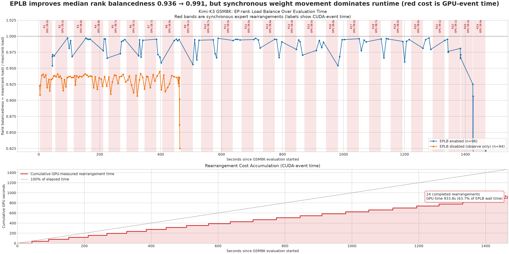

# Kimi K3 EPLB experiment

This document records the reproducible configuration and the two full GSM8K
runs used to validate the Kimi K3 EPLB integration in this pull request.

## Code scope

The PR changes only the Kimi K3 model and MTP model metadata paths:

- `vllm/models/kimi_k3/nvidia/model.py`
    - derives logical, physical, local, and redundant expert counts from the
    parallel and EPLB configuration;
    - passes physical expert counts and the initial physical-to-logical layout
    to MegaMoE and FusedMoE;
    - includes redundant physical slots in checkpoint expert-parameter mapping;
    - exposes `KimiK3MixtureOfExperts` metadata and physical-expert update
    methods to the v1 EPLB controller.
- `vllm/models/kimi_k3/nvidia/mtp.py`
    - registers MTP MoE layers with the same EPLB metadata interface;
    - includes redundant physical slots when building MTP expert mappings.

The implementation keeps the logical expert count unchanged. With
`num_redundant_experts=16`, 896 logical experts become 912 physical slots,
distributed as 57 physical slots per EP rank at EP16. With EPLB disabled, the
layout is the original 896 experts / 56 slots per rank.

## Runtime configuration

Both runs used the same model, image, parallelism, request workload, and
loading path. The only functional difference was whether EPLB rearrangement
was enabled.

| Setting | Value |
| --- | --- |
| Model | `moonshotai/Kimi-K3` |
| Model revision | `79a424f302e6ed63cd82211b0e99918cdb6de8df` |
| Image | `kimi-k3-oss-0723-arm64-cu130-ubuntu2404-commit-e3e837.sqsh` |
| Service nodes | 4 |
| Client/publisher node | 1 |
| Tensor parallelism | TP4 |
| Data parallelism | DP4 |
| Expert parallelism | EP16 |
| GPU memory utilization | 0.85 |
| MTP | disabled |
| GSM8K questions | 1319 |
| Few-shot examples | 5 |
| Client concurrency | 128 |
| Maximum output tokens | 1024 |
| Maximum model length | 2944 |
| Maximum sequences | 256 |
| Weight format | `fastsafetensors` |
| Safetensors strategy | `lazy` |
| Fast safetensors queue | 1 |
| EPLB window | 32 |
| EPLB step interval | 64 |
| EPLB policy | `default` |
| EPLB communicator | `torch_gloo` |
| EPLB async mode | `false` |

### EPLB-enabled run (job 10272)

```text
logical experts:   896
redundant experts:  16
physical experts:  912
enable_eplb:       1
observe_only:      0
```

### Observation-only control run (job 10300)

This run retained the load-accounting and `rank_load` instrumentation but used
the identity expert map and performed no rearrangement or weight movement.

```text
logical experts:   896
redundant experts:  0
physical experts:  896
enable_eplb:       0
observe_only:      1
```

## Results

| Metric | EPLB enabled (10272) | Observation-only (10300) |
| --- | ---: | ---: |
| GSM8K correct | 1260 / 1319 | 1256 / 1319 |
| Accuracy | 95.5269% | 95.2237% |
| Evaluation latency | 1466.50 s | 463.11 s |
| Questions per second | 0.8994 | 2.8481 |
| Output tokens per second | 91.37 | 291.66 |
| Rank-load samples | 97 | 97 |
| Median rank balancedness | 0.9919 | 0.9356 |
| Median max/mean rank load | 1.008x | 1.069x |
| Formal rearrangements | 24 | 0 |
| Map commits | 384 | 0 |

Rank balancedness is calculated from the raw 16-rank `rank_tokens` arrays as:

```text
mean(rank_tokens) / max(rank_tokens)
```

The EPLB run performed 24 formal synchronous rearrangements. Their
CUDA-event-measured durations sum to 933.8124 seconds; the median individual
duration was 38.88 seconds and the maximum was 39.87 seconds. This explains
the dominant runtime difference between the two runs: the total latency
difference is 1003.39 seconds, while the measured rearrangement GPU time is
933.81 seconds.

The load data is aggregate window data. It does not currently separate
prefill and decode because the existing EPLB load pass combines both phases
before emitting `rank_load`.

## Reproduction artifacts

The comparison image is included in this PR:



The image shows:

1. rank balancedness over the evaluation timeline for both runs;
2. every completed synchronous rearrangement as a red time band, with its
   CUDA-event duration labelled;
3. cumulative GPU-measured rearrangement time.

Raw local artifacts used to generate the comparison:

- EPLB log:
  `/home/inf-aoshen/vllm/projects/vllm-rl-day0-support/k3/agent_run/results/k3-full-gsm8k-eplb-load-10272/serve-srun.log`
- Observation-only log:
  `/home/inf-aoshen/vllm/projects/vllm-rl-day0-support/k3/agent_run/results/k3-full-gsm8k-eplb-load-10300/serve-srun.log`
- EPLB GSM8K summary:
  `/home/inf-aoshen/vllm/projects/vllm-rl-day0-support/k3/agent_run/results/k3-full-gsm8k-eplb-load-10272/gsm8k-full.json`
- Observation-only GSM8K summary:
  `/home/inf-aoshen/vllm/projects/vllm-rl-day0-support/k3/agent_run/results/k3-full-gsm8k-eplb-load-10300/gsm8k-full.json`
- EPLB load analysis:
  `/home/inf-aoshen/vllm/projects/vllm-rl-day0-support/k3/agent_run/results/k3-full-gsm8k-eplb-load-10272/load-imbalance.json`
- Observation-only load analysis:
  `/home/inf-aoshen/vllm/projects/vllm-rl-day0-support/k3/agent_run/results/k3-full-gsm8k-eplb-load-10300/load-imbalance.json`
- Plot source:
  `/home/inf-aoshen/vllm/projects/vllm-rl-day0-support/k3/agent_run/scripts/plot_eplb_comparison.py`

The experiment launcher was:

```text
/home/inf-aoshen/vllm/projects/vllm-rl-day0-support/k3/agent_run/scripts/run_k3_full_gsm8k_eplb_load_imbalance.sbatch
```

## Validation

Static checks for the implementation:

```bash
pre-commit run
git diff --check
.venv/bin/python -m py_compile vllm/models/kimi_k3/nvidia/model.py
.venv/bin/python -m py_compile vllm/models/kimi_k3/nvidia/mtp.py
```

Runtime validation:

- both 1319-question GSM8K jobs completed without request errors;
- the EPLB verifier passed for job 10272;
- the observation-only verifier passed for job 10300;
- job 10272 recorded model registration, rearrangement, map computation,
  map commit, and router mapping events;
- job 10300 recorded rank-load events and recorded zero rearrangements and zero
  map commits.
