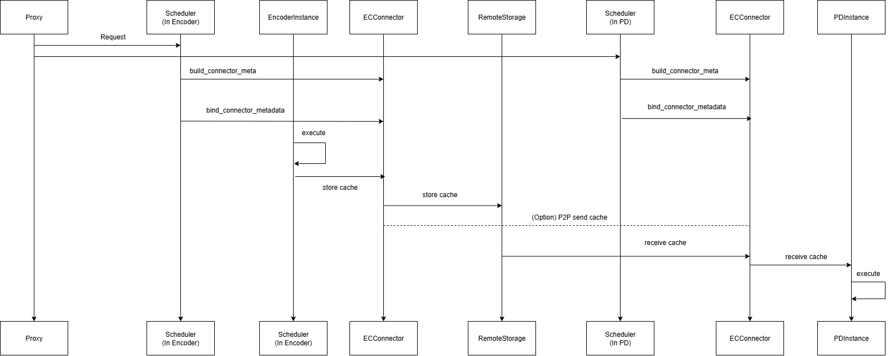

# Disaggregated Encoder

A **disaggregated encoder** runs the vision-encoder stage of a multimodal LLM in a process that is separate from the pre-fill / decoder stage. Deploying these two stages in independent vLLM instances brings three practical benefits:

1. **Independent, fine-grained scaling**  
2. **Lower time-to-first-token (TTFT)**  
3. **Cross-process reuse and caching of encoder outputs**

Design doc: <https://docs.google.com/document/d/1aed8KtC6XkXtdoV87pWT0a8OJlZ-CpnuLLzmR8l9BAE>

---

## 1  Motivation

### 1. Independent, fine-grained scaling

* Vision encoders are lightweight, while language models are orders of magnitude larger.  
* The language model can be parallelised without affecting the encoder fleet.  
* Encoder nodes can be added or removed independently.

### 2. Lower time-to-first-token (TTFT)

* Language-only requests bypass the vision encoder entirely.  
* Encoder output is injected only at required attention layers, shortening the pre-fill critical path.

### 3. Cross-process reuse and caching

* In-process encoders confine reuse to a single worker.  
* A remote, shared cache lets any worker retrieve existing embeddings, eliminating redundant computation.

---

## 2  Usage Example

The current reference pathway is **ExampleConnector**.  
Below ready-to-run scripts shows the workflow:

1 Encoder instance + 1 PD instance:
`examples/online_serving/disaggregated_encoder/disagg_1e1pd_example.sh`

1 Encoder instance + 1 Prefill instance + 1 Decode instance:
`examples/online_serving/disaggregated_encoder/disagg_1e1p1d_example.sh`

---

## 3  Test Script

Please refer to the directories `tests/v1/ec_connector`

## 4  Development

Disaggregated encoding is implemented by running two parts:

* **Encoder instance** – a vLLM instance to performs vision encoding.  
* **Prefill/Decode (PD) instance(s)** – runs language pre-fill and decode.
    * PD can be in either a single normal instance with `disagg_encoder_example.sh` (E->PD) or in disaggregated instances with `disagg_epd_example.sh` (E->P->D)

A connector transfers encoder-cache (EC) embeddings from the encoder instance to the PD instance.  
All related code is under `vllm/distributed/ec_transfer`.

### Key abstractions

* **ECConnector** – interface for retrieving EC caches produced by the encoder.  
    * *Scheduler role* – checks cache existence and schedules loads.  
    * *Worker role* – loads the embeddings into memory.

Here is a figure illustrating disaggregate encoder flow:

For the PD disaggregation part, the Prefill instance receive cache exactly the same as the disaggregate encoder flow above. Prefill instance executes 1 step (prefill -> 1 token output) and then transfer KV cache to the Decode instance for the remaining execution. The KV transfer part purely happens after the execute of the PDinstance.

`docs/features/disagg_prefill.md` shows the brief idea about the disaggregated prefill (v0)

We create the example setup with the **NixlConnector** from `vllm/distributed/kv_transfer/kv_connector/v1/nixl_connector.py` and referred to the `tests/v1/kv_connector/nixl_integration/toy_proxy_server.py` to facilitate the kv transfer between P and D;
