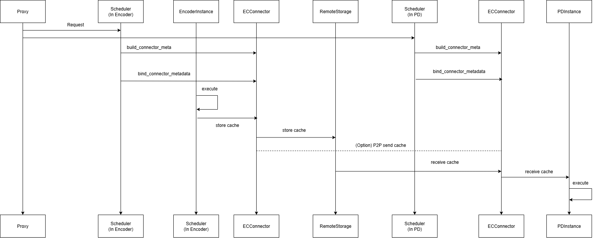

# Disaggregated Encoder

A **disaggregated encoder** runs the vision-encoder stage of a multimodal LLM in a process that is separate from the pre-fill / decoder stage. Deploying these two stages in independent vLLM instances brings three practical benefits:

1. **Independent, fine-grained scaling**  
2. **Lower time-to-first-token (TTFT)**  
3. **Cross-process reuse and caching of encoder outputs**

Design doc: <https://docs.google.com/document/d/1aed8KtC6XkXtdoV87pWT0a8OJlZ-CpnuLLzmR8l9BAE>

---

## 1  Motivation

### 1. Independent, fine-grained scaling

* Vision encoders are lightweight, while language models are orders of magnitude larger.  
* The language model can be parallelised without affecting the encoder fleet.  
* Encoder nodes can be added or removed independently.

### 2. Lower time-to-first-token (TTFT)

* Language-only requests bypass the vision encoder entirely.  
* Encoder output is injected only at required attention layers, shortening the pre-fill critical path.

### 3. Cross-process reuse and caching

* In-process encoders confine reuse to a single worker.  
* A remote, shared cache lets any worker retrieve existing embeddings, eliminating redundant computation.

---

## 2  Usage Example

The current reference pathway is **ExampleConnector**.  
Below ready-to-run scripts shows the workflow:

1 Encoder instance + 1 PD instance:
`examples/disaggregated/disaggregated_encoder/disagg_1e1pd_example.sh`

1 Encoder instance + 1 Prefill instance + 1 Decode instance:
`examples/disaggregated/disaggregated_encoder/disagg_1e1p1d_example.sh`

---

## 3  Test Script

Please refer to the directories `tests/v1/ec_connector`

## 4  Development

Disaggregated encoding is implemented by running two parts:

* **Encoder instance** – a vLLM instance to performs vision encoding.  
* **Prefill/Decode (PD) instance(s)** – runs language pre-fill and decode.
    * PD can be in either a single normal instance with `disagg_encoder_example.sh` (E->PD) or in disaggregated instances with `disagg_epd_example.sh` (E->P->D)

A connector transfers encoder-cache (EC) embeddings from the encoder instance to the PD instance.  
All related code is under `vllm/distributed/ec_transfer`.

### Key abstractions

* **ECConnector** – interface for retrieving EC caches produced by the encoder.  
    * *Scheduler role* – checks cache existence and schedules loads.  
    * *Worker role* – loads the embeddings into memory.

### Connectors

| Connector | Transport | Reuse across requests | Notes |
| --- | --- | --- | --- |
| `ECExampleConnector` | shared filesystem (safetensors) | yes, until the file is removed | reference implementation |
| `ECCPUConnector` | `/dev/shm` mmap, same host | yes, FIFO eviction | offloads to host memory |
| `ECZmqConnector` | ZMQ push over TCP | no, one-shot delivery | no shared medium between hosts |

#### ZMQ connector

The encoder pushes each embedding straight to the consumer instead of publishing
it to a store. Every consumer rank that holds an encoder cache binds one PULL
socket, on `ec_port + dp_rank * ranks_per_engine + flat_rank`, where
`ranks_per_engine` is `tensor_parallel_size * prefill_context_parallel_size` and
`flat_rank` is `tp_rank + pcp_rank * tensor_parallel_size`. The producer's first
rank sends one copy per consumer rank, since every rank reads the encoder cache.

Encoder instance:

```json
{
  "ec_connector": "ECZmqConnector",
  "ec_role": "ec_producer",
  "ec_connector_extra_config": {
    "ec_zmq_consumers": [{"host": "127.0.0.1", "port": 14579, "num_ranks": 1}]
  }
}
```

PD instance:

```json
{
  "ec_connector": "ECZmqConnector",
  "ec_role": "ec_consumer",
  "ec_port": 14579,
  "ec_connector_extra_config": {"ec_zmq_staging_bytes": 4294967296}
}
```

Run it with `EC_BACKEND=zmq examples/disaggregated/disaggregated_encoder/disagg_1e1pd_example.sh`.

Options, all under `ec_connector_extra_config`:

| Option | Role | Default | Meaning |
| --- | --- | --- | --- |
| `ec_zmq_consumers` | producer | `[{ec_ip, ec_port, 1}]` | where to push; a request may override it with `ec_transfer_params: {"ec_dst": {...}}` |
| `ec_zmq_send_timeout_s` | producer | 30 | how long a send may block before the item is dropped |
| `ec_zmq_max_inflight_sends` | producer | 64 | queued embeddings before `save_caches` blocks |
| `ec_zmq_bind_host` | consumer | `0.0.0.0` | receive interface |
| `ec_zmq_staging_bytes` | consumer | 4 GiB | host memory for embeddings awaiting a load |
| `ec_zmq_staging_ttl_s` | consumer | 300 | when to drop an embedding no request came for |
| `ec_zmq_recv_timeout_s` | consumer | 60 | how long a request waits for its embeddings |
| `ec_zmq_wait_for_all_remote` | consumer | `false` | wait for every uncached item, not just the declared ones |

A consumer only waits for embeddings a request declares in
`ec_transfer_params.ec_items` -- what `disagg_epd_proxy.py` forwards from the
encoder's response. Deployments that cannot pass it can set
`ec_zmq_wait_for_all_remote` instead, at the cost of making locally encoded items
wait out `ec_zmq_recv_timeout_s`.

Current limitations:

* Delivery is one-shot. Once the consumer's own encoder cache evicts an item, a
  new request for it needs a fresh push; the connector keeps no cache of its own.
* Traffic scales with the consumer's TP size, since each rank receives its own
  copy.
* Readiness reaches the consumer's scheduler through the worker report, so a load
  is scheduled one engine step after the embedding lands.

Here is a figure illustrating disaggregate encoder flow:



For the PD disaggregation part, the Prefill instance receives cache exactly the same as the disaggregated encoder flow above. Prefill instance executes 1 step (prefill -> 1 token output) and then transfers KV cache to the Decode instance for the remaining execution. The KV transfer part purely happens after the execution of the PD instance.

`docs/features/disagg_prefill.md` shows the brief idea about the disaggregated prefill (v0)

We create the example setup with the **NixlConnector** from `vllm/distributed/kv_transfer/kv_connector/v1/nixl/` and referred to the `tests/v1/kv_connector/nixl_integration/toy_proxy_server.py` to facilitate the kv transfer between P and D;
