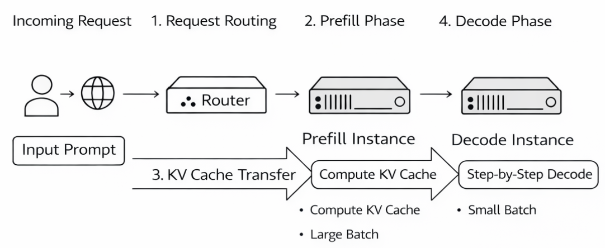
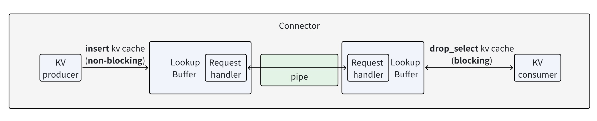
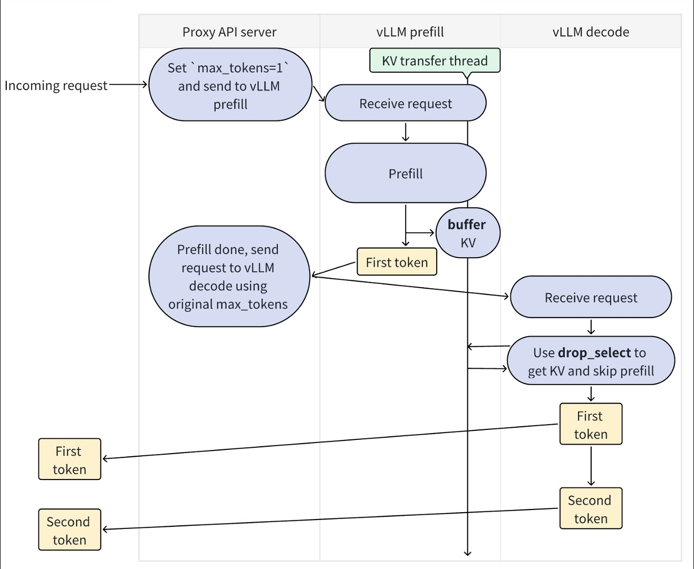
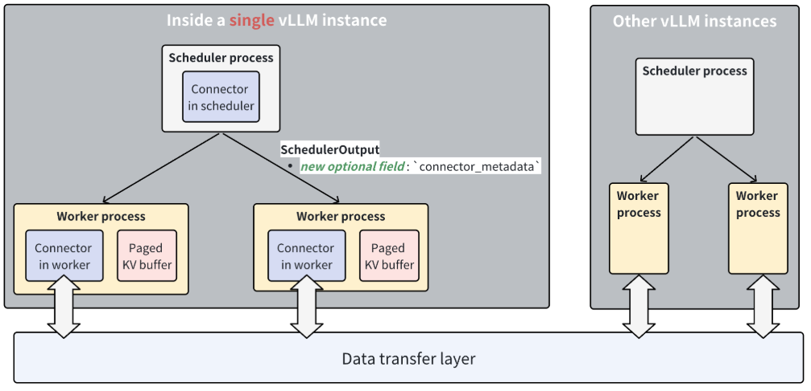
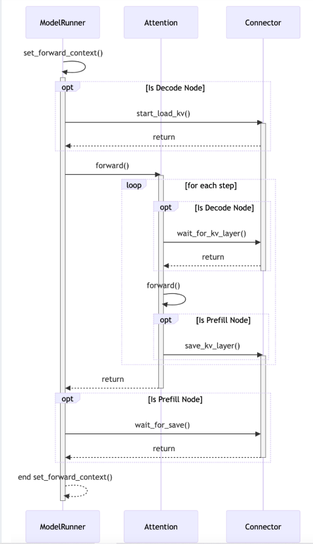

# Disaggregated Prefilling (experimental)

This page introduces you to the disaggregated prefilling feature in vLLM.

!!! note
    This feature is experimental and subject to change.

## What's Prefill-Decode Disaggregation
Prefill–Decode Disaggregation (PD Disaggregation) refers to separating:

- Prefill (context encoding)
- Decode (token-by-token generation)

into different instances for execution, thereby achieving:

- Lower latency (Decode focuses on step-by-step generation)
- More flexible resource scheduling (enabling tiered GPU utilization)

## When to Use Disaggregated Prefilling?

If you have any of the following needs, you may consider using the PD (Prefill–Decode) disaggregation approach:

- **Tuning time-to-first-token (TTFT) and inter-token-latency (ITL) independently**. Disaggregated prefilling separates the prefill and decode phase of LLM inference into different vLLM instances. This allows you apply different parallelization strategies (e.g. `tp` and `pp`) to optimize TTFT without impacting ITL, or optimize ITL without affecting TTFT.
- **Controlling tail ITL**. Without disaggregated prefilling, vLLM may interleave prefill jobs during the decoding phase of a request, which can increase tail latency. Disaggregated prefilling helps mitigate this issue and provides better control over tail ITL. While chunked prefill with an appropriate chunk size can achieve a similar effect, determining the optimal chunk size in practice is often difficult. Therefore, disaggregated prefilling is generally a more reliable approach for controlling tail ITL.

!!! note
    Disaggregated prefilling does NOT improve overall throughput. Its primary goal is to optimize latency (e.g., TTFT and tail ITL), not throughput.

## How Disaggregated Prefilling Works
Disaggregated prefilling separates the LLM inference pipeline into two independent stages—Prefill and Decode—and executes them on different vLLM instances.



**1. Request Routing**

When a request arrives, it is first sent to a Prefill instance. A router (or gateway) is responsible for directing incoming traffic to the appropriate Prefill service.

**2. Prefill Phase (Context Encoding)**

The Prefill instance processes the full input prompt and performs the forward pass to compute the **KV cache** for all input tokens. This stage is typically compute-intensive and benefits from:
- Large batch sizes
- Higher parallelism (e.g., tensor parallelism, pipeline parallelism)

Instead of generating tokens, the Prefill instance outputs the generated KV cache along with necessary metadata (e.g., sequence state).

**3. KV Cache Transfer**

The computed KV cache is then transferred from the Prefill instance to a **Decode instance**. This transfer can be implemented via:
- Network communication (e.g., RPC, shared storage, or RDMA)
- In-memory transfer (if colocated)

Efficient KV cache transfer is critical, as it directly impacts end-to-end latency.

**4. Decode Phase (Token Generation)**

The Decode instance receives the KV cache and continues the generation process token by token. This stage is latency-sensitive and typically optimized for:
- Low batch sizes or continuous batching
- Fast scheduling and iteration
- Stable inter-token latency (ITL)

Unlike Prefill, Decode focuses on incremental computation using the existing KV cache.

**5. Independent Scaling and Optimization**

Because Prefill and Decode are decoupled:
- They can be scaled independently (e.g., more Prefill instances for heavy prompts, more Decode instances for high concurrency)
- Different hardware can be used (e.g., high-memory GPUs for Prefill, low-latency GPUs for Decode)
- Different parallel strategies can be applied without interference

---
**Summary**

Disaggregated prefilling transforms the monolithic inference flow into a **two-stage pipeline**:

```text
Request → Prefill (compute KV cache) → Transfer → Decode (generate tokens)
```

This design enables finer-grained control over latency and resource utilization, especially in large-scale production deployments.

## Before you begin
Before enabling disaggregated prefilling, ensure your environment meets the following requirements.

### Software and Hardware Requirements
Please refer to the [installation guide](../getting_started/installation/gpu.md) for detailed setup instructions.

!!!note
    Ensure sufficient GPU capacity to allocate Prefill and Decode instances separately.

### Deployment Requirements
- Ability to run multiple vLLM instances (Prefill and Decode)
- A routing layer (e.g., custom router or gateway) to:
  - Direct requests to Prefill instances
  - Forward KV cache to Decode instances

### Network Requirements
- High-bandwidth, low-latency network between Prefill and Decode instances
- Recommended:
  - RDMA / InfiniBand (for large-scale deployments)
  - Or at least high-speed TCP (10Gb+)

### Optional (Recommended)
- Kubernetes or similar orchestration system for:
  - Independent scaling of Prefill and Decode
  - Resource isolation and scheduling
- Monitoring and observability:
  - GPU utilization
  - TTFT and ITL metrics

!!!note
    Disaggregated prefilling introduces additional KV cache transfer overhead, so network performance is critical.
    It is primarily designed for latency optimization, not throughput improvement.

## How to Run Disaggregated Prefilling
- The number of Prefill and Decode instances can be scaled independently based on workload characteristics.
- See the [Connectors](#connectors) section for the list of supported connectors.

### Step 1: Start Prefill Instances
```bash
  CUDA_VISIBLE_DEVICES=0 vllm serve "$MODEL_NAME" \
    --host 0.0.0.0 \
    --port 8100 \
    --max-model-len 100 \
    --gpu-memory-utilization 0.8 \
    --trust-remote-code \
    --kv-transfer-config \
    '{"kv_connector":"P2pNcclConnector","kv_role":"kv_producer","kv_rank":0,"kv_parallel_size":2,"kv_buffer_size":"1e9","kv_port":"14579","kv_connector_extra_config":{"proxy_ip":"'"$VLLM_HOST_IP"'","proxy_port":"30001","http_ip":"'"$VLLM_HOST_IP"'","http_port":"8100","send_type":"PUT_ASYNC"}}' &
```

### Step 2: Start Decode Instances
```bash
  CUDA_VISIBLE_DEVICES=1 vllm serve "$MODEL_NAME" \
    --host 0.0.0.0 \
    --port 8200 \
    --max-model-len 100 \
    --gpu-memory-utilization 0.8 \
    --trust-remote-code \
    --kv-transfer-config \
    '{"kv_connector":"P2pNcclConnector","kv_role":"kv_consumer","kv_rank":1,"kv_parallel_size":2,"kv_buffer_size":"1e10","kv_port":"14580","kv_connector_extra_config":{"proxy_ip":"'"$VLLM_HOST_IP"'","proxy_port":"30001","http_ip":"'"$VLLM_HOST_IP"'","http_port":"8200","send_type":"PUT_ASYNC"}}' &
```

### Step 3: Start the Router
You can use a router such as:
- https://github.com/vllm-project/router

```bash
  # When vLLM runs the NIXL connector, prefill/decode URLs are required.
  # See a working example in scripts/llama3.1/ folder.
  cargo run --release -- \
    --policy consistent_hash \
    --vllm-pd-disaggregation \
    --prefill http://127.0.0.1:8100 \
    #--prefill http://127.0.0.1:8101 \
    --decode http://127.0.0.1:8200 \
    #--decode http://127.0.0.1:8201 \
    --host 127.0.0.1 \
    --port 8090 \
    --intra-node-data-parallel-size 1 \


  # When vLLM runs the NCCL connector, ZMQ based discovery is supported.
  # See a working example in scripts/install.sh
  cargo run --release -- \
    --policy consistent_hash \
    --vllm-pd-disaggregation \
    --vllm-discovery-address 0.0.0.0:30001 \
    --host 0.0.0.0 \
    --port 10001 \
    --prefill-policy consistent_hash \
    --decode-policy consistent_hash
```

## Connectors

Choosing the right connector depends on your deployment environment, performance requirements, and infrastructure capabilities.
Please refer to [examples/online_serving/disaggregated_prefill.sh](../../examples/online_serving/disaggregated_prefill.sh) for the example usage of disaggregated prefilling.

### Available Connectors

vLLM currently supports multiple connector implementations for disaggregated prefilling:

- **ExampleConnector**: A minimal reference implementation for demonstration purposes. For simple testing or getting started. See: [examples/offline_inference/disaggregated-prefill-v1/run.sh](../../examples/offline_inference/disaggregated-prefill-v1/run.sh)

- **LMCacheConnectorV1**: Uses LMCache with NIXL as the underlying KV transfer mechanism. For integrating with external KV cache systems. See: [examples/others/lmcache/disagg_prefill_lmcache_v1/disagg_example_nixl.sh](../../examples/others/lmcache/disagg_prefill_lmcache_v1/disagg_example_nixl.sh)

- **NixlConnector**: Provides fully asynchronous KV cache transfer using NIXL. For production with high-performance networking (RDMA / UCX / GDS). See:
  - [tests/v1/kv_connector/nixl_integration/run_accuracy_test.sh](../../tests/v1/kv_connector/nixl_integration/run_accuracy_test.sh)  
  - [nixl_connector_usage](nixl_connector_usage.md)

  NixlConnector supports one or more backends (e.g., UCX, GDS).
  ```bash
  --kv-transfer-config '{
    "kv_connector": "NixlConnector",
    "kv_role": "kv_both",
    "kv_buffer_device": "cuda",
    "kv_connector_extra_config": {
      "backends": ["UCX", "GDS"]
    }
  }'

- **P2pNcclConnector**: Uses NCCL-based peer-to-peer communication for KV transfer. For GPU-to-GPU high-speed communication (same cluster). See: [examples/online_serving/disaggregated_serving_p2p_nccl_xpyd/disagg_example_p2p_nccl_xpyd.sh](../../examples/online_serving/disaggregated_serving_p2p_nccl_xpyd/disagg_example_p2p_nccl_xpyd.sh)

- **MooncakeConnector**: Integration with Mooncake for distributed KV transfer. See:
  - [examples/online_serving/disaggregated_serving/mooncake_connector/run_mooncake_connector.sh](../../examples/online_serving/disaggregated_serving/mooncake_connector/run_mooncake_connector.sh)  
  - [mooncake_connector_usage](mooncake_connector_usage.md)

- **OffloadingConnector**: Offloads KV cache to CPU memory.
  ```bash
  --kv-transfer-config '{
    "kv_connector": "OffloadingConnector",
    "kv_role": "kv_both",
    "kv_connector_extra_config": {
      "block_size": 64,
      "cpu_bytes_to_use": 1000000000
    }
  }'

- **FlexKVConnectorV1**: A distributed KV store with multi-level cache.
  ```bash
  --kv-transfer-config '{
    "kv_connector": "FlexKVConnectorV1",
    "kv_role": "kv_both"
  }'

- **MultiConnector**: Allows composing multiple connectors in sequence. For combining multiple strategies.

  ```bash
  --kv-transfer-config '{
    "kv_connector": "MultiConnector",
    "kv_role": "kv_both",
    "kv_connector_extra_config": {
      "connectors": [
        {
          "kv_connector": "NixlConnector",
          "kv_role": "kv_both"
        },
        {
          "kv_connector": "ExampleConnector",
          "kv_role": "kv_both",
          "kv_connector_extra_config": {
            "shared_storage_path": "local_storage"
          }
        }
      ]
    }
  }'

### Connector Comparison

| Connector            | Key Feature                         | Best For                         | Notes                         |
|---------------------|-------------------------------------|----------------------------------|-------------------------------|
| ExampleConnector    | Minimal implementation              | Testing / debugging               | Not for production            |
| LMCacheConnectorV1  | External KV cache (via NIXL)        | KV reuse / caching systems        | Requires LMCache setup        |
| NixlConnector       | Async, high-performance transfer    | Production / distributed systems  | Supports multiple backends    |
| P2pNcclConnector    | NCCL-based GPU communication        | Single cluster, GPU-heavy setups  | Low latency                   |
| MooncakeConnector   | External distributed KV system      | Specialized infra                 | Requires Mooncake             |
| MultiConnector      | Compose multiple connectors         | Hybrid strategies                 | Flexible but complex          |
| OffloadingConnector | CPU memory offloading               | Limited GPU memory                | Trades latency for capacity   |
| FlexKVConnectorV1   | Distributed KV + multi-level cache  | Large-scale inference             | Advanced setup                |

### Design Considerations

When selecting a connector, consider:

- Latency vs Throughput
  - NCCL / NIXL → low latency
  - Offloading → higher latency, more capacity
- Network Capabilities
  - RDMA / UCX available → prefer NixlConnector
  - Standard TCP → consider simpler connectors
- Memory Constraints
  - Limited GPU memory → OffloadingConnector
  - Large-scale KV reuse → FlexKV / LMCache
- System Complexity
  - Simple deployment → ExampleConnector / P2pNccl
  - Complex infra → Nixl / MultiConnector

### Advanced Usage

For complex production environments, connectors can be combined. Use MultiConnector to:
- Chain fast-path + fallback
- Combine GPU transfer + storage-based transfer
- Implement tiered KV cache systems


## Benchmarks

Please refer to [benchmarks/disagg_benchmarks](../../benchmarks/disagg_benchmarks) for disaggregated prefilling benchmarks.

## Development

!!! note
    This section focuses on the internal architecture and implementation details.  
    It is intended for developers and contributors. End users can skip it.

Disaggregated prefilling is implemented by running two independent vLLM instances:

- A **Prefill instance** that processes input prompts and computes KV caches  
- A **Decode instance** that performs token-by-token generation using the KV cache  

A connector is used to transfer KV caches and associated request state from the Prefill instance to the Decode instance.

All disaggregated prefilling components are implemented under `vllm/distributed/kv_transfer`.

### Key Abstractions

- **Connector**: Enables the KV consumer to retrieve KV caches for a batch of requests from the KV producer.

- **LookupBuffer**: Provides two APIs: `insert` and `drop_select`.  
  - `insert`: inserts KV caches into the buffer  
  - `drop_select`: retrieves KV caches matching given conditions and removes them from the buffer  

  The semantics are similar to SQL operations.

- **Pipe**: A unidirectional FIFO channel for tensor transmission. Provides `send_tensor` and `recv_tensor` interfaces.

!!! note
    `insert` is a non-blocking operation, whereas `drop_select` is blocking.

The following figure illustrates how the three core abstractions are organized:



The overall workflow of disaggregated prefilling is shown below:



In this workflow:
- **buffer** corresponds to the `insert` API of `LookupBuffer`
- **drop_select** corresponds to the `drop_select` API of `LookupBuffer`

---

Each vLLM process is associated with a connector. There are two types of connectors:

- **Scheduler connector**: Located in the scheduler process. Responsible for orchestrating KV cache transfer operations.

- **Worker connectors**: Located in worker processes. Responsible for executing KV cache transfer operations.

The following figure illustrates how these connectors are organized:



---

The figure below shows how the worker connector interacts with the attention module to enable layer-by-layer KV cache storage and loading:



## Third-Party Contributions

Disaggregated prefilling is tightly coupled with infrastructure. For production deployments, vLLM relies on third-party connectors to provide efficient and scalable KV cache transfer.

The vLLM project actively welcomes and reviews contributions of third-party connectors.

We recommend the following implementation approaches:

- **Fully customized connector**  
  Implement a custom `Connector` and integrate with external systems or libraries to handle KV cache transfer.  
  This approach provides maximum flexibility (e.g., customizing model inputs or prefill behavior), but may require additional effort to maintain compatibility with future vLLM versions.

- **Database-like connector**  
  Implement a custom `LookupBuffer` that supports the `insert` and `drop_select` APIs, similar to database semantics.  
  This approach is suitable for systems that naturally model KV cache storage and retrieval as query operations.

- **Distributed P2P connector**  
  Implement a custom `Pipe` that provides `send_tensor` and `recv_tensor` APIs, similar to `torch.distributed`.  
  This approach is ideal for high-performance, peer-to-peer KV cache transfer in distributed environments.
