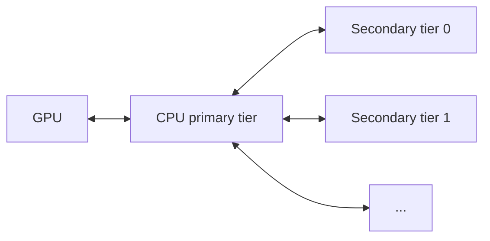

# KV Offloading Usage Guide

This guide covers configuration of the [`OffloadingConnector`](disagg_prefill.md), which extends the prefix cache by spilling KV blocks evicted from GPU memory to slower but larger tiers (CPU host memory, plus optional secondary tiers). Hits in the offload tiers are promoted back to GPU on demand.

## Overview

Two specs are available, selected by the `spec_name` key in `kv_connector_extra_config`:

- `CPUOffloadingSpec` (default): single CPU tier. GPU evictions spill into pinned host memory.
- `TieringOffloadingSpec`: multi-tier. A CPU primary tier plus one or more secondary tiers.

Only the CPU primary tier has direct GPU access. Secondary tiers cannot read from or write to GPU memory; all GPU↔secondary transfers are staged through the CPU primary tier.



## Single-Tier Setup (CPU Only)

```bash
vllm serve <model> \
  --kv-transfer-config '{
    "kv_connector": "OffloadingConnector",
    "kv_role": "kv_both",
    "kv_connector_extra_config": {
      "block_size": 64,
      "cpu_bytes_to_use": 1000000000
    }
  }'
```

## Multi-Tier Setup

Set `spec_name` to `"TieringOffloadingSpec"` and supply a `secondary_tiers` list. Each entry is a dict with a required `type` key plus tier-specific fields. The list is ordered: tier 0 is consulted before tier 1, and so on. See [Secondary Tiers](#secondary-tiers) for tier-specific keys.

```bash
vllm serve <model> \
  --kv-transfer-config '{
    "kv_connector": "OffloadingConnector",
    "kv_role": "kv_both",
    "kv_connector_extra_config": {
      "spec_name": "TieringOffloadingSpec",
      "cpu_bytes_to_use": 10737418240,
      "block_size": 16,
      "eviction_policy": "lru",
      "secondary_tiers": [
        {
          "type": "fs",
          "root_dir": "/mnt/kv_cache",
          "n_read_threads": 32,
          "n_write_threads": 16
        }
      ]
    }
  }'
```

## `kv_connector_extra_config` Reference

| Key | Required | Default | Scope | Notes |
| --- | --- | --- | --- | --- |
| `spec_name` | no | `CPUOffloadingSpec` | both | Set to `TieringOffloadingSpec` for multi-tier. |
| `cpu_bytes_to_use` | yes | — | both | Bytes of host memory reserved for the CPU tier. |
| `block_size` | no | GPU block size | both | Offloaded block size in tokens; must be a multiple of the GPU block size. |
| `eviction_policy` | no | `lru` | both | Primary tier policy: `lru` or `arc`. |
| `store_threshold` | no | `0` | single-tier | Min lookups before a block is offloaded. Values ≥ 2 are rejected by `TieringOffloadingSpec`. |
| `max_tracker_size` | no | `64000` | single-tier | Max entries in the lookup tracker. |
| `secondary_tiers` | no | `[]` | multi-tier | List of secondary tier configs (see below). |

## Secondary Tiers

Each entry in `secondary_tiers` is a dict with a required `type` field plus tier-specific fields.

### Filesystem (FS)

The filesystem tier (`type: "fs"`) writes blocks to a directory on local storage.

| Key | Required | Default | Notes |
| --- | --- | --- | --- |
| `type` | yes | — | Must be `fs`. |
| `root_dir` | yes | — | Base directory; suffixed per-rank as `<root_dir>_r<rank>/`. |
| `n_read_threads` | no | `16` | Read-priority I/O threads (load path). |
| `n_write_threads` | no | `16` | Write-priority I/O threads (store path). |

Each thread group prefers its own queue but pulls from the other when its primary queue is empty, so a write-heavy or read-heavy burst won't leave the off-priority queue waiting. Size the totals to your storage's effective concurrency.

#### On-Disk Layout

Under `root_dir`, blocks are sharded across hash-prefix subdirectories to limit directory fan-out:

```text
<root_dir>_r<rank>/
  <hhh>/
    <hh>_g<group_idx>/
      <hash_hex>.bin
  config.json
```

A `config.json` describing the run (block size, number of KV groups, etc.) is written on first start.

The directory must be writable by every rank. Because the per-rank suffix is added automatically, multiple ranks can safely share the same `root_dir` value.

## Tuning Tips

- `cpu_bytes_to_use`: a bigger CPU tier means fewer trips to slower secondary tiers and a higher hit rate. Leave headroom for the rest of the host workload.
- `block_size`: larger offloaded blocks reduce per-block bookkeeping overhead but increase the granularity of lookups. Must be a multiple of the GPU block size.
- FS thread counts: tune `n_read_threads` and `n_write_threads` to the parallelism your storage can sustain. Reads are latency-sensitive on the prefill path, so prefer more read threads when prefill hit rates are high.
- Sharing `root_dir` across runs: the tier reuses files matching the current run's `config.json`. Changing `block_size` or model topology invalidates older files; clean the directory between incompatible runs.
