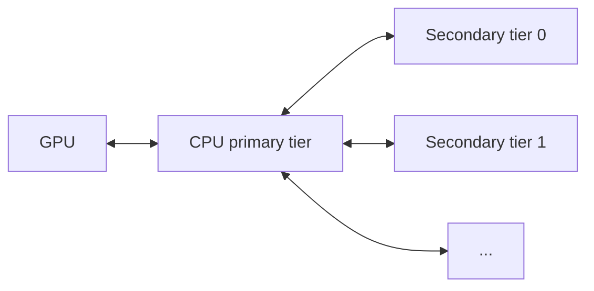

# KV Offloading Usage Guide

This guide covers configuration of the [`OffloadingConnector`](disagg_prefill.md), which extends the prefix cache by offloading completed KV blocks to slower but larger tiers (CPU host memory, plus optional secondary tiers) as they are produced. Hits in the offload tiers are promoted back to GPU on demand. Transfers between GPU and CPU use DMA (`cudaMemcpyAsync`) and run asynchronously alongside model computation, so offloading adds minimal CPU- and GPU-core overhead.

!!! note
    The `OffloadingConnector` currently supports CUDA, ROCm, and XPU only.

## Overview

Two specs are available, selected by the `spec_name` key in `kv_connector_extra_config`:

- `CPUOffloadingSpec` (default): single CPU tier. Completed GPU blocks are copied into pinned host memory.
- `TieringOffloadingSpec`: multi-tier. A CPU primary tier plus one or more secondary tiers.

Only the CPU primary tier has direct GPU access. Secondary tiers cannot read from or write to GPU memory; all GPU↔secondary transfers are staged through the CPU primary tier.



## Single-Tier Setup (CPU Only)

```bash
vllm serve <model> \
  --kv-transfer-config '{
    "kv_connector": "OffloadingConnector",
    "kv_role": "kv_both",
    "kv_connector_extra_config": {
      "block_size": 64,
      "cpu_bytes_to_use": 1000000000
    }
  }'
```

## Multi-Tier Setup

Set `spec_name` to `"TieringOffloadingSpec"` and supply a `secondary_tiers` list. Each entry is a dict with a required `type` key plus tier-specific fields. The list is ordered: tier 0 is consulted before tier 1, and so on. See [Secondary Tiers](#secondary-tiers) for tier-specific keys.

```bash
vllm serve <model> \
  --kv-transfer-config '{
    "kv_connector": "OffloadingConnector",
    "kv_role": "kv_both",
    "kv_connector_extra_config": {
      "spec_name": "TieringOffloadingSpec",
      "cpu_bytes_to_use": 10737418240,
      "block_size": 16,
      "eviction_policy": "lru",
      "secondary_tiers": [
        {
          "type": "fs",
          "root_dir": "/mnt/kv_cache",
          "n_read_threads": 32,
          "n_write_threads": 16
        }
      ]
    }
  }'
```

## `kv_connector_extra_config` Reference

| Key | Required | Default | Scope | Notes |
| --- | --- | --- | --- | --- |
| `spec_name` | no | `CPUOffloadingSpec` | both | Set to `TieringOffloadingSpec` for multi-tier. |
| `cpu_bytes_to_use` | yes | — | both | Total bytes of host memory reserved for the CPU tier across all workers (not per-worker). |
| `block_size` | no | GPU block size | both | Offloaded block size in tokens; must be a multiple of the GPU block size. |
| `eviction_policy` | no | `lru` | both | Primary tier policy: `lru` or `arc`. |
| `store_threshold` | no | `0` | single-tier | Min lookups before a block is offloaded. Values ≥ 2 are rejected by `TieringOffloadingSpec`. |
| `max_tracker_size` | no | `64000` | single-tier | Max entries in the lookup tracker. |
| `secondary_tiers` | no | `[]` | multi-tier | List of secondary tier configs (see below). |
| `offload_prompt_only` | no | `true` | both | If `true`, only prompt (prefill) blocks are offloaded; decode blocks are skipped. |
| `spec_module_path` | no | — | both | Python import path for a custom `OffloadingSpec` not in the built-in registry. Required only when `spec_name` is not built-in (advanced). |

## Secondary Tiers

Each entry in `secondary_tiers` is a dict with a required `type` field plus tier-specific fields.

### Filesystem (FS)

The filesystem tier (`type: "fs"`) writes blocks to a directory on local storage.

| Key | Required | Default | Notes |
| --- | --- | --- | --- |
| `type` | yes | — | Must be `fs`. |
| `root_dir` | yes | — | Base directory; vLLM creates subdirectories beneath it (see [On-Disk Layout](#on-disk-layout)). |
| `n_read_threads` | no | `16` | Read-priority I/O threads (load path). |
| `n_write_threads` | no | `16` | Write-priority I/O threads (store path). |

Each thread group prefers its own queue but pulls from the other when its primary queue is empty, so a write-heavy or read-heavy burst won't leave the off-priority queue waiting. Size the totals to your storage's effective concurrency.

#### On-Disk Layout

Under `root_dir`, vLLM creates a subdirectory `<model>_<digest>`, where `<model>` is the model name with `/` replaced by `_` (so HuggingFace IDs like `meta-llama/Llama-3-8B` don't nest), and `<digest>` is a short SHA256 prefix derived from the run configuration (model, block size, parallelism, dtype, etc.). Runs with the same configuration share the same subdirectory; runs with different configurations live side-by-side under the same `root_dir` without colliding.

Inside that subdirectory, blocks are sharded across hash-prefix subdirectories to limit directory fan-out:

```text
<root_dir>/
  <model>_<digest>/
    config.json
  <model>_<digest>_r<rank>/
    <hhh>/                    # first 3 hex chars of the block hash
      <hh>_g<group_idx>/      # next 2 hex chars + KV cache group index
        <hash_hex>.bin        # full block hash (in hex)
```

`config.json` records the run (block size, number of KV groups, etc.) and is written on first start. Each rank writes blocks under its own `_r<rank>` sibling directory, so multiple ranks can safely share the same `root_dir`.

#### Cross-Process Sharing

To enable KV cache sharing between multiple vLLM instances using the same `root_dir` (e.g., via a shared PVC), the `PYTHONHASHSEED` environment variable must be set to the same fixed value (e.g., `"0"`) on every instance. Without this, each process initializes `NONE_HASH` (the chain-hash seed for block content hashes) with random bytes, producing different block filenames for identical token content.

```bash
PYTHONHASHSEED=0 vllm serve ...
```

## Tuning Tips

- `cpu_bytes_to_use`: a bigger CPU tier means fewer trips to slower secondary tiers and a higher hit rate. The value is total across all workers, not per-worker. Leave headroom for the rest of the host workload.
- For single-tier (CPU-only) setups, set `cpu_bytes_to_use` larger than the aggregate GPU KV cache. Because offloading is immediate, a smaller CPU tier just mirrors what the GPU already holds and adds no hit rate.
- `block_size`: larger offloaded blocks reduce per-block bookkeeping overhead but increase the granularity of lookups. Must be a multiple of the GPU block size.
- FS thread counts: tune `n_read_threads` and `n_write_threads` to the parallelism your storage can sustain. Reads are latency-sensitive on the prefill path, so prefer more read threads when prefill hit rates are high.
- Sharing `root_dir` across runs: runs with the same model, `block_size`, parallelism layout, and dtype share files under the same `<digest>` subdirectory. Changing any of these produces a new subdirectory; old ones are orphaned but harmless. Delete them to reclaim disk.

## Further Reading

- [vLLM blog: KV Offloading Connector](https://vllm.ai/blog/2026-01-08-kv-offloading-connector) — motivation, architecture (DMA-based async transfer), and benchmarks (TTFT and throughput).
