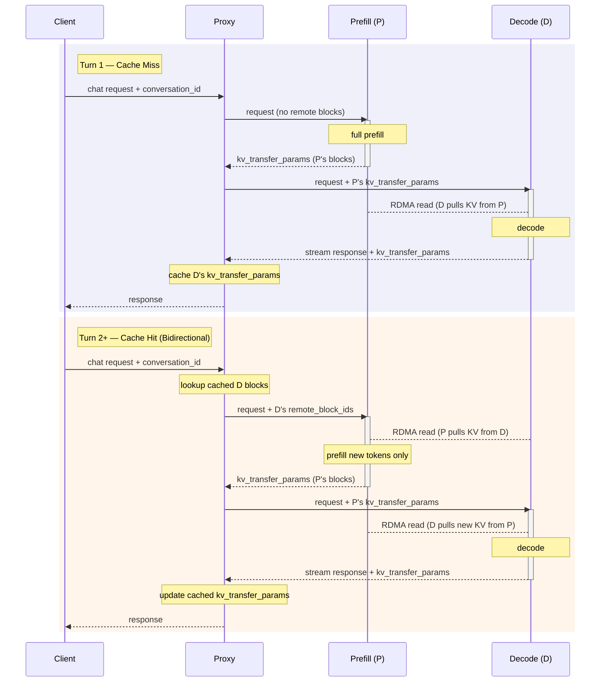

# NixlConnector Usage Guide

NixlConnector is a high-performance KV cache transfer connector for vLLM's disaggregated prefilling feature. It provides fully asynchronous send/receive operations using the NIXL library for efficient cross-process KV cache transfer.

For feature compatibility details (supported model architectures, TP configurations, and feature interactions), see the [NixlConnector Compatibility Matrix](nixl_connector_compatibility.md).

## Prerequisites

### Installation

Install the NIXL library: `uv pip install nixl`, as a quick start on Nvidia platform.

- Refer to [NIXL official repository](https://github.com/ai-dynamo/nixl) for more installation instructions
- The specified required NIXL version can be found in [requirements/kv_connectors.txt](../../requirements/kv_connectors.txt) and other relevant config files

For ROCm platform, the [ROCm docker file](../../docker/Dockerfile.rocm) includes RIXL and ucx already.

- Refer to [RIXL official repository](https://github.com/rocm/rixl) for more information
- The supportive libraries for RIXL can be found in [requirements/kv_connectors_rocm.txt](../../requirements/kv_connectors_rocm.txt)
- In the future we may remove RIXL from docker image file and users will be able to install from pre-compiled binary packages

For non-cuda platform, please install nixl with ucx build from source, instructed as below.

```bash
python tools/install_nixl_from_source_ubuntu.py
```

### Transport Configuration

NixlConnector uses NIXL library for underlying communication, which supports multiple transport backends. UCX (Unified Communication X) is the primary default transport library used by NIXL. Configure transport environment variables:

```bash
# Example UCX configuration, adjust according to your environment
export UCX_TLS=all  # or specify specific transports like "rc,ud,sm,^cuda_ipc" ..etc
export UCX_NET_DEVICES=all  # or specify network devices like "mlx5_0:1,mlx5_1:1"
```

!!! tip
    When using UCX as the transport backend, NCCL environment variables (like `NCCL_IB_HCA`, `NCCL_SOCKET_IFNAME`) are not applicable to NixlConnector, so configure UCX-specific environment variables instead of NCCL variables.

#### Selecting a NIXL transport backend (plugin)

NixlConnector can use different NIXL transport backends (plugins). By default, NixlConnector uses UCX as the transport backend.

To select a different backend, set `kv_connector_extra_config.backends` in `--kv-transfer-config`.

### Example: using LIBFABRIC backend

```bash
vllm serve <MODEL> \
  --kv-transfer-config '{
    "kv_connector":"NixlConnector",
    "kv_role":"kv_both",
    "kv_connector_extra_config":{"backends":["LIBFABRIC"]}
  }'
```

You can also pass JSON keys individually using dotted arguments, and you can append list elements using `+`:

```bash
vllm serve <MODEL> \
  --kv-transfer-config.kv_connector NixlConnector \
  --kv-transfer-config.kv_role kv_both \
  --kv-transfer-config.kv_connector_extra_config.backends+ LIBFABRIC
```

!!! note
    Backend availability depends on how NIXL was built and what plugins are present in your environment. Refer to the [NIXL repository](https://github.com/ai-dynamo/nixl) for available backends and build instructions.

## Basic Usage (on the same host)

### Producer (Prefiller) Configuration

Start a prefiller instance that produces KV caches

```bash
# 1st GPU as prefiller
CUDA_VISIBLE_DEVICES=0 \
UCX_NET_DEVICES=all \
VLLM_NIXL_SIDE_CHANNEL_PORT=5600 \
vllm serve Qwen/Qwen3-0.6B \
  --port 8100 \
  --enforce-eager \
  --kv-transfer-config '{"kv_connector":"NixlConnector","kv_role":"kv_both","kv_load_failure_policy":"fail"}'
```

### Consumer (Decoder) Configuration

Start a decoder instance that consumes KV caches:

```bash
# 2nd GPU as decoder
CUDA_VISIBLE_DEVICES=1 \
UCX_NET_DEVICES=all \
VLLM_NIXL_SIDE_CHANNEL_PORT=5601 \
vllm serve Qwen/Qwen3-0.6B \
  --port 8200 \
  --enforce-eager \
  --kv-transfer-config '{"kv_connector":"NixlConnector","kv_role":"kv_both","kv_load_failure_policy":"fail"}'
```

### Proxy Server

Use a proxy server to route requests between prefiller and decoder:

```bash
python tests/v1/kv_connector/nixl_integration/toy_proxy_server.py \
  --port 8192 \
  --prefiller-hosts localhost \
  --prefiller-ports 8100 \
  --decoder-hosts localhost \
  --decoder-ports 8200
```

## Environment Variables

- `VLLM_NIXL_SIDE_CHANNEL_PORT`: Port for NIXL handshake communication
    - Default: 5600
    - **Required for both prefiller and decoder instances**
    - Each vLLM worker needs a unique port on its host; using the same port number across different hosts is fine
    - For TP/DP deployments, each worker's port on a node is computed as: base_port + dp_rank (e.g., with `--data-parallel-size=2` and base_port=5600, dp_rank 0..1 use port 5600, 5601 on that node).
    - Used for the initial NIXL handshake between the prefiller and the decoder

- `VLLM_NIXL_SIDE_CHANNEL_HOST`: Host for side channel communication
    - Default: "localhost"
    - Set when prefiller and decoder are on different machines
    - Connection info is passed via KVTransferParams from prefiller to decoder for handshake

- `kv_lease_duration` (via `kv_connector_extra_config`): Lease duration (in seconds) for the prefiller's KV cache blocks. (Optional)
    - Default: 30
    - When a prefill request finishes, its KV blocks are held for this duration waiting for the decoder to read them. While the request is queued on the decoder, periodic heartbeats automatically extend the lease. If neither a heartbeat nor a read notification arrives before the lease expires, the blocks are freed. The heartbeat interval and extension amount are derived automatically from this value.
    - Example: `--kv-transfer-config '{"kv_connector_extra_config": {"kv_lease_duration": 60}}'`

- `decoder_kv_blocks_ttl` (via `kv_connector_extra_config`): TTL (in seconds) for KV blocks cached on the decoder in bidirectional transfer mode. (Optional)
    - Default: 480
    - In bidirectional mode, the decoder caches KV blocks for multi-turn conversations. This TTL controls how long those blocks are held before being released. Unlike the prefiller lease, this TTL is not renewed via heartbeats.
    - Example: `--kv-transfer-config '{"kv_connector_extra_config": {"decoder_kv_blocks_ttl": 600}}'`

## Bidirectional KV Transfer (Multi-turn)

In standard disaggregated prefilling, KV cache flows in one direction: Prefill (P) computes the KV cache and Decode (D) reads from P. For multi-turn conversations this is wasteful — D already holds the KV cache corresponding to the generated tokens from prior turns, yet P must recompute it from scratch on every new turn. Bidirectional KV transfer lets P **pull** existing KV blocks from D via RDMA before computing only the new tokens, significantly reducing Time-To-First-Token (TTFT) for long-prefill such as **multi-turn heavy scenarios**.

### How it works

The feature relies on a **stateful proxy** that sits between the client and the P/D instances. The proxy tracks `kv_transfer_params` returned by D at the end of each turn, and attaches them to the next turn's request so P knows which blocks to pull from D.



**Turn 1 (cache miss):**

1. Client sends a chat request with a `conversation_id` to the proxy.
2. Proxy forwards the request to P with no remote block info — P computes the full KV cache.
3. Proxy forwards the request to D along with P's `kv_transfer_params` (block IDs, engine ID, host/port).
4. D reads KV blocks from P via RDMA (peer-to-peer pull), then generates the response.
5. D streams the response back through the proxy. The final chunk includes D's own `kv_transfer_params`.
6. Proxy caches D's `kv_transfer_params` keyed by `conversation_id`, then returns the response to the client.

**Turn 2+ (cache hit — bidirectional):**

1. Client sends the next turn with the same `conversation_id`.
2. Proxy looks up cached `kv_transfer_params` from the previous turn and attaches D's `remote_block_ids` to the request sent to P.
3. P reads the existing KV cache from D via RDMA (D→P pull), then computes KV only for the new tokens.
4. Proxy forwards the request to D with P's updated `kv_transfer_params`.
5. D reads the new KV blocks from P, generates the response, and returns updated `kv_transfer_params` which the proxy caches for the next turn.

### Configuration

Enable bidirectional KV transfer by setting `bidirectional_kv_xfer` in `kv_connector_extra_config` on **both** P and D instances:

```bash
vllm serve <MODEL> \
  --kv-transfer-config '{
    "kv_connector": "NixlConnector",
    "kv_role": "kv_both",
    "kv_connector_extra_config": {
      "bidirectional_kv_xfer": true
    }
  }'
```

Additional configuration options in `kv_connector_extra_config`:

| Parameter | Default | Description |
| --------- | ------- | ----------- |
| `bidirectional_kv_xfer` | `false` | Enable bidirectional D→P KV transfer. |
| `kv_recompute_threshold` | `64` | Minimum number of remote tokens required to trigger a D→P pull. Below this threshold, P recomputes locally instead of pulling (to amortize transfer latency). |
| `decoder_kv_blocks_ttl` | `480` | TTL (seconds) for KV blocks cached on D for bidirectional reuse. Blocks are released after this duration. Not renewed via heartbeats. |

### Multi-turn proxy setup

Use the provided multi-turn proxy to manage `kv_transfer_params` caching across conversation turns:

```bash
python examples/disaggregated/disaggregated_serving/disagg_proxy_multiturn.py \
  --host 0.0.0.0 --port 8000 \
  --prefiller-host <P_IP> --prefiller-port 8100 \
  --decoder-host <D_IP> --decoder-port 8200
```

The proxy supports multiple P and D instances via round-robin:

```bash
python examples/disaggregated/disaggregated_serving/disagg_proxy_multiturn.py \
  --host 0.0.0.0 --port 8000 \
  --prefiller-hosts <P_IP1> <P_IP2> --prefiller-ports 8100 8100 \
  --decoder-hosts <D_IP1> <D_IP2> --decoder-ports 8200 8200
```

### Client usage

Include a `conversation_id` field in the request body to enable cross-turn KV reuse. Without it, the proxy cannot link turns and falls back to full recomputation.

```bash
# Turn 1
curl http://localhost:8000/v1/chat/completions \
  -H "Content-Type: application/json" \
  -d '{
    "model": "Qwen/Qwen3-0.6B",
    "conversation_id": "session-42",
    "messages": [
      {"role": "user", "content": "What is vLLM?"}
    ]
  }'

# Turn 2 — same conversation_id triggers bidirectional KV pull
curl http://localhost:8000/v1/chat/completions \
  -H "Content-Type: application/json" \
  -d '{
    "model": "Qwen/Qwen3-0.6B",
    "conversation_id": "session-42",
    "messages": [
      {"role": "user", "content": "What is vLLM?"},
      {"role": "assistant", "content": "vLLM is a high-throughput LLM serving engine..."},
      {"role": "user", "content": "How does disaggregated prefilling work?"}
    ]
  }'
```

!!! note
    The `conversation_id` field is a non-standard extension to the OpenAI API. It is consumed by the proxy and not forwarded to the vLLM engine.

### Limitations

- Requires a stateful proxy (or equivalent router) to track and forward `kv_transfer_params` between turns.
- Currently supported on CUDA with device-buffer KV cache. Host-buffer support (e.g., for Intel XPU) is planned for future work.

!!! warning "Reasoning models with stripped thinking traces"
    When using reasoning models (e.g. DeepSeek-R1) that produce thinking traces
    (`<think>...</think>`), D's KV blocks cover the full token sequence including
    thinking tokens. If the client strips thinking traces from the conversation
    history before sending the next turn, the prompt P receives will be missing
    tokens from the middle of what D generated. The block-alignment logic assumes
    P's prompt is a prefix of D's sequence, so pulling KV blocks from D in this
    case transfers cache computed for the wrong token positions, producing
    incorrect results.

    We currently assume the router is able to detect such mismatch across turns. See [#43094](https://github.com/vllm-project/vllm/issues/43094). 

## Multi-Instance Setup

### Multiple Prefiller Instances on Different Machines

```bash
# Prefiller 1 on Machine A (example IP: ${IP1})
VLLM_NIXL_SIDE_CHANNEL_HOST=${IP1} \
VLLM_NIXL_SIDE_CHANNEL_PORT=5600 \
UCX_NET_DEVICES=all \
vllm serve Qwen/Qwen3-0.6B --port 8000 \
  --tensor-parallel-size 8 \
  --kv-transfer-config '{"kv_connector":"NixlConnector","kv_role":"kv_producer","kv_load_failure_policy":"fail"}'

# Prefiller 2 on Machine B (example IP: ${IP2})
VLLM_NIXL_SIDE_CHANNEL_HOST=${IP2} \
VLLM_NIXL_SIDE_CHANNEL_PORT=5600 \
UCX_NET_DEVICES=all \
vllm serve Qwen/Qwen3-0.6B --port 8000 \
  --tensor-parallel-size 8 \
  --kv-transfer-config '{"kv_connector":"NixlConnector","kv_role":"kv_producer","kv_load_failure_policy":"fail"}'
```

### Multiple Decoder Instances on Different Machines

```bash
# Decoder 1 on Machine C (example IP: ${IP3})
VLLM_NIXL_SIDE_CHANNEL_HOST=${IP3} \
VLLM_NIXL_SIDE_CHANNEL_PORT=5600 \
UCX_NET_DEVICES=all \
vllm serve Qwen/Qwen3-0.6B --port 8000 \
  --tensor-parallel-size 8 \
  --kv-transfer-config '{"kv_connector":"NixlConnector","kv_role":"kv_consumer","kv_load_failure_policy":"fail"}'

# Decoder 2 on Machine D (example IP: ${IP4})
VLLM_NIXL_SIDE_CHANNEL_HOST=${IP4} \
VLLM_NIXL_SIDE_CHANNEL_PORT=5600 \
UCX_NET_DEVICES=all \
vllm serve Qwen/Qwen3-0.6B --port 8000 \
  --tensor-parallel-size 8 \
  --kv-transfer-config '{"kv_connector":"NixlConnector","kv_role":"kv_consumer","kv_load_failure_policy":"fail"}'
```

### Proxy for Multiple Instances

```bash
python tests/v1/kv_connector/nixl_integration/toy_proxy_server.py \
  --port 8192 \
  --prefiller-hosts ${IP1} ${IP2} \
  --prefiller-ports 8000 8000 \
  --decoder-hosts ${IP3} ${IP4} \
  --decoder-ports 8000 8000
```

For multi-host DP deployment, only need to provide the host/port of the head instances.

### KV Role Options

- **kv_producer**: For prefiller instances that generate KV caches
- **kv_consumer**: For decoder instances that consume KV caches from prefiller
- **kv_both**: Enables symmetric functionality where the connector can act as both producer and consumer. This provides flexibility for experimental setups and scenarios where the role distinction is not predetermined.

!!! tip
    NixlConnector currently does not distinguish `kv_role`; the actual prefiller/decoder roles are determined by the upper-level proxy (e.g., `toy_proxy_server.py` using `--prefiller-hosts` and `--decoder-hosts`).
    Therefore, `kv_role` in `--kv-transfer-config` is effectively a placeholder and does not affect NixlConnector's behavior.

### KV Load Failure Policy

The `kv_load_failure_policy` setting controls how the system handles failures when the decoder instance loads KV cache blocks from the prefiller instance:

- **fail** (default): Immediately fail the request with an error when KV load fails. This prevents performance degradation by avoiding recomputation of prefill work on the decode instance.
- **recompute**: Recompute failed blocks locally on the decode instance. This may cause performance _jitter_ on decode instances as the scheduled prefill will delay and interfere with other decodes. Furthermore, decode instances are typically configured with low-latency optimizations.

!!! warning
    Using `kv_load_failure_policy="recompute"` can lead to performance degradation in production deployments. When KV loads fail, the decode instance will execute prefill work with decode-optimized configurations, which is inefficient and defeats the purpose of disaggregated prefilling. This also increases tail latency for other ongoing decode requests.

### For NVIDIA GB-series GPUs

GB-series GPUs support multi-node NVLink. NIXL supports this capability, but KVCache must be registered as VMM during KVCache registration. To enable this feature, you need to set `--enable-cumem-allocator` or `--enable-sleep-mode` flags, and set `UCX_CUDA_IPC_ENABLE_MNNVL: 'y'` env. Otherwise, NIXL can only use RDMA/TCP for cross-node KVCache transfers.

## Experimental Feature

### Heterogeneous KV Layout support

Support use case: Prefill with 'HND' and decode with 'NHD' with experimental configuration

```bash
--kv-transfer-config '{..., "enable_permute_local_kv":"True"}'
```

### Cross layers blocks

By default, this feature is disabled. On attention backends that support this feature, each logical block is contiguous in physical memory. This reduces the number of buffers that need to be transferred.
To enable this feature:

```bash
--kv-transfer-config '{..., "kv_connector_extra_config": {"enable_cross_layers_blocks": "True"}}'
```

## Example Scripts/Code

Refer to these example scripts in the vLLM repository:

- [run_accuracy_test.sh](../../tests/v1/kv_connector/nixl_integration/run_accuracy_test.sh)
- [toy_proxy_server.py](../../tests/v1/kv_connector/nixl_integration/toy_proxy_server.py)
- [test_accuracy.py](../../tests/v1/kv_connector/nixl_integration/test_accuracy.py)
