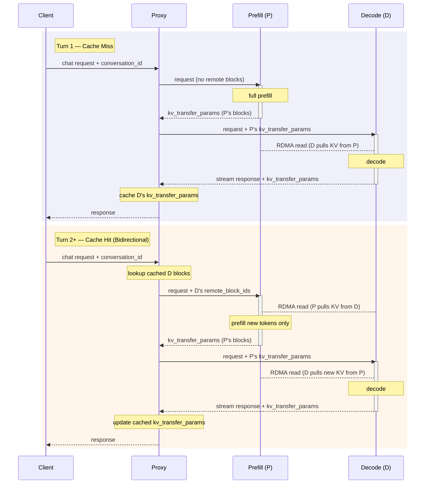

# NixlConnector Usage Guide

NixlConnector is a high-performance KV cache transfer connector for vLLM's disaggregated prefilling feature. It provides fully asynchronous send/receive operations using the NIXL library for efficient cross-process KV cache transfer.

For feature compatibility details (supported model architectures, TP configurations, and feature interactions), see the [NixlConnector Compatibility Matrix](nixl_connector_compatibility.md).

## Prerequisites

### Installation

Install the NIXL library: `uv pip install nixl`, as a quick start on Nvidia platform.

- Refer to [NIXL official repository](https://github.com/ai-dynamo/nixl) for more installation instructions
- The specified required NIXL version can be found in [requirements/kv_connectors.txt](../../requirements/kv_connectors.txt) and other relevant config files

For ROCm, the [ROCm Dockerfile](../../docker/Dockerfile.rocm) builds NIXL and UCX with ROCm support from source.

For non-cuda platform, please install nixl with ucx build from source, instructed as below.

```bash
python tools/install_nixl_from_source_ubuntu.py
```

### Transport Configuration

NixlConnector uses NIXL library for underlying communication, which supports multiple transport backends. UCX (Unified Communication X) is the primary default transport library used by NIXL. Configure transport environment variables:

```bash
# Example UCX configuration, adjust according to your environment
export UCX_TLS=all  # or specify specific transports like "rc,ud,sm,^cuda_ipc" ..etc
export UCX_NET_DEVICES=all  # or specify network devices like "mlx5_0:1,mlx5_1:1"
```

!!! tip
    When using UCX as the transport backend, NCCL environment variables (like `NCCL_IB_HCA`, `NCCL_SOCKET_IFNAME`) are not applicable to NixlConnector, so configure UCX-specific environment variables instead of NCCL variables.

#### Selecting a NIXL transport backend (plugin)

NixlConnector can use different NIXL transport backends (plugins). By default, NixlConnector uses UCX as the transport backend.

To select a different backend, set `kv_connector_extra_config.backends` in `--kv-transfer-config`.

### Example: using LIBFABRIC backend

```bash
vllm serve <MODEL> \
  --kv-transfer-config '{
    "kv_connector":"NixlConnector",
    "kv_role":"kv_producer",
    "kv_connector_extra_config":{"backends":["LIBFABRIC"]}
  }'
```

You can also pass JSON keys individually using dotted arguments, and you can append list elements using `+`:

```bash
vllm serve <MODEL> \
  --kv-transfer-config.kv_connector NixlConnector \
  --kv-transfer-config.kv_role kv_producer \
  --kv-transfer-config.kv_connector_extra_config.backends+ LIBFABRIC
```

!!! note
    Backend availability depends on how NIXL was built and what plugins are present in your environment. Refer to the [NIXL repository](https://github.com/ai-dynamo/nixl) for available backends and build instructions.

## Basic Usage (on the same host)

### Producer (Prefiller) Configuration

Start a prefiller instance that produces KV caches

```bash
# 1st GPU as prefiller
CUDA_VISIBLE_DEVICES=0 \
UCX_NET_DEVICES=all \
VLLM_NIXL_SIDE_CHANNEL_PORT=5600 \
vllm serve Qwen/Qwen3-0.6B \
  --port 8100 \
  --enforce-eager \
  --kv-transfer-config '{"kv_connector":"NixlConnector","kv_role":"kv_producer","kv_load_failure_policy":"fail"}'
```

### Consumer (Decoder) Configuration

Start a decoder instance that consumes KV caches:

```bash
# 2nd GPU as decoder
CUDA_VISIBLE_DEVICES=1 \
UCX_NET_DEVICES=all \
VLLM_NIXL_SIDE_CHANNEL_PORT=5601 \
vllm serve Qwen/Qwen3-0.6B \
  --port 8200 \
  --enforce-eager \
  --kv-transfer-config '{"kv_connector":"NixlConnector","kv_role":"kv_consumer","kv_load_failure_policy":"fail"}'
```

### Proxy Server

Use a proxy server to route requests between prefiller and decoder:

```bash
python tests/v1/kv_connector/nixl_integration/toy_proxy_server.py \
  --port 8192 \
  --prefiller-hosts localhost \
  --prefiller-ports 8100 \
  --decoder-hosts localhost \
  --decoder-ports 8200
```

## Router discovery over the gRPC control plane

A router that pairs prefill and decode instances needs to know, for each instance, which
engines it runs, whether two instances can exchange KV cache at all, and where a decoder
should reach a prefiller. The Rust frontend serves this from its gRPC `KvTransfer` service, on
the same listener that carries the other control RPCs and under the same TLS settings, so the
information never has to be scraped from logs or read off the unauthenticated ZMQ side channel.

### Enabling it

The control plane exists only in the Rust frontend, and the gRPC port is a Rust frontend flag.
Start each instance with `vllm-rs serve` (the binary ships inside the `vllm` package) and pass
`--grpc-port`; every flag the Rust frontend does not own is forwarded to the Python engine:

```bash
# Prefiller
VLLM_NIXL_SIDE_CHANNEL_HOST=10.0.0.1 VLLM_NIXL_SIDE_CHANNEL_PORT=5600 \
vllm-rs serve Qwen/Qwen3-0.6B \
  --host 0.0.0.0 --port 8100 --grpc-port 50051 \
  --tensor-parallel-size 1 \
  --kv-transfer-config '{"kv_connector":"NixlConnector","kv_role":"kv_both"}'

# Decoder
VLLM_NIXL_SIDE_CHANNEL_HOST=10.0.0.2 VLLM_NIXL_SIDE_CHANNEL_PORT=5600 \
vllm-rs serve Qwen/Qwen3-0.6B \
  --host 0.0.0.0 --port 8200 --grpc-port 50051 \
  --tensor-parallel-size 1 \
  --kv-transfer-config '{"kv_connector":"NixlConnector","kv_role":"kv_both"}'
```

`vllm serve` with `VLLM_USE_RUST_FRONTEND=1` does not forward `--grpc-port` to the Rust
frontend today, so the gRPC control plane is only reachable through `vllm-rs serve`.

`--grpc-services` mounts all four services by default; `--grpc-services configured` derives
the set from the engine configuration, which mounts `KvTransfer` whenever a KV connector is
configured. Adding
`--grpc-services control,kv-transfer` keeps the handshake plus the `Control` RPCs a router
discovers instances with, and drops `Generate` and the RL RPCs from the port; on an instance no
router queries, `--grpc-services kv-transfer` leaves only the handshake. The services left out
answer `Unimplemented`, and `Control.GetServerInfo` reports the mounted set in its `services`
field. The moved RPCs also stay callable at their old `vllm.Control` paths for one release,
deprecated, and answer `Unimplemented` whenever `KvTransfer` or `RlControl` is unmounted.
A frontend only advertises `remote_control_port` when `KvTransfer` is mounted, so
narrowing the set off `kv-transfer` sends peers back to the ZMQ side channel rather than to an
unmounted service.

### How the handshake runs

A frontend with a gRPC port adds `remote_control_port` to the `kv_transfer_params` a
prefiller returns. When a request carrying such params reaches a decoder frontend, that
frontend calls the prefiller's `GetKvHandshakeMetadata`, hands the payload to its own workers,
and only then submits the request; the workers register the remote NIXL agent from the pushed
payload and never open a side channel. Pairs where either side lacks a control plane keep
using the ZMQ side channel. The `handshake_transport` connector option pins the behaviour:

| Value | Worker behaviour | ZMQ listener |
| --- | --- | --- |
| `auto` (default) | pushed payload when present, else ZMQ side channel | started |
| `grpc` | pushed payload only; a peer without `remote_control_port` fails the handshake | not started |
| `zmq` | ZMQ side channel only | started |

```bash
--kv-transfer-config '{"kv_connector":"NixlConnector","kv_role":"kv_both","kv_connector_extra_config":{"handshake_transport":"grpc"}}'
```

By default a peer dials `remote_host` (the side-channel host, usually the pod IP) on
`remote_control_port`. Pass `--kv-control-advertise-host <name>` to advertise a different
host as `remote_control_host`; under a service mesh this must be a Service name, since the
sidecar only originates mTLS towards destinations in its registry, and the mesh policy must
admit the decode instances' identity as callers of the control port.

The ZMQ side channel and `VLLM_NIXL_SIDE_CHANNEL_*` are deprecated: `auto` is the default
for this release, `grpc` becomes the default in the next, and the ZMQ path is removed after
that. Deployments on the Python frontend stay on ZMQ until then.

### What a router gets

`GetKvTransferInfo` lists the engines behind one frontend, one entry per data-parallel rank:

```bash
grpcurl -plaintext -import-path rust/proto -proto control.proto \
  10.0.0.1:50051 vllm.KvTransfer/GetKvTransferInfo
```

```json
{
  "engines": [
    {
      "engineId": "ba35fccd-4e4d-41b9-bac4-15afc77d11a3",
      "connector": "NixlConnector",
      "role": "kv_both",
      "tensorParallelSize": 1,
      "pipelineParallelSize": 1,
      "kvBlockSize": 128,
      "compatibilityHash": "3b135b15c7aad11057176dab7f5b2f9986ae6ff21e9203b926f483166fbbe80d"
    }
  ]
}
```

- `engineId` is the value a prefiller returns as `remote_engine_id` in `kv_transfer_params`,
  so a router can map a finished prefill back to the instance that owns the KV blocks.
- `compatibilityHash` covers the vLLM version, model, dtype, KV cache layout and attention
  backend. Only pair instances whose hashes match; a mismatch fails the handshake on the
  decoder (see [NixlConnector Compatibility Matrix](nixl_connector_compatibility.md)).
- `kvBlockSize`, `tensorParallelSize` and `pipelineParallelSize` are the values the decoder
  validates against its own configuration when it registers the remote agent.

`GetKvHandshakeMetadata` returns, for one `engine_id`, the msgpack-encoded
`NixlHandshakePayload` of every `(pp_rank, tp_rank)` worker. It is byte-identical to what the
ZMQ side channel serves and is meant for tooling and for a router that wants to verify a
peer before sending traffic; the payload is opaque and should not be parsed by the router.

```bash
grpcurl -plaintext -import-path rust/proto -proto control.proto \
  -d '{"engine_id":"ba35fccd-4e4d-41b9-bac4-15afc77d11a3"}' \
  10.0.0.1:50051 vllm.KvTransfer/GetKvHandshakeMetadata
```

The schema is `rust/proto/control.proto`, also published to `buf.build/vllm-project/vllm`.

### Securing the control plane

The handshake payload contains the RDMA registration of the KV cache, which is what lets a
peer read that memory. Treat the gRPC port like the side channel port: private network only,
and authenticated when the network is shared.

- **TLS terminated by vLLM.** The gRPC listener uses the frontend's TLS flags:
  `--ssl-certfile` (optionally `--ssl-keyfile`), plus `--ssl-ca-certs` and
  `--ssl-cert-reqs 2` to require a client certificate. This is the option when no service mesh
  is in place.
- **Service mesh.** With Istio in sidecar mode, require mTLS on the gRPC port alone, admit the
  router's identity to it, and admit peer instances to the two handshake RPCs only, since the
  same port can also carry `Generate`, `PauseGeneration`, `Sleep`, the weight-update RPCs and the
  KV event stream endpoint. The HTTP port and the side channel keep their existing behaviour:

    ```yaml
    apiVersion: security.istio.io/v1
    kind: PeerAuthentication
    metadata:
      name: kv-control-plane
    spec:
      selector:
        matchLabels:
          llm-d.ai/role: prefill
      mtls:
        mode: PERMISSIVE
      portLevelMtls:
        "50051":
          mode: STRICT
    ---
    apiVersion: security.istio.io/v1
    kind: AuthorizationPolicy
    metadata:
      name: kv-control-plane-callers
    spec:
      selector:
        matchLabels:
          llm-d.ai/role: prefill
      action: DENY
      rules:
        - to:
            - operation:
                ports: ["50051"]
          from:
            - source:
                notPrincipals:
                  - cluster.local/ns/<namespace>/sa/<router-service-account>
                  - cluster.local/ns/<namespace>/sa/<decode-service-account>
        - to:
            - operation:
                ports: ["50051"]
                notPaths:
                  - /vllm.KvTransfer/GetKvHandshakeMetadata
                  - /vllm.KvTransfer/GetKvTransferInfo
          from:
            - source:
                principals:
                  - cluster.local/ns/<namespace>/sa/<decode-service-account>
    ```

  Istio only originates mTLS towards destinations in its service registry, and only evaluates
  path rules on a port it sees as HTTP, so expose the gRPC port of every role the policy selects
  through a `Service` with a port named `grpc-control` and have clients dial that name. On a port
  outside the registry, Istio drops the HTTP fields and the second rule degrades to denying the
  peer identity the whole port.

See [gRPC Interface](../usage/security.md#grpc-interface) for the rest of the control
service's security considerations.

## Environment Variables

- `VLLM_NIXL_SIDE_CHANNEL_PORT`: Port for NIXL handshake communication
    - Default: 5600
    - **Required for both prefiller and decoder instances**
    - Each vLLM worker needs a unique port on its host; using the same port number across different hosts is fine
    - For TP/DP deployments, each worker's port on a node is computed as: base_port + dp_rank (e.g., with `--data-parallel-size=2` and base_port=5600, dp_rank 0..1 use port 5600, 5601 on that node).
    - Used for the initial NIXL handshake between the prefiller and the decoder

- `VLLM_NIXL_SIDE_CHANNEL_HOST`: Host for side channel communication
    - Default: "localhost"
    - Set when prefiller and decoder are on different machines
    - Connection info is passed via KVTransferParams from prefiller to decoder for handshake

- `kv_lease_duration` (via `kv_connector_extra_config`): Lease duration (in seconds) for the prefiller's KV cache blocks. (Optional)
    - Default: 30
    - When a prefill request finishes, its KV blocks are held for this duration waiting for the decoder to read them. While the request is queued on the decoder, periodic heartbeats automatically extend the lease. If neither a heartbeat nor a read notification arrives before the lease expires, the blocks are freed. The heartbeat interval and extension amount are derived automatically from this value.
    - Example: `--kv-transfer-config '{"kv_connector_extra_config": {"kv_lease_duration": 60}}'`

- `decoder_kv_blocks_ttl` (via `kv_connector_extra_config`): TTL (in seconds) for KV blocks cached on the decoder in bidirectional transfer mode. (Optional)
    - Default: 480
    - In bidirectional mode, the decoder caches KV blocks for multi-turn conversations. This TTL controls how long those blocks are held before being released. Unlike the prefiller lease, this TTL is not renewed via heartbeats.
    - Example: `--kv-transfer-config '{"kv_connector_extra_config": {"decoder_kv_blocks_ttl": 600}}'`

## Bidirectional KV Transfer (Multi-turn)

In standard disaggregated prefilling, KV cache flows in one direction: Prefill (P) computes the KV cache and Decode (D) reads from P. For multi-turn conversations this is wasteful — D already holds the KV cache corresponding to the generated tokens from prior turns, yet P must recompute it from scratch on every new turn. Bidirectional KV transfer lets P **pull** existing KV blocks from D via RDMA before computing only the new tokens, significantly reducing Time-To-First-Token (TTFT) for long-prefill such as **multi-turn heavy scenarios**.

### How it works

The feature relies on a **stateful proxy** that sits between the client and the P/D instances. The proxy tracks `kv_transfer_params` returned by D at the end of each turn, and attaches them to the next turn's request so P knows which blocks to pull from D.


```mermaid
sequenceDiagram
    participant Client
    participant Proxy
    participant P as Prefill (P)
    participant D as Decode (D)

    rect rgb(240, 240, 250)
    note right of Client: Turn 1 — Cache Miss
    Client->>Proxy: chat request + conversation_id
    Proxy->>P: request (no remote blocks)
    activate P
    note over P: full prefill
    P-->>Proxy: kv_transfer_params (P's blocks)
    deactivate P
    Proxy->>D: request + P's kv_transfer_params
    activate D
    D-->P: RDMA read (D pulls KV from P)
    note over D: decode
    D-->>Proxy: stream response + kv_transfer_params
    deactivate D
    note over Proxy: cache D's kv_transfer_params
    Proxy-->>Client: response
    end

    rect rgb(255, 245, 235)
    note right of Client: Turn 2+ — Cache Hit (Bidirectional)
    Client->>Proxy: chat request + conversation_id
    note over Proxy: lookup cached D blocks
    Proxy->>P: request + D's remote_block_ids
    activate P
    P-->D: RDMA read (P pulls KV from D)
    note over P: prefill new tokens only
    P-->>Proxy: kv_transfer_params (P's blocks)
    deactivate P
    Proxy->>D: request + P's kv_transfer_params
    activate D
    D-->P: RDMA read (D pulls new KV from P)
    note over D: decode
    D-->>Proxy: stream response + kv_transfer_params
    deactivate D
    note over Proxy: update cached kv_transfer_params
    Proxy-->>Client: response
    end
```

**Turn 1 (cache miss):**

1. Client sends a chat request with a `conversation_id` to the proxy.
2. Proxy forwards the request to P with no remote block info — P computes the full KV cache.
3. Proxy forwards the request to D along with P's `kv_transfer_params` (block IDs, engine ID, host/port).
4. D reads KV blocks from P via RDMA (peer-to-peer pull), then generates the response.
5. D streams the response back through the proxy. The final chunk includes D's own `kv_transfer_params`.
6. Proxy caches D's `kv_transfer_params` keyed by `conversation_id`, then returns the response to the client.

**Turn 2+ (cache hit — bidirectional):**

1. Client sends the next turn with the same `conversation_id`.
2. Proxy looks up cached `kv_transfer_params` from the previous turn and attaches D's `remote_block_ids` to the request sent to P.
3. P reads the existing KV cache from D via RDMA (D→P pull), then computes KV only for the new tokens.
4. Proxy forwards the request to D with P's updated `kv_transfer_params`.
5. D reads the new KV blocks from P, generates the response, and returns updated `kv_transfer_params` which the proxy caches for the next turn.

### Configuration

Enable bidirectional KV transfer by setting `bidirectional_kv_xfer` in `kv_connector_extra_config` on **both** P and D instances:

```bash
# Prefill instance
vllm serve <MODEL> \
  --kv-transfer-config '{
    "kv_connector": "NixlConnector",
    "kv_role": "kv_producer",
    "kv_connector_extra_config": {
      "bidirectional_kv_xfer": true
    }
  }'

# Decode instance
vllm serve <MODEL> \
  --kv-transfer-config '{
    "kv_connector": "NixlConnector",
    "kv_role": "kv_consumer",
    "kv_connector_extra_config": {
      "bidirectional_kv_xfer": true
    }
  }'
```

Additional configuration options in `kv_connector_extra_config`:

| Parameter | Default | Description |
| --------- | ------- | ----------- |
| `bidirectional_kv_xfer` | `false` | Enable bidirectional D→P KV transfer. |
| `kv_recompute_threshold` | `64` | Minimum number of remote tokens required to trigger a D→P pull. Below this threshold, P recomputes locally instead of pulling (to amortize transfer latency). |
| `decoder_kv_blocks_ttl` | `480` | TTL (seconds) for KV blocks cached on D for bidirectional reuse. Blocks are released after this duration. Not renewed via heartbeats. |

### Multi-turn proxy setup

Use the provided multi-turn proxy to manage `kv_transfer_params` caching across conversation turns:

```bash
python examples/disaggregated/disaggregated_serving/disagg_proxy_multiturn.py \
  --host 0.0.0.0 --port 8000 \
  --prefiller-host <P_IP> --prefiller-port 8100 \
  --decoder-host <D_IP> --decoder-port 8200
```

The proxy supports multiple P and D instances via round-robin:

```bash
python examples/disaggregated/disaggregated_serving/disagg_proxy_multiturn.py \
  --host 0.0.0.0 --port 8000 \
  --prefiller-hosts <P_IP1> <P_IP2> --prefiller-ports 8100 8100 \
  --decoder-hosts <D_IP1> <D_IP2> --decoder-ports 8200 8200
```

### Client usage

Include a `conversation_id` field in the request body to enable cross-turn KV reuse. Without it, the proxy cannot link turns and falls back to full recomputation.

```bash
# Turn 1
curl http://localhost:8000/v1/chat/completions \
  -H "Content-Type: application/json" \
  -d '{
    "model": "Qwen/Qwen3-0.6B",
    "conversation_id": "session-42",
    "messages": [
      {"role": "user", "content": "What is vLLM?"}
    ]
  }'

# Turn 2 — same conversation_id triggers bidirectional KV pull
curl http://localhost:8000/v1/chat/completions \
  -H "Content-Type: application/json" \
  -d '{
    "model": "Qwen/Qwen3-0.6B",
    "conversation_id": "session-42",
    "messages": [
      {"role": "user", "content": "What is vLLM?"},
      {"role": "assistant", "content": "vLLM is a high-throughput LLM serving engine..."},
      {"role": "user", "content": "How does disaggregated prefilling work?"}
    ]
  }'
```

!!! note
    The `conversation_id` field is a non-standard extension to the OpenAI API. It is consumed by the proxy and not forwarded to the vLLM engine.

### Benchmarking the multi-turn proxy

[`benchmarks/multi_turn/benchmark_serving_multi_turn.py`](../../benchmarks/multi_turn/benchmark_serving_multi_turn.py) supports targeting the disaggregated multi-turn proxy with the `--send-conversation-id` flag, which injects a per-conversation `conversation_id` into every request payload so the proxy can key cross-turn KV cache reuse.

The flag is **off by default** so the benchmark is compatible with strict OpenAI-compatible frontends that reject unknown top-level fields. When benchmarking the multi-turn proxy you must pass it explicitly — otherwise every turn lands as a cache MISS and the bidirectional KV transfer path is never exercised.

```bash
python benchmarks/multi_turn/benchmark_serving_multi_turn.py \
  --model <MODEL> --served-model-name <NAME> \
  --url http://<proxy_host>:8000 \
  --input-file benchmarks/multi_turn/generate_multi_turn.json \
  --num-clients 2 --max-active-conversations 6 \
  --send-conversation-id
```

### Limitations

- Requires a stateful proxy (or equivalent router) to track and forward `kv_transfer_params` between turns.
- Currently supported on CUDA with device-buffer KV cache. Host-buffer support (e.g., for Intel XPU) is planned for future work.

!!! warning "Reasoning models with stripped thinking traces"
    When using reasoning models (e.g. DeepSeek-R1) that produce thinking traces
    (`<think>...</think>`), D's KV blocks cover the full token sequence including
    thinking tokens. If the client strips thinking traces from the conversation
    history before sending the next turn, the prompt P receives will be missing
    tokens from the middle of what D generated. The block-alignment logic assumes
    P's prompt is a prefix of D's sequence, so pulling KV blocks from D in this
    case transfers cache computed for the wrong token positions, producing
    incorrect results.

    We currently assume the router is able to detect such mismatch across turns. See [#43094](https://github.com/vllm-project/vllm/issues/43094). 

## Multi-Instance Setup

### Multiple Prefiller Instances on Different Machines

```bash
# Prefiller 1 on Machine A (example IP: ${IP1})
VLLM_NIXL_SIDE_CHANNEL_HOST=${IP1} \
VLLM_NIXL_SIDE_CHANNEL_PORT=5600 \
UCX_NET_DEVICES=all \
vllm serve Qwen/Qwen3-0.6B --port 8000 \
  --tensor-parallel-size 8 \
  --kv-transfer-config '{"kv_connector":"NixlConnector","kv_role":"kv_producer","kv_load_failure_policy":"fail"}'

# Prefiller 2 on Machine B (example IP: ${IP2})
VLLM_NIXL_SIDE_CHANNEL_HOST=${IP2} \
VLLM_NIXL_SIDE_CHANNEL_PORT=5600 \
UCX_NET_DEVICES=all \
vllm serve Qwen/Qwen3-0.6B --port 8000 \
  --tensor-parallel-size 8 \
  --kv-transfer-config '{"kv_connector":"NixlConnector","kv_role":"kv_producer","kv_load_failure_policy":"fail"}'
```

### Multiple Decoder Instances on Different Machines

```bash
# Decoder 1 on Machine C (example IP: ${IP3})
VLLM_NIXL_SIDE_CHANNEL_HOST=${IP3} \
VLLM_NIXL_SIDE_CHANNEL_PORT=5600 \
UCX_NET_DEVICES=all \
vllm serve Qwen/Qwen3-0.6B --port 8000 \
  --tensor-parallel-size 8 \
  --kv-transfer-config '{"kv_connector":"NixlConnector","kv_role":"kv_consumer","kv_load_failure_policy":"fail"}'

# Decoder 2 on Machine D (example IP: ${IP4})
VLLM_NIXL_SIDE_CHANNEL_HOST=${IP4} \
VLLM_NIXL_SIDE_CHANNEL_PORT=5600 \
UCX_NET_DEVICES=all \
vllm serve Qwen/Qwen3-0.6B --port 8000 \
  --tensor-parallel-size 8 \
  --kv-transfer-config '{"kv_connector":"NixlConnector","kv_role":"kv_consumer","kv_load_failure_policy":"fail"}'
```

### Proxy for Multiple Instances

```bash
python tests/v1/kv_connector/nixl_integration/toy_proxy_server.py \
  --port 8192 \
  --prefiller-hosts ${IP1} ${IP2} \
  --prefiller-ports 8000 8000 \
  --decoder-hosts ${IP3} ${IP4} \
  --decoder-ports 8000 8000
```

For multi-host DP deployment, only need to provide the host/port of the head instances.

### KV Role Options

- **kv_producer**: For prefiller instances that generate KV caches
- **kv_consumer**: For decoder instances that consume KV caches from prefiller
- **kv_both** (deprecated): Previously used as a catch-all when the role was not predetermined. This value is now deprecated for NixlConnector and will be removed in a future release.

!!! warning
    `kv_role="kv_both"` is deprecated for NixlConnector. Please set `kv_role="kv_producer"` for prefill instances and `kv_role="kv_consumer"` for decode instances. See [#33702](https://github.com/vllm-project/vllm/issues/33702) for details.

### KV Load Failure Policy

The `kv_load_failure_policy` setting controls how the system handles failures when the decoder instance loads KV cache blocks from the prefiller instance:

- **fail** (default): Immediately fail the request with an error when KV load fails. This prevents performance degradation by avoiding recomputation of prefill work on the decode instance.
- **recompute**: Recompute failed blocks locally on the decode instance. This may cause performance _jitter_ on decode instances as the scheduled prefill will delay and interfere with other decodes. Furthermore, decode instances are typically configured with low-latency optimizations.

!!! warning
    Using `kv_load_failure_policy="recompute"` can lead to performance degradation in production deployments. When KV loads fail, the decode instance will execute prefill work with decode-optimized configurations, which is inefficient and defeats the purpose of disaggregated prefilling. This also increases tail latency for other ongoing decode requests.

### For NVIDIA GB-series GPUs

GB-series GPUs support multi-node NVLink. NIXL supports this capability, but KVCache must be registered as VMM during KVCache registration. To enable this feature, you need to set `--enable-cumem-allocator` or `--enable-sleep-mode` flags, and set `UCX_CUDA_IPC_ENABLE_MNNVL: 'y'` env. Otherwise, NIXL can only use RDMA/TCP for cross-node KVCache transfers.

## Experimental Feature

### Heterogeneous KV Layout support

Support use case: Prefill with `LBHNC` and decode with `LBNHC` with experimental configuration

```bash
--kv-transfer-config '{..., "enable_permute_local_kv":"True"}'
```

## Metrics Reference

vLLM periodically logs a `KV Transfer metrics` line summarising NIXL transfer
activity for the last reporting interval. Example output:

```text
KV Transfer metrics: Num successful transfers=4, Avg xfer time (ms)=1.381,
P90 xfer time (ms)=2.601, Avg post time (ms)=0.672, P90 post time (ms)=0.801,
Avg MB per transfer=2.25, Throughput (MB/s)=1629.549, Avg number of descriptors=72.0
```

The table below describes each field. All timing values cover only the
successful transfers recorded in the current interval; failed transfers are
counted separately via Prometheus (see
[Prometheus metrics](#prometheus-metrics) below).

| Metric | Unit | Description |
| -------- | ------ | ------------- |
| `Num successful transfers` | count | Number of NIXL KV-block transfers that completed without error during the interval. A transfer corresponds to one prefill request's worth of KV cache being moved from the prefiller to the decoder (or vice versa in bidirectional mode). |
| `Avg xfer time (ms)` | ms | Mean end-to-end transfer duration (`xferDuration` in NIXL telemetry, converted from µs). Measured from when the request is posted to when the backend reports completion, so it includes both the posting step and the actual data movement. |
| `P90 xfer time (ms)` | ms | 90th-percentile transfer duration. Use this to identify tail latency: a large gap between average and P90 suggests occasional stragglers (e.g., network congestion or large KV blocks). |
| `Avg post time (ms)` | ms | Mean time to submit the transfer request to the RDMA backend (`postDuration` in NIXL telemetry). This is the synchronous cost of posting work to the NIC queue (descriptor setup, etc.) before the async data movement begins. |
| `P90 post time (ms)` | ms | 90th-percentile request-posting duration. Elevated P90 here (with low xfer P90) points to overhead in submitting requests rather than in the data transfer itself. |
| `Avg MB per transfer` | MB | Mean payload size per transfer, computed as `total bytes transferred / number of transfers`. Reflects the average KV cache footprint of a single request (sequence length × layers × head dimension × dtype bytes). |
| `Throughput (MB/s)` | MB/s | Effective bandwidth over the interval: `total MB transferred / total xfer time (s)` across all successful transfers. This is aggregate throughput, not per-request bandwidth. |
| `Avg number of descriptors` | count | Mean number of NIXL memory descriptors (scatter-gather segments) submitted per transfer. More descriptors indicate more fragmented or larger KV cache allocations; very high counts can increase descriptor-registration overhead. |

### Prometheus metrics

In addition to the periodic log line, the following Prometheus metrics are
exported when NixlConnector is active:

| Metric name | Type | Description |
| ------------- | ------ | ------------- |
| `vllm:nixl_xfer_time_seconds` | Histogram | Per-transfer RDMA copy duration (seconds). |
| `vllm:nixl_post_time_seconds` | Histogram | Time to submit the transfer request to the RDMA backend (seconds). |
| `vllm:nixl_bytes_transferred` | Histogram | Bytes moved per transfer. |
| `vllm:nixl_num_descriptors` | Histogram | Descriptor count per transfer. |
| `vllm:nixl_num_failed_transfers` | Counter | Cumulative count of failed NIXL KV-block transfers. |
| `vllm:nixl_num_failed_notifications` | Counter | Cumulative count of failed completion notifications (`send_notif`). |
| `vllm:nixl_num_kv_expired_reqs` | Counter | Requests whose KV blocks expired on the prefiller before the decoder read them (tracked on the P instance). |

!!! tip
    High `vllm:nixl_num_kv_expired_reqs` indicates that the prefiller's lease
    duration (`kv_lease_duration`) is too short for your network or workload.
    Increase it via `--kv-transfer-config '{"kv_connector_extra_config":
    {"kv_lease_duration": <seconds>}}'`.

## Example Scripts/Code

Refer to these example scripts in the vLLM repository:

- [run_accuracy_test.sh](../../tests/v1/kv_connector/nixl_integration/run_accuracy_test.sh)
- [toy_proxy_server.py](../../tests/v1/kv_connector/nixl_integration/toy_proxy_server.py)
- [test_accuracy.py](../../tests/v1/kv_connector/nixl_integration/test_accuracy.py)
