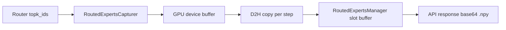

# Routed Experts Capture

vLLM can capture and return the expert routing decisions made by Mixture-of-Experts (MoE) models during inference. This is useful for analyzing expert utilization, debugging routing behavior, load-balancing studies, and RL training pipelines that need per-token expert assignments.

## Overview

When `--enable-return-routed-experts` is enabled, vLLM intercepts the router's `topk_ids` tensor (the logical expert IDs selected for each token) at every MoE layer during the forward pass. The captured data is returned alongside the generated tokens in the API response.

The captured expert IDs are **logical** IDs — they are captured *before* any Expert Parallel Load Balancing (EPLB) remapping, so they reflect the router's raw decisions.

## Enabling the Feature

### CLI (serving)

```bash
vllm serve <model> --enable-return-routed-experts
```

### Python API (offline)

```python
from vllm import LLM

llm = LLM(model="<model>", enable_return_routed_experts=True)
```

## Output Format

The routed experts data is returned as a base64-encoded `.npy` byte stream in the API response. Decoding it yields a NumPy array of shape:

```
(num_tokens - 1, num_hidden_layers, num_experts_per_tok)
```

`num_tokens - 1` because the last sampled token has not been forwarded through the model yet and therefore has no routing data.

| Dimension | Description |
| --- | --- |
| `num_tokens - 1` | Number of tokens that went through a forward pass (prompt + generated tokens, minus the last sampled token) |
| `num_hidden_layers` | Total number of hidden layers in the model (not just MoE layers) |
| `num_experts_per_tok` | Number of experts selected per token (top-k) |

The dtype is `uint8` when the model has ≤ 256 experts, otherwise `uint16`.

## Examples

### Completions API (curl)

Start the server:

```bash
vllm serve <model> --enable-return-routed-experts
```

Send a request with `return_token_ids` to get `token_ids` and
`routed_experts` in the response:

```bash
curl http://localhost:8000/v1/completions \
  -H "Content-Type: application/json" \
  -H "Authorization: Bearer EMPTY" \
  -d '{
    "model": "<model>",
    "prompt": "Hello, world",
    "max_tokens": 10,
    "temperature": 0,
    "return_token_ids": true
  }'
```

Example response (truncated):

```json
{
  "choices": [
    {
      "text": "...",
      "token_ids": [ ... ],
      "routed_experts": "gASV...==",
      "finish_reason": "stop",
      "index": 0
    }
  ]
}
```

### Chat Completions API (curl)

```bash
curl http://localhost:8000/v1/chat/completions \
  -H "Content-Type: application/json" \
  -H "Authorization: Bearer EMPTY" \
  -d '{
    "model": "<model>",
    "messages": [
      {"role": "user", "content": "Hello, world"}
    ],
    "max_tokens": 10,
    "temperature": 0,
    "return_token_ids": true
  }'
```

### Decoding the response

=== "Python"

    ```python
    import base64
    import io
    import numpy as np

    # `choice["routed_experts"]` comes from the API response JSON
    routed_experts = np.load(
        io.BytesIO(base64.b64decode(choice["routed_experts"]))
    )
    # shape: (num_tokens, num_layers, top_k)
    # values: expert IDs in [0, num_experts)
    print(f"Shape: {routed_experts.shape}")
    print(f"Expert IDs:\n{routed_experts}")
    ```

=== "Shell (jq + Python)"

    ```bash
    # Extract and decode in one pipeline
    curl -s http://localhost:8000/v1/completions \
      -H "Content-Type: application/json" \
      -d '{"model":"<model>","prompt":"Hi","max_tokens":5,"return_token_ids":true}' \
      | jq -r '.choices[0].routed_experts' \
      | base64 -d \
      | python3 -c "import sys,numpy as np; a=np.load(sys.stdin.buffer); print(f'shape={a.shape}'); print(a)"
    ```

### OpenAI Python SDK

```python
from openai import OpenAI
import base64, io, numpy as np

client = OpenAI(base_url="http://localhost:8000/v1", api_key="EMPTY")

result = client.completions.create(
    model="<model>",
    prompt="Hello, world",
    max_tokens=10,
    temperature=0,
    extra_body={"return_token_ids": True},
)

choice = result.model_dump()["choices"][0]
routed_experts = np.load(
    io.BytesIO(base64.b64decode(choice["routed_experts"]))
)
print(f"Shape: {routed_experts.shape}")
print(f"Expert IDs: {routed_experts}")
```

### Offline (Python API)

```python
from vllm import LLM, SamplingParams
import base64, io, numpy as np

llm = LLM(model="<model>", enable_return_routed_experts=True)

outputs = llm.generate(
    ["Hello, world"],
    SamplingParams(max_tokens=10, temperature=0),
)

# routed_experts is attached to each RequestOutput
re_b64 = outputs[0].outputs[0].routed_experts
routed_experts = np.load(io.BytesIO(base64.b64decode(re_b64)))
print(f"Shape: {routed_experts.shape}")
```

## How It Works



1. **Capture (GPU)**: Each MoE layer's router calls a capture callback that writes `topk_ids` into a pre-allocated GPU buffer (`RoutedExpertsCapturer`).
2. **D2H transfer**: At the end of each scheduler step, the device buffer is copied to a pinned CPU buffer.
3. **Slot-indexed storage (CPU)**: The scheduler persists the routing data into a slot-indexed buffer tied to physical KV-cache blocks (`RoutedExpertsManager`). This means routing data survives preemption and prefix-cache hits.
4. **Response**: When a request completes, the scheduler reads the per-token routing from the slot buffer and returns it in the API response.

## Configuration

### Server-side

| Argument | Type | Default | Description |
| --- | --- | --- | --- |
| `--enable-return-routed-experts` | bool | `False` | Enable routed experts capture |

### Per-request

| Parameter | Type | Default | Description |
| --- | --- | --- | --- |
| `routed_experts_prompt_start` | int | `0` | Skip the first N prompt tokens from the returned routing data. Useful in multi-turn agent scenarios to avoid duplicating routing for prompt tokens covered by earlier turns. |

## Limitations and Compatibility

### Hard restrictions

The following configurations are **incompatible** with routed experts capture and will raise an error at startup:

| Feature | Reason |
| --- | --- |
| Pipeline parallelism (PP > 1) | Routing captured on one PP rank cannot reach the scheduler for tokens processed on other ranks |
| Context parallelism (DCP > 1 or PCP > 1) | Slot-mapping semantics break when KV blocks are split across CP ranks |
| KV connectors / disaggregation | Slot-mapping semantics change when KV blocks live outside local GPU memory |
| Sliding window attention | `RoutedExpertsManager` requires a `FullAttentionSpec` group; override `sliding_window=null` via `--hf-overrides` |

### V2 model runner

Routed experts capture is currently **not supported** with the V2 model runner. When the feature is enabled, vLLM automatically falls back to the V1 model runner. This does **not** disable CUDA graphs or `torch.compile` — V1 supports both. The V2 incompatibility is tracked in [PR #38163](https://github.com/vllm-project/vllm/pull/38163).

### Tensor parallelism

- **TP = 1** (single GPU): Fully supported. This is the simplest case — the capturer writes the full `topk_ids` tensor directly.
- **TP > 1**: Supported when using the modular kernel path with sequence parallelism (SP). The capturer performs an all-gather across the TP group to reconstruct the full per-DP-rank routing tensor.

## Performance Overhead

### When disabled

**Zero overhead.** All routed-experts code paths are guarded by a `routed_experts_initialized` flag. When the feature is off, no additional operations are executed.

### When enabled

| Component | Where | Cost |
| --- | --- | --- |
| `capture()` — write `topk_ids` to GPU buffer | Inside forward pass | Microseconds (one tensor slice per MoE layer) |
| `clear_buffer()` — zero the device buffer | Start of each step | Microseconds |
| D2H copy of capture buffer | End of each step | Microseconds (a few MB per step) |
| `store_batch` — numpy fancy-index assign | Scheduler (CPU) | Microseconds |
| Slot-mapping copy in `_prepare_inputs` | Start of each step | Microseconds |

The per-step data volume is: `num_tokens × num_layers × top_k × 4 bytes` (int32 transit buffer). For example, DeepSeek-V3 (61 layers, top_k=6, 8192 tokens) produces ~12 MB per step — negligible compared to the MoE computation itself.

### Memory

| Buffer | Location | Size |
| --- | --- | --- |
| `device_buffer` | GPU (per worker) | `max_num_batched_tokens × num_layers × top_k × 4 bytes` |
| `routed_experts_cpu` | Pinned CPU (per worker) | Same as device buffer |
| `routed_experts_by_slot` | CPU (scheduler) | `num_blocks × block_size × num_layers × top_k` — can reach multiple GB for large KV caches |

!!! warning "Memory usage"
    The scheduler-side slot buffer is sized for the **entire** KV-cache block pool. For large models with many blocks, this can consume multiple gigabytes of CPU RAM. Check the startup log for the exact size:
    ```
    RoutedExpertsManager CPU buffer: X.XX GB (slots=..., layers=..., top_k=..., dtype=...)
    ```

## Supported Models

Any MoE model that uses vLLM's `FusedMoE` layer with a `BaseRouter` subclass is supported. This includes:

- Mixtral
- DeepSeek-V2 / V3
- Qwen2-MoE / Qwen3-MoE
- Granite MoE
- GPT-OSS
- And other MoE architectures in the [supported models list](../models/supported_models.md)

The model's HuggingFace config must expose one of: `num_experts_per_tok`, `top_k_experts` (for top-k) and one of: `num_experts`, `n_routed_experts`, `num_local_experts` (for expert count).
