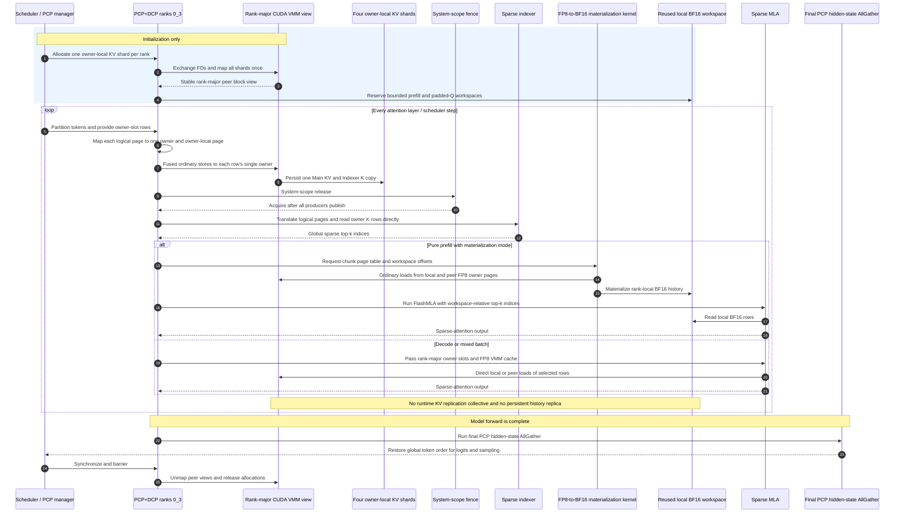

# Context Parallel Deployment

Context parallel mainly solves the problem of serving long context requests. As prefill and decode present quite different characteristics and have quite different SLO (service level objectives), we need to implement context parallel separately for them. The major considerations are:

- For long context prefill, we need to control the TTFT (time to first token) by amortizing the computation time of the prefill across query tokens.
- For long context decode, we need more space for KV cache to increase the batchsize (and hence the throughput).

## Prefill Context Parallel

During prefill, for a long request with `T` new tokens, we need to compute query/key/value tensors for these new tokens. Say we have `N` GPUs, we can split the request into `N` chunks, and each GPU computes one chunk of the query/key/value tensors.

Depending on the use case, there are two possible strategies:

1. Partial query, full key/value: If the request token length is moderately long (we can afford holding the full key/value tensors), and the goal is to accelerate the prefill (and amortize the computation time of the prefill across query tokens), then we can gather the key/value tensors from all GPUs and let each GPU compute the attention output corresponding to the query tokens of its chunk.
2. Partial query, partial key/value: If the request token length is too long, we cannot afford holding the full key/value tensors anymore, then we can only compute one chunk of query/key/value tensors for each GPU, and use techniques like [ring-attention](http://arxiv.org/abs/2310.01889) to send/recv key/value tensors chunk by chunk.

Both approaches are under active development.

### Experimental owner-sharded PCP history for GLM-5.2

On a single peer-accessible NVIDIA node, GLM-5.2 can store each historical Main
KV and Indexer K row only on its DCP owner. vLLM maps every rank's owner-local
cache once during initialization. The fused producer then publishes each new
row once, to its owner's peer-mapped cache, using ordinary device load/store
semantics followed by a system-scope visibility fence.

`VLLM_USE_PCP_OWNER_HISTORY=1` selects the owner-sharded PCP4/DCP4 layout. The
feature includes allocation, file-descriptor exchange, fused publication,
logical-to-owner translation, and consumption of the sharded history. Without
this selector, vLLM uses the ordinary collective PCP path.

The owner-sharded PCP4/DCP4 configuration enables DCP4 and page-granular
64-token ownership:

```bash
VLLM_USE_V2_MODEL_RUNNER=1 \
VLLM_USE_PCP_OWNER_HISTORY=1 \
VLLM_PCP_OWNER_PREFILL_MODE=materialize \
vllm serve nvidia/GLM-5.2-NVFP4 \
  --enforce-eager \
  --no-async-scheduling \
  --tensor-parallel-size 1 \
  --prefill-context-parallel-size 4 \
  --decode-context-parallel-size 4 \
  --cp-kv-cache-interleave-size 64 \
  --model-class-overrides \
    '{"GlmMoeDsaForCausalLM":"vllm.models.deepseek_v32.nvidia.model:DeepseekV32ForCausalLM"}' \
  --enable-expert-parallel \
  --moe-backend flashinfer_cutlass \
  --attention-backend FLASHMLA_SPARSE \
  --no-enable-prefix-caching \
  --kv-cache-dtype fp8_ds_mla
```

The owner layout uses page-granular ownership: logical page `p` is stored by
owner `p % DCP` at owner-local page `p // DCP`. The indexer and sparse MLA
translate logical pages directly into the rank-major CUDA VMM view. Decode and
mixed batches read selected historical rows directly from their owners. With
`VLLM_PCP_OWNER_PREFILL_MODE=materialize`, a pure-prefill chunk uses a CUDA
FP8-to-BF16 kernel to materialize its request histories in a bounded, reused
local workspace before FlashMLA. The kernel reads the peer VMM mappings
directly and does not create a persistent full-history replica.
`FLASHMLA_SPARSE` covers both sparse prefill and sparse KV decode in this path,
matching the
FlashMLA-prefill/FlashMLA-KV backend class used by the corresponding SGLang
configuration.

The owner-sharded sequence shows publication, bounded prefill history
materialization, and the final PCP restore at their actual locations:



For PCP4, owner sharding exposes exactly four times as many logical KV-cache
tokens as conventional replicated PCP storage when both runs use the same
physical block count per rank. Automatic cache sizing can choose a different
physical block count because it also accounts for model and workspace memory,
so compare reported logical capacity at equal per-rank blocks when validating
this ratio.

The implementation is deliberately fail-closed. Owner history requires one
peer-accessible host, the specialized NVIDIA GLM-5.2 model class, TP1, PP1,
DP1, PCP4=DCP4 with identical PCP/DCP rank ordering, page-granular DCP
interleave equal to the 64-token cache block size, eager execution, FP8 KV, and
no asynchronous scheduling. The validated and recommended launch in this
section uses the SM100 FlashMLA sparse backend with `fp8_ds_mla` KV layout.
Explicit `materialize` mode fails closed on backends without bounded prefill
history materialization; the existing FlashInfer owner-compute combination
remains available in `auto` mode. The path rejects multimodal inputs, LoRA,
speculative decoding, CUDA graphs, sleep mode, dual-batch/ubatch overlap,
prefix caching/copy-on-write, and KV connectors or offloading. Cache allocation
and POSIX file-descriptor exchange happen only during startup; the per-layer
publication path contains producer stores plus a system-scope visibility fence,
with no KV-update collective. Pure-prefill materialization mode uses the
bounded local BF16 attention workspace described above; decode and mixed
batches do not.

The ordinary collective PCP path remains the default when
`VLLM_USE_PCP_OWNER_HISTORY` is unset.

## Decode Context Parallel

Due to the auto-regressive nature of decoding, every decoding step needs to compute a small amount of query tokens w.r.t. a large number of key/value tokens stored in the paged KV cache. The core of decode context parallel is how to shard the KV cache across GPUs.

For a model with `H` kv-heads, a request with `T` tokens in the context needs to store `H * T` key/value tensors in the KV cache.

1. If one GPU can hold them all, and the performance is good enough, then no parallelization is needed.
2. If one GPU cannot hold them all, or we want to hold more requests in the KV cache, we can first shard the KV cache along the `H` dimension, that's the plain tensor parallel sharding. It's as simple as adding `-tp <num_gpus>` to the command line.
3. Since `H` is limited (determined by the model architecture), when we continue to increase the tensor parallel size, the KV cache for each GPU will be duplicated for `tp_size / H` times. Of course, duplication is not good for efficiency. Then we need to add decode context parallel to further shard the KV cache along the `T` dimension. This is as simple as adding `-dcp <size>` to the command line. Note that `size` does not increase the number of GPUs we need to launch, but just reduces the KV cache duplication. The dcp size should lie in the range of `[1, tp_size/H]`. With larger dcp size, the KV cache duplication is reduced, but the communication overhead increases.

Theoretically, it is possible to extend the dcp size beyond `tp_size / H` to further shard the KV cache and accelerate the decoding phase. However, since the number of query tokens is limited in decoding, it's unclear what should we do for the remaining `dcp_size - tp_size / H` GPUs for non-attention layers. For the sake of simplicity, dcp size is upper bounded by `tp_size / H`. If you want to further accelerate the decoding phase, you can consider increasing the `tp_size` first, and then increasing the dcp size.

Note that kv cache can grow during decoding, and the sharding strategy needs to be carefully implemented. We use an interleaving strategy to shard the KV cache along the `T` dimension, so that kv cache for future tokens can be naturally sharded along the `T` dimension. This is proposed by [Chao Hong from Moonshot](https://github.com/youzhedian), and also explained in details in [this paper](http://arxiv.org/abs/2507.07120).

Case study:

For DeepSeek-R1, we have 1 kv-head when MLA is enabled. The typical single-node deployment with `-tp 8` causes 8x KV cache duplication. We can consider adding `-dcp 8` to reduce the KV cache duplication.

For Kimi-K2, the architecture is similar to DeepSeek-R1, but with more parameters. When we deploy it with `-tp 16`, the KV cache duplication is 16x. We can add `-dcp 16` to completely remove the KV cache duplication, at the cost of more communication overhead. We can also add `-dcp 8` to reduce the KV cache duplication to 2x. Although it still duplicates the KV cache twice, the communication overhead is smaller since the DCP communication only happens inside one node.

For Qwen3-235B-A22B, we have 4 kv-heads. When we deploy it with `-tp 8`, the KV cache duplication is 2x. Then we can add `-dcp 2` to remove the KV cache duplication.

In short, for decode context parallel, try to increase `-tp` size until you get satisfactory performance, and then add `-dcp` to reduce the KV cache duplication.

Decode context parallel is supported in vLLM, for both MLA and GQA models. Some attention backends also support the combination of decode context parallel and MTP (multi-token prediction) to further accelerate the decoding phase.

## Technical Discussions

The main discussions happen in the `#sig-context-parallel` channel of [vLLM Slack](https://slack.vllm.ai/).
