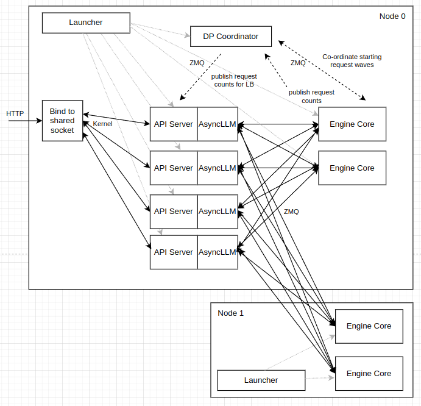
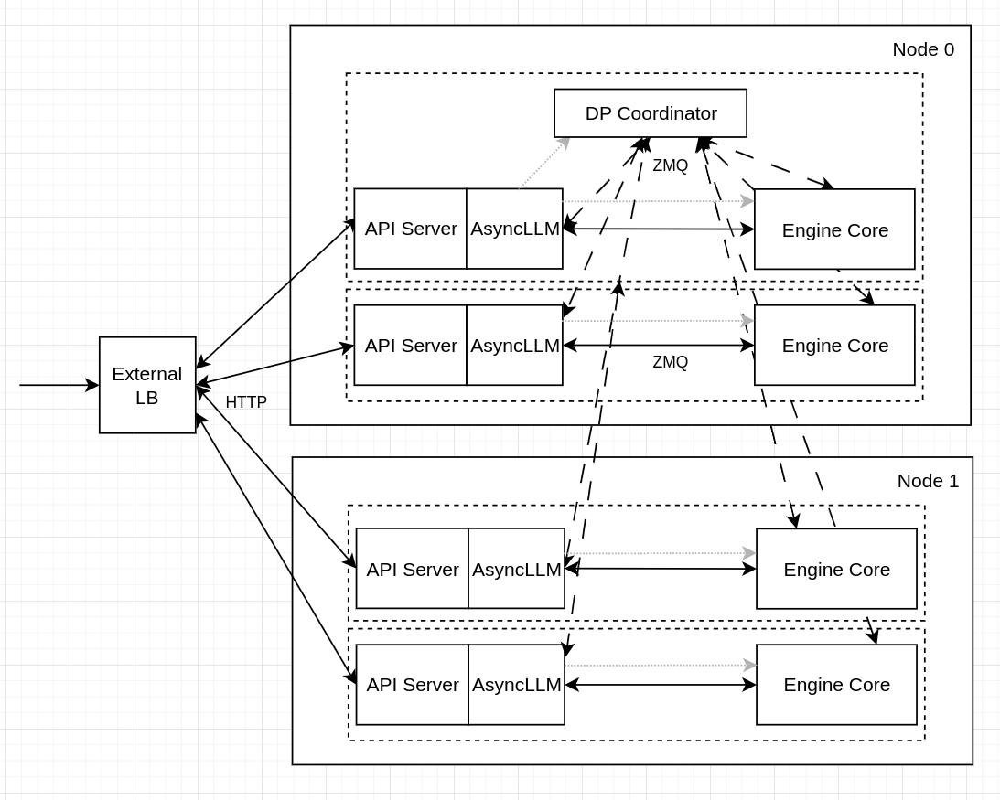

# Data Parallel Deployment

vLLM supports Data Parallel deployment, where model weights are replicated across separate instances/GPUs to process independent batches of requests.

This will work with both dense and MoE models.

For MoE models, particularly those like DeepSeek that employ MLA (Multi-head Latent Attention), it can be advantageous to use data parallel for the attention layers and expert or tensor parallel (EP or TP) for the expert layers.

In these cases, the data parallel ranks are not completely independent. Forward passes must be aligned, and expert layers across all ranks are required to synchronize during every forward pass, even when there are fewer requests to be processed than DP ranks.

The expert layers will by default form a (DP x TP) sized tensor parallel group. To enable expert parallelism, include the `--enable-expert-parallel` CLI arg (on all nodes in the multi-node case).

In vLLM, each DP rank is deployed as a separate "core engine" process that communicates with front-end process(es) via ZMQ sockets. Data Parallel attention can be combined with Tensor Parallel attention, in which case each DP engine owns a number of per-GPU worker processes equal to the configured TP size.

For MoE models, when any requests are in progress in any rank, we must ensure that empty "dummy" forward passes are performed in all ranks that don't currently have any requests scheduled. This is handled via a separate DP Coordinator process that communicates with all ranks, and a collective operation performed every N steps to determine when all ranks become idle and can be paused. When TP is used in conjunction with DP, expert layers form an EP or TP group of size (DP x TP).

In all cases, it is beneficial to load-balance requests between DP ranks. For online deployments, this balancing can be optimized by taking into account the state of each DP engine - in particular its currently scheduled and waiting (queued) requests, and KV cache state. Each DP engine has an independent KV cache, and the benefit of prefix caching can be maximized by directing prompts intelligently.

This document focuses on online deployments (with the API server). DP + EP is also supported for offline usage (via the LLM class), for an example see [examples/offline_inference/data_parallel.py](../../examples/offline_inference/data_parallel.py).

There are two distinct modes supported for online deployments - self-contained with internal load balancing, or externally per-rank process deployment and load balancing.

## Internal Load Balancing

vLLM supports "self-contained" data parallel deployments that expose a single API endpoint.

It can be configured by simply including e.g. `--data-parallel-size=4` in the vllm serve command line arguments. This will require 4 GPUs. It can be combined with tensor parallel, for example `--data-parallel-size=4 --tensor-parallel-size=2`, which would require 8 GPUs.

Running a single data parallel deployment across multiple nodes requires a different `vllm serve` to be run on each node, specifying which DP ranks should run on that node. In this case, there will still be a single HTTP entrypoint - the API server(s) will run only on one node, but it doesn't necessarily need to be co-located with the DP ranks.

This will run DP=4, TP=2 on a single 8-GPU node:

```bash
vllm serve $MODEL --data-parallel-size 4 --tensor-parallel-size 2
```

This will run DP=4 with DP ranks 0 and 1 on the head node and ranks 2 and 3 on the second node:

```bash
# Node 0  (with ip address 10.99.48.128)
vllm serve $MODEL --data-parallel-size 4 --data-parallel-size-local 2 \
                  --data-parallel-address 10.99.48.128 --data-parallel-rpc-port 13345
# Node 1
vllm serve $MODEL --headless --data-parallel-size 4 --data-parallel-size-local 2 \
                  --data-parallel-start-rank 2 \
                  --data-parallel-address 10.99.48.128 --data-parallel-rpc-port 13345
```

This will run DP=4 with only the API server on the first node and all engines on the second node:

```bash
# Node 0  (with ip address 10.99.48.128)
vllm serve $MODEL --data-parallel-size 4 --data-parallel-size-local 0 \
                  --data-parallel-address 10.99.48.128 --data-parallel-rpc-port 13345
# Node 1
vllm serve $MODEL --headless --data-parallel-size 4 --data-parallel-size-local 4 \
                  --data-parallel-address 10.99.48.128 --data-parallel-rpc-port 13345
```

This DP mode can also be used with Ray by specifying `--data-parallel-backend=ray`:

```bash
vllm serve $MODEL --data-parallel-size 4 --data-parallel-size-local 2 \
                  --data-parallel-backend=ray
```

There are several notable differences when using Ray:

- A single launch command (on any node) is needed to start all local and remote DP ranks, therefore it is more convenient compared to launching on each node
- There is no need to specify `--data-parallel-address`, and the node where the command is run is used as `--data-parallel-address`
- There is no need to specify `--data-parallel-rpc-port`
- When a single DP group requires multiple nodes, *e.g.* in case a single model replica needs to run on at least two nodes, make sure to set `VLLM_RAY_DP_PACK_STRATEGY="span"` in which case `--data-parallel-size-local` is ignored and will be automatically determined
- Remote DP ranks will be allocated based on node resources of the Ray cluster

Currently, the internal DP load balancing is done within the API server process(es) and is based on the running and waiting queues in each of the engines. This could be made more sophisticated in future by incorporating KV cache aware logic.

When deploying large DP sizes using this method, the API server process can become a bottleneck. In this case, the orthogonal `--api-server-count` command line option can be used to scale this out (for example `--api-server-count=4`). This is transparent to users - a single HTTP endpoint / port is still exposed. Note that this API server scale-out is "internal" and still confined to the "head" node.

<figure markdown="1">

</figure>

## External Load Balancing

For larger scale deployments especially, it can make sense to handle the orchestration and load balancing of data parallel ranks externally.

In this case, it's more convenient to treat each DP rank like a separate vLLM deployment, with its own endpoint, and have an external router balance HTTP requests between them, making use of appropriate real-time telemetry from each server for routing decisions.

This can already be done trivially for non-MoE models, since each deployed server is fully independent. No data parallel CLI options need to be used for this.

We support an equivalent topology for MoE DP+EP which can be configured via the following CLI arguments.

If DP ranks are co-located (same node / ip address), a default RPC port is used, but a different HTTP server port must be specified for each rank:

```bash
# Rank 0
CUDA_VISIBLE_DEVICES=0 vllm serve $MODEL --data-parallel-size 2 --data-parallel-rank 0 \
                                         --port 8000
# Rank 1
CUDA_VISIBLE_DEVICES=1 vllm serve $MODEL --data-parallel-size 2 --data-parallel-rank 1 \
                                         --port 8001
```

For multi-node cases, the address/port of rank 0 must also be specified:

```bash
# Rank 0  (with ip address 10.99.48.128)
vllm serve $MODEL --data-parallel-size 2 --data-parallel-rank 0 \
                  --data-parallel-address 10.99.48.128 --data-parallel-rpc-port 13345
# Rank 1
vllm serve $MODEL --data-parallel-size 2 --data-parallel-rank 1 \
                  --data-parallel-address 10.99.48.128 --data-parallel-rpc-port 13345
```

The coordinator process also runs in this scenario, co-located with the DP rank 0 engine.

<figure markdown="1">

</figure>

In the above diagram, each of the dotted boxes corresponds to a separate launch of `vllm serve` - these could be separate Kubernetes pods, for example.
