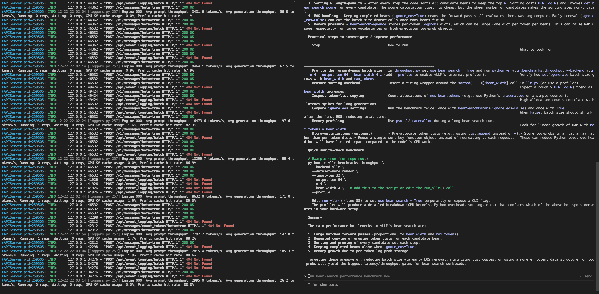

# Claude Code

[Claude Code](https://docs.anthropic.com/en/docs/claude-code/overview) is Anthropic's official agentic coding tool that lives in your terminal. It can understand your codebase, edit files, run commands, and help you write code more efficiently.

By pointing Claude Code at a vLLM server, you can use your own models as the backend instead of the Anthropic API. This is useful for:

- Running fully local/private coding assistance
- Using open-weight models with tool calling capabilities
- Testing and developing with custom models

## How It Works

vLLM implements the Anthropic Messages API, which is the same API that Claude Code uses to communicate with Anthropic's servers. By setting `ANTHROPIC_BASE_URL` to point at your vLLM server, Claude Code sends its requests to vLLM instead of Anthropic. vLLM then translates these requests to work with your local model and returns responses in the format Claude Code expects.

This means any model served by vLLM with proper tool calling support can act as a drop-in replacement for Claude models in Claude Code.

## Requirements

Claude Code requires a model with strong tool calling capabilities. The model must support the OpenAI-compatible tool calling API. See [Tool Calling](../../features/tool_calling.md) for details on enabling tool calling for your model.

## Installation

First, install Claude Code by following the [official installation guide](https://docs.anthropic.com/en/docs/claude-code/getting-started).

## Starting the vLLM Server

Start vLLM with a tool-calling capable model - here's an example using `openai/gpt-oss-120b`:

```bash
vllm serve openai/gpt-oss-120b --served-model-name my-model --enable-auto-tool-choice --tool-call-parser openai
```

For other models, you'll need to enable tool calling explicitly with `--enable-auto-tool-choice` and the right `--tool-call-parser`. Refer to the [Tool Calling documentation](../../features/tool_calling.md) for the correct flags for your model.

## Configuring Claude Code

Launch Claude Code with environment variables pointing to your vLLM server:

```bash
ANTHROPIC_BASE_URL=http://localhost:8000 \
ANTHROPIC_API_KEY=dummy \
ANTHROPIC_DEFAULT_OPUS_MODEL=my-model \
ANTHROPIC_DEFAULT_SONNET_MODEL=my-model \
ANTHROPIC_DEFAULT_HAIKU_MODEL=my-model \
claude
```

The environment variables:

| Variable                         | Description                                                           |
| -------------------------------- | --------------------------------------------------------------------- |
| `ANTHROPIC_BASE_URL`             | Points to your vLLM server (default port is 8000)                     |
| `ANTHROPIC_API_KEY`              | Can be any value since vLLM doesn't require authentication by default |
| `ANTHROPIC_DEFAULT_OPUS_MODEL`   | Model name for Opus-tier requests                                     |
| `ANTHROPIC_DEFAULT_SONNET_MODEL` | Model name for Sonnet-tier requests                                   |
| `ANTHROPIC_DEFAULT_HAIKU_MODEL`  | Model name for Haiku-tier requests                                    |

!!! tip
    You can add these environment variables to your shell profile (e.g., `.bashrc`, `.zshrc`), Claude Code configuration file (`~/.claude/settings.json`), or create a wrapper script for convenience.

## Testing the Setup

Once Claude Code launches, try a simple prompt to verify the connection:



If the model responds correctly, your setup is working. You can now use Claude Code with your vLLM-served model for coding tasks.

## Troubleshooting

**Connection refused**: Ensure vLLM is running and accessible at the specified URL. Check that the port matches.

**Tool calls not working**: Verify that your model supports tool calling and that you've enabled it with the correct `--tool-call-parser` flag. See [Tool Calling](../../features/tool_calling.md).

**Model not found**: Ensure the `--served-model-name` matches the model names in your environment variables. You cannot use model names with `/` in them, such as `openai/gpt-oss-120b` directly from Huggingface, so beware of that limitation with Claude Code.
