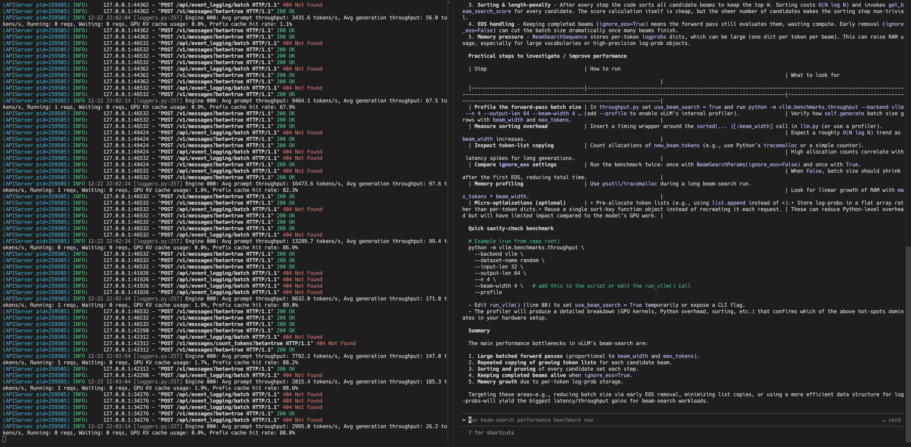

# Claude Code

[Claude Code](https://code.claude.com/docs/en/quickstart) is Anthropic's official agentic coding tool that lives in your terminal. It can understand your codebase, edit files, run commands, and help you write code more efficiently.

By pointing Claude Code at a vLLM server, you can use your own models as the backend instead of the Anthropic API. This is useful for:

- Running fully local/private coding assistance
- Using open-weight models with tool calling capabilities
- Testing and developing with custom models

## How It Works

vLLM implements the Anthropic Messages API, which is the same API that Claude Code uses to communicate with Anthropic's servers. By setting `ANTHROPIC_BASE_URL` to point at your vLLM server, Claude Code sends its requests to vLLM instead of Anthropic. vLLM then translates these requests to work with your local model and returns responses in the format Claude Code expects.

This means any model served by vLLM with proper tool calling support can act as a drop-in replacement for Claude models in Claude Code.

## Requirements

Claude Code requires a model with strong tool calling capabilities. The model must support the OpenAI-compatible tool calling API. See [Tool Calling](../../features/tool_calling.md) for details on enabling tool calling for your model.

## Installation

First, install Claude Code by following the [official installation guide](https://docs.anthropic.com/en/docs/claude-code/getting-started).

## Starting the vLLM Server

Start vLLM with a tool-calling capable model - here's an example using `openai/gpt-oss-120b`:

```bash
vllm serve openai/gpt-oss-120b --served-model-name my-model --enable-auto-tool-choice --tool-call-parser openai
```

For other models, you'll need to enable tool calling explicitly with `--enable-auto-tool-choice` and the right `--tool-call-parser`. Refer to the [Tool Calling documentation](../../features/tool_calling.md) for the correct flags for your model.

## Configuring Claude Code

Launch Claude Code with environment variables pointing to your vLLM server:

```bash
ANTHROPIC_BASE_URL=http://localhost:8000 \
ANTHROPIC_API_KEY=dummy \
ANTHROPIC_AUTH_TOKEN=dummy \
ANTHROPIC_DEFAULT_OPUS_MODEL=my-model \
ANTHROPIC_DEFAULT_SONNET_MODEL=my-model \
ANTHROPIC_DEFAULT_HAIKU_MODEL=my-model \
claude
```

The environment variables:

| Variable                         | Description                                                           |
| -------------------------------- | --------------------------------------------------------------------- |
| `ANTHROPIC_BASE_URL`             | Points to your vLLM server (default port is 8000)                     |
| `ANTHROPIC_API_KEY`              | Can be any value since vLLM doesn't require authentication by default |
| `ANTHROPIC_AUTH_TOKEN`           | Is required. Can be any value.                                        |
| `ANTHROPIC_DEFAULT_OPUS_MODEL`   | Model name for Opus-tier requests                                     |
| `ANTHROPIC_DEFAULT_SONNET_MODEL` | Model name for Sonnet-tier requests                                   |
| `ANTHROPIC_DEFAULT_HAIKU_MODEL`  | Model name for Haiku-tier requests                                    |

!!! tip
    You can add these environment variables to your shell profile (e.g., `.bashrc`, `.zshrc`), Claude Code configuration file (`~/.claude/settings.json`), or create a wrapper script for convenience.

!!! warning
    Claude Code recently started injecting a per-request hash in the system prompt, which can defeat [prefix caching](../../design/prefix_caching.md) because the prompt changes on every request, causing greatly reduced performance. This is addressed automatically in vLLM versions > 0.17.1 but for older versions `"CLAUDE_CODE_ATTRIBUTION_HEADER": "0"` should be added to the `"env"` section of `~/.claude/settings.json` (see this [blog post](https://unsloth.ai/docs/basics/claude-code#fixing-90-slower-inference-in-claude-code) from Unsloth).

## Context Window

Claude Code assumes the context window of a Claude model, and requests up to 32000 output tokens per turn. When your server's `--max-model-len` is smaller, tell Claude Code the real limits:

| Variable                          | Description                                                                                                   |
| --------------------------------- | ------------------------------------------------------------------------------------------------------------- |
| `CLAUDE_CODE_AUTO_COMPACT_WINDOW` | Set to your `--max-model-len`, so Claude Code compacts the conversation before it outgrows the context window |
| `CLAUDE_CODE_MAX_OUTPUT_TOKENS`   | Maximum output tokens per request. Lower it when `--max-model-len` leaves little room after the prompt        |

Without `CLAUDE_CODE_AUTO_COMPACT_WINDOW`, a long session can reach `--max-model-len` before Claude Code compacts it. From then on, every request fails because the prompt is too long. These settings also apply when Claude Code reaches vLLM through a gateway such as LiteLLM.

`CLAUDE_CODE_AUTO_COMPACT_WINDOW` needs Claude Code 2.1.75 or later. On older versions, set `CLAUDE_AUTOCOMPACT_PCT_OVERRIDE` instead: the percentage of a 200k-token window at which Claude Code compacts (for example, `20` compacts at about 40k tokens).

For example, for a server started with `--max-model-len 131072`:

```bash
CLAUDE_CODE_AUTO_COMPACT_WINDOW=131072 claude
```

## Testing the Setup

Once Claude Code launches, try a simple prompt to verify the connection:



If the model responds correctly, your setup is working. You can now use Claude Code with your vLLM-served model for coding tasks.

## Troubleshooting

**Connection refused**: Ensure vLLM is running and accessible at the specified URL. Check that the port matches.

**Tool calls not working**: Verify that your model supports tool calling and that you've enabled it with the correct `--tool-call-parser` flag. See [Tool Calling](../../features/tool_calling.md).

**Model not found**: Ensure the `--served-model-name` (by default, the model path such as `openai/gpt-oss-120b`) matches the model names in your environment variables.

**`400 ... maximum context length`**: The conversation or the requested output no longer fits in `--max-model-len`. Set `CLAUDE_CODE_AUTO_COMPACT_WINDOW` and `CLAUDE_CODE_MAX_OUTPUT_TOKENS` as described in [Context Window](#context-window). A conversation that is already too long cannot be compacted; start a new one with `/clear`.
