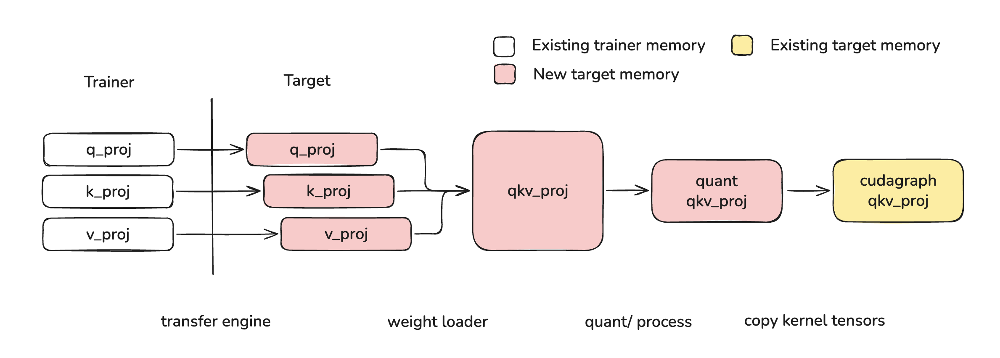
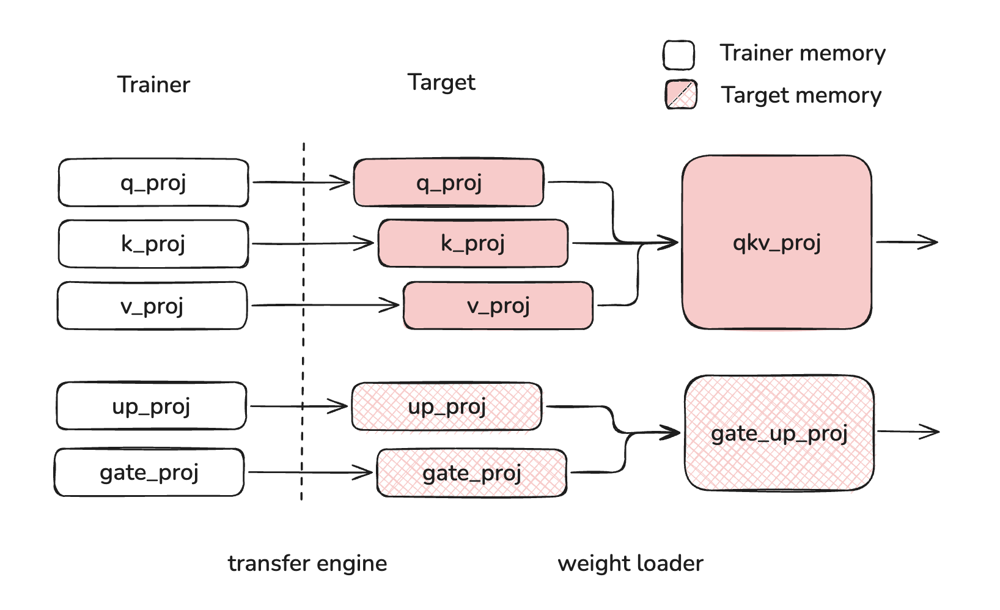
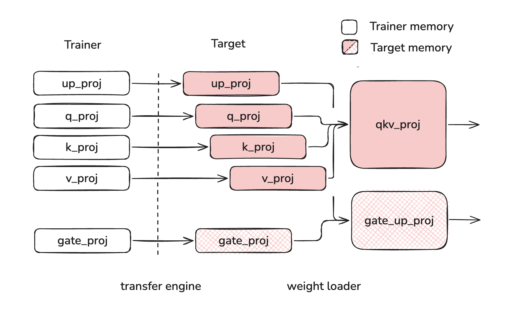

# What is Layerwise (Re)loading?

Layerwise reloading is the system used to handle the loading of new weight data into existing weight data destinations without triggering recompilation of the cuda graph and other runtime artifacts. This system is used to enable [QeRL](https://arxiv.org/pdf/2510.11696)-style post training flows, where full-precision trainer weights are quantized and loaded into a target vLLM instance for fast, high-exploration rollouts. The core implementation can be found in [layerwise.py](../../vllm/model_executor/model_loader/reload/layerwise.py).



## Layerwise Reloading for QeRL

In order to load new weights into existing weight data destinations, a weight must undergo the following operations:

- Transfer: weights must be transferred from trainer model to target node/device
- Fuse: weight partitions must be fused, for example qkv/gate_up
- Process: this typically means online quantization and kernel-specific padding or striding
- Shard: weights must be sharded according to the selected parallelism strategy
- Copy: weights must be copied into the existing weight data destinations

Layerwise reloading achieves this using the following steps:

1. Weights are **transferred** from the trainer to the target (see [weight_transfer](weight_transfer/README.md))
2. Weights loaded via `model.load_weights`, during which they are **sharded** and **fused**
3. Weights are **processed** in an online fashion as soon as all of a layer's weights are loaded
4. Weights are **copied** into the existing weight data destinations

For more information on implementation, see [Low Level `layerwise` API](#low-level-layerwise-api).

## Layerwise Loading with Online Quantization

Online quantization refers to when a user provides full precision weights and those weights are quantized on-the-fly as they are loaded into the model. The layerwise reloading system handles this by treating online quantization as a **processing** step, which is then handled in an online way both during first-time load and during reload. A typical online quantization method implementation should look like this:

```python
class Fp8OnlineLinearMethod(Fp8LinearMethod):
    """Online version of Fp8LinearMethod which loads a full precision checkpoint
    and quantizes weights during loading."""

    uses_meta_device: bool = True

    def create_weights(self, layer: torch.nn.Module, ...):
        # weight is materialized and processed during loading
        layer.weight = ModelWeightParameter(
            data=torch.empty(..., device="meta"),
            weight_loader=weight_loader,
        )

        # set up online processing
        initialize_online_processing(layer)

    def process_weights_after_loading(self, layer: Module) -> None:
        if getattr(layer, "_already_called_process_weights_after_loading", False):
            return

        layer.weight, layer.weight_scale = ops.scaled_fp8_quant(layer.weight)

        # Prevent duplicate processing (e.g., during weight reload)
        layer._already_called_process_weights_after_loading = True
```

## Example Usages

### High Level Weight Transfer API

The layerwise reloading system is integrated with the post-training weight transfer system. To use layerwise reloading in conjunction to the weight transfer system, follow the examples found [here](../../examples/rl/). Layerwise reloading is controlled by the `WeightTransferUpdateInfo.is_checkpoint_format` flag and is set to `True` by default.

### Mid Level `reload_weights` API

Layerwise reloading is also exposed via the `reload_weights` API. This interface can be called using the following code:

```python
from vllm import LLM

llm = LLM("Qwen/Qwen3-0.6B")
llm.collective_rpc("reload_weights")
```

This interface also allows specifying a `weights_path` which can be used to select a checkpoint path to load from:

```python
from vllm import LLM

# fine tuned model checkpoints for testing
mul_path = "inference-optimization/Qwen3-0.6B-debug-multiply"
add_path = "inference-optimization/Qwen3-0.6B-debug-add"

llm = LLM("Qwen/Qwen3-0.6B")
llm.collective_rpc("reload_weights", kwargs={"weights_path": mul_path})
llm.generate("3 4 = ")  # 12

llm.collective_rpc("reload_weights", kwargs={"weights_path": add_path})
llm.generate("3 4 = ")  # 7
```

Finally, a `weights_iterator` can be provided directly. This iterator can be lazy or eagerly defined.

```python
from vllm import LLM

weights_iterator = [("q_proj", ...), ("k_proj", ...), ...]

llm = LLM("Qwen/Qwen3-0.6B")
llm.collective_rpc("reload_weights", kwargs={"weights_iterator": weights_iterator})
```

### Low Level `layerwise` API

[layerwise.py](../../vllm/model_executor/model_loader/reload/layerwise.py) Implements the following functions to execute its lifecycle:

| Function | Purpose | Quantized Reload | Online Quantization |
| - | - | - | - |
| `record_metadata_for_reloading` | Record tensor metadata so that layers can be restored on the meta device | Called by `BaseModelLoader` | Called by `BaseModelLoader` |
| `restore_layer_on_meta` | Restore layer to model format at start of reload | Called by `initialize_layerwise_reload` | Not called. Online quantized weights already start on meta device via `...OnlineLinearMethod.create_weights` |
| `initialize_online_processing` | Wrap weight loaders with the `online_process_loader` wrapper, which buffers weights until all layer weights have been loaded | Called by `initialize_layerwise_reload` | Called by `...OnlineLinearMethod.create_weights` |
| `_layerwise_process` | Process layer once all weights are loaded | Called by `online_process_loader` during loading | Called by `online_process_loader` during loading |
| `_copy_and_restore_kernel_tensors` | Copy processed weights into original tensor locations to affect compiled cuda graphs, etc. | Called by `_layerwise_process` after `process_weights_after_loading` | Not called. There is no compiled cuda graph yet |
| `finalize_layerwise_processing` | Catch any layers which did not load all weights (for example attention weights or weights with padding) | Called by `BaseModelLoader` | Called by `BaseModelLoader` |

You can plug into this lifecycle directly by calling the `initialize_layerwise_reload`, loading weights, then calling `finalize_layerwise_processing`:

```python
from vllm import LLM
from vllm.model_executor.model_loader.reload import initialize_layerwise_reload, finalize_layerwise_processing

llm = LLM("Qwen/Qwen3-0.6B")

# this model path requires `VLLM_ENABLE_V1_MULTIPROCESSING=0` and is not stable
model = llm.llm_engine.engine_core.engine_core.model_executor.driver_worker.worker.get_model()

# layerwise reload
initialize_layerwise_reload(model)
model.load_weights(...)
finalize_layerwise_processing(model, llm.model_config)
```

## Troubleshooting Excessive Memory Usage

Layerwise reloading allows users to incrementally load and process weights as they are loaded into the model. This system relies on buffering layer weights on device until all weights of a layer have been loaded. However, without offloading, this approach necessarily causes excessive buffering if weights are loaded out of order.

For this reason, users must take care as to the order of weights when they are reloading into the model. Weight should be loaded "in order", meaning that each layer's weights are fully loaded before beginning to load the next layer's weights. "Out of order" loading can cause layer weights to stay buffered while other layer weights are loading, leading to excessive memory usage. In the example below, q_proj, k_proj, v_proj, and up_proj are all buffered at the same time, using more memory than if up_proj was loaded after q_proj, k_proj and v_proj.

| Correct Loading | Incorrect Loading |
| - | - |
|  |  |

Users will see a warning like the one below if weights are loaded out-of-order.

```console
WARNING [layerwise.py:198] Allocating 28.5 MB of device memory to buffers to load ["QKVParallelLinear", "MergedColumnParallelLinear"] layers. This extra memory usage can be avoided by ordering weights by their parent layer when reloading.
```
