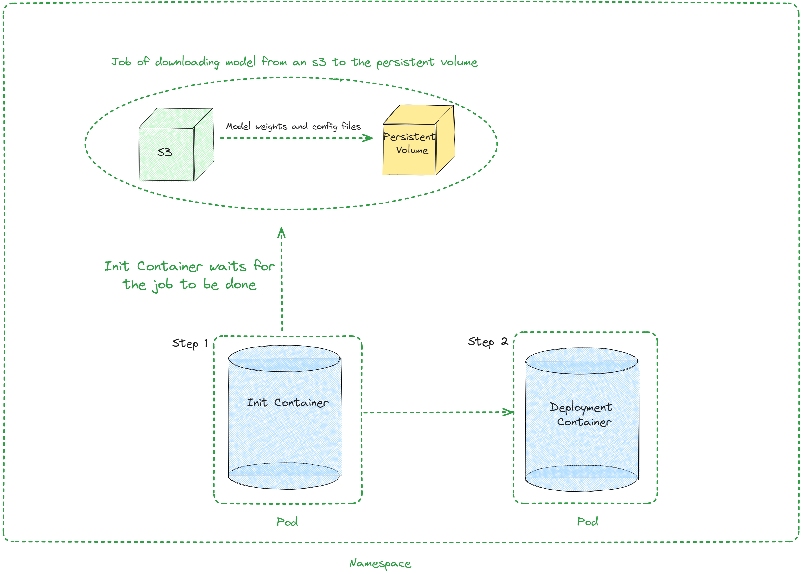

chart-vllm
==========

|Version: 0.0.1| |Type: application|

A Helm chart to deploy vllm for Kubernetes

Installing the chart
--------------------

To install the chart with the release name ``test-vllm``

.. code:: console

   helm upgrade --install --create-namespace --namespace=ns-vllm test-vllm . -f values.yaml --set secrets.s3endpoint=$ACCESS_POINT --set secrets.s3buckername=$BUCKET --set secrets.s3accesskeyid=$ACCESS_KEY --set secrets.s3accesskey=$SECRET_KEY

➖ Uninstalling the Chart
-------------------------

To uninstall the ``test-vllm`` deployment

.. code:: console

   helm uninstall test-vllm --namespace=ns-vllm

The command removes all the Kubernetes components associated with the
chart **including persistent volumes** and deletes the release.

Architecture
------------

   Architecture

Values
------

+---------+------------+------------------+---------------------------+
| Key     | Type       | Default          | Description               |
+=========+============+==================+===========================+
| auto    | object     | ``{"enabled      | Autoscaling configuration |
| scaling |            | ":false,"maxRepl |                           |
|         |            | icas":100,"minRe |                           |
|         |            | plicas":1,"targe |                           |
|         |            | tCPUUtilizationP |                           |
|         |            | ercentage":80}`` |                           |
+---------+------------+------------------+---------------------------+
| autos   | bool       | ``false``        | Enable autoscaling        |
| caling. |            |                  |                           |
| enabled |            |                  |                           |
+---------+------------+------------------+---------------------------+
| au      | int        | ``100``          | Maximum replicas          |
| toscali |            |                  |                           |
| ng.maxR |            |                  |                           |
| eplicas |            |                  |                           |
+---------+------------+------------------+---------------------------+
| au      | int        | ``1``            | Minimum replicas          |
| toscali |            |                  |                           |
| ng.minR |            |                  |                           |
| eplicas |            |                  |                           |
+---------+------------+------------------+---------------------------+
| autosca | int        | ``80``           | Target CPU utilization    |
| ling.ta |            |                  | for autoscaling           |
| rgetCPU |            |                  |                           |
| Utiliza |            |                  |                           |
| tionPer |            |                  |                           |
| centage |            |                  |                           |
+---------+------------+------------------+---------------------------+
| configs | object     | ``{}``           | Configmap                 |
+---------+------------+------------------+---------------------------+
| contai  | int        | ``8000``         | Container port            |
| nerPort |            |                  |                           |
+---------+------------+------------------+---------------------------+
| custom  | list       | ``[]``           | Custom Objects            |
| Objects |            |                  | configuration             |
+---------+------------+------------------+---------------------------+
| depl    | object     | ``{}``           | Deployment strategy       |
| oymentS |            |                  | configuration             |
| trategy |            |                  |                           |
+---------+------------+------------------+---------------------------+
| e       | list       | ``[]``           | External configuration    |
| xternal |            |                  |                           |
| Configs |            |                  |                           |
+---------+------------+------------------+---------------------------+
| e       | list       | ``[]``           | Additional containers     |
| xtraCon |            |                  | configuration             |
| tainers |            |                  |                           |
+---------+------------+------------------+---------------------------+
| ex      | object     | ``{"pvcS         | Additional configuration  |
| traInit |            | torage":"1Gi","s | for the init container    |
|         |            | 3modelpath":"rel |                           |
|         |            | ative_s3_model_p |                           |
|         |            | ath/opt-125m", " |                           |
|         |            | awsEc2MetadataDi |                           |
|         |            | sabled": true}`` |                           |
+---------+------------+------------------+---------------------------+
| extraI  | string     | ``"50Gi"``       | Storage size of the s3    |
| nit.pvc |            |                  |                           |
| Storage |            |                  |                           |
+---------+------------+------------------+---------------------------+
| extraIn | string     | ``"re            | Path of the model on the  |
| it.s3mo |            | lative_s3_model_ | s3 which hosts model      |
| delpath |            | path/opt-125m"`` | weights and config files  |
+---------+------------+------------------+---------------------------+
| extr    | boolean    | ``true``         | Disables the use of the   |
| aInit.a |            |                  | Amazon EC2 instance       |
| wsEc2Me |            |                  | metadata service          |
| tadataD |            |                  |                           |
| isabled |            |                  |                           |
+---------+------------+------------------+---------------------------+
| ext     | list       | ``[]``           | Additional ports          |
| raPorts |            |                  | configuration             |
+---------+------------+------------------+---------------------------+
| gp      | list       | ``["T            | Type of gpu used          |
| uModels |            | YPE_GPU_USED"]`` |                           |
+---------+------------+------------------+---------------------------+
| image   | object     | ``{"command"     | Image configuration       |
|         |            | :["vllm","serve" |                           |
|         |            | ,"/data/","--ser |                           |
|         |            | ved-model-name", |                           |
|         |            | "opt-125m","--ho |                           |
|         |            | st","0.0.0.0","- |                           |
|         |            | -port","8000"]," |                           |
|         |            | repository":"vll |                           |
|         |            | m/vllm-openai"," |                           |
|         |            | tag":"latest"}`` |                           |
+---------+------------+------------------+---------------------------+
| image.  | list       | `                | Container launch command  |
| command |            | `["vllm","serve" |                           |
|         |            | ,"/data/","--ser |                           |
|         |            | ved-model-name", |                           |
|         |            | "opt-125m","--ho |                           |
|         |            | st","0.0.0.0","- |                           |
|         |            | -port","8000"]`` |                           |
+---------+------------+------------------+---------------------------+
| im      | string     | ``"vll           | Image repository          |
| age.rep |            | m/vllm-openai"`` |                           |
| ository |            |                  |                           |
+---------+------------+------------------+---------------------------+
| im      | string     | ``"latest"``     | Image tag                 |
| age.tag |            |                  |                           |
+---------+------------+------------------+---------------------------+
| livene  | object     | ``{"failureThre  | Liveness probe            |
| ssProbe |            | shold":3,"httpGe | configuration             |
|         |            | t":{"path":"/hea |                           |
|         |            | lth","port":8000 |                           |
|         |            | },"initialDelayS |                           |
|         |            | econds":15,"peri |                           |
|         |            | odSeconds":10}`` |                           |
+---------+------------+------------------+---------------------------+
| li      | int        | ``3``            | Number of times after     |
| venessP |            |                  | which if a probe fails in |
| robe.fa |            |                  | a row, Kubernetes         |
| ilureTh |            |                  | considers that the        |
| reshold |            |                  | overall check has failed: |
|         |            |                  | the container is not      |
|         |            |                  | alive                     |
+---------+------------+------------------+---------------------------+
| livenes | object     | ``               | Configuration of the      |
| sProbe. |            | {"path":"/health | Kubelet http request on   |
| httpGet |            | ","port":8000}`` | the server                |
+---------+------------+------------------+---------------------------+
| liven   | string     | ``"/health"``    | Path to access on the     |
| essProb |            |                  | HTTP server               |
| e.httpG |            |                  |                           |
| et.path |            |                  |                           |
+---------+------------+------------------+---------------------------+
| liven   | int        | ``8000``         | Name or number of the     |
| essProb |            |                  | port to access on the     |
| e.httpG |            |                  | container, on which the   |
| et.port |            |                  | server is listening       |
+---------+------------+------------------+---------------------------+
| liven   | int        | ``15``           | Number of seconds after   |
| essProb |            |                  | the container has started |
| e.initi |            |                  | before liveness probe is  |
| alDelay |            |                  | initiated                 |
| Seconds |            |                  |                           |
+---------+------------+------------------+---------------------------+
| livene  | int        | ``10``           | How often (in seconds) to |
| ssProbe |            |                  | perform the liveness      |
| .period |            |                  | probe                     |
| Seconds |            |                  |                           |
+---------+------------+------------------+---------------------------+
| maxUn   | string     | ``""``           | Disruption Budget         |
| availab |            |                  | Configuration             |
| lePodDi |            |                  |                           |
| sruptio |            |                  |                           |
| nBudget |            |                  |                           |
+---------+------------+------------------+---------------------------+
| readine | object     | ``{"failureTh    | Readiness probe           |
| ssProbe |            | reshold":3,"http | configuration             |
|         |            | Get":{"path":"/h |                           |
|         |            | ealth","port":80 |                           |
|         |            | 00},"initialDela |                           |
|         |            | ySeconds":5,"per |                           |
|         |            | iodSeconds":5}`` |                           |
+---------+------------+------------------+---------------------------+
| rea     | int        | ``3``            | Number of times after     |
| dinessP |            |                  | which if a probe fails in |
| robe.fa |            |                  | a row, Kubernetes         |
| ilureTh |            |                  | considers that the        |
| reshold |            |                  | overall check has failed: |
|         |            |                  | the container is not      |
|         |            |                  | ready                     |
+---------+------------+------------------+---------------------------+
| r       | object     | ``               | Configuration of the      |
| eadines |            | {"path":"/health | Kubelet http request on   |
| sProbe. |            | ","port":8000}`` | the server                |
| httpGet |            |                  |                           |
+---------+------------+------------------+---------------------------+
| readin  | string     | ``"/health"``    | Path to access on the     |
| essProb |            |                  | HTTP server               |
| e.httpG |            |                  |                           |
| et.path |            |                  |                           |
+---------+------------+------------------+---------------------------+
| readin  | int        | ``8000``         | Name or number of the     |
| essProb |            |                  | port to access on the     |
| e.httpG |            |                  | container, on which the   |
| et.port |            |                  | server is listening       |
+---------+------------+------------------+---------------------------+
| readin  | int        | ``5``            | Number of seconds after   |
| essProb |            |                  | the container has started |
| e.initi |            |                  | before readiness probe is |
| alDelay |            |                  | initiated                 |
| Seconds |            |                  |                           |
+---------+------------+------------------+---------------------------+
| readine | int        | ``5``            | How often (in seconds) to |
| ssProbe |            |                  | perform the readiness     |
| .period |            |                  | probe                     |
| Seconds |            |                  |                           |
+---------+------------+------------------+---------------------------+
| repli   | int        | ``1``            | Number of replicas        |
| caCount |            |                  |                           |
+---------+------------+------------------+---------------------------+
| re      | object     | ``{              | Resource configuration    |
| sources |            | "limits":{"cpu": |                           |
|         |            | 4,"memory":"16Gi |                           |
|         |            | ","nvidia.com/gp |                           |
|         |            | u":1},"requests" |                           |
|         |            | :{"cpu":4,"memor |                           |
|         |            | y":"16Gi","nvidi |                           |
|         |            | a.com/gpu":1}}`` |                           |
+---------+------------+------------------+---------------------------+
| resou   | int        | ``1``            | Number of gpus used       |
| rces.li |            |                  |                           |
| mits.”n |            |                  |                           |
| vidia.c |            |                  |                           |
| om/gpu” |            |                  |                           |
+---------+------------+------------------+---------------------------+
| resour  | int        | ``4``            | Number of CPUs            |
| ces.lim |            |                  |                           |
| its.cpu |            |                  |                           |
+---------+------------+------------------+---------------------------+
| re      | string     | ``"16Gi"``       | CPU memory configuration  |
| sources |            |                  |                           |
| .limits |            |                  |                           |
| .memory |            |                  |                           |
+---------+------------+------------------+---------------------------+
| resourc | int        | ``1``            | Number of gpus used       |
| es.requ |            |                  |                           |
| ests.”n |            |                  |                           |
| vidia.c |            |                  |                           |
| om/gpu” |            |                  |                           |
+---------+------------+------------------+---------------------------+
| r       | int        | ``4``            | Number of CPUs            |
| esource |            |                  |                           |
| s.reque |            |                  |                           |
| sts.cpu |            |                  |                           |
+---------+------------+------------------+---------------------------+
| reso    | string     | ``"16Gi"``       | CPU memory configuration  |
| urces.r |            |                  |                           |
| equests |            |                  |                           |
| .memory |            |                  |                           |
+---------+------------+------------------+---------------------------+
| secrets | object     | ``{}``           | Secrets configuration     |
+---------+------------+------------------+---------------------------+
| serv    | string     |                  | Service name              |
| iceName |            |                  |                           |
+---------+------------+------------------+---------------------------+
| serv    | int        | ``80``           | Service port              |
| icePort |            |                  |                           |
+---------+------------+------------------+---------------------------+
| labe    | string     | ``test``         | Environment name          |
| ls.envi |            |                  |                           |
| ronment |            |                  |                           |
+---------+------------+------------------+---------------------------+
| labels. | string     | ``test``         | Release name              |
| release |            |                  |                           |
+---------+------------+------------------+---------------------------+

--------------

Autogenerated from chart metadata using `helm-docs
v1.14.2 <https://github.com/norwoodj/helm-docs/releases/v1.14.2>`__

.. |Version: 0.0.1| image:: https://img.shields.io/badge/Version-0.0.1-informational?style=flat-square
.. |Type: application| image:: https://img.shields.io/badge/Type-application-informational?style=flat-square
