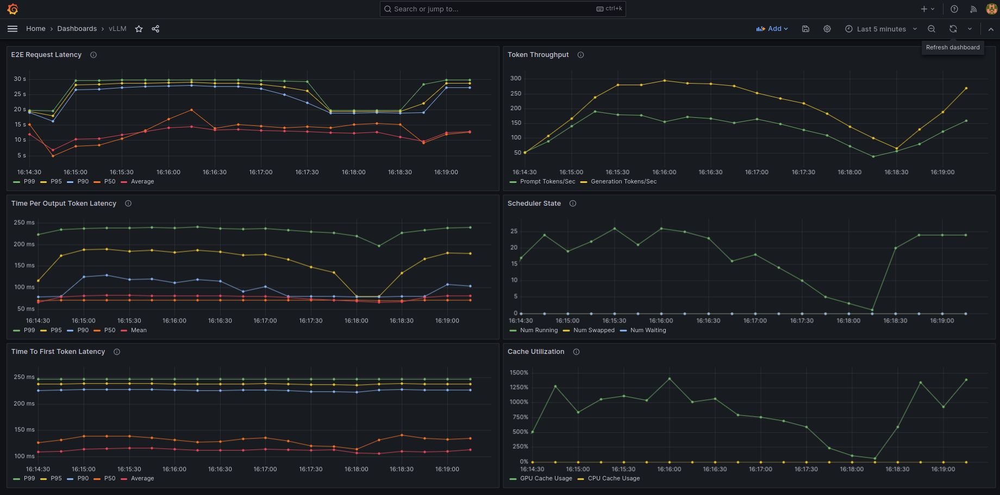

# vLLM + Prometheus/Grafana 

This is a simple example that shows you how to connect vLLM metric logging to the Prometheus/Grafana stack.

For this example, we launch Prometheus and Grafana via Docker. Install: 
- [`docker`](https://docs.docker.com/engine/install/)
- [`docker compose`](https://docs.docker.com/compose/install/linux/#install-using-the-repository)

### Launch

Prometheus metric logging is enabled by default in the OpenAI-compatible server. Launch via the entrypoint:
```bash
python3 ../../vllm/entrypoints/openai/api_server.py \
    --model mistralai/Mistral-7B-v0.1 \
    --max-model-len 2048 \
    --disable-log-requests
```

Launch Prometheus and Grafana servers with `docker compose`:
```bash
docker compose up
```

Submit some sample requests to the server:
```bash
wget https://huggingface.co/datasets/anon8231489123/ShareGPT_Vicuna_unfiltered/resolve/main/ShareGPT_V3_unfiltered_cleaned_split.json
python3 ../../benchmark/benchmark_serving.py \
    --model mistralai/Mistral-7B-v0.1 \
    --tokenizer mistralai/Mistral-7B-v0.1 \
    --endpoint /v1/completions \
    --dataset ShareGPT_V3_unfiltered_cleaned_split.json \
    --num-prompts 200 \
    --request-rate 3.0
```

Navigating to [`http://localhost:8000/metrics`](http://localhost:8000/metrics) will show the raw Prometheus metrics being exposed by vLLM.

### Grafana Dashboard

Navigate to [`http://localhost:3000`](http://localhost:3000). Log in with the default username (`admin`) and password (`admin`).

#### Add Prometheus Data Source

Navigate to [`http://localhost:3000/connections/datasources/new`](http://localhost:3000/connections/datasources/new) and select Prometheus. 

On Prometheus configuration page, we need to add the `Prometheus Server URL` in `Connection`. For this setup, Grafana and Prometheus are running in separate containers, so we need the IP address of the Prometheus container. Run the following to lookup the name of your Prometheus container:

```bash
docker container ls

>> CONTAINER ID   IMAGE                    COMMAND                  CREATED          STATUS          PORTS                                       NAMES
>> 6b2eb9d7aa99   grafana/grafana:latest   "/run.sh"                45 minutes ago   Up 45 minutes   0.0.0.0:3000->3000/tcp, :::3000->3000/tcp   production_monitoring-grafana-1
>> d9b32bc6a02b   prom/prometheus:latest   "/bin/prometheus --c…"   45 minutes ago   Up 45 minutes   0.0.0.0:9090->9090/tcp, :::9090->9090/tcp   production_monitoring-prometheus-1
```

Run the following to lookup the IP address (replace `production_monitoring-prometheus-1` with your container name):
```bash 
docker inspect -f '{{range.NetworkSettings.Networks}}{{.IPAddress}}{{end}}' production_monitoring-prometheus-1
>> 172.18.0.2
```

So, in our case, the `Prometheus Server URL` should be: `http://172.18.0.2:9090`. 

Click `Save & Test`. You should get a green check saying "Successfully queried the Prometheus API.".

#### Import Dashboard 

Navigate to [`http://localhost:3000/dashboard/import`](http://localhost:3000/dashboard/import), upload `grafana.json`, and select the `prometheus` datasource.

You should see a screen that looks like the following:


