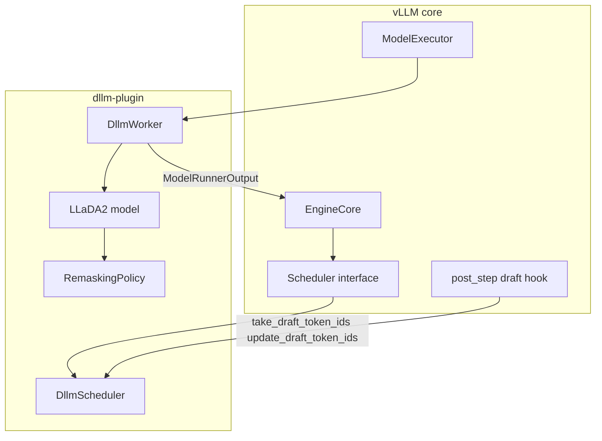
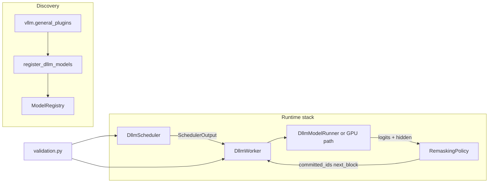
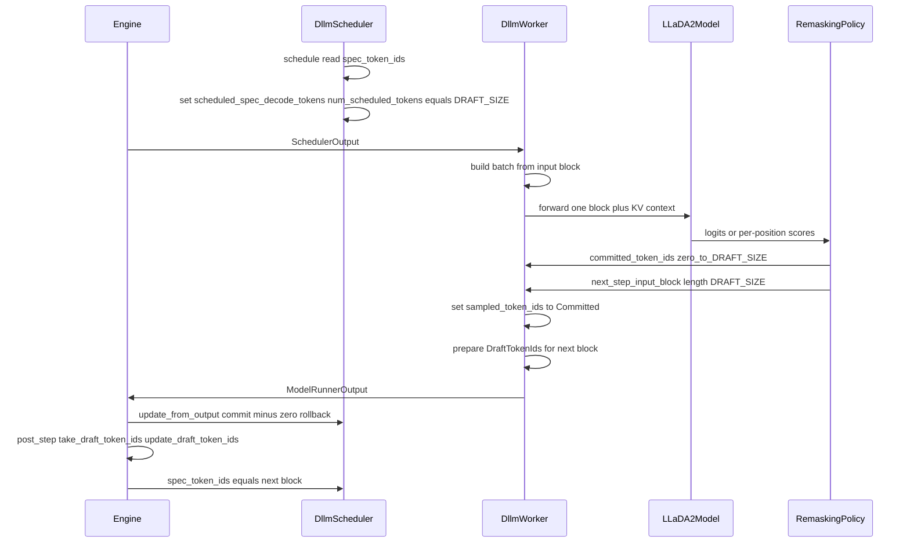
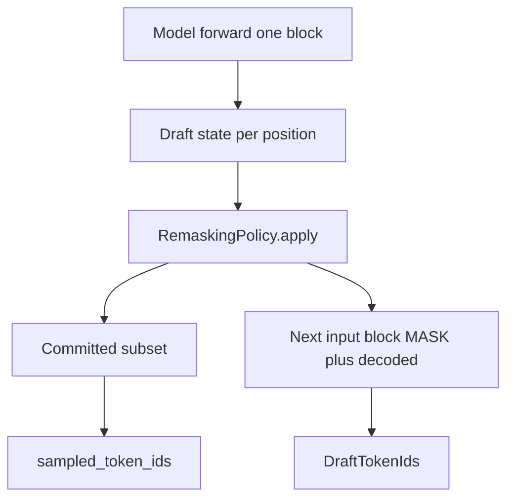

# dllm-plugin — MVP architecture

This document describes the **MVP architecture** for [`vllm-project/dllm-plugin`](https://github.com/vllm-project/dllm-plugin). It aligns with:

- RFC [vllm#36155](https://github.com/vllm-project/vllm/issues/36155) (spec-decode path reuse, one core engine change).
- Evidence-backed integration notes in [`../ANALYSIS.md`](../ANALYSIS.md).
- Product scope in [`../dllm-plugin-plan.md`](../dllm-plugin-plan.md) (LLaDA2.0 first, composable remasking, Summit-class demo).

**Audience:** implementers and reviewers of the plugin and the minimal vLLM core hook.

---

## 1. MVP goals

| Goal | Notes |
|------|--------|
| **One diffusion step = one worker schedule = one model forward** | Same abstraction as RFC; continuous batching stays aligned across requests. |
| **Block size `DRAFT_SIZE`** | Fixed per model (e.g. 32 for LLaDA2.0); one input block in, variable **Committed** (0..DRAFT_SIZE) + fixed **next-step input block** out. |
| **Reuse spec-decode fields** | No new core tensor types; overload meaning when plugin scheduler + worker are active. |
| **Custom scheduler + worker + registered model** | Loaded via `--scheduler-cls` / `--worker-cls` and `vllm.general_plugins` model registration. |
| **Commit-0** | Plugin scheduler rolls back `num_computed_tokens` when no tokens are committed in a step. |
| **Composable remasking (MVP scope)** | Pluggable **remasking policy** interface after forward (threshold / top-k style); LLaDA2.0 can ship with one default implementation. Full sampler zoo from the roadmap is **post-MVP**. |
| **First architecture** | LLaDA2.0 inference path end-to-end (per plan + RFC). |
| **Validation** | Fail fast if dLLM model is used without plugin scheduler/worker (or wrong classes). |

**Out of MVP** (tracked for later): grammar/structured outputs beyond “do not break AR grammar on next block”, block-specific CUDA kernels, prefix caching under semi-causal masks, extra architectures, draft streaming UX, LAVE-style advanced grammar.

---

## 2. Design principles

1. **Thin core, fat plugin** — vLLM change is only the draft-token hook guard; all dLLM semantics live in the plugin.
2. **Strict stack** — Model + scheduler + worker are **one supported configuration**; no mixing with default scheduler/worker for dLLM models.
3. **Spec-decode-shaped I/O** — Scheduler and worker agree on overloaded fields so the existing batching and executor paths stay exercised.
4. **Remasking behind an interface** — Model forward produces logits/hidden state; **RemaskingPolicy** (or equivalent) updates draft state and decides commit candidates; keeps room for plan items (metrics, samplers) without rewriting the worker each time.

---

## 3. Suggested package layout (MVP)

```text
vllm_dllm_plugin/
  __init__.py              # register_models() entry for vllm.general_plugins
  config.py                # DRAFT_SIZE, model id constants, feature flags
  validation.py            # assert_compatible_stack(vllm_config)
  scheduler.py             # DllmScheduler (v1 scheduler interface)
  worker.py                # DllmWorker (WorkerBase subclass)
  remasking/
    __init__.py
    base.py                # RemaskingPolicy protocol / ABC
    llada2_default.py        # MVP default for LLaDA2.0
  models/
    __init__.py
    llada2.py              # vLLM model module for LLaDA2.0 (HF mapping, forward)
```

Naming is illustrative; adjust to match PyPI package name (`vllm-dllm-plugin`).

---

## 4. Context: vLLM core vs plugin boundary



**Core dependency:** After the RFC lands, `Hook` runs whenever a model step executed and draft IDs exist—not only when `speculative_config` is set. Until then the plugin documents the required vLLM version or commit.

---

## 5. Plugin component diagram



- **Registration** mirrors [bart-plugin](https://github.com/vllm-project/bart-plugin): one entry point that registers architecture names → qualified model class strings.
- **Runtime** mirrors the RFC: scheduler owns request state for `spec_token_ids`; worker maps `scheduled_spec_decode_tokens` to the forward and fills `sampled_token_ids` + draft return path.

---

## 6. One decode step: data flow (sequence)



**Commit-0:** In `update_from_output`, if `sampled_token_ids` is empty for a request, scheduler rolls back `num_computed_tokens` by the number of tokens scheduled that step (typically `DRAFT_SIZE` per RFC).

---

## 7. Field mapping (RFC contract)

| vLLM field / API | Role when plugin stack is active |
|------------------|-----------------------------------|
| `Request.spec_token_ids` | **Next-step input block** (length `DRAFT_SIZE`) for the upcoming schedule. |
| `SchedulerOutput.scheduled_spec_decode_tokens` | **Input block** (length `DRAFT_SIZE`) for this step’s forward. |
| `SchedulerOutput.num_scheduled_tokens` (per request) | Set to `DRAFT_SIZE` for decode steps using the block path. |
| `ModelRunnerOutput.sampled_token_ids` | **Committed** token IDs only, length 0..`DRAFT_SIZE` (may be empty). |
| Worker `take_draft_token_ids()` | Returns **next-step input block** packaged as `DraftTokenIds` for engine → scheduler. |
| Scheduler `update_draft_token_ids` / `update_draft_token_ids_in_output` | Store next block into `spec_token_ids`; **must not** apply AR draft grammar to dLLM blocks (override for structured output / async). |

Mutually exclusive with true speculative decoding on the same requests: operators must not enable spec-decode + dLLM plugin stack together for the same run mode.

---

## 8. Remasking composability (MVP)



**MVP contract (conceptual):**

- **Input:** Current input block, logits (or equivalent), optional request config (e.g. threshold).
- **Output:** `committed_token_ids: list[int]` (0..N), `next_input_block: list[int]` (length `DRAFT_SIZE`), and internal mask/draft state for logging.

**LLaDA2.0 default** implements one concrete policy (e.g. confidence-based commit + remask rest); additional policies (Top-P budget, entropy, etc.) from the product plan plug in as new `RemaskingPolicy` implementations without changing the worker’s engine contract.

---

## 9. Attention and execution (MVP)

- **Baseline:** Prefer **FlexAttention** (or model forward that uses vLLM attention with a **custom mask**) for semi-causal “block attends to committed prefix” patterns, per maintainer discussion on [#36155](https://github.com/vllm-project/vllm/issues/36155).
- **Worker responsibility:** Ensure the model runner path used for dLLM keeps **`num_spec_tokens` / draft buffers** consistent with what `take_draft_token_ids` expects (see `ANALYSIS.md` §5.3 on GPU model runner preconditions).

---

## 10. Operator configuration

```bash
export VLLM_PLUGINS=dllm   # or the plugin entry name you register
vllm serve <model> \
  --scheduler-cls vllm_dllm_plugin.scheduler:DllmScheduler \
  --worker-cls vllm_dllm_plugin.worker:DllmWorker
```

**First step:** Before the first decode schedule, `request.spec_token_ids` must hold the first input block (`DRAFT_SIZE` tokens); plugin scheduler or worker initializes it (prompt suffix + mask padding per RFC).

---

## 11. Risks specific to MVP

| Risk | Mitigation |
|------|------------|
| Custom scheduler API not stable | Pin max tested vLLM version; integration tests in CI. |
| Draft hook not in release | Document minimum vLLM from SHA or nightly until released. |
| Structured output + async queue | Implement scheduler overrides early; defer full PDA to post-MVP where possible. |
| Wrong worker/scheduler pairing | `validation.py` at model load or worker init. |

---

## 12. Document history

| Version | Notes |
|---------|--------|
| 1.0 | Initial MVP architecture for plugin-analysis workspace; align with RFC #36155 and internal plan. |

To promote into the official repo, copy or move this file to e.g. `dllm-plugin/docs/MVP-ARCHITECTURE.md` and adjust relative links.
