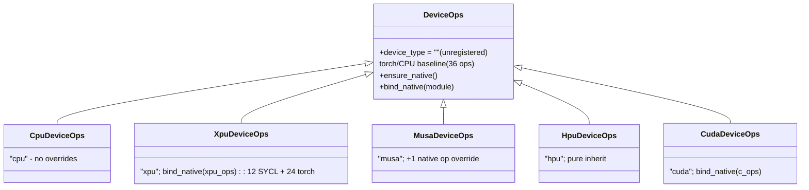

# Design: Unified Device Ops via `DeviceOps` Abstraction

---

## 1. Goal

Unify the per-device **ops** (callable ops plus shared types, currently
exposed as `lmcache.c_ops`) behind a single `DeviceOps` abstraction in
`lmcache/v1/platform/`, alongside the existing device abstractions
(`DeviceIPCWrapper`, `PinMemoryBackend`, `BaseCacheContext`).

**The torch reference implementation moves *into* `DeviceOps`.** The base class
*is* the CPU/torch backend — `python_ops_fallback.py` is
**deprecated entirely**, its logic migrated into the platform package. Every
device (CUDA, XPU, MUSA, HPU) is a `DeviceOps` subclass that overrides only
what it accelerates and inherits the torch baseline for everything else.

---

## 2. What exists today

| Concern | Mechanism | Location |
|---------|-----------|----------|
| Compiled CUDA ops | `PYBIND11_MODULE(c_ops)` — 36 ops + 7 types (+`GPUKVFormat` alias) | `csrc/pybind.cpp` |
| Compiled SYCL ops | `PYBIND11_MODULE(xpu_ops)` — 12 ops + 2 enums (+`GPUKVFormat`); **24 ops fall back to torch** | `csrc/sycl/pybind_sycl.cpp` |
| Torch/CPU reference | `torch_ops.py` — 36 ops (migrated from former `python_ops_fallback.py`) | `lmcache/v1/platform/torch_ops.py` |
| Shared types | `ops_types.py` — `TransferDirection`, `EngineKVFormat`, `PageBufferShapeDesc`, `StagingCopy`, `LaunchVar`, `BatchStep`, `KernelGroupSpec`, `set_shape_desc_dtype` | `lmcache/v1/platform/ops_types.py` |
| MUSA ops | Python override: 1 native op, rest inherited | `lmcache/v1/platform/musa/device_ops.py` |
| HPU ops | None — uses torch baseline entirely | (via `DeviceOps` inheritance) |
| Runtime selection | `_install_c_ops_shim()`: resolves `DeviceOps` singleton via `DeviceSpec.get_ops()` | `lmcache/__init__.py` |
| Device detection | `_device_detect.py`: registry, torch device probe, `current_device_spec` | `lmcache/v1/platform/_device_detect.py` |
| Build selection | `BuildProfile` subclasses auto-discovered | `setup_extensions/build_profiles/` |
| Device services registry | `DeviceIPCWrapper`/`PinMemoryBackend`/`BaseCacheContext` auto-discovered by `device_type` | `lmcache/v1/platform/` |

---

## 3. The `DeviceOps` Abstraction

### 3.1 The dispatch model

Plain instance methods + inheritance:

- The base defines all 36 ops as **explicit instance methods** that delegate to
  `torch_ops` (the migrated torch/CPU baseline).
- A subclass overrides only what it accelerates with a normal method; everything
  else inherits the baseline via MRO.
- Whole-module backends (CUDA, XPU) call `self.bind_native(module)` in
  `ensure_native()` — native callables shadow the baseline as instance attrs.
  Partial backends (XPU: 12 SYCL + 24 torch) shadow only what they ship.
  Single-op backends (MUSA) override one method directly.

The one-line base methods are intentional boilerplate: they keep the contract
visible to type-checkers and IDEs, and `bind_native` shadows them at instance
level when a native op exists.

Note: LMCache DeviceOps is currently stateless and follows a strict one-device-per-process model—making classmethod/staticmethod a natural fit—but instancemethod is selected instead for now. This design choice balances two objectives: aligning with the current LMCache coding style and ensuring architectural flexibility for potential stateful operations in the future.

### 3.2 Base class — contract + torch baseline

`lmcache/v1/platform/base_device_ops.py`:

```python
from __future__ import annotations
from typing import TYPE_CHECKING, ClassVar
import inspect

from lmcache.v1.platform import ops_types, torch_ops
from lmcache.v1.platform.ops_types import (
    BatchStep, EngineKVFormat, KernelGroupSpec, LaunchVar,
    PageBufferShapeDesc, StagingCopy, TransferDirection, set_shape_desc_dtype,
)

class DeviceOps:
    """Strategy base: per-device ops resolved via normal instance MRO."""

    device_type: ClassVar[str] = ""        # base is unregistered

    # Shared types as class attributes (for c_ops shim access).
    TransferDirection = TransferDirection
    EngineKVFormat = EngineKVFormat
    GPUKVFormat = EngineKVFormat            # back-compat alias
    PageBufferShapeDesc = PageBufferShapeDesc
    StagingCopy = StagingCopy
    LaunchVar = LaunchVar
    BatchStep = BatchStep
    KernelGroupSpec = KernelGroupSpec
    set_shape_desc_dtype = staticmethod(set_shape_desc_dtype)

    def __init__(self) -> None:
        self._native_bound: bool = False

    def ensure_native(self) -> None:
        """Subclasses override to import compiled module + call bind_native.
        Base is a no-op (pure torch). Guarded by _native_bound."""

    def bind_native(self, module: object) -> None:
        """Rebind ops and types on *self* from a compiled native module.
        Walks vars(DeviceOps): functions -> instance callables,
        types -> instance type aliases. Class body is the SSOT."""
        for name, member in vars(DeviceOps).items():
            if name.startswith("_") or name == "ensure_native":
                continue
            native_sym = getattr(module, name, None)
            if native_sym is None:
                continue
            if isinstance(member, type):
                setattr(self, name, native_sym)
            elif callable(member):
                setattr(self, name, native_sym)
        ekf = getattr(module, "EngineKVFormat", None)
        if ekf is not None:
            self.GPUKVFormat = ekf  # alias -> native EngineKVFormat

    # --- 36 instance methods delegating to the torch baseline ---
    def multi_layer_kv_transfer(self, *a, **k):
        return torch_ops.multi_layer_kv_transfer(*a, **k)
    def alloc_pinned_ptr(self, size, device_id=0):
        return torch_ops.alloc_pinned_ptr(size, device_id)
    # ... (one per op, 36 total)
```

### 3.3 Key design decisions

- **No `OPS` constant.** Op names are derived dynamically from the class body
  via `inspect.isfunction(member)`, excluding `_`-prefixed names and
  infrastructure methods (`ensure_native`, `bind_native`). This keeps the class
  body as the single source of truth — add a method and it is automatically
  part of the contract and eligible for native rebinding.

- **`bind_native` is public** so subclasses call `self.bind_native(module)` in
  their `ensure_native()` override. It sets native callables and types as
  instance attributes, shadowing the class methods for that instance only.

- **`ensure_native` is lazy**, called once by `DeviceSpec.get_ops()` when the
  singleton is first created. The `_native_bound` guard prevents repeated
  import attempts.

### 3.4 What got migrated

| Old | New |
|-----|-----|
| `lmcache/python_ops_fallback.py` — 36 ops | `platform/torch_ops.py` (module functions) |
| — private helpers (`_transfer_*`, `_tensor_from_ptr`, ...) | `platform/torch_ops.py` (private) |
| — types (`TransferDirection`, `EngineKVFormat`, ...) | `platform/ops_types.py` |
| `import lmcache.python_ops_fallback` (call sites) | `from lmcache.v1.platform.ops_types import ...` |

---

## 4. Per-Device `DeviceOps` Subclasses

### 4.0 Class hierarchy



### 4.1 CPU — the base (no overrides)

```python
# platform/cpu/device_ops.py
class CpuDeviceOps(DeviceOps):
    device_type: ClassVar[str] = "cpu"
    # No overrides. Inherited methods -> torch_ops ARE the CPU backend.
```

### 4.2 CUDA (& ROCm) — bulk-bind the whole module

```python
# platform/cuda/device_ops.py
class CudaDeviceOps(DeviceOps):
    device_type: ClassVar[str] = "cuda"

    def ensure_native(self) -> None:
        if self._native_bound:
            return
        self._native_bound = True
        try:
            import lmcache.c_ops as native
        except ImportError:
            logger.warning("lmcache.c_ops not found; staying on torch baseline.")
            return
        self.bind_native(native)      # all 36 ops -> lmcache.c_ops
```

> ROCm also builds `lmcache.c_ops` (via hipify) and PyTorch ROCm masquerades
> as `torch.cuda`, so `CudaDeviceOps` handles ROCm automatically.

### 4.3 XPU — 12 SYCL + 24 torch

```python
# platform/xpu/device_ops.py
class XpuDeviceOps(DeviceOps):
    device_type: ClassVar[str] = "xpu"

    def ensure_native(self) -> None:
        if self._native_bound:
            return
        self._native_bound = True
        try:
            import lmcache.xpu_ops as sycl
        except ImportError:
            logger.warning("lmcache.xpu_ops not built; staying on torch baseline.")
            return
        self.bind_native(sycl)        # 12 SYCL ops shadow base; 24 inherit
```

### 4.4 MUSA — one native override, extracted as module-level function

```python
# platform/musa/device_ops.py
def _musa_multi_layer_block_kv_transfer(...) -> None:
    """Native MUSA block transfer when tensor-backed; else torch baseline."""
    from lmcache.v1.platform.musa.native_kv_transfer import (
        try_native_multi_layer_block_kv_transfer,
    )
    object_tensors = _tensor_list(lmcache_objects_ptrs)
    if object_tensors is not None and try_native_multi_layer_block_kv_transfer(
        ...
    ):
        return
    torch_ops.multi_layer_block_kv_transfer(...)

class MusaDeviceOps(DeviceOps):
    device_type: ClassVar[str] = "musa"

    def multi_layer_block_kv_transfer(self, *args, **kwargs) -> None:
        _musa_multi_layer_block_kv_transfer(*args, **kwargs)
```

> The implementation is extracted as a module-level function for testability
> and to keep the class body short. The function-call overhead is negligible
> on a path that does heavy tensor I/O.

### 4.5 HPU — inherit the baseline

```python
# platform/hpu/device_ops.py
class HpuDeviceOps(DeviceOps):
    device_type: ClassVar[str] = "hpu"
    # All 36 inherited from the torch baseline.
```

---

## 5. Registration & Discovery

`DeviceOps` resolution reuses the existing `DeviceSpec` discovery in
`lmcache.v1.platform._DEVICE_REGISTRY`; there is no separate ops registry.

### 5.1 `DeviceSpec.ops_cls` and `DeviceSpec.get_ops()`

```python
# platform/base_device_spec.py
class DeviceSpec:
    _ops_cache: DeviceOps | None = None

    @property
    def ops_cls(self) -> type[DeviceOps]:
        """Lazy import to avoid pulling torch_ops into the import graph."""
        from lmcache.v1.platform.base_device_ops import DeviceOps
        return DeviceOps

    def get_ops(self) -> DeviceOps:
        """Cached singleton: create instance, call ensure_native(), cache."""
        ops = self._ops_cache
        if ops is None:
            ops = self.ops_cls()
            ops.ensure_native()
            self._ops_cache = ops
        return ops

# platform/cuda/__init__.py
class CudaDeviceSpec(DeviceSpec):
    @property
    def ops_cls(self) -> type[DeviceOps]:
        from lmcache.v1.platform.cuda.device_ops import CudaDeviceOps
        return CudaDeviceOps
```

The `ops_cls` import lives inside the property body to avoid reintroducing
the `lmcache` / `lmcache.v1.platform` import cycle.

### 5.2 Resolution helpers

```python
# platform/__init__.py
_FALLBACK_CPU_SPEC: DeviceSpec = DeviceSpec()

def _resolve_device_spec(device_type: str) -> DeviceSpec:
    spec = _DEVICE_REGISTRY.get(device_type)
    if spec is not None:
        return spec
    if device_type in ("", "cpu"):
        return _FALLBACK_CPU_SPEC
    raise RuntimeError(
        f"No DeviceSpec registered for accelerator {device_type!r}; "
        "refusing to silently fall back to the torch baseline."
    )

def resolve_device_ops(device_type: str) -> DeviceOps:
    return _resolve_device_spec(device_type).get_ops()
```

Resolution is **fail-fast for accelerators**: if `"cuda"` / `"xpu"` / `"musa"` /
`"hpu"` has no registered `DeviceSpec`, it raises instead of silently falling
back. The CPU path resolves through `CpuDeviceSpec -> CpuDeviceOps`; only `""`
(and a deliberately cleared CPU registry in tests) uses the bare fallback.

### 5.3 Import cycle: `_device_detect.py`

`_device_detect.py` exists as a separate module to break an import cycle:

```
platform/__init__.py → base_device_ops → torch_ops → needs get_torch_device()
```

If `get_torch_device()` and `current_device_spec()` lived in
`platform/__init__.py`, `torch_ops.py` importing them would create a
circular import. `_device_detect.py` sits outside that chain.

### 5.4 `platform/` tree

```text
lmcache/v1/platform/
  __init__.py                 # resolve_device_ops, _resolve_device_spec
  _device_detect.py           # get_torch_device, current_device_spec, registry
  base_device_ops.py          # DeviceOps base + bind_native
  base_device_spec.py         # DeviceSpec + ops_cls + get_ops
  torch_ops.py                # migrated torch/CPU impl (was python_ops_fallback)
  ops_types.py                # TransferDirection, EngineKVFormat, etc.
  base_cache_context.py       # (unchanged) sibling abstractions
  base_ipc_wrapper.py
  base_pin_memory.py
  cache_context.py
  device_ext.py
  event_notifier.py
  _registry.py
  cpu/
    __init__.py               # CpuDeviceSpec.ops_cls -> CpuDeviceOps
    device_ops.py             # CpuDeviceOps (no overrides = base)
    cache_context.py
    shm.py
    stub_cpu_device.py
  cuda/
    __init__.py               # CudaDeviceSpec.ops_cls -> CudaDeviceOps
    device_ops.py             # CudaDeviceOps (bind_native c_ops)
    cache_context.py
    ipc_wrapper.py
    pin_memory.py
  xpu/
    __init__.py               # XpuDeviceSpec.ops_cls -> XpuDeviceOps
    device_ops.py             # XpuDeviceOps (12 SYCL + 24 torch)
    torch_kv_transfer.py      # XPU-tuned fast paths
  musa/
    __init__.py               # MusaDeviceSpec.ops_cls -> MusaDeviceOps
    device_ops.py             # MusaDeviceOps (1 native override)
    native_kv_transfer.py
  hpu/
    __init__.py               # HpuDeviceSpec.ops_cls -> HpuDeviceOps
    device_ops.py             # HpuDeviceOps (inherits baseline)
```

---

## 6. Runtime Resolution — the `lmcache.c_ops` Shim

The shim lives in `lmcache/__init__.py` (not `platform/`) because
`globals()["c_ops"]` must be set on the `lmcache` package namespace for
`from lmcache import c_ops` (IMPORT_FROM bytecode) to work.

```python
# lmcache/__init__.py
def _install_c_ops_shim() -> None:
    from lmcache.v1.platform import resolve_device_ops

    ops = resolve_device_ops(torch_device_type)  # cached singleton

    shim = types.ModuleType("lmcache.c_ops")
    shim.__getattr__ = lambda name: getattr(ops, name)
    shim.__dir__ = lambda: dir(ops)
    sys.modules["lmcache.c_ops"] = shim
    globals()["c_ops"] = shim  # parent attr for IMPORT_FROM bytecode

try:
    _install_c_ops_shim()
except Exception as exc:
    logger.warning("No compute backend loaded; CLI-only mode. Reason: %s", exc)
```

The PEP 562 `__getattr__`/`__dir__` forwarding means:
- `lmc_ops.multi_layer_kv_transfer(...)` resolves with zero overhead.
- Runtime `setattr(ops_instance, ...)` patches (e.g. from `bind_native` or
  tests) are immediately visible through the live forwarding.

---

## 7. Native Compiled Modules (unchanged)

`DeviceOps` changes only how kernels are *selected*, not how they are built.

---

## 8. Build System

setuptools + auto-discovered `BuildProfile`s in `setup_extensions/build_profiles/`.
**No build change is required**: the CUDA extension keeps the name
`lmcache.c_ops`. All profiles (`cuda.py`, `sycl.py`, `rocm.py`, `musa.py`)
are untouched.

---

## 9. Per-Device Effort Matrix

| Device | DeviceOps subclass | Overrides | Native work | Effort |
|--------|-------------------|-----------|-------------|--------|
| CPU | `CpuDeviceOps` | none (base = torch) | none | migrate `python_ops_fallback` -> `torch_ops` |
| CUDA | `CudaDeviceOps` | 36 via `bind_native(c_ops)` | none (keep `.cu`) | **low** |
| HIP/ROCm | handled by `CudaDeviceOps` | (same; ROCm builds `c_ops` via hipify) | N/A | N/A |
| XPU | `XpuDeviceOps` | 12 via `bind_native(xpu_ops)` + 24 torch | existing SYCL | **low** |
| MUSA | `MusaDeviceOps` | 1 native op | none | **low** |
| HPU | `HpuDeviceOps` | none (inherits baseline) | none | **trivial** |
