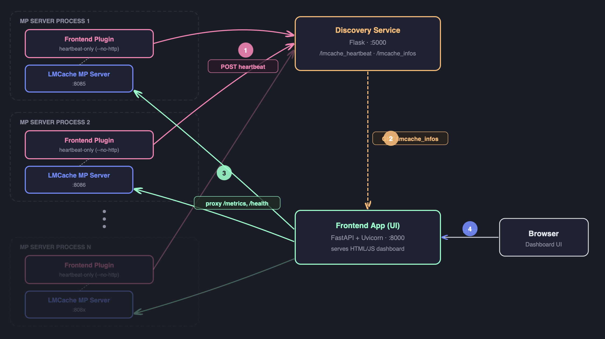

Frontend Dashboard
==================

The **LMCache Frontend Dashboard** is a lightweight web UI that lets you
monitor and manage a fleet of LMCache multiprocess (MP) servers from a
single browser tab.  It is shipped as part of the ``lmcache`` package and
requires no extra infrastructure beyond a small discovery service.

Architecture Overview
---------------------

.. code-block:: text

    +-----------------------------+
    |  LMCache MP HTTP Server     |
    |  (lmcache server)           |
    |                             |
    |  MPRuntimePluginLauncher    |                +---------------------------+
    |    |                        |                |  simple_discover_service  |
    |    +-> lmcache_mp_frontend  |   heartbeat    |  (lmcache.tools)          |
    |        _plugin (subprocess) | -------------> |                           |
    |        -> app.main()        |   (HTTP GET)   |  /lmcache_heartbeat       |
    |           - HeartbeatService|                |  /lmcache_infos           |
    |           - (--no-http)     |                +---------------------------+
    +-----------------------------+                         |
                                                            | node supplier
                                                            v
                                              +---------------------------+
                                              |  Frontend Dashboard       |
                                              |  python -m lmcache.       |
                                              |  lmcache_frontend.app     |
                                              |  --node-supplier-url ...  |
                                              +---------------------------+

Each LMCache MP server runs a **frontend plugin subprocess** that
periodically sends a heartbeat to the discovery service.  The dashboard
queries the discovery service to discover all live nodes and proxies
their HTTP APIs through a built-in reverse proxy.

Components
----------

.. list-table::
   :header-rows: 1
   :widths: 35 65

   * - Component
     - Description
   * - ``lmcache.lmcache_frontend.app``
     - FastAPI application serving the web UI and a reverse proxy to
       every registered LMCache node.  Start with
       ``python -m lmcache.lmcache_frontend.app``.
   * - ``lmcache_mp_frontend_plugin``
     - Runtime plugin subprocess launched by ``MPRuntimePluginLauncher``.
       Runs ``HeartbeatService`` (``--no-http`` mode) to register the
       server with the discovery service.
   * - ``lmcache.tools.simple_discover_service``
     - Reference Flask discovery service.  Accepts heartbeats at
       ``/lmcache_heartbeat`` and exposes the node list at
       ``/lmcache_infos``.  Start with
       ``python -m lmcache.tools.simple_discover_service``.

Prerequisites
-------------

Install the extra dependencies used by the frontend and discovery service:

.. code-block:: bash

    pip install flask httpx fastapi uvicorn

These are not pulled in by the base ``lmcache`` install to keep it slim.

Quick Start (all-in-one on ``localhost``)
------------------------------------------

The steps below spin up the **discovery service**, the **LMCache MP
server** and the **dashboard** on a single machine and glue them
together with ``localhost``. Open three terminals and run one command
in each.

Endpoint cheat sheet used throughout this section:

- Discovery service: ``http://localhost:5000``
- LMCache MP HTTP server: ``http://localhost:8085``
- Dashboard UI: ``http://localhost:8000``

**Step 1 — Start the discovery service**

.. code-block:: bash

    python3 -m lmcache.tools.simple_discover_service --port 5000

This binds to ``0.0.0.0:5000`` by default. To pick a different
interface or port, pass ``--host`` / ``--port`` (e.g.
``--port 5001``); if you change the port, remember to update the
URLs in Step 2 & 3 accordingly.

The service exposes:

- ``GET /lmcache_heartbeat`` — record a heartbeat from an MP server.
- ``GET /lmcache_infos`` — return all registered nodes as JSON.

Verify it is up:

.. code-block:: bash

    curl http://localhost:5000/lmcache_infos

**Step 2 — Start the LMCache MP server with the frontend plugin**

.. important::
   ``--runtime-plugin-locations`` accepts either a relative path
   (resolved against the **current working directory**) or an
   absolute path. The command below uses a relative path, so it
   **must be run from the repository root**. Otherwise you will see:

   .. code-block:: text

       LMCache WARNING: Runtime plugin location
       lmcache/lmcache_frontend/lmcache_mp_plugin/lmcache_mp_frontend_plugin.py
       does not exist

   and no heartbeat will be sent. Either ``cd`` into the repo root
   first, or replace the plugin path with an absolute one such as
   ``$(pwd)/lmcache/lmcache_frontend/lmcache_mp_plugin/lmcache_mp_frontend_plugin.py``
   (evaluated from the repo root) or a fully-qualified path
   ``/abs/path/to/LMCache/lmcache/lmcache_frontend/lmcache_mp_plugin/lmcache_mp_frontend_plugin.py``.

.. code-block:: bash

    # Run from the repository root of LMCache.
    cd /path/to/LMCache

    lmcache server \
        --l1-size-gb 2 \
        --eviction-policy LRU \
        --http-host 0.0.0.0 --http-port 8085 \
        --runtime-plugin-locations \
            lmcache/lmcache_frontend/lmcache_mp_plugin/lmcache_mp_frontend_plugin.py \
        --runtime-plugin-config \
            '{"plugin.frontend.heartbeat-url": "http://localhost:5000/lmcache_heartbeat", "plugin.frontend.report-host": "127.0.0.1"}'

The plugin subprocess sends a heartbeat to the discovery service every
30 seconds (configurable via ``plugin.frontend.heartbeat-interval``).

.. important::
   **Why ``plugin.frontend.report-host: 127.0.0.1`` matters for local dev.**

   By default the plugin calls ``get_local_ip()`` to guess a
   non-loopback IPv4 to put into the reported ``api_address``. On a
   developer laptop that guess is often a NIC/VPN address that is
   **not reachable** from the dashboard side (Wi-Fi switched off,
   split-tunnel VPN, macOS firewall, etc.), so
   ``http://localhost:5000/lmcache_infos`` will list an
   ``apiAddress`` that the dashboard cannot connect to.

   Setting ``plugin.frontend.report-host`` to ``127.0.0.1`` bypasses
   the auto-detection and forces the reported address to
   ``http://127.0.0.1:8085``, which is always reachable on the same
   machine. For multi-host deployments, set it to the real IP or
   hostname that the dashboard should use to reach this server, or
   leave it unset to keep auto-detection.

Verify the heartbeat landed:

.. code-block:: bash

    curl http://localhost:5000/lmcache_infos
    # Expect: processInfos -> "http://127.0.0.1:8085": { ... }

Alternatively, use the provided example script (accepts the
``REPORT_HOST`` env var):

.. code-block:: bash

    REPORT_HOST=127.0.0.1 \
        bash lmcache/lmcache_frontend/run_mp_server_with_frontend.sh

**Step 3 — Start the dashboard**

.. code-block:: bash

    python3 -m lmcache.lmcache_frontend.app \
        --port 8000 \
        --host 0.0.0.0 \
        --node-supplier-url http://localhost:5000/lmcache_infos

Open ``http://localhost:8000`` in your browser. The dashboard fetches
the node list from the discovery service and reverse-proxies to each
node's ``apiAddress`` — with ``report-host`` set to ``127.0.0.1``
above, this always resolves back to the local MP server on
``:8085``.

.. note::
   The dashboard auto-refreshes the node list from the supplier URL
   at most once every 30 seconds when the homepage is loaded.

Dashboard Features
------------------

- **Node tree view** — shows all proxies and their child nodes in a
  collapsible tree.
- **Metrics aggregation** — ``GET /metrics`` on the dashboard aggregates
  Prometheus metrics from every leaf node.
- **Reverse proxy** — ``/proxy2/{node_name}/{path}`` forwards requests to
  the named node, enabling direct API access from the browser.
- **Health endpoint** — ``GET /health`` returns ``{"status": "healthy"}``.

CLI Reference
-------------

``python -m lmcache.lmcache_frontend.app``
~~~~~~~~~~~~~~~~~~~~~~~~~~~~~~~~~~~~~~~~~~

.. list-table::
   :header-rows: 1
   :widths: 30 15 55

   * - Flag
     - Default
     - Description
   * - ``--host``
     - ``0.0.0.0``
     - Bind address for the dashboard HTTP server.
   * - ``--port``
     - ``8000``
     - Port for the dashboard HTTP server.
   * - ``--node-supplier-url``
     - *(none)*
     - URL to fetch node information from, e.g.:
       ``http://localhost:5000/lmcache_infos``.
   * - ``--config``
     - *(built-in)*
     - Path to a JSON config file listing proxy nodes.  Used when
       ``--node-supplier-url`` is not set.
   * - ``--nodes``
     - *(none)*
     - Inline JSON array of node dicts, e.g.
       ``'[{"name":"n1","host":"127.0.0.1","port":"8085"}]'``.
   * - ``--heartbeat-url``
     - *(none)*
     - If set, the dashboard itself also sends heartbeats to this URL.
   * - ``--report-host``
     - *(auto)*
     - Host reported in the heartbeat ``api_address``. When set, skips
       ``get_local_ip()`` auto-detection. Useful for local dev where the
       auto-detected IP is not reachable from the discovery service side.
   * - ``--log-level``
     - ``warning``
     - Uvicorn log level (``debug``, ``info``, ``warning``, …).
   * - ``--no-http``
     - ``false``
     - Disable the HTTP server; only the heartbeat loop runs.  Used
       internally by the MP plugin.

Plugin Config Keys
------------------

Pass these inside ``--runtime-plugin-config`` when launching the MP server:

.. list-table::
   :header-rows: 1
   :widths: 40 60

   * - Key
     - Description
   * - ``plugin.frontend.heartbeat-url``
     - **(Required)** Heartbeat endpoint of the discovery service.
   * - ``plugin.frontend.heartbeat-interval``
     - Heartbeat interval in seconds (default: ``30``).
   * - ``plugin.frontend.heartbeat-initial-delay``
     - Seconds to wait before the first heartbeat (default: ``0``).
   * - ``plugin.frontend.report-host``
     - Host reported in the heartbeat ``api_address``. When set, the
       plugin skips ``get_local_ip()`` auto-detection and uses this
       value verbatim. Handy for local dev (``127.0.0.1``), multi-NIC
       hosts, or when the auto-detected IP is not reachable from the
       discovery service side.

Using a Custom Discovery Service
---------------------------------

The ``simple_discover_service`` is a reference implementation.  Any HTTP
service that accepts the following GET request can be used:

.. code-block:: text

    GET <heartbeat_url>?api_address=<url>&pid=<int>&version=<str>&other_info=<json>

And exposes a node-list endpoint that returns JSON in the shape:

.. code-block:: json

    {
      "processInfos": {
        "http://host:port": {
          "lmCacheInfoEntities": [
            {"apiAddress": "http://host:port", "version": "1.0.0"}
          ]
        }
      }
    }
