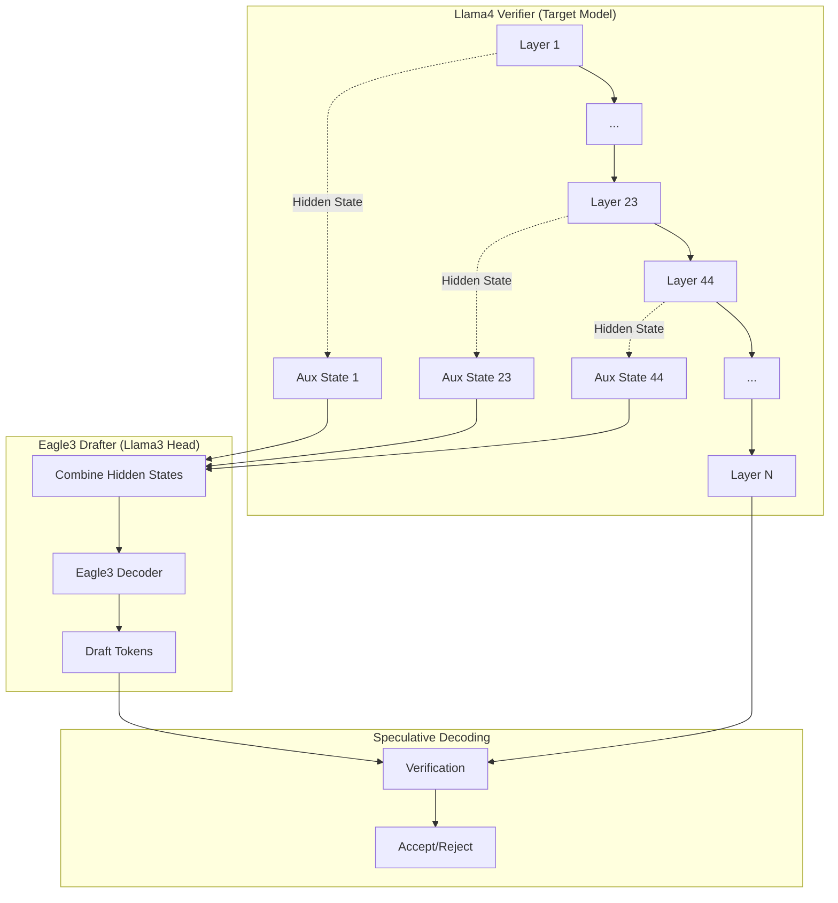
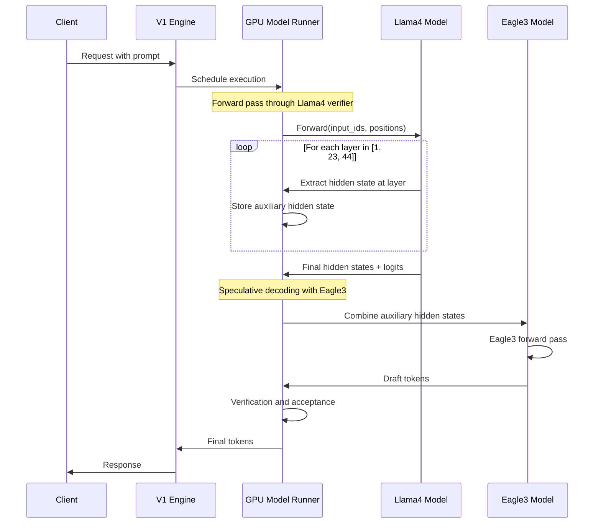

# Llama3 Eagle3 Drafter with Llama4 Verifier Implementation Plan

## Overview

This document outlines the implementation plan for supporting Eagle3 speculative decoding with a Llama3-based drafter and Llama4 verifier in vLLM. The key challenge is implementing support for custom auxiliary hidden state layer IDs (`[1, 23, 44]`) instead of the default layers used in standard Eagle3 implementations.

## Feature Requirements

- **Drafter Model**: `nm-testing/Llama4-Maverick-Eagle3-Speculators` (Eagle3 head based on Llama3 architecture)
- **Verifier Model**: `RedHatAI/Llama-4-Maverick-17B-128E-Instruct-quantized.w4a16` (Llama4 multimodal model)
- **Auxiliary Hidden Layers**: Custom layers `[1, 23, 44]` instead of default
- **Architecture**: `Eagle3Speculator` with `eagle3` algorithm
- **Multimodal Support**: First Eagle3 implementation on multimodal models (Llama4)

## Architecture Overview



## Key Implementation Changes

### 1. Speculators Configuration Handling

**File**: `vllm/transformers_utils/configs/speculators/algos.py:16-33`

The speculators framework automatically handles model selection:

```python
@register_speculator("eagle3")
def update_eagle3(config_dict: dict, vllm_config: dict) -> None:
    # Automatically sets architectures to Eagle3LlamaForCausalLM
    vllm_config["architectures"] = ["Eagle3LlamaForCausalLM"]
```

**No manual registry needed** - the `"speculators_model_type": "eagle3"` in the config automatically routes to the correct model implementation.

### 2. Configure Eagle3 Auxiliary Layers via SupportsEagle3 Interface

**File**: `vllm/v1/worker/gpu_model_runner.py:100-150`

**Current Implementation**: Basic Eagle support without custom layer configuration.

**Required Changes**: Use the `SupportsEagle3` interface to configure auxiliary layers:

```python
def _configure_eagle3_layers(self):
    """Configure auxiliary hidden state layers for Eagle3 models."""
    if (self.vllm_config.speculative_config is not None and
        self.vllm_config.speculative_config.method == "eagle3"):

        # Check if target model supports Eagle3
        from vllm.model_executor.models.interfaces import supports_eagle3
        if supports_eagle3(self.model):
            draft_config = self.vllm_config.speculative_config.draft_model_config.hf_config

            # Extract auxiliary layer IDs from Eagle3 drafter config
            aux_layers = None
            if hasattr(draft_config, 'eagle_aux_hidden_state_layer_ids'):
                aux_layers = tuple(draft_config.eagle_aux_hidden_state_layer_ids)
            elif hasattr(draft_config, 'eagle_config'):
                eagle_config = draft_config.eagle_config
                if 'eagle_aux_hidden_state_layer_ids' in eagle_config:
                    aux_layers = tuple(eagle_config['eagle_aux_hidden_state_layer_ids'])

            # Set auxiliary layers on the target model
            if aux_layers:
                logger.info(f"Configuring Eagle3 auxiliary layers: {aux_layers}")
                self.model.set_aux_hidden_state_layers(aux_layers)
                self.use_aux_hidden_state_outputs = True
            else:
                logger.warning("Eagle3 config found but no auxiliary layer IDs specified")

# Call during model runner initialization
def __init__(self, ...):
    # ... existing initialization ...
    self._configure_eagle3_layers()
```

### 3. Implement SupportsEagle3 Interface for Llama4ForConditionalGeneration

**File**: `vllm/model_executor/models/mllama4.py`

**Current Implementation**: `Llama4ForConditionalGeneration` does not implement `SupportsEagle3`.

**Required Changes**: Add `SupportsEagle3` interface implementation following existing patterns:

```python
from .interfaces import SupportsMultiModal, SupportsPP, SupportsEagle3  # Add SupportsEagle3

class Llama4ForConditionalGeneration(nn.Module, SupportsMultiModal, SupportsPP, SupportsEagle3):
    supports_eagle3: ClassVar[Literal[True]] = True

    def set_aux_hidden_state_layers(self, layers: tuple[int, ...]) -> None:
        """Set which layers should output auxiliary hidden states for EAGLE3."""
        # Delegate to underlying language model (Llama4ForCausalLM)
        if hasattr(self.language_model, 'set_aux_hidden_state_layers'):
            self.language_model.set_aux_hidden_state_layers(layers)

    def get_eagle3_aux_hidden_state_layers(self) -> tuple[int, ...]:
        """Get the layer indices for auxiliary hidden state outputs."""
        # Return custom layers for this model - will be overridden by config
        return (1, 23, 44)

    def forward(
        self,
        input_ids: torch.Tensor,
        positions: torch.Tensor,
        intermediate_tensors: Optional[IntermediateTensors] = None,
        inputs_embeds: Optional[torch.Tensor] = None,
        **kwargs: object,
    ) -> Union[torch.Tensor, IntermediateTensors, tuple[torch.Tensor, list[torch.Tensor]]]:
        if intermediate_tensors is not None:
            inputs_embeds = None
        elif inputs_embeds is None:
            vision_embeddings = self.get_multimodal_embeddings(**kwargs)
            inputs_embeds = self.get_input_embeddings(input_ids, vision_embeddings)
            input_ids = None

        # Simply delegate to language model - it handles aux states if configured
        return self.language_model(input_ids, positions, intermediate_tensors, inputs_embeds)
```

**Key Changes**:
1. **Simple Delegation**: No complex routing - just delegate interface methods to underlying model
2. **Return Type**: Matches existing pattern `Union[torch.Tensor, tuple[torch.Tensor, list[torch.Tensor]]]`
3. **No Special Logic**: The `language_model` (Llama4ForCausalLM) handles auxiliary state collection

### 4. Add SupportsEagle3 Interface to Llama4ForCausalLM

**File**: `vllm/model_executor/models/llama4.py`

**Current Implementation**: `Llama4ForCausalLM` inherits from `LlamaForCausalLM` which already implements `SupportsEagle3`.

**Required Changes**: Ensure `Llama4ForCausalLM` inherits the interface properly:

```python
# No changes needed to Llama4ForCausalLM class itself - it inherits from LlamaForCausalLM
# which already implements SupportsEagle3

class Llama4ForCausalLM(LlamaForCausalLM):
    # ... existing implementation ...

    # SupportsEagle3 methods are inherited from LlamaForCausalLM:
    # - set_aux_hidden_state_layers() -> delegates to self.model.aux_hidden_state_layers
    # - get_eagle3_aux_hidden_state_layers() -> returns default pattern
    # - forward() -> calls self.model() which handles aux state collection

    def get_eagle3_aux_hidden_state_layers(self) -> tuple[int, ...]:
        """Override to return custom layers for Llama4."""
        # This will be overridden by the config during initialization
        return (1, 23, 44)  # Custom auxiliary layers for this model
```

**Key Insight**: The underlying `LlamaModel` already handles auxiliary state collection in its forward method (lines 380-416). It:
1. Collects states from `self.aux_hidden_state_layers` during layer loop
2. Returns `tuple[torch.Tensor, list[torch.Tensor]]` when aux states exist
3. GPU model runner concatenates the aux states: `torch.cat([h for h in aux_hidden_states], dim=-1)`

### 4. Eagle3 Drafter Model Updates

**File**: `vllm/model_executor/models/llama_eagle3.py:268-274`

**Current Implementation**:
```python
def combine_hidden_states(self, hidden_states: torch.Tensor) -> torch.Tensor:
    # combine multiple auxiliary hidden states returned by eagle3
    return self.model.fc(hidden_states)
```

**Required Changes**: Ensure the `fc` layer properly handles the concatenated hidden states from layers `[1, 23, 44]`:

```python
def combine_hidden_states(self, hidden_states: torch.Tensor) -> torch.Tensor:
    """
    Combine auxiliary hidden states from specified layers.

    Args:
        hidden_states: Concatenated hidden states from aux layers [1, 23, 44]
                      Shape: [batch_size, seq_len, hidden_size * 3]

    Returns:
        Combined hidden states: [batch_size, seq_len, hidden_size]
    """
    # Verify expected input shape
    expected_input_size = self.config.hidden_size * 3  # 3 auxiliary layers
    assert hidden_states.shape[-1] == expected_input_size, \
        f"Expected hidden_states dim {expected_input_size}, got {hidden_states.shape[-1]}"

    return self.model.fc(hidden_states)
```

### 5. Eagle3 Proposer - No Changes Needed

**File**: `vllm/v1/spec_decode/eagle.py:168-172`

**Current Implementation**:
```python
if self.method == "eagle3":
    assert isinstance(self.model, Eagle3LlamaForCausalLM)
    target_hidden_states = self.model.combine_hidden_states(target_hidden_states)
    assert target_hidden_states.shape[-1] == self.hidden_size
```

**Required Changes**: **None** - the existing implementation already works correctly!

**Why it works**:
1. **GPU Model Runner** concatenates aux states: `torch.cat([h for h in aux_hidden_states], dim=-1)`
2. **Target Hidden States** already contains the concatenated auxiliary states from layers `[1, 23, 44]`
3. **Eagle3 Proposer** receives this concatenated tensor and passes it to `combine_hidden_states()`
4. **Eagle3 Model** processes the concatenated states through its `fc` layer to combine them

The existing Eagle3 implementation in vLLM is already designed to handle arbitrary auxiliary layer configurations!

### 6. Multimodal Support Integration

**File**: `vllm/model_executor/models/llama4_eagle.py:224-240`

**Current Implementation**: Basic multimodal embedding support exists.

**Required Changes**: Ensure Llama4 Eagle drafter properly handles multimodal inputs:

```python
def get_input_embeddings(
    self,
    input_ids: torch.Tensor,
    multimodal_embeddings: Optional[NestedTensors] = None,
) -> torch.Tensor:
    inputs_embeds = self.model.get_input_embeddings(input_ids)

    if multimodal_embeddings is not None:
        # Ensure image_token_index is properly configured for Llama4
        if not hasattr(self.config, 'image_token_index'):
            logger.warning("image_token_index not found in config, multimodal may not work correctly")

        inputs_embeds = merge_multimodal_embeddings(
            input_ids,
            inputs_embeds,
            multimodal_embeddings,
            getattr(self.config, 'image_token_index', None),
        )

    return inputs_embeds
```

## Implementation Steps

### Phase 1: SupportsEagle3 Interface Implementation

1. **Add SupportsEagle3 to Llama4ForConditionalGeneration** (`vllm/model_executor/models/mllama4.py`)
   - Add `SupportsEagle3` to class inheritance
   - Implement delegation methods for `set_aux_hidden_state_layers()` and `get_eagle3_aux_hidden_state_layers()`
   - Update return type annotation to include `tuple[torch.Tensor, list[torch.Tensor]]`

2. **Override auxiliary layer configuration in Llama4ForCausalLM** (`vllm/model_executor/models/llama4.py`)
   - Override `get_eagle3_aux_hidden_state_layers()` to return `(1, 23, 44)`
   - No other changes needed - inherits all Eagle3 functionality from `LlamaForCausalLM`

### Phase 2: Configuration Setup

3. **Configure auxiliary layers via interface** (`vllm/v1/worker/gpu_model_runner.py`)
   - **No changes needed** - existing code in lines 2580-2587 already handles this:
     ```python
     if self.use_aux_hidden_state_outputs:
         if supports_eagle3(self.model):
             self.model.set_aux_hidden_state_layers(
                 self.model.get_eagle3_aux_hidden_state_layers())
     ```
   - The model will be configured with layers `(1, 23, 44)` automatically

### Phase 3: Testing and Validation

4. **Test with custom configuration** - Update the Eagle3 drafter config to use custom layers
5. **Verify tensor dimensions** - Ensure the `fc` layer in Eagle3 drafter expects 3 concatenated auxiliary states

### Phase 3: Multimodal Integration

5. **Enhance Llama4 Eagle support** (`vllm/model_executor/models/llama4_eagle.py`)
   - Ensure proper multimodal embedding handling
   - Add configuration validation for image tokens

6. **Update Eagle proposer** (`vllm/v1/spec_decode/eagle.py`)
   - Add validation for custom auxiliary layer configuration
   - Ensure compatibility with multimodal models

### Phase 4: Testing and Validation

7. **Create test scenarios**
   - Unit tests for auxiliary hidden state extraction
   - Integration tests with sample prompts
   - Performance benchmarks comparing to default Eagle3

8. **Error handling and edge cases**
   - Invalid layer ID configurations
   - Memory constraints with multiple auxiliary layers
   - Multimodal input edge cases

## Detailed Code Flow



## Expected Challenges and Solutions

### Challenge 1: Memory Management
**Issue**: Storing hidden states from 3 different layers increases memory usage.
**Solution**: Implement efficient tensor pooling and only store necessary states.

### Challenge 2: Layer Index Mapping
**Issue**: Ensuring correct layer indices between Llama3 drafter and Llama4 verifier.
**Solution**: Explicit validation and error handling for layer ID configuration.

### Challenge 3: Multimodal Compatibility
**Issue**: First time running Eagle3 on multimodal models may reveal bugs.
**Solution**: Comprehensive testing with various multimodal inputs and fallback mechanisms.

### Challenge 4: Performance Impact
**Issue**: Custom auxiliary layer extraction may impact performance.
**Solution**: Profile memory usage and computation overhead, optimize tensor operations.

## Testing Strategy

1. **Unit Tests**
   - Test auxiliary hidden state extraction for layers `[1, 23, 44]`
   - Validate `combine_hidden_states` with correct input dimensions
   - Test multimodal embedding integration

2. **Integration Tests**
   - End-to-end speculative decoding with sample prompts
   - Compare output quality with baseline Eagle3 implementation
   - Test with various multimodal inputs (images + text)

3. **Performance Tests**
   - Memory usage profiling
   - Throughput comparison with standard Eagle3
   - Latency measurements for different sequence lengths

## Error Handling

```python
# Configuration validation
def validate_eagle3_config(config):
    if not hasattr(config, 'eagle_aux_hidden_state_layer_ids'):
        raise ValueError("eagle_aux_hidden_state_layer_ids not found in config")

    layer_ids = config.eagle_aux_hidden_state_layer_ids
    if not isinstance(layer_ids, list) or len(layer_ids) != 3:
        raise ValueError(f"Expected 3 auxiliary layer IDs, got {len(layer_ids)}")

    # Validate layer IDs are within reasonable bounds
    max_layers = getattr(config, 'num_hidden_layers', 50)
    for layer_id in layer_ids:
        if layer_id >= max_layers:
            raise ValueError(f"Layer ID {layer_id} exceeds model layers {max_layers}")

# Runtime validation
def validate_hidden_states(hidden_states, expected_layers):
    if hidden_states.shape[-1] != expected_layers * hidden_size:
        raise RuntimeError(f"Hidden state dimension mismatch: expected {expected_layers * hidden_size}, got {hidden_states.shape[-1]}")
```

## Command to Test

```bash
# Set environment
source /home/rahul-tuli/vllm/.venv/bin/activate

# Run the speculators model - verifier is automatically configured from speculators config
VLLM_USE_V1=1 CUDA_VISIBLE_DEVICES=6,7 vllm serve "nm-testing/Llama4-Maverick-Eagle3-Speculators" \
    --tensor-parallel-size 2
```

**Notes**:
- The verifier model `"RedHatAI/Llama-4-Maverick-17B-128E-Instruct-quantized.w4a16"` is automatically loaded based on the `speculators_config.verifier.name_or_path` field in the drafter's config
- `VLLM_USE_V1=1` enables the V1 engine which supports Eagle3 speculative decoding
- Multi-GPU setup required due to the size of the Llama4 verifier model

## Success Criteria

1. ✅ Model loads successfully with custom auxiliary layer configuration
2. ✅ Hidden states are correctly extracted from layers `[1, 23, 44]`
3. ✅ Eagle3 drafter generates coherent draft tokens
4. ✅ Speculative decoding works with acceptable acceptance rates
5. ✅ Multimodal inputs (text + images) process correctly
6. ✅ Performance is comparable to standard Eagle3 implementations
7. ✅ No memory leaks or crashes during extended operation

## Summary: Minimal Changes Required

**Analysis Result**: After examining existing Eagle3 implementations, the required changes are **much simpler** than initially anticipated.

### **Key Insight**
vLLM's Eagle3 system is already designed to handle arbitrary auxiliary layer configurations. The existing infrastructure:
- ✅ Collects auxiliary states from any configured layers
- ✅ Concatenates them automatically
- ✅ Passes them to Eagle3 proposer
- ✅ Handles multimodal models via interfaces

### **Required Changes**
1. **Add 15 lines** to `Llama4ForConditionalGeneration` - implement `SupportsEagle3`
2. **Add 3 lines** to `Llama4ForCausalLM` - override layer configuration
3. **Zero changes** to GPU model runner, Eagle proposer, or auxiliary state handling

### **Why This Works**
The speculators framework + SupportsEagle3 interface + existing Eagle3 infrastructure provides a robust foundation that already supports:
- Custom auxiliary layer configurations
- Multimodal models
- Arbitrary layer indices
- Proper tensor concatenation and routing

This implementation leverages vLLM's existing patterns rather than introducing new mechanisms, making it **minimal, robust, and maintainable**.