# LongCat-Next Model Architecture

## Implementation Status

| Component | Status | Location |
| ----------- | ------ | ---------- |
| **Backbone (MLA + MoE)** | ✅ Implemented | vLLM core (`longcat_next.py`) |
| **N-gram Embedding** | ✅ Implemented | vLLM core (`longcat_next.py`) |
| **Visual Encoder (Qwen2.5-VL)** | ✅ Implemented | vLLM core (`longcat_next.py`) |
| **Audio Encoder (Whisper)** | ✅ Implemented | vLLM core (`longcat_next.py`) |
| **Visual/Audio Quantizers (RQ/RVQ)** | ✅ Implemented | vLLM core (`longcat_next.py`) |
| **Image/Video/Audio Understanding** | ✅ Implemented | vLLM core (`longcat_next.py`) |
| **Text Generation** | ✅ Implemented | vLLM core (`longcat_next.py`) |
| **Visual Decoder (Image Generation)** | ⏳ Planned | vllm-omni (DiT blocks) |
| **Audio Decoder (Code2Wav)** | ⏳ Planned | vllm-omni (code2wav) |
| **Video Generation** | ⏳ Planned | vllm-omni (DiT blocks) |
| **Generation Mode Switching** | ⏳ Planned | vllm-omni (bifurcated heads) |

**Note**: Image, audio, and video generation are expected to be implemented in the **vllm-omni** codebase, which contains the code2wav vocoder, DiT (Diffusion Transformer) blocks, and other generation components. The vLLM core implementation handles understanding tasks (prefill/encoding), while generation tasks are delegated to vllm-omni.

## Overview

LongCat-Next is a unified multimodal (text, image, audio, video) generative model with N-gram embedding, Mixture of Experts (MoE), and Multi-Latent Attention (MLA). It uses a shared transformer backbone with bifurcated output heads for text, visual, and audio generation.

**All shapes below are ground-truth from `config.json`, `nmm_infer/config.json`, and `model.safetensors` weight files.**

## Architecture Diagram

```mermaid
graph TB
    subgraph "Input Fusion"
        A["Text Tokens\n(bs, seq_len)"] --> A1["ngram_embeddings\n(bs, seq_len) → (bs, seq_len, 3072)"]
        B["Pixel Values\n(num_patches, 1176)"] --> B1["VisualEncoder\n(Qwen2_5_VL, 32 layers)\n(num_patches, 1176) → (L, 1280)"]
        B1 --> B2["OmniVisualBridge\n(L, 1280) → (L_out, 3584)\nmlp: [5120,5120]→[3584,5120]"]
        B2 --> B3["VisualQuantizer / RQ\n(L_out, 3584) → codes(h, w, 8)\n8 codebooks × 16384, dim=3584"]
        B3 --> B4["+ visual_offset(150581) → visual_ids\n(h×w, 8)"]

        C["Audio Waveform\n(bs, 128 mel, frames)\n16kHz, n_fft=400, hop=160"] --> C1["AudioEncoder\n(Whisper, 32 layers, 20 heads)\n(bs, 128, frames) → (bs, frames', 1280)"]
        C1 --> C2["AudioVQBridger\n(bs, frames', 1280)\n→ gate/up [5120,1280,4]\n→ down [5120,5120]\n→ RQ 8 codebooks (dim=5120)\n→ codes(bs×seq, 8)"]
        C2 --> C3["+ audio_offset(131125) → audio_ids\n(bs×seq, 8)"]

        A1 --> D["Token Embeddings / inputs_embeds\n(bs, seq, 3072)"]
        B4 --> D
        C3 --> D
    end

    subgraph "Shared Backbone\n14× LongcatFlashDecoderLayer"
        D --> E["inputs_embeds\n(bs, seq, 3072)"]
        E --> F["MLA Attention\n32 heads, qk_nope=128, qk_rope=64, v_head=128\nq: (bs,seq,3072)→q_a[1536,3072]→(bs,seq,1536)\n  →q_b[6144,1536]→(bs,seq,4096)+rope(64)\nk: (bs,seq,3072)→k_proj[1536,512]\n  →k_up[1536,1536]→(bs,seq,1536+64)\nv: (bs,seq,3072)→v_proj[1536,512]\n  →v_up[1536,1536]→(bs,seq,1536)\n→ o_proj[3072,4096] → (bs, seq, 3072)"]
        F --> G["MoE FFN\n256 routed + 128 zero(identity)\ntopk=12, scaling=6.0\nrouted: gate/up[1024,3072]→down[3072,1024]\nshared: gate/up[6144,3072]→down[3072,6144]\n→ (bs, seq, 3072)"]
        G --> H["Residual + LayerNorm\n(bs, seq, 3072)"]
    end

    subgraph "Bifurcation\n(multimodal_generation_status.mode)"
        H --> I{"Generation Mode?"}
    end

    subgraph "Text Path"
        I -->|"text"| J["lm_head\n(bs, 1, 3072) → (bs, 1, 131125)"]
        J --> K["Text Logits\nargmax/sample → token_id"]
    end

    subgraph "Visual Path"
        I -->|"visual"| L["visual_head: CasualDepthTransformerHead\nhidden: (bs, 1, 3072)\ncodes: (bs, 8)\ntransformer_dim=2048, ffn_scale=16\n4 transformer layers\n→ per-level: (bs, 1, 16385)"]
        L --> L1["Per-level AR sampling\n8 codebooks × 16384\nloss_weights=[1.0×10]\n→ visual_ids (bs, 8)"]
    end

    subgraph "Audio Path"
        I -->|"audio"| M["audio_head: CasualDepthTransformerHead\nhidden: (bs, 1, 3072)\ncodes: (bs, 8)\ntransformer_dim=3072, ffn_scale=16\n4 transformer layers\n→ per-level: varies"]
        M --> M1["Per-level AR sampling\n8 codebooks [8192,4096,2048,1024×5]\nloss_weights=[1,0.5,0.25,0.125×7]\n→ audio_ids (bs, 8)"]
    end

    subgraph "Output Decoding"
        K --> N["Text Output\ntoken IDs → string"]

        L1 --> O["VisionTransformerDecoder\nvisual_ids (h×w, 8)\n→ VQ lookup: 8×[16384,3584] → (N,3584)\n→ post_quant_conv [6144,3584] → (N,6144)\n→ post_quant_norm\n→ patch_unmerger (N×4, context_dim)\n→ norm_in → VisionEncoder (32 layers)\n  hidden=1024, heads=16, inter=2730\n  2D RoPE, distill_taps=[3,7,15,23]\n  teacher_dim=1280 at each tap\n→ norm_out → decoder_head\n→ restore_spatial → (3, H, W)\n→ ImageRefinerPipeline (Flux-style)\n  transformer: hidden=2520, 32 layers\n  heads=21, kv_heads=7, 2D RoPE\n  text_feat_dim=2048, timestep_scale=1000"]
        O --> P["Image/Video Output\n(3, H_out, W_out) PNG\ndefault grid: 37×37 tokens\nmax_pixels=3,211,264, min=50,176"]

        M1 --> Q["AudioDecoder\naudio_ids → VQ decode (dim=5120)\n→ proj_decoder → (bs, seq, 1280)\n→ dconv1 [1280,1280,3] stride=2\n  → (bs, seq×2, 1280)\n→ 8× CausalTransformer\n  heads=20, ffn_dim=5120\n→ dconv2 [80,1280,3] stride=2\n→ (bs, mel_len', 80)"]
        Q --> Q1["MelSpecRefineNet\n(bs, mel_len', 80) → (bs, mel_len', 128)\nresidual CNN stack"]
        Q1 --> Q2["FlowmatchingPrenet\n(bs, mel_len, 128) → (bs, mel_len', 80)\nd_model=512, ffn_dim=2048\n12 transformer layers, 8 heads\nin_dim=1280, out_dim=80\nmax_pos=5000, mel_scale=1.0"]
        Q2 --> Q3["ConditionalCFM\nnoise (bs, 80, mel_len')\n+ ConditionalDecoder U-Net\n  channels=[256], n_blocks=4\n  num_mid_blocks=12, heads=8\n  head_dim=64, act=gelu, dropout=0\n→ (bs, 80, mel_len') mel spectrogram\n10 diffusion steps, euler solver\ncfg_rate=0.7, t_scheduler=cosine"]
        Q3 --> Q4["Cosy24kVocoder\n(bs, 80, mel_len') → (bs, 1, wav_len)\nHiFT vocoder: channels=[256×5]\nhop_length=256, 24kHz output"]
        Q4 --> R["Audio Output\n(bs, 1, wav_samples) WAV\n24kHz, max 30s"]
    end

    style A fill:#e1f5fe
    style B fill:#f3e5f5
    style C fill:#fff3e0
    style F fill:#c8e6c9
    style G fill:#c8e6c9
    style H fill:#c8e6c9
    style I fill:#fff9c4
    style J fill:#ffcdd2
    style L fill:#e1bee7
    style M fill:#ffe0b2
    style N fill:#ffcdd2
    style P fill:#e1bee7
    style R fill:#ffe0b2
```

## Key Configuration

### Backbone

| Parameter | Value | Source |
| ----------- | ----- | ------ |
| hidden_size | 3072 | `config.json` + weight shapes |
| ffn_hidden_size | 6144 | `config.json` (shared expert intermediate) |
| expert_ffn_hidden_size | 1024 | `config.json` (routed expert intermediate) |
| num_hidden_layers | 14 | `config.json` + actual weight files |
| num_attention_heads | 32 | `config.json` |
| q_lora_rank | 1536 | `config.json` |
| kv_lora_rank | 512 | `config.json` |
| qk_nope_head_dim | 128 | `config.json` |
| qk_rope_head_dim | 64 | `config.json` |
| v_head_dim | 128 | `config.json` |
| mla_scale_q_lora | true | `config.json` |
| mla_scale_kv_lora | true | `config.json` |
| rms_norm_eps | 1e-5 | `config.json` |
| rope_theta | 10,000,000 | `config.json` |
| max_position_embeddings | 131,072 | `config.json` |

### MoE

| Parameter | Value | Source |
| ----------- | ----- | ------ |
| n_routed_experts | 256 | `config.json` |
| zero_expert_num | 128 | `config.json` (identity experts) |
| zero_expert_type | identity | `config.json` |
| moe_topk | 12 | `config.json` (routing selects 12) |
| routed_scaling_factor | 6.0 | `config.json` |

### Tokenizer

| Parameter | Value | Source |
| ----------- | ----- | ------ |
| vocab_size | 282,624 | `config.json` |
| text_vocab_size | 131,072 | `config.json` |
| text_vocab_plus_special | 131,125 | `config.json` |
| visual_offset | 150,581 | `config.json` |
| audio_offset | 131,125 | `config.json` |
| ignored_token_ids | 131072:131125 | `config.json` (range of special tokens) |
| bos/eos/pad | 1 / 2 / 3 | `tokenizer_config.json` |

### N-gram

| Parameter | Value | Source |
| ----------- | ----- | ------ |
| ngram_vocab_size_ratio | 78 | `config.json` |
| emb_neighbor_num | 4 | `config.json` |
| emb_split_num | 4 | `config.json` |

### Generation

| Parameter | Text | Visual | Audio |
| ----------- | ---- | ------ | ----- |
| do_sample | true | true | true |
| temperature | 0.4 | 0.5 | 0.5 |
| top_k | 20 | 1024 | 5 |
| top_p | 0.85 | 0.75 | 0.85 |
| repetition_penalty | 1.1 | - | 1.3 |
| cfg_scale | - | 3.0 | - |
| token grid | - | 37×37 | - |
| max_new_tokens | 2048 | - | - |

## Component Details

### Input Fusion

- **N-gram Embedding** [✅ vLLM Core]: `input_ids (bs, seq_len)` → 12× `ngram_embedder` (vocab_size_ratio=78, dim 256) → `ngram_proj` [3072, 3072] → `ngram_embeddings (bs, seq_len, 3072)`; neighbor_num=4, split_num=4. Uses Int4 per-channel quantization for memory efficiency.
- **Visual Tokenizer** [✅ vLLM Core - Encoder | ⏳ vllm-omni - Decoder]:
    - **Encoder** (prefill/understanding): `pixel_values (num_patches, 1176)` → Qwen2_5_VL VisualEncoder `(L, 1280)` (32 layers, hidden=1280, patch_size=14, spatial_merge_size=2, temporal_patch_size=2, window_size=112, fullatt_blocks=[7,15,23,31]) → OmniVisualBridge `(L_out, 3584)` (mlp [5120,5120]→[3584,5120], silu*) → VisualQuantizer RQ `codes (h, w, 8)` (8× codebooks of 16384, dim=3584, shared_codebook=true, restart_unused_codes=true, decay=0.99) + `visual_offset(150581)` → `visual_ids (h×w, 8)`
    - **Decoder** (generation - vllm-omni): `visual_ids (h×w, 8)` → VQ lookup → post_quant_conv → patch_unmerger → VisionEncoder (32 layers, 2D RoPE) → decoder_head → ImageRefinerPipeline (Flux-style DiT) → PNG image
    - *Note: OmniVisualBridge uses GELU activation in current vLLM implementation (doc specifies SiLU - minor discrepancy)*
    - Image tokens: start=131106, end=131107, pad=131108, newline=131109
    - Image preprocessing: mean=[0.481,0.458,0.408], std=[0.269,0.261,0.276], max_pixels=3,211,264, min_pixels=50,176
- **Audio Tokenizer** [✅ vLLM Core - Encoder | ⏳ vllm-omni - Decoder]:
    - **Encoder** (prefill/understanding): `audio (bs, 128 mel, frames)` (16kHz, n_fft=400, hop_length=160, max 30s) → Whisper AudioEncoder `(bs, frames', 1280)` (32 encoder layers, 20 heads, ffn_dim=5120) → avg_pooler=4 → AudioVQBridger `(bs×seq, 8)` (conv1[1280,128,3]→conv2[1280,1280,3]→N×OmniWhisperTransformerLayer→gate_proj[5120,1280,4]+up_proj→SiLU MLP→down_proj[5120,5120]→RQ 8 codebooks dim=5120) + `audio_offset(131125)` → `audio_ids (bs×seq, 8)`
    - **Decoder** (generation - vllm-omni): `audio_ids` → VQ decode → proj_decoder → deconv → 8× CausalTransformer → MelSpecRefineNet → FlowmatchingPrenet → ConditionalCFM (diffusion) → Cosy24kVocoder → WAV 24kHz
    - Audio tokens: start=131103, end=131104, pad=131105, delim=131116
- During prefill, visual/audio placeholder tokens are replaced with their corresponding embeddings; `inputs_embeds (bs, seq, 3072)` is the fused result

### Shared Backbone [✅ vLLM Core]

- **MLA (Multi-Latent Attention)** [✅ vLLM Core]: input `(bs, seq, 3072)` → `q_a_proj` [1536, 3072] → `(bs, seq, 1536)` → `q_b_proj` [6144, 1536] → `(bs, seq, 4096)` + rope `(bs, seq, 64)` → 32 heads × (128 nope + 64 rope) = 192 per head; `k_proj` [1536, 512] → `k_up_proj` [1536, 1536] → `(bs, seq, 1536+64)`; `v_proj` [1536, 512] → `v_up_proj` [1536, 1536] → `(bs, seq, 1536)` → `o_proj` [3072, 4096] → output `(bs, seq, 3072)`. MLA scaling enabled for both q_lora and kv_lora.
- **MoE (Mixture of Experts)** [✅ vLLM Core]: `(bs, seq, 3072)` → MoE router with topk=12 selects from 256 routed experts; 128 zero (identity) experts always pass through; routed_scaling_factor=6.0. Each routed expert: `gate_proj` [1024, 3072] + `up_proj` [1024, 3072] → SiLU → `down_proj` [3072, 1024]. Shared expert: `gate_proj` [6144, 3072] + `up_proj` [6144, 3072] → SiLU → `down_proj` [3072, 6144]. Output `(bs, seq, 3072)`.
- **14 Decoder Layers** [✅ vLLM Core]: each contains MLA self-attention + MoE FFN + residual + LayerNorm (eps=1e-5), all `(bs, seq, 3072)` → `(bs, seq, 3072)`

### Bifurcation Logic [⏳ Planned - vllm-omni]

The `multimodal_generation_status.mode` controls which output head is used:

- **text mode** [✅ vLLM Core]: `hidden (bs, 1, 3072)` → `lm_head` [131125, 3072] → `(bs, 1, 131125)` for standard text generation
- **visual mode** [⏳ vllm-omni]: `hidden (bs, 1, 3072)` + accumulated codebook embeddings → `visual_head` (CasualDepthTransformerHead, `transformer_dim=2048`, `ffn_scale=16`, 4 layers) → per-level logits `(bs, 1, 16385)` for 8 codebooks of size 16384
- **audio mode** [⏳ vllm-omni]: `hidden (bs, 1, 3072)` + accumulated codebook embeddings → `audio_head` (CasualDepthTransformerHead, `transformer_dim=3072`, `ffn_scale=16`, 4 layers) → per-level logits `(bs, 1, codebook_size+1)` for 8 codebooks of sizes [8192, 4096, 2048, 1024, 1024, 1024, 1024, 1024]

*Note: In vLLM core, visual_head and audio_head are instantiated and load weights correctly, but generation mode switching is not yet implemented (TODO in compute_logits). The bifurcated generation logic is expected to be completed in vllm-omni.*

### CasualDepthTransformerHead (visual_head / audio_head) [⏳ Planned - vllm-omni]

*Note: The head structure is loaded in vLLM core, but the cumsum embedding mechanism for AR generation is not yet implemented. This will be completed in vllm-omni.*

- Input: `hidden (bs, 1, 3072)` + `code_tokens (bs, depth)` + `codebook_emb_layers`
- Cumsum embeddings: `(bs, depth-1, transformer_dim)` → concat with hidden → `(bs, depth, transformer_dim)`
- `hidden_norm → hidden_proj [transformer_dim, 3072]`: `(bs, depth, transformer_dim)`
- `transformer_layers × N`: each `CasualDepthTransformerLayer` with causal flash attention `(bs×depth, transformer_dim)` → FFN (ffn_scale=16) → `(bs, depth, transformer_dim)`
    - Visual: N=4, transformer_dim=2048
    - Audio: N=4, transformer_dim=3072
- `headnorm → heads[level] [vq_size+1, transformer_dim]`: `(bs, depth, transformer_dim) → (bs, 1, vq_size+1)` per level

### Visual Decoder (image_decoder.safetensors) [⏳ Planned - vllm-omni]

*Note: The entire visual decoder pipeline is expected to be implemented in vllm-omni, which contains the DiT (Diffusion Transformer) blocks and related components.*

- **VQ Codebook Lookup**: `visual_ids (h×w, 8)` → 8× codebook embedding lookup `[16384, 3584]` → `(N, 3584)` where N=h×w×8
- **Post-Quant Conv**: `post_quant_conv [6144, 3584]` → `(N, 6144)` → `post_quant_norm`
- **PatchUnMerger**: `(N, 6144)` → `patch_unmerger (N×4, context_dim)` → unmerges patches back to spatial structure
- **VisionEncoder** (32 layers): `norm_in` → 32× transformer layers with 2D RoPE → `norm_out`
    - `hidden_size=1024`, `num_attention_heads=16`, `intermediate_size=2730`
    - `patch_size=14`, `spatial_merge_size=2`, `temporal_patch_size=2`
    - SwiGLU FFN, subln=true, gelu activation
    - Distillation taps at layers [3, 7, 15, 23], each with teacher_dim=1280
    - Q bias=true, V bias=true, K bias=false
    - Layer norm eps=1e-6
- **Decoder Head**: `(N×4, 1024)` → `decoder_head (N×4, 3×patch²×temporal)` → `restore_spatial_structure → (3, H, W)`
- **VAE Config** (from config.json): `in_channels=3`, `latent_channels=16`, `block_out_channels=[128,256,512,512]`, `layers_per_block=2`, `norm_num_groups=32`, `sample_size=1024`, `scaling_factor=0.3611`, `shift_factor=0.1159`, `use_post_quant_conv=false`, `use_quant_conv=false`
- **ImageRefinerPipeline** (Flux-style diffusion transformer): refines output to final PNG
    - `hidden_size=2520`, `num_layers=32`, `num_refiner_layers=2`
    - `num_attention_heads=21`, `num_kv_heads=7` (GQA)
    - 2D RoPE: `axes_dim_rope=[40,40,40]`, `axes_lens=[10000,10000,10000]`
    - `text_feat_dim=2048`, `timestep_scale=1000.0`
    - Scheduler: `num_train_timesteps=1000`, `dynamic_time_shift=true`
    - `patch_size=2`, `in_channels=16` (latent), `multiple_of=256`, `norm_eps=1e-5`
- **Output**: PNG image, default token grid 37×37, max_pixels=3,211,264 (~1792×1792), min_pixels=50,176 (~224×224)

### Audio Decoder Pipeline [⏳ Planned - vllm-omni]

*Note: The entire audio decoder pipeline is expected to be implemented in vllm-omni, which contains the code2wav vocoder and related components.*

1. **VQ Decode**: `audio_ids (bs, 8)` → 8 codebook lookups (dim=5120) → `(bs, seq, 5120)`
2. **Proj Decoder**: projects back to encoder space → `(bs, seq, 1280)`
3. **Deconv1**: `dconv1 [1280, 1280, 3]` with stride=2 → `(bs, seq×2, 1280)`
4. **Causal Transformer**: 8 layers, 20 heads, ffn_dim=5120 → `(bs, seq×2, 1280)`
5. **Deconv2**: `dconv2 [80, 1280, 3]` with stride=2 → `(bs, mel_len', 80)`
6. **MelSpecRefineNet**: residual CNN stack → `(bs, mel_len', 128)` (upscales from 80 to 128 mel bins for hi-res)
7. **FlowmatchingPrenet**: `d_model=512`, `ffn_dim=2048`, 12 transformer layers, 8 heads, `in_dim=1280`, `out_dim=80`, gelu activation, `max_source_positions=5000`, `target_mel_length_scale_ratio=1.0` → `(bs, mel_len', 80)`
8. **ConditionalCFM**: Conditional Flow Matching with 10 diffusion steps
   - ConditionalDecoder U-Net: `channels=[256]`, `n_blocks=4`, `num_mid_blocks=12`, `num_heads=8`, `attention_head_dim=64`, gelu, dropout=0
   - CFM params: `sigma_min=1e-6`, solver=euler, t_scheduler=cosine, `inference_cfg_rate=0.7`, `training_cfg_rate=0.2`
   - Output: `(bs, 80, mel_len')` mel spectrogram
9. **Cosy24kVocoder** (`hift.pt`): HiFT vocoder converts mel to waveform
   - `channels=[256, 256, 256, 256, 256]` (5 layers)
   - `hop_length=256`, `num_mel_bins=80`, `sampling_rate=16000` input, 24000 output
   - Output: `(bs, 1, wav_samples)` WAV at 24kHz

### Video Support

- Video tokens: start=131118, place=131117, end=131119
- Decode way: "1fps" (1 frame per second sampling)
- Max frames: 128, frame_pattern: `<frame><TIMEIDX>`
- Video config extends visual config with temporal dimension
- Supported modalities: image, video, audio, audiogen

**Implementation Status**:

- **Video Understanding** [✅ vLLM Core]: Video encoding works via the visual tower (reuses image processing with temporal dimension)
- **Video Generation** [⏳ vllm-omni]: Video token generation and decoding will be implemented in vllm-omni using DiT blocks
- **Note**: Video currently reuses image tokens in vLLM core; dedicated video token types (131117-131119) are not yet fully utilized

## Model Classes

| Class | Base | Purpose | Status |
| ----- | ---- | ------- | ------ |
| `LongcatNextModel` | `LongcatFlashNgramModel` | Core model with visual_tokenizer, audio_tokenizer, ngram_embeddings | ✅ vLLM Core |
| `LongcatNextForCausalLM` | `LongcatFlashForCausalLM` | Top-level model with model, lm_head, visual_head, audio_head | ✅ vLLM Core |
| `LongcatNextVisualTokenizer` | - | Image/video encoding (encoder) and decoding (decoder) | ✅ Encoder / ⏳ Decoder (vllm-omni) |
| `LongcatNextAudioTokenizer` | - | Audio encoding (encoder) and decoding (decoder) | ✅ Encoder / ⏳ Decoder (vllm-omni) |
| `LongcatNextProcessor` | `AutoProcessor` | Multimodal preprocessing (text + image + audio) | ✅ vLLM Core |

---

## Implementation Summary

### vLLM Core (This Repository)

The vLLM implementation handles **understanding/prefill tasks**:

- ✅ **Text understanding and generation**
- ✅ **Image understanding** (captioning, visual QA)
- ✅ **Video understanding** (describing, temporal reasoning)
- ✅ **Audio understanding** (transcription, speech recognition)

All encoder towers, the shared backbone, and the text generation head are fully implemented and functional.

### vllm-omni (Separate Repository)

The vllm-omni codebase will handle **generation tasks**:

- ⏳ **Image generation** (text → visual codes → DiT decoder → PNG)
- ⏳ **Audio generation** (text → audio codes → code2wav vocoder → WAV)
- ⏳ **Video generation** (text → visual codes with temporal dimension → DiT decoder → video frames)
- ⏳ **Generation mode switching** (bifurcated head routing for visual/audio generation)

Key components in vllm-omni:

- DiT (Diffusion Transformer) blocks for image/video decoding
- code2wav vocoder for audio synthesis
- Conditional Flow Matching (CFM) for audio diffusion
- AR codebook generation with cumsum embeddings
