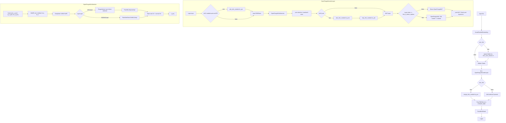
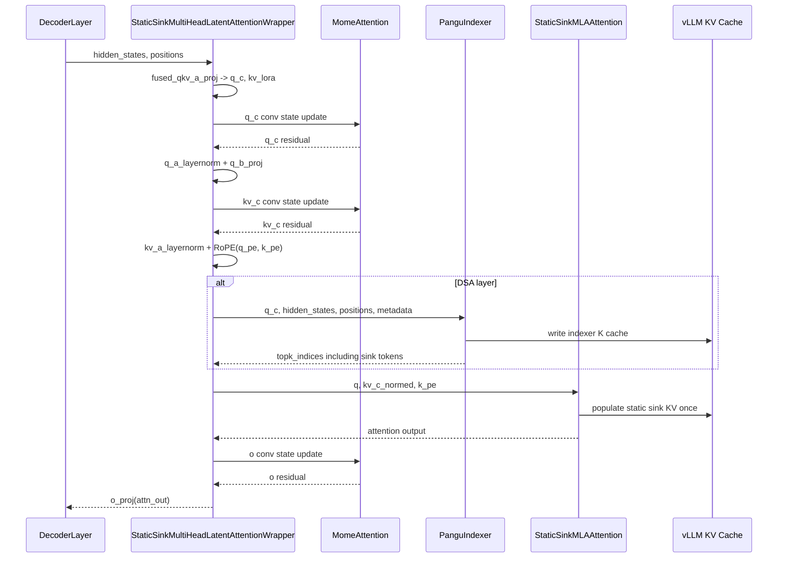

# Pangu 92B DSA 模型适配设计文档

本文档说明 `/home/huting/models/92B_DSA_iter_0000180` 模型在 vLLM 中的适配设计。内容基于当前 `/home/huting/vllm` 工作区中的未提交修改整理，重点覆盖模型架构、推理数据流、KV cache 管理、Static Sink MLA、DSA sparse attention、MoME、mHC、MoE 与权重加载等适配点。

## 模型概览

模型入口为 `PanguUltraMoEForCausalLM`，HF 配置中的 `architectures` 为 `["PanguUltraMoEForCausalLM"]`，`model_type` 为 `pangu_ultra_moe`。该模型是 decoder-only MoE 语言模型，主体由 46 个 decoder layer 组成，并启用了 MLA、DSA sparse attention、static sink token、MoME 卷积状态、mHC 多流混合、sandwich norm 和 block-level post layernorm。

关键结构参数如下：

| 项目 | 配置值 |
| --- | --- |
| hidden size | 2560 |
| layer 数 | 46 |
| attention heads | 48 |
| q LoRA rank | 1024 |
| KV LoRA rank | 512 |
| qk nope / rope dim | 128 / 64 |
| value head dim | 128 |
| vocab size | 151552 |
| max position embeddings | 524288 |
| dtype | bfloat16 |
| MoE routed experts | 256 |
| shared experts | 1 |
| top-k experts per token | 8 |
| MoE intermediate size | 1024 |
| dense FFN 前置层数 | 2 |
| static sink token 数 | 128 |
| DSA top-k token 数 | 2048，加上 sink 后为 2176 |
| DSA indexer heads / dim | 24 / 128 |
| MoME kernel size | `router_sliding_window = 3` |
| mHC streams | 4 |
| MTP layer 数 | 3 |

主模型 layer 的 attention 类型由配置中的 `dsa_layers` 和 `swa_layers` 控制：

- DSA sparse MLA 层：`0, 3, 6, ..., 45`，共 16 层。
- Sliding-window MLA 层：配置中的 `swa_layers` 覆盖其余层，窗口主要为 512，列表末尾存在 2048 窗口配置。
- Static sink token 全局开启：每个 MLA attention 额外持有 128 个可学习 sink KV。

## 模型架构图



## 单层推理数据流

`OpenPanguMLAAttention` 将 Pangu 的 MLA 结构拆成 projection、RoPE、可选 indexer、attention backend 和 output projection：



## vLLM 适配特性

### 1. Pangu 模型结构适配

主要修改位于 `vllm/model_executor/models/openpangu.py`。

当前实现将原有 OpenPangu 模型扩展为能够加载和运行 92B DSA 变体：

- `OpenPanguMLAAttention` 支持 Pangu MLA 参数：`q_lora_rank`、`kv_lora_rank`、`qk_nope_head_dim`、`qk_rope_head_dim`、`v_head_dim`。
- MLA projection 使用 fused Q/KV A projection：`fused_qkv_a_proj` 合并 checkpoint 中的 `q_a_proj` 与 `kv_a_proj_with_mqa`。
- RoPE 使用 DeepSeek-YARN 参数，并根据 `rope_interleaved` 设置 `is_neox_style`。
- 按 layer index 判断 DSA 与 SWA：
  - `dsa_layers` 命中时创建 `PanguIndexer` 并走 sparse MLA。
  - `swa_layers` 命中时从 `sliding_window_list` 取对应窗口。
- 当 `param_sink_number > 0` 时，MLA attention 切换到 `StaticSinkMultiHeadLatentAttentionWrapper`。
- 当 `use_mome` 开启时，在 q LoRA、KV LoRA 和 attention output 三个位置插入 `MomeAttention` 残差。
- 当 `use_mhc` 开启时，decoder layer 使用 `forward_mhc`，在 attention 和 MLP 前后执行多流合并与恢复。

`OpenPanguMoE` 使用 `SharedFusedMoE` 承载 routed experts 和 shared experts：

- routed experts 数为 256，token 级 top-k 为 8。
- scoring 使用 `sigmoid`，并支持 `e_score_correction_bias`。
- shared expert 使用普通 `OpenPanguMLP`，与 routed expert 输出相加。
- `first_k_dense_replace = 2`，前两层是 dense MLP，后续层为 MoE。

### 2. Static Sink MLA 适配

Static Sink 相关逻辑主要分布在：

- `vllm/model_executor/layers/attention/static_sink_attention.py`
- `vllm/model_executor/layers/mla.py`
- `vllm/v1/attention/backends/mla/flashattn_mla.py`

适配目标是让每个请求在正常 token KV 之前额外看到固定的 128 个 sink token。实现上分为三层：

1. KV cache 预填充  
   `StaticSinkMLAAttention.populate_sink_kv()` 使用 `ops.concat_and_cache_mla` 将 `param_sink_compressed_kv` 与 `param_sink_k_pe` 写入 KV cache 中的固定 block。`maybe_populate_sink` 是注册到 `torch.ops.vllm` 的 custom op，保证每层 sink KV 只写一次。

2. metadata 改写  
   `create_static_sink_attention_backend()` 对底层 attention backend 包一层 StaticSink builder。builder 会在 block table 前拼接 sink block，同时把非空请求的 `seq_lens` 和 `max_seq_len` 加上 `sink_len`。这样 backend 看到的是“sink + 正常上下文”的逻辑序列。

3. attention 计算  
   `FlashAttnStaticSinkMLAImpl` 对 full-context 和 sliding-window 做了不同处理：
   - full-context prefill：直接把 sink KV 插入每个 request 的序列起点，再调用原 MLA prefill。
   - sliding-window prefill/decode：分别计算 sink attention 和 no-sink window attention，再用 `merge_attn_states` 按 LSE 合并两个 attention 状态，避免 sink token 被 sliding window 裁掉。

这种设计保留了 vLLM 的 paged KV cache 和 FlashAttention MLA 路径，同时显式维护 sink token 的“全局可见”语义。

### 3. DSA Sparse Attention 与 PanguIndexer

DSA 相关核心代码位于：

- `vllm/model_executor/models/openpangu.py`
- `vllm/v1/attention/backends/mla/flashmla_sparse.py`
- `vllm/model_executor/layers/attention/static_sink_attention.py`

`PanguIndexer` 是 DSA sparse attention 的 token 选择器，工作流程如下：

1. 从 q LoRA 表示 `q_c` 生成 indexer query，维度为 `index_n_heads x index_head_dim`。
2. 从 hidden states 生成 indexer key，并对 key 做 RMSNorm。
3. 对 query/key 的 RoPE 部分应用独立的 `indexer_rope_emb`。
4. 生成每个 index head 的权重 `weights`。
5. 将当前 token 的 indexer key 写入单独的 indexer KV cache。
6. 根据 block table 取历史 key，计算 top-k token，下发给 sparse MLA backend。

为了兼容 static sink，`topk_tokens` 被扩展为 `index_topk + sink_len`。top-k 输出前 `sink_len` 个位置固定填入 sink token 索引，其余位置为普通上下文 token 的稀疏选择结果。

实现中注册了 `torch.ops.vllm.pangu_sparse_attn_indexer`：

- 在 dict metadata 场景中读取当前 attention layer 的 metadata。
- 使用 `slot_mapping` 将 indexer key 写入 composite KV cache。
- 通过 `req_id_per_token` 或 `query_start_loc` 将 token 映射到 request。
- 对每个 token 的候选历史 key 做打分并取 top-k。
- 提供 fake impl，以便 torch compile / dummy run 通过。

`flashmla_sparse.py` 的适配包括：

- metadata 增加 `seq_lens`。
- sparse backend 中 KV cache reshape 改为 `reshape`，适应 composite/padded KV cache。
- head padding 逻辑从固定 padding 改为向上对齐到 backend 要求的倍数。

### 4. Composite KV Cache 与 Hybrid KV 管理

92B DSA 同时使用 MLA KV、DSA indexer KV、MoME state 和 static sink KV。单一 KV cache page 必须能承载这些不同形态的状态，因此本次修改扩展了 vLLM v1 的 KV cache spec 和 manager。

#### Attention type 与 KV type 映射

Pangu 92B 的每个 decoder layer 都有 MLA attention，同时每层还额外带一个 MoME 状态模块。因此从 vLLM KV 管理视角看，一个模型层可能贡献不止一种 KV/state spec：

| 模型特性 | 触发条件 | 计算路径 | KV/state spec | 管理器 |
| --- | --- | --- | --- | --- |
| DSA sparse MLA | layer index 在 `dsa_layers` 中 | `PanguIndexer` + `FlashMLASparseImpl` | `SinkDSAAttentionSpec` | `SinkFullAttentionManager` |
| SWA MLA | layer index 在 `swa_layers` 中 | `FlashAttnStaticSinkMLAImpl` + sliding window | `SinkMLASlidingWindowSpec` | `SinkSlidingWindowManager` |
| MoME | `use_mome=True` | q/kv/o 三组 depthwise conv state | `MomeSpec` | `MomeManager` |

三类 spec 的 token 保留策略不同：

- DSA 层按 full-attention 语义保留历史 token，因为 sparse attention 的候选集合可以来自长上下文。
- SWA 层只需要保留 sliding window 覆盖的最近 token，但 static sink token 必须常驻。
- MoME 不保存 attention KV，而是保存每个 request 的卷积状态；当前实现不参与 prefix cache 共享。

这三类状态通过 hybrid KV 架构共存的关键约束是：不同 KV group 可以有不同的 block table 和释放策略，但底层 block pool 的物理 page size 必须一致。否则同一个 block pool 需要同时管理不同大小的 block，会造成碎片化和复杂的 allocator 逻辑。

#### Page padding 方案

当前实现选择把所有 Pangu KV/state page padding 到同一个 `target_page_size`。按 bf16 计算：

```text
MLA token bytes = (kv_lora_rank + qk_rope_head_dim) * dtype_size
                = (512 + 64) * 2 = 1152 bytes/token

DSA token bytes = (kv_lora_rank + qk_rope_head_dim + index_head_dim) * dtype_size
                = (512 + 64 + 128) * 2 = 1408 bytes/token

target_page_size = block_size * max(MLA token bytes, DSA token bytes)
```

`PanguUltraMoEForCausalLMConfig.verify_and_update_config()` 会根据 MLA backend 的 block 对齐要求调整 `cache_config.block_size`。当前 CUDA MLA 路径下对齐粒度通常为 64，所以在默认场景中：

```text
block_size = 64
target_page_size = 64 * 1408 = 90112 bytes
```

这个值会写入 `cache_config.mamba_page_size_padded`，随后被 `StaticSinkMLAAttention.get_kv_cache_spec()` 和 `MomeAttention.get_kv_cache_spec()` 用作 `page_size_padded`。结果是：

| KV/state type | 真实 page 内容 | 真实 page bytes | padding 后 page bytes | padding 目的 |
| --- | --- | ---: | ---: | --- |
| DSA composite KV | MLA KV + indexer K | 90112 | 90112 | 已是最大 page，无需额外 padding |
| SWA/普通 MLA KV | `kv_c + k_pe` | 73728 | 90112 | 与 DSA/MoME page 对齐 |
| MoME state | q state + kv state + o state，保留 `kernel_size - 1` 个 token | 15360 | 90112 | 与 attention KV page 对齐 |

这里 MoME 真实 page 按当前模型 `router_sliding_window=3`、无 speculative token 估算：

```text
MoME real bytes = (kernel_size - 1) * (q_lora_rank + kv_lora_rank + num_heads * v_head_dim) * 2
                = 2 * (1024 + 512 + 48 * 128) * 2
                = 15360 bytes
```

Padding 的直接原因是统一 block pool 的分配单位。DSA composite KV 的 page 最大，因为它不仅要放 MLA 的 `kv_c + k_pe`，还要在同一 raw page 中额外切出 indexer K cache。`StaticSinkMLAAttention.reshape_kv_cache()` 会把同一段 raw tensor 拆成两个 view：

```text
raw page
|---------------- MLA cache: block_size * (kv_lora_rank + qk_rope_head_dim) ----------------|
|---------- indexer cache: block_size * index_head_dim ----------|
```

`bind_kv_cache()` 再把 `(mla_cache, indexer_cache)` 分别绑定到 attention layer 和 `PanguIndexer`。这样 DSA sparse attention 不需要单独申请第二套 block pool。

#### padding 后的 spec merge

新增或扩展的 spec 位于 `vllm/v1/kv_cache_interface.py`：

- `MomeSpec`：描述 MoME 的 3 组卷积状态，分别对应 q、kv、o。
- `DSAAttentionSpec`：描述 MLA KV 与 indexer KV 共用 page 的 composite DSA cache。
- `SinkDSAAttentionSpec`：在 DSA composite cache 上增加 static sink 长度。
- `SinkMLAAttentionSpec`：普通 MLA + sink。
- `MLASlidingWindowSpec`：MLA sliding-window KV。
- `SinkMLASlidingWindowSpec`：MLA sliding-window + sink。

Hybrid KV grouping 会先按 spec 是否可 merge 判断组内兼容性。Pangu 相关 merge 规则如下：

- `SinkDSAAttentionSpec.merge()` 要求组内都是 DSA spec，且 `cache_dtype_str`、`indexer_head_size`、`sink_len` 一致。
- `SinkMLASlidingWindowSpec.merge()` 要求组内都是 MLA sliding-window spec，且 `cache_dtype_str`、`sliding_window`、`sink_len` 一致。
- `MomeSpec` 走 Mamba/MoME 同类型 merge，要求 shape、dtype、speculative block 等状态布局一致。

为了让 SWA 层可以 merge，配置校验时会把 `sliding_window_list` 中的最大值保存到 `hf_config.max_sliding_window`。`StaticSinkMLAAttention.get_kv_cache_spec()` 上报给 KV manager 的 sliding window 使用这个最大值，而每层真实 attention 计算仍使用自己的 `sliding_window`。这样做的含义是：

- KV manager 统一按最大窗口管理 SWA KV group，避免 512 和 2048 窗口被拆成更多小 group。
- 小窗口层会多保留一部分 KV cache，但 attention kernel 仍按小窗口计算，不改变模型语义。
- 这是用少量 KV 冗余换取更少的 KV group 和更简单的 block table。

`PanguUltraMoEForCausalLMConfig.verify_and_update_config()` 负责在模型加载前对齐 cache 形状：

- 读取 `sliding_window_list`，保存最大窗口到 `hf_config.max_sliding_window`，用于 KV group 对齐。
- 计算 MLA 单 token page size：`(kv_lora_rank + qk_rope_head_dim) * dtype_size`。
- 计算 DSA 单 token page size：`(kv_lora_rank + qk_rope_head_dim + index_head_dim) * dtype_size`。
- 计算 MoME page size，并保证 attention block page 能覆盖 MoME state page。
- 根据 MLA backend 对齐约束调整 `cache_config.block_size`。
- 设置 `cache_config.mamba_page_size_padded`，使 MLA/DSA/MoME 的 page size 可以统一分组。

#### KV group 划分

vLLM 的 group 划分入口是 `get_kv_cache_groups()`。当模型不是单一 spec 时，它会：

1. 确认所有 spec 的 `page_size_bytes` 已一致；Pangu 通过 `page_size_padded` 提前满足这一点。
2. 按完全相同的 spec 聚类，例如 DSA、SWA、MoME 会分到不同 type bucket。
3. 取所有 bucket 中最小的 layer 数作为 `group_size`。
4. 每个 bucket 按 `group_size` 切成一个或多个 KV group，最后不足的位置作为 padding layer。

按当前 46 层主模型估算：

| KV/state bucket | 数量 | group_size=16 时的 KV group |
| --- | ---: | --- |
| DSA `SinkDSAAttentionSpec` | 16 | 1 个 group，每组 16 层 |
| SWA `SinkMLASlidingWindowSpec` | 30 | 2 个 group，每组约 15 层，隐式 padding 2 个 layer slot |
| MoME `MomeSpec` | 46 | 3 个 group，每组约 16/15/15 层，隐式 padding 2 个 layer slot |

因此 Pangu 92B 主模型大致会形成 6 个 KV group：1 个 DSA group、2 个 SWA group、3 个 MoME group。物理 KV tensor 数量等于 `group_size`，也就是 16 个；每个 tensor 会被来自不同 KV group 的同一相对位置 layer 共享。不同 group 仍然有各自的 block table，所以 DSA、SWA、MoME 可以独立决定某个 request 需要多少 block。

```text
KV tensor 0: DSA group layer 0 + SWA group 0 layer 0 + SWA group 1 layer 0 + MoME group 0/1/2 layer 0
KV tensor 1: DSA group layer 1 + SWA group 0 layer 1 + SWA group 1 layer 1 + MoME group 0/1/2 layer 1
...
KV tensor 15: DSA group layer 15 + MoME group 0 layer 15 + padding slots
```

这个布局的好处是 block pool 只需要一种 page size，scheduler 只需要处理一套全局 block id；代价是 page 内 padding 和 group slot padding。

#### 显存浪费估算

显存浪费主要来自两部分。

第一部分是 page padding。以 `block_size=64`、bf16 为例：

| KV/state type | 真实 page bytes | padding 后 page bytes | 单 page 额外开销 |
| --- | ---: | ---: | ---: |
| DSA composite KV | 90112 | 90112 | 0% |
| SWA/普通 MLA KV | 73728 | 90112 | 22.22% |
| MoME state | 15360 | 90112 | 486.67% |

MoME 的百分比看起来很高，是因为 MoME state 本身很小，但为了能和 attention KV 共用 block pool，需要 padding 到 DSA page 大小。绝对值上每个 MoME page 额外约 73.0 KiB。

第二部分是 group slot padding。当前 bucket 数量为 16、30、46，`group_size=16` 后容量为：

```text
DSA: 1 * 16 = 16 slots，实际 16，无 padding
SWA: 2 * 16 = 32 slots，实际 30，padding 2
MoME: 3 * 16 = 48 slots，实际 46，padding 2

总 slot: 96
实际 spec: 92
group slot padding: 4 / 96 = 4.17% allocated slots
```

如果用一个保守口径，把所有 KV/state spec 都假设分配相同数量的 blocks，那么 page padding + group slot padding 后的容量与“完全按真实 page 单独分配”的理论下界相比大约是：

```text
理论真实容量 = 16 * 90112 + 30 * 73728 + 46 * 15360 = 4360192 bytes/block-index
padding 后容量 = 96 * 90112 = 8650752 bytes/block-index
额外开销约 = 98.4%
```

这个 98.4% 是上界式估算，用来说明统一 page 的代价，并不等同于线上每个 request 的实际浪费。真实运行中：

- SWA group 只为窗口内 token 分配 block，长上下文下不会像 DSA 一样保留全量历史。
- MoME 使用自己的 manager，不参与 prefix cache，实际 block 生命周期与 attention KV 不同。
- block pool 是全局共享的，不同 group 消耗的是同一批 block id 资源，实际显存压力取决于请求长度、batch、`max_num_batched_tokens`、prefix cache 命中和 sliding window 回收情况。

因此更实用的判断是：Pangu 当前方案用 page padding 换取了统一 allocator、composite DSA cache 和多 KV type 共存；其中 SWA 的开销相对温和，MoME 的 page padding 比例最高，但 MoME state 的 block 数和生命周期与长上下文 full KV 不完全相同。

运行时还有两处关键适配：

- `GPUModelRunner` 支持 attention backend 暴露 `reshape_kv_cache()`。对于 composite DSA cache，`StaticSinkMLAAttention` 返回 `(mla_cache, indexer_cache)` 两个 view。
- `bind_kv_cache()` 识别二元 tuple，将 `mla_cache` 绑定给 attention layer，将 `indexer_cache` 绑定给 `PanguIndexer`。

### 5. MoME 卷积状态适配

MoME 适配集中在：

- `MomeAttention` custom op
- `vllm/v1/attention/backends/mome_attn.py`
- `MomeSpec` / `MomeManager`
- `MAMBA_TYPE_TO_BACKEND_MAP`

`MomeAttention` 继承 `MambaBase`，复用 vLLM 对“每请求持久状态”的管理框架，但其内部是三组 depthwise Conv1d：

- `qa_conv`：作用在 q LoRA rank 表示上。
- `compresskv_conv`：作用在 KV LoRA rank 表示上。
- `o_conv`：作用在 attention output 上。

每组 state 的长度为 `kernel_size - 1 + num_spec_tokens`。当前模型 `router_sliding_window = 3`，因此普通推理时每个请求需要保留最近 2 个 token 的 q/kv/o 状态；开启 speculative decode 时会额外考虑 speculative token 数。

`MomeManager` 禁用 prefix cache 共享，并通过 `get_num_skipped_tokens()` 保留卷积所需的最近 token 状态。`mome_attn.py` 提供最小 backend/metadata builder，使 MoME state 能进入 vLLM v1 attention metadata 管线。

### 6. mHC 多流混合适配

`mHCModule` 是本次为 Pangu 92B 增加的多流 hidden-state 混合模块。模型输入 embedding 在 `use_mhc=True` 时被复制为 4 个 stream，decoder layer 中 attention 与 MLP 前后分别执行：

- `hc_pre`：根据 `phi` 产生 stream 权重，将 4 路 hidden 合并到单路 hidden 后送入 attention 或 MLP。
- `hc_post`：用 `h_post` 和 `h_res` 将模块输出重新分配回多流 residual。
- `sinkhorn_knopps`：对 residual mixing 矩阵做 Sinkhorn 归一化。

最后一层后，`merge_mhc_module.hc_pre` 将多流 hidden 合并回 `hidden_size=2560`，再进入最终 RMSNorm 与 lm head。

### 7. 权重加载与 post-load 初始化

为了匹配 checkpoint 命名和 vLLM 模块命名，`OpenPanguModel.load_weights()` 做了如下映射：

- `q_a_proj` 和 `kv_a_proj_with_mqa` 合并加载到 `fused_qkv_a_proj`。
- `gate_proj` 和 `up_proj` 合并加载到 `gate_up_proj`。
- expert 权重通过 `SharedFusedMoE.make_expert_params_mapping()` 加载到 fused expert 参数。
- `e_score_correction_bias` 映射到 `gate.e_score_correction_bias`。
- `qa_conv.weight`、`compresskv_conv.weight`、`o_conv.weight` 映射到 `self_attn.mome_attn.*`。
- 主模型加载时跳过 MTP 层权重，避免把 speculative decode 层加载进主干 46 层。

权重加载完成后，`post_weight_load()` 遍历子模块。对于 static sink MLA，会先对 `param_sink_compressed_kv` 走 `kv_a_layernorm`，再调用 `update_sink_kv()` 写入 attention impl 缓存，确保 dummy run 和真实推理都能拿到 sink KV。

### 8. Speculative / MTP 与架构配置转换

相关修改位于：

- `vllm/config/speculative.py`
- `vllm/transformers_utils/model_arch_config_convertor.py`

本次适配增加了 `openpangu_mtp` 类型：

- 当 `hf_config.model_type == "openpangu_v2"` 时转换为 `openpangu_mtp`。
- 根据 `num_nextn_predict_layers` 设置 `n_predict`。
- 将 speculative architecture 设置为 `OpenPanguMTPModel`。
- `OpenpanguMTPModelArchConfigConvertor` 返回 MTP 层数，用于模型架构配置转换。

当前 92B 配置中 `num_nextn_predict_layers = 3`，主模型加载路径会跳过这些 MTP 层权重，speculative 路径单独处理。

### 9. 编译与 custom op 白名单

`vllm/config/compilation.py` 将 `vllm::pangu_sparse_attn_indexer` 加入 compilation static op 白名单，避免 torch compile 误处理带副作用的 indexer op。该 op 会修改 indexer KV cache 与 top-k buffer，因此必须明确登记 mutating arguments。

## 主要修改文件清单

| 文件 | 作用 |
| --- | --- |
| `vllm/model_executor/models/openpangu.py` | Pangu 92B 主模型、MLA/DSA/MoME/mHC/MoE、权重加载适配 |
| `vllm/model_executor/layers/mla.py` | 增加 `StaticSinkMultiHeadLatentAttentionWrapper`，接入 MoME 和 DSA indexer |
| `vllm/model_executor/layers/attention/static_sink_attention.py` | Static sink backend wrapper、sink KV populate、StaticSinkMLAAttention、composite KV reshape |
| `vllm/v1/attention/backends/mla/flashattn_mla.py` | FlashAttention MLA 支持 sliding window 和 static sink 状态合并 |
| `vllm/v1/attention/backends/mla/flashmla_sparse.py` | Sparse MLA metadata 与 head padding 适配 |
| `vllm/v1/attention/backends/mome_attn.py` | MoME backend/metadata builder |
| `vllm/v1/kv_cache_interface.py` | 新增 DSA、sink MLA、MoME 等 KV cache spec |
| `vllm/v1/core/single_type_kv_cache_manager.py` | 新增 MoME manager、sink sliding-window manager，并扩展 manager map |
| `vllm/v1/worker/gpu_model_runner.py` | 支持 backend 自定义 KV cache reshape |
| `vllm/v1/worker/utils.py` | 支持 composite KV cache 绑定到 attention/indexer |
| `vllm/model_executor/models/config.py` | Pangu 模型 KV page/block size 对齐策略 |
| `vllm/config/speculative.py` | openpangu MTP speculative 配置 |
| `vllm/transformers_utils/model_arch_config_convertor.py` | openpangu MTP 架构转换 |
| `vllm/config/compilation.py` | Pangu indexer custom op 白名单 |

## 设计要点总结

本次适配的核心是把 Pangu 92B 的“混合注意力 + 混合状态”结构映射到 vLLM v1 的统一调度和 KV cache 管线中：

- MLA 是 attention 主体，static sink token 作为每层固定前缀写入 KV cache。
- DSA 层使用 `PanguIndexer` 为 sparse MLA 选择历史 token，同时将 sink token 固定加入 top-k。
- SWA 层保留 sliding-window 局部上下文，但通过双 attention + LSE merge 保证 sink token 始终可见。
- MoME 复用 Mamba 状态管理框架保存 q/kv/o 三组卷积状态。
- mHC 在模型维度上引入 4-stream hidden 混合，最终再合并回普通 hidden size。
- Hybrid KV spec/page 对齐把 MLA、DSA indexer、MoME 和 sink KV 放进可统一管理的 cache group，减少对 vLLM 调度器和 block manager 的侵入。
