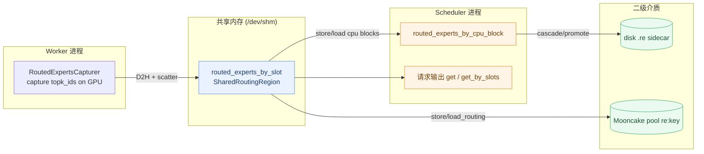
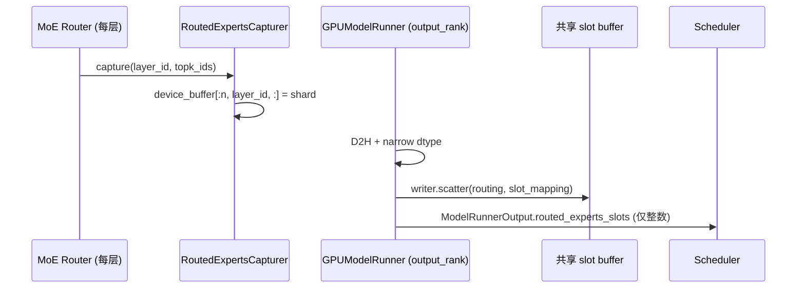
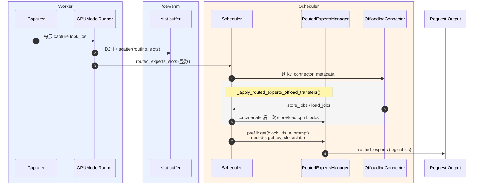
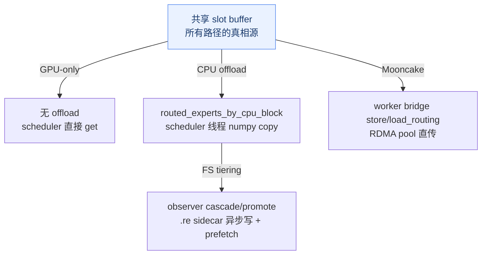

# enable_return_routed_experts + KV Offload 设计说明

## 1. 背景和目标

`enable_return_routed_experts` 的目标是：请求返回时，附带每个 token 在每一层 MoE 中被 router 选中的 logical expert ids。verl 等 RL 训练框架用它做 **routing replay**（训练侧重放 rollout 时的 expert 选择）。

不开 KV offload 时，逻辑相对直接：

1. worker 在 forward 中捕获每层 MoE router 的 `topk_ids`（GPU 上）。
2. `output_rank` worker 把捕获结果 D2H 后，**直接 scatter 写入一块 scheduler/worker 共享的 `/dev/shm` slot buffer**。
3. worker 只把 per-token 的 `slot_mapping`（整数数组，不含 routing payload）通过 `ModelRunnerOutput.routed_experts_slots` 返回 scheduler。
4. 请求完成时，scheduler 按请求的 KV block ids 从共享 slot buffer 读回 routing 并返回。

> 关键设计：routing payload 不跨进程序列化。worker 写共享内存，scheduler 读共享内存，IPC 只传 slot 整数。

开启 KV offload 后，被 store 到二级介质（CPU / disk / Mooncake pool）的 token，后续 load 回来时不会重新跑 forward，因此它们的 routing 也必须跟 KV block 一起保存和恢复。本设计让 routing **复用 KV offload 的生命周期作为 transport**，覆盖四条路径：

- **GPU-only**（无 connector）
- **CPU offload**（`OffloadingConnector` + `CPUOffloadingSpec`）
- **FS / disk tiering**（`TieringOffloadingSpec` + secondary tiers）
- **Mooncake direct**（`MooncakeStoreConnector`，GPU↔RDMA pool 直传）

支持任意 `block_size_factor >= 1`。

## 2. 一句话设计

routing 按**物理 KV slot** 索引（`slot = block_id * block_size + offset`），所以它天然跟随 KV cache 的生命周期；每条 offload 路径只需在 KV block 搬运时同步搬运对应的 routing row。

```text
共享 slot buffer (/dev/shm)   <->  routed_experts_by_slot   (所有路径的主 buffer)
CPU offload block             <->  routed_experts_by_cpu_block  (CPU/FS 路径)
Mooncake RDMA pool key "re:k" <->  slot buffer 的 block row     (Mooncake 路径)
```

最终请求输出**始终**从 slot buffer 读（`get` / `get_by_slots`）。二级 buffer / 远程 pool 只是为了让 routing 随 KV offload 保存和恢复。



## 3. 支持范围

### 3.1 支持矩阵

| 场景 | 状态 | 说明 |
| --- | --- | --- |
| Full-attention MoE | 支持 | 基础路径 |
| MLA / DSA / DeepSeek-V4 | 支持 | `MLA_ATTENTION` / `SINK_FULL_ATTENTION` 都算 full-attention anchor |
| Hybrid attention | 支持（anchor-only） | 只跟随第一个 full-attention group；其余 group 的 routing 不 offload，多 group 时 `warning_once` |
| TP + SP | 支持 | capturer 处理 SP all-gather |
| DP + EP | 每个 DP rank 独立支持 | 每 DP rank 独立 slot buffer（`/dev/shm` 路径按 dp_rank 区分）；不支持跨 DP migration |
| **CPU offload** | 支持 | `OffloadingConnector` + `CPUOffloadingSpec` |
| **FS / disk tiering** | 支持 | `TieringOffloadingSpec` + `RoutedExpertsBlockLifecycleObserver` + `RoutedExpertsSecondaryStore` |
| **Mooncake direct** | 支持 | `MooncakeStoreConnector`，worker 侧 bridge 直传 RDMA pool |
| **`block_size_factor > 1`** | 支持 | `compute_full_attn_block_map` 做 sub-block offset 计算 |
| Pipeline parallelism (PP > 1) | **不支持** | `config/vllm.py` 校验时 raise |
| Context parallelism (DCP / PCP > 1) | **不支持** | scheduler `__init__` 中 assert 拦截（slot 空间会跨 CP rank 交错 alias） |

### 3.2 为什么 routing 按物理 slot 索引

`routed_experts_by_slot[block_id * block_size + offset]` 把 routing 绑定到**物理 KV block**，而非 virtual token。好处：

- prefix-cache 命中时，复用的物理 block 直接 re-expose 相同的 slot → 不需要额外簿记，routing 自动正确。
- routing 是 token 内容（+ 权重）的确定性函数，所以同内容 prefix 的 slot 持有的 routing 对命中方也是正确的。
- 被 evict / reuse 的 stale row 不需要清零：只有 connector 实际 load 的 block ids 才会被读，reuse 时下一次 store 覆盖。

### 3.3 `block_size_factor > 1` 如何支持

当 `factor > 1` 时，一个 offload block 打包多个 GPU block：

```text
CPU offload block 10
  sub-block 0 <-> GPU block 40
  sub-block 1 <-> GPU block 41
  ...
```

`compute_full_attn_block_map()` 复用与 worker KV copy（`kv_offload/cpu/gpu_worker.py`）**字节一致**的 sub-block 算术：根据 `block_indices[g] % factor` 计算首块对齐 skip，per-group offload block 数为 `cdiv(group_size + skip, factor)`。`factor == 1` 退化为 1:1（skip=0, sub=0）。

## 4. 核心组件

| 组件 | 文件 | 职责 |
| --- | --- | --- |
| `RoutedExpertsCapturer` | `routed_experts_capture/capturer.py` | worker GPU 侧捕获每层 router `topk_ids` 到 device buffer |
| `RoutedExpertsWorkerWriter` | `routed_experts_capture/shared_region.py` | worker 侧 attach 共享 slot buffer，`scatter` 写入本 step routing |
| `SharedRoutingRegion` | `routed_experts_capture/shared_region.py` | scheduler 侧创建的 `/dev/shm` MAP_SHARED slot buffer |
| `RoutedExpertsManager` | `routed_experts_capture/manager.py` | scheduler 侧：拥有 slot buffer + offload buffer，store/load/get |
| `require_full_attention_gid()` | `routed_experts_capture/common.py` | 单一 gate：选 anchor full-attn group，无则 raise，多则 warn |
| `routing_slot_shape_dtype()` | `common.py` | slot buffer `(shape, dtype)` 单一真相源（worker/scheduler 必须一致） |
| `routed_experts_output_rank()` | `common.py` | 哪个全局 rank 的 `ModelRunnerOutput` 到达 scheduler（即唯一 slot writer） |
| `compute_full_attn_block_map()` | `manager.py` | 把一个 transfer job 切到 anchor group，算 sub-block 映射 + 契约校验 |
| `FullAttnBlockMap` | `manager.py` | NamedTuple `(gpu_block_ids, cpu_block_ids, sub_offsets)`；`concatenate` 合并多 job |
| `_apply_routed_experts_offload_transfers()` | `scheduler.py` | 消费 KV load/store jobs，批量同步 routing |
| `_full_attn_block_map()` | `scheduler.py` | scheduler↔KV transfer spec 的适配器，delegate 到 `compute_full_attn_block_map` |
| `RoutedExpertsSecondaryStore` | `store/base.py` | 二级 tier 后端接口（`persist`/`restore`/`prefetch`） |
| `RoutedExpertsStoreFactory` | `store/base.py` | tier `type` → 懒加载 builder 注册表 |
| `RoutedExpertsBlockLifecycleObserver` | `store/observer.py` | 把 KV cascade/promotion 事件桥接到二级 store |
| `FileRoutedExpertsStore` | `store/fs.py` | 内置 `fs` 后端：每 block 一个 `.re` sidecar，异步写 + prefetch |
| `RoutedExpertsMooncakeBridge` | `mooncake_bridge.py` | worker 侧：routing row 随 KV PUT/GET 直传 Mooncake pool |

## 5. 进程视角

### 5.1 Worker 进程

1. forward 中每层 router 调 `capture(layer_id, topk_ids)`，写入 GPU device buffer（int32，匹配 router native dtype）。
2. forward 结束，`output_rank` worker 把 device buffer D2H 到 pinned CPU buffer，narrow 成 slot dtype（uint8/uint16）。
3. `RoutedExpertsWorkerWriter.scatter(routing_data, slot_mapping)` 写入共享 slot buffer。
4. `ModelRunnerOutput.routed_experts_slots = slot_mapping`（只传整数）。

worker 不持久化 offload metadata。



### 5.2 Scheduler 进程

scheduler 拥有：

1. `routed_experts_by_slot`：共享 slot buffer（`/dev/shm`，scheduler 创建、worker attach、scheduler 是唯一 unlinker）。
2. `routed_experts_by_cpu_block`：CPU offload buffer，shape `(num_offload_blocks, factor, block_size, layers, top_k)`（仅 CPU/FS 路径）。

scheduler 在 `update_from_output()` 中：

1. 拿到本 step 的 `routing_slots` / `routing_offsets`（worker 返回的整数）。
2. 若有 KV offload，调 `_apply_routed_experts_offload_transfers()` 同步 routing（store/load）。
3. per-request 输出：prefill 完成读全 prompt（`get`），decode 读本 step 新 token（`get_by_slots`）。

> scheduler **不** scatter routing —— 那是 worker 的活。`store_batch()` 仍存在但仅供单测使用。

## 6. Workflow：从 forward 到返回



### Step 1：选 anchor full-attention group

worker 和 scheduler 必须用同一个 group，否则 slot 错位。共用单一 gate：

```python
def require_full_attention_gid(kv_cache_config) -> int:
    full_attn_gids = [gid for gid, g in enumerate(kv_cache_config.kv_cache_groups)
                      if get_kv_cache_spec_kind(g.kv_cache_spec) in _FULL_ATTENTION_KINDS]
    if not full_attn_gids:
        raise ValueError("... requires at least one full-attention KV cache group ...")
    if len(full_attn_gids) > 1:
        logger.warning_once("... anchoring on group %d only ...", full_attn_gids[0])
    return full_attn_gids[0]
```

`_FULL_ATTENTION_KINDS = {FULL_ATTENTION, MLA_ATTENTION, SINK_FULL_ATTENTION}`。worker 侧 `_get_attention_kv_cache_gid()`、scheduler 侧 `RoutedExpertsManager.__init__` 和 `routing_slot_shape_dtype()` 都走它。

### Step 2：worker 捕获（capture）

`capture()` 把当前层本 DP rank 的 routing 写入 device buffer。DP 下 `topk_ids` 有三种 batch layout，分别处理：

- **naive dispatch**：所有 DP rank token 拼接，本 rank 取 `[end-token_num_per_dp, end)`。
- **modular-kernel**：DP combine 在 `quant_method.apply` 内，本 rank 只见自己的 token，取全量。
- **SP + modular-kernel**：每 TP rank 持 dim=0 shard，`get_tp_group().all_gather(dim=0)` 还原后取前 `token_num_per_dp` 行。

捕获的是 **logical** expert ids（在 EPLB logical→physical mapping 之前，`base_router.py` 的 `capture_fn` 调用点）。

### Step 3：D2H + scatter

```python
# sync 路径 (gpu_model_runner)
self.routed_experts_cpu[:total].copy_(buf[:total], non_blocking=True)
...
writer.scatter(routing_data, slot_mapping)        # 写 /dev/shm
output.routed_experts_slots = slot_mapping        # 只回传整数
```

`scatter` 对连续 slot run（单请求 prefill chunk 常见）走 slice 快速路径（顺序 memcpy），否则 fancy fallback；O(1) span 预检 gate O(n) 确认。

### Step 4：offload 同步（仅 CPU/FS 路径）

```python
def _apply_routed_experts_offload_transfers(self, scheduler_output):
    if self.routed_experts_mgr.routed_experts_by_cpu_block is None:
        return  # Mooncake direct 无 scheduler 侧 offload buffer

    load_maps = [self._full_attn_block_map(dst, src)
                 for job in meta.load_jobs.values() ...]   # CPU->GPU
    self.routed_experts_mgr.load_from_offload_blocks(
        FullAttnBlockMap.concatenate(load_maps))

    store_maps = [...]                                     # GPU->CPU
    self.routed_experts_mgr.store_to_offload_blocks(
        FullAttnBlockMap.concatenate(store_maps))
```

**批量化**：一个 step 的所有 job 拼成一次 fancy-index（而非 per-job 一次 numpy 调用），消除 per-job 固定开销。空 map 过滤。

### Step 5：group-major flat order 切片

`compute_full_attn_block_map` 从 group-major flat 的 block ids 中切出 anchor group 段，并算 sub-block：

```text
flat GPU ids = [group0 blocks][group1=anchor blocks][group2 blocks]
契约：sum(group_sizes) == len(gpu_ids)
      sum(cdiv(group_size + skip, factor)) == len(cpu_ids)
```

违约 raise（防止 layout 错位静默写错）。

### Step 6：store / load

```python
# store: GPU -> CPU
cpu_blocks[block_map.cpu_block_ids, block_map.sub_offsets] = blocks_view[block_map.gpu_block_ids]
# load:  CPU -> GPU
blocks_view[block_map.gpu_block_ids] = cpu_blocks[block_map.cpu_block_ids, block_map.sub_offsets]
```

`blocks_view` 是 slot buffer 的 block-major reshape（零拷贝）。

### Step 7：请求输出

```python
if num_output_tokens_before == 0:
    # prefill 完成：从 slot buffer 读全 prompt routing
    routed_experts = mgr.get(block_ids, request.num_prompt_tokens, token_start=prompt_start)
else:
    # decode：用本 step worker 返回的 slots 读（step-paired，async 安全）
    if scheduled_spec_token_ids:
        slots = routing_slots[req_offset : req_offset + n]   # spec：accepted 在段首
    else:
        slots = routing_slots[end - n : end]                 # 普通 decode：段尾 n 个
    routed_experts = mgr.get_by_slots(slots)
```

`get` 按 `slot = block_id*bs + offset` 重建 `[token_start, num_tokens)` 窗口的 slot_mapping（只算窗口，不物化全序列网格）。

## 7. 四条 transport 路径



| 路径 | 触发 | 数据落点 | 进程 | 关键函数 |
| --- | --- | --- | --- | --- |
| **GPU-only** | 无 connector | slot buffer | worker 写 / scheduler 读 | `scatter`, `get`, `get_by_slots` |
| **CPU offload** | KV store/load job | `routed_experts_by_cpu_block` | scheduler 线程 | `_apply_routed_experts_offload_transfers`, `store_to/load_from_offload_blocks` |
| **FS tiering** | KV cascade/promotion 事件 | disk `.re` sidecar | scheduler 线程（写异步） | observer `on_blocks_cascaded/promoted`, `FileRoutedExpertsStore.persist/restore/prefetch` |
| **Mooncake direct** | KV PUT/GET（worker 线程） | Mooncake RDMA pool `"re:"+key` | worker KV 传输线程 | bridge `store_routing/load_routing` |

### 7.1 CPU offload

scheduler 在 KV transfer 时同步 routing。CPU buffer 按 offloaded block id + sub-block 索引。开销在 scheduler 单线程（每 step 一次批量 numpy copy）。

### 7.2 FS / disk tiering

在 CPU offload 之上叠加：`RoutedExpertsBlockLifecycleObserver` 挂在 `TieringOffloadingManager` 上，KV block cascade（CPU→disk）时 `persist` routing row，promotion（disk→CPU）时 `restore`。`fs` 后端每 block 写一个 `.re` sidecar（复用 KV `FileMapper` 布局），**写异步**（线程池）、**读 prefetch**（promotion 开始时预读）。fail-closed：promoted 但 sidecar 缺失 → raise。

后端可插拔：实现 `RoutedExpertsSecondaryStore`（`persist`/`restore`）+ `RoutedExpertsStoreFactory.register_store(type, module, builder)` 即可加新二级介质。

### 7.3 Mooncake direct

无 scheduler 侧 offload buffer（`_validate_routed_experts_offload` 返回 `(None, 1)`）。worker bridge 在 KV `batch_put` 后把每 block 的 routing row（从已 RDMA-注册的 slot buffer）以 `"re:"+key` PUT 进 pool，KV cache 命中 `batch_get` 时 GET 回 slot buffer。zero-copy RDMA，`batch_is_exist` 去重，fail-closed。`factor>1` 在此 N/A（Mooncake 是 GPU-block 粒度）。

## 8. 关键时序

`_apply_routed_experts_offload_transfers()` 有两个硬性约束：

1. 必须在 worker scatter **之后**（store job 可能覆盖本 step 刚 forward 的 token）—— 由 `ModelRunnerOutput` 返回作为 happens-before barrier 保证。
2. 必须在 per-request 输出读取**之前**（load job 可能刚把 resumed request 的 routing 回填到 slot buffer）。

## 9. 异步 store 与 stale block

- routing 可在 `prepare_store` 分配出 CPU block id 后立即写入，不必等 worker KV copy 完成：未完成的 KV store 不产生可用 load job，提前写入的 routing row 不会被读。
- stale / removed block row 不需清零：只有 connector 生成 load job 的 block ids 才会被读，reuse 时下一次 store 覆盖。
- FS 路径 `persist` 异步（线程池），`restore` 读 `_pending`（read-after-write，靠 `os.replace` 提交早于 pop）→ `_prefetched` → 同步 disk，三级回退。

## 10. DP / TP / EP 语义

- **TP + SP**：`capture()` 通过 TP-group all_gather 还原本 DP rank 的完整 routing。
- **DP + EP**：每个 DP rank 独立 EngineCore / Scheduler / RoutedExpertsManager；slot buffer 是 per-DP-rank 的 `/dev/shm` 文件（按 `instance_id` + `dp_rank` 命名）。唯一 `output_rank` worker 写。不支持跨 DP migration。
- 返回 logical expert ids（capture 在 EPLB physical mapping 之前）。

## 11. 关键不变量

1. worker 和 scheduler 通过 `require_full_attention_gid` 选同一个 `attn_gid`。
2. worker 和 scheduler 通过 `routing_slot_shape_dtype` 派生**完全一致**的 slot buffer `(shape, dtype)`，否则共享 mmap 错位。
3. KV transfer spec 的 GPU/CPU block ids 用相同的 group-major flat order。
4. 契约：`sum(group_sizes) == len(gpu_ids)`，`sum(cdiv(group_size + skip, factor)) == len(cpu_ids)`。
5. routing 只 store/load `attn_gid` 段；多 full-attn group 时其余 group 不 offload（`warning_once`）。
6. 支持任意 `block_size_factor >= 1`，sub-block 算术与 worker KV copy 一致。
7. stale block row 不需清零；reuse 时下一次 store 覆盖。
8. slot buffer：scheduler 创建并 unlink，worker 只 attach。
9. 返回 logical expert ids。
10. 每序列**最后一个生成 token 没有 routing**（它从不作为输入再 forward），所以返回长度是 `prompt + generated - 1`；消费方需自行处理（verl 中该 token 不计 loss，无害）。

## 12. 命名约定

```python
# slot buffer 读写
RoutedExpertsWorkerWriter.scatter()
RoutedExpertsManager.get() / get_by_slots()

# CPU offload
store_to_offload_blocks() / load_from_offload_blocks()
compute_full_attn_block_map() / FullAttnBlockMap.concatenate()
_apply_routed_experts_offload_transfers() / _full_attn_block_map()

# FS 二级 tier
RoutedExpertsSecondaryStore.persist() / restore() / prefetch()
RoutedExpertsBlockLifecycleObserver.on_blocks_cascaded() / on_blocks_promoted()
read_cpu_blocks() / write_cpu_blocks()

# Mooncake direct
RoutedExpertsMooncakeBridge.store_routing() / load_routing()

# anchor / 布局
require_full_attention_gid() / routing_slot_shape_dtype() / routed_experts_output_rank()
```

## 13. 实现细节

本节记录跨进程契约、关键数据结构、性能优化和 fail-loud 约束的实现要点，供维护者参考。

### 13.1 文件组织

```text
routed_experts_capture/
├── __init__.py        公共导出（17 个符号）
├── common.py          torch-free 共享 helper：anchor 选择 / expert 数解析 /
│                      slot shape / output_rank（worker 和 scheduler 都依赖）
├── capturer.py        worker GPU 侧：RoutedExpertsCapturer（forward hook）
├── shared_region.py   /dev/shm 共享 slot buffer：SharedRoutingRegion（创建/attach
│                      handshake）+ RoutedExpertsWorkerWriter（scatter）
├── manager.py         scheduler 侧：RoutedExpertsManager + FullAttnBlockMap +
│                      compute_full_attn_block_map + _mmap_zeroed
├── mooncake_bridge.py worker 侧 Mooncake 直传：RoutedExpertsMooncakeBridge
└── store/             FS / 二级 tier 子包
    ├── base.py        RoutedExpertsSecondaryStore（ABC）+ Context + Factory
    ├── fs.py          FileRoutedExpertsStore（内置 fs 后端，自注册）
    └── observer.py    RoutedExpertsBlockLifecycleObserver（KV 事件桥接）
```

`store/` 是子包：`base` 定义契约，`fs` 是内置后端（import 时 `register_store("fs", ...)` 自注册），`observer` 把 KV cascade/promotion 事件桥接到任意后端。加新后端只需实现 `RoutedExpertsSecondaryStore` 的 `persist`/`restore` + 注册 builder，无需改 scheduler。

### 13.2 跨进程契约：slot buffer 布局

worker 和 scheduler 是两个进程，共享同一块 `/dev/shm` mmap。二者必须派生**完全一致**的 `(shape, dtype)`，否则 reshape 出不同 stride → 静默数据错乱。防御链：

1. 唯一真相源 `routing_slot_shape_dtype(vllm_config, kv_cache_config)`（`common.py`）。scheduler（`manager.py`）和 worker writer（`gpu_model_runner.py`）都调它。
2. `manager.__init__` 内 `if slot_shape != expected_shape: raise RuntimeError(...)`（自洽校验，附两个 tuple，fail-loud）。
3. `SharedRoutingRegion` 按 `np.prod(shape)*itemsize` 定文件大小；attacher 用 `_wait_for_file_size` 等到精确字节数才 mmap（结构就绪 handshake）。

> 谁创建谁 unlink：scheduler 的 manager 是创建者和唯一 unlinker，worker 只 attach。

### 13.3 关键数据结构：FullAttnBlockMap + 子块算术

`FullAttnBlockMap`（NamedTuple，`manager.py`）描述一个 transfer job 在 anchor group 上的映射：

```python
gpu_block_ids[i]  --(store)-->  cpu_blocks[cpu_block_ids[i], sub_offsets[i]]
```

`compute_full_attn_block_map()` 从 group-major flat 的 block ids 切出 anchor 段并算子块偏移，**与 worker KV copy（`kv_offload/cpu/gpu_worker.py`）字节一致**：

- group-major：`sum(group_sizes) == len(gpu_block_ids)`，anchor 段从 `sum(group_sizes[:attn_gid])` 起。
- 子块：`factor` 个 GPU block 打包进一个 offload block；首块可能因 `block_indices[g] % factor` 偏移（skip），per-group offload 数 = `cdiv(group_size + skip, factor)`。
- `sub_offsets = (skip + arange(n)) % factor`，`cpu_local_idx = (skip + arange(n)) // factor`。
- `factor == 1` 退化为 1:1（skip=0, sub 全 0）。

契约违约（长度对不上）直接 `raise RuntimeError`，附全部变量值。

### 13.4 内存：demand-paged buffer

两块大 buffer 都按整个 block pool 尺寸（可达数 GB / 长上下文数十 GB），用 demand-paging 避免提交物理内存：

- slot buffer：`/dev/shm` `MAP_SHARED`（跨进程），未触碰的 slot 不 fault。
- offload buffer（`routed_experts_by_cpu_block`）：`_mmap_zeroed` 匿名 `MAP_PRIVATE | ANONYMOUS`（scheduler 私有），按需 zero-fill。
- expert id dtype：`num_experts <= 256` 用 `uint8`，否则 `uint16`（slot buffer 全池尺寸下 dtype 宽度直接决定 GB 数）。
- capturer device buffer：`int32`（匹配 router native dtype，避免 SP all-gather 上的 cast），scatter 时 narrow 进 slot dtype。

### 13.5 性能优化（本 PR）

实测均为 CPU 上正加速，且"命中则快、不命中也不变慢"：

1. **offload transfer 批量化**（`FullAttnBlockMap.concatenate` + `_apply_routed_experts_offload_transfers`）：一个 step 的所有 load/store job 先 `concatenate` 再一次 fancy-index，消除 per-job numpy 固定开销。微基准 ~3×（job 越多收益越大）。空 map 过滤后再 concat。
2. **scatter 连续快速路径**（`RoutedExpertsWorkerWriter.scatter`）：slot 连续时走 slice assign（顺序 memcpy），否则 fancy fallback。O(1) span 预检 gate O(n) `np.diff==1` 确认，不命中几乎零额外开销。微基准 ~1.6×（序列越长收益越大）。
3. **fs tier 日志降级**：`submit_store`/`submit_load` 的 per-job 日志从 `info` 降 `debug`，去重为 `_record_io` helper（避免热路径 info 刷屏）。

> 注意：这些优化都在 scheduler/worker 的 CPU 路径，端到端吞吐收益取决于该路径是否为瓶颈（可能被 GPU forward / IO 掩盖），需真实负载 profiling 确认。

### 13.6 fail-loud 约束

遵循"不静默 fallback，有问题就报错"：

- `routed_experts_output_rank` 内 `assert pc.pipeline_parallel_size == 1`：公式 `world_size - tp*pcp` 只在 PP=1 成立；PP guard 在 config 层，这里再 assert 让不变量随公式走（config guard 若被放松则立即炸，而非静默选错 rank）。
- slot buffer 布局不一致 → `RuntimeError`（13.2）。
- `routed_experts_prompt_start` 越界 → `ValueError` 点名参数（用户输入，不报内部 AssertionError）。
- offload 契约违约 / 缺 full-attn group / 不支持的 connector / promoted 但 routing 缺失 → 各自 `raise`，消息含原因和修复提示。

### 13.7 已知限制

- **最后一个生成 token 无 routing**：它从不作为输入再 forward，返回长度 `prompt + generated - 1`。消费方需自行处理（verl 中该 token 不计 loss，无害）。
- **多 full-attn group 只 anchor 第一个**：hybrid 模型其余 full-attn group 的 routing 不 offload（`require_full_attention_gid` `warning_once`）。
- **PP > 1 / CP(DCP/PCP) > 1 不支持**：分别在 config 和 scheduler 拦截。
- **不支持跨 DP migration**：每 DP rank 独立 slot buffer。
- `store_batch`（`manager.py`）现为 test-only 写入器（worker 走 `scatter` 写 live buffer），保留供单测 populate slot buffer。

