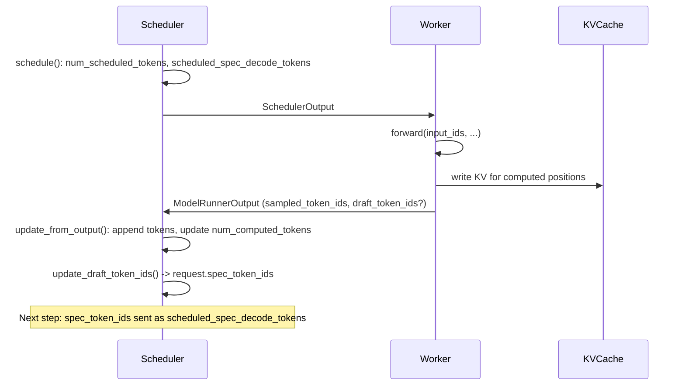
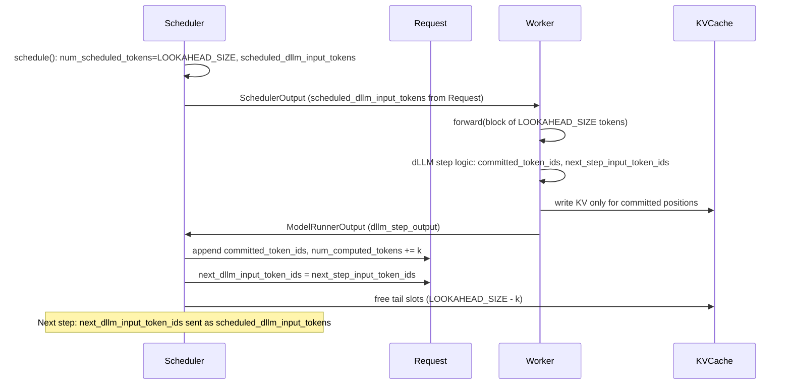
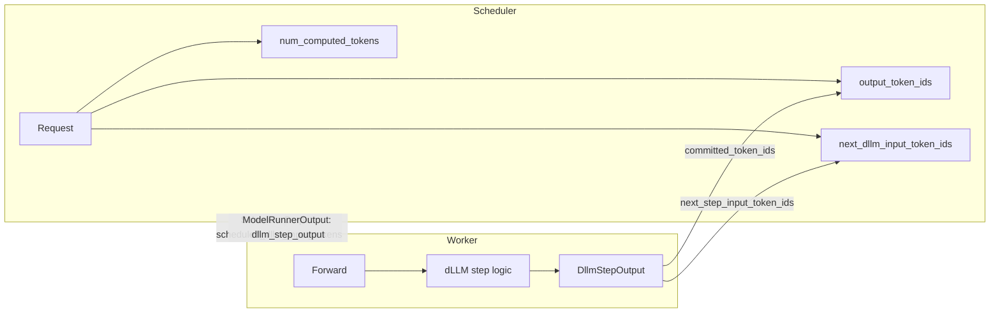
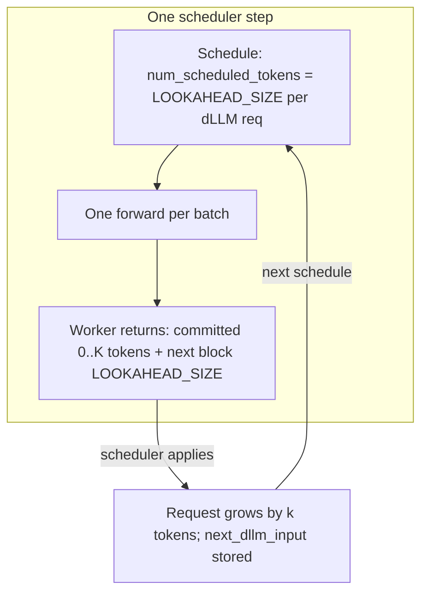
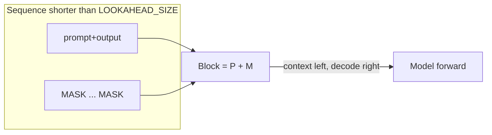

# Pitch: Blocked Masked Diffusion LLM (dLLM) Integration in vLLM

**Audience**: vLLM maintainers (deep vLLM/LLM inference expertise; familiar with traditional bidirectional DLMs; less familiar with newer block/window semi-causal dLLMs.)  
**Purpose**: Explain the feature, motivation, proposed architecture, and design tradeoffs to support a maintainer discussion or RFC.

---

## 1. What This Is About

We propose adding first-class support in vLLM for **blocked masked diffusion LLMs (dLLMs)**—a family of models that generate text in **fixed-size blocks** using **mask-then-fill** (diffusion-style) decoding instead of strict left-to-right autoregressive decoding. The goal is to treat **one diffusion step as one worker iteration** so that vLLM’s continuous batching, scheduling, and KV cache machinery apply without special-casing the engine.

Target architectures include **SDAR**, **LLaDA2.0**, **LLaDA2.1**, **Fast-dLLMv2**, **WeDLM**, and others that share the same block-based abstraction described below.

---

## 2. Trending dLLMs and Competitive Landscape

**Trending models.** Block-based dLLMs are moving into the mainstream. **Mercury 2** (Inception Labs, 2025/2026) is a diffusion-based reasoning model claiming **1,000+ tokens/second** and roughly **5×** faster than leading speed-optimized AR models on comparable hardware. **LLaDA2.0** and **LLaDA2.1** (Ant Group) report **~800–900 TPS** on coding benchmarks (HumanEval+, BigCodeBench) with configurable speed/quality modes. **WeDLM** (Tencent) reconciles diffusion with standard causal attention for fast inference. Major labs and vendors are investing in diffusion-style decoding (e.g. Gemini-related research, SDAR, Fast-dLLMv2), so the ecosystem is growing.

**Competitor support.** Three major vLLM competitors already support or ship dLLM-style inference: **SGlang** (e.g. LLaDA 2.0 and block-diffusion text models, integrated with chunked-prefill–style execution), **Ollama** (local and API usage for diffusion-style models), and **LMDeploy** (deployment path for dLLM-style models). Users who want to serve these models today can turn to these stacks; first-class support in vLLM would keep the ecosystem aligned and avoid fragmenting deployment.

**Benchmarks vs AR on vLLM.** Recent papers and reports compare dLLM inference **directly to classic autoregressive LLMs deployed with vLLM**. In several settings, dLLMs **win by a large margin**—sometimes on the order of **several× to an order of magnitude** in throughput or latency. Examples: **WeDLM** reports **~3×–10×** speedup over vLLM-optimized AR baselines (e.g. ~3× on complex reasoning, up to ~10× on low-entropy tasks). **LLaDA2.1** shows **~800+ TPS** on coding benchmarks. Frameworks like **dInfer** and **FlashDLM** report **~2–3×** over vLLM-optimized AR and **~10–12×** over prior dLLM systems. So the “dLLM vs AR on vLLM” comparison is already in the literature; adding first-class dLLM support in vLLM lets users get these benefits inside the same engine they use for AR.

---

## 3. Background: From Traditional Diffusion LLMs to Block-Based dLLMs

Maintainers are likely familiar with **fully bidirectional** diffusion-style language models (e.g. **MDLM**, **LLaDA1.0**, **Dream**): the model sees the full sequence with masks and iteratively refines all positions; attention is (or can be) bidirectional over the whole sequence. Inference is typically **multi-step over the full length**, which does not map cleanly to vLLM’s **one forward per step, one step per batch** design, and can be expensive for long sequences.

**Newer block/window-based semi-causal dLLMs** change the tradeoff:

- Generation is done in **fixed-size blocks** (e.g. 32 tokens): at each step the model sees exactly one block of tokens (some real, some `<MASK>`).
- **Attention is block- or window-based**: within the block (and possibly a prefix) the model may use a custom mask (semi-causal, banded, or full block); the important point is that the **step** is defined over a **bounded window**, not the full sequence.
- After each step, **model-specific logic** turns logits into: (1) which positions in the block to **commit** (0 to block size) and write to the KV cache, and (2) the **next block’s input** (same size, with masks for positions to fill next).
- So **one “diffusion step” = one forward over a fixed-size block** and a deterministic (or sampling-based) commit/next-input rule. This aligns well with vLLM’s **one step = one forward** and **variable tokens per step** (e.g. speculative decoding already does variable “accepted” tokens).

We use **dLLM** here to mean this **block-based** family (SDAR, LLaDA2.0/2.1, Fast-dLLMv2, WeDLM, etc.), not the older full-sequence bidirectional diffusion LLMs. The rest of the document focuses on integrating this block-based abstraction.

---

## 4. Why vLLM Needs This

- **Demand**: Block-based dLLMs are showing strong quality/speed tradeoffs and are being adopted; users will want to serve them in production.
- **Efficiency**: Block decoding is amenable to batching (many requests each doing one block step) and fits **continuous batching** and **one forward per step**.
- **Reuse**: If we map “one diffusion step” to “one scheduler step,” we get **existing scheduling, KV cache, prefix caching (with a documented bound), and metrics (e.g. TPF = tokens per forward)** without reimplementing the engine loop.
- **Consistency**: Serving dLLMs inside vLLM keeps a single stack for deployment, observability, and APIs instead of separate custom servers.

---

## 5. Unifying Abstraction for Block-Based dLLMs

We can describe all these architectures with one contract:

- **Fixed block size**: `LOOKAHEAD_SIZE` (e.g. 32). Every decode step consumes exactly `LOOKAHEAD_SIZE` input positions (some may be `<MASK>`).
- **Per step output**:
  - **Committed tokens**: 0 to `LOOKAHEAD_SIZE` tokens to append to the sequence and to write to the KV cache (model-specific rule from logits).
  - **Next-step input**: Exactly `LOOKAHEAD_SIZE` token IDs for the next forward (again, from model-specific logic; may include `<MASK>`).
- **Attention**: Each architecture defines its own mask (block causal, banded, etc.). Prefix caching is only valid up to **committed** length (e.g. at most `PREFIX_LEN - LOOKAHEAD_SIZE` in the worst case).

This is enough to plug into vLLM: the **worker** runs one forward per step and returns the two values above; the **scheduler** applies committed tokens to the Request and feeds the next-step input on the next schedule. The following sections make this concrete with diagrams and data flow.

---

## 6. Current vLLM Step Flow (Reference)

Today, one scheduler step corresponds to one forward. The scheduler decides how many tokens to run per request; the worker runs the model and returns sampled (and possibly draft) tokens; the scheduler updates the Request and may store draft tokens for the next step.

Key point: **next-step input** (draft tokens) lives on the **Request** and is sent to the worker via **SchedulerOutput**. The worker does not own durable request state.

---

## 7. Proposed dLLM Step Flow

We keep the same pattern: the worker is stateless; the scheduler owns “what to run next.”

- The worker returns **DllmStepOutput**: `committed_token_ids` (variable length per request) and `next_step_input_token_ids` (exactly `LOOKAHEAD_SIZE` per request).
- The scheduler applies committed tokens to the Request (append, update `num_computed_tokens`, stop handling) and sets `request.next_dllm_input_token_ids`.
- On the next `schedule()`, the scheduler sends `request.next_dllm_input_token_ids` to the worker as `scheduled_dllm_input_tokens`.
- KV cache: only **committed** positions are kept; slots for the rest of the block are freed (or never committed).

---

## 8. Data Flow: Where State Lives

The next diagram stresses that **per-request state that affects the next step** stays in the scheduler (on the Request). The worker only produces values that the scheduler applies.

- **Scheduler → Worker**: `scheduled_dllm_input_tokens[req_id]` = next block (length `LOOKAHEAD_SIZE`), or omitted on first decode step (worker uses last `LOOKAHEAD_SIZE` of prompt+output or right-pads with MASK).
- **Worker → Scheduler**: `dllm_step_output.committed_token_ids[i]`, `dllm_step_output.next_step_input_token_ids[i]`; scheduler appends committed to Request and stores next-step input on Request.

---

## 9. One Step, One Forward: How dLLM Fits

vLLM already allows **variable tokens per request per step** (prefill, chunked prefill, speculative decoding). dLLM fits the same mental model:

- **Input to the step**: Exactly `LOOKAHEAD_SIZE` tokens per dLLM request (from `scheduled_dllm_input_tokens` or first-step convention).
- **Output of the step**: Variable-length committed tokens (0..LOOKAHEAD_SIZE) and fixed-length next-step input (LOOKAHEAD_SIZE). So “one step, one forward” is preserved; only the **interpretation** of the output (commit vs next input) is dLLM-specific.

---

## 10. First Decode Step and Padding

When the sequence is shorter than `LOOKAHEAD_SIZE`, the worker must form a block of size `LOOKAHEAD_SIZE`. We use **right-pad with `<MASK>`**:

- Block = `[prompt+output, MASK, …, MASK]`.
- Rationale: dLLMs are trained to **fill** masked positions; the “positions to predict” should be on the **right** (context left, masks right). Left-padding with MASK would put “to decode” on the left and would not match training.

---

## 11. Prefix Caching and Per-Model Attention Masks

**Prefix caching in dLLM.** In autoregressive decoding, the prefix (e.g. prompt) is fixed after prefill; the engine can reuse cached KV for identical prefix tokens across requests. In dLLM decode, only **committed** tokens are final. The last up to **LOOKAHEAD_SIZE** positions are still “in flight” (current block) until the model commits them. So **prefix cache validity is bounded by committed length**: we may only treat as reusable prefix a contiguous segment whose KV has been written and will not change—i.e. positions that have been committed. A conservative rule is **prefix valid length ≤ num_computed_tokens** (committed so far). When sharing prefix across requests (e.g. same system prompt), the reusable prefix is at most the committed prefix length; any tail within the current block is not shareable until committed.

**How per-model attention masks affect it.** Each dLLM architecture defines its own **attention mask** (block causal, banded, full block, etc.). The mask controls which positions the current block attends to (prefix + block, or a window). From a **caching** perspective:

- **What we cache**: We only write and retain KV for **committed** positions. The engine does not need to interpret the mask to decide what to cache; it caches whatever the model has committed.
- **Reuse across requests**: When two requests share the same prompt (or prefix), we can reuse the same cached KV for that prefix **if** it is fully committed and produced by the same model. The **per-model** mask is fixed for that model; so for a given model, the same committed prefix yields the same KV and is safe to reuse. The mask only affects how the **next** forward (current block) attends to that prefix—a forward-time concern of the model, not a cache-invalidation rule.
- **Step- or block-dependent masks**: If a model’s attention pattern depends on step index or block index (e.g. different masking at “block 0” vs “block N”), prefix reuse could in theory require that the reuse happens at the same logical phase. In practice, shared prefix is usually **prompt-only** (prefill); decode blocks are request-specific and not shared. So we document that prefix caching is **safest for prompt prefix** up to committed length; decode-phase reuse is an advanced case and may need model-specific rules if the mask is step-dependent.
- **Fully bidirectional prefill**: Some dLLM works **modify the prefill mask to be fully bidirectional** (full sequence visible, no causal constraint). In that case, the KV at every position depends on the **entire** prompt; there is no contiguous prefix whose KV is invariant when reused in another request. **Prefix caching is then impossible** for such models—each request must run prefill independently. The engine should either detect this (e.g. from model config) or allow the model to declare it, and **disable prefix caching** when the prefill mask is fully bidirectional.

**Summary.** Prefix caching remains valid up to **committed length**; the last LOOKAHEAD_SIZE positions are not part of the reusable prefix until committed. Variable per-model attention masks define how the current block uses the prefix; they do not change which KV we cache or the “valid up to committed” rule—**unless** the prefill mask is fully bidirectional, in which case prefix caching is impossible and must be disabled. When the mask is step-independent and prefill is not fully bidirectional, reuse is safe for the same model and same committed prefix. Implementation should document this bound, disable prefix caching for bidirectional-prefill models, and note any model-specific caveats for step-dependent masks.

---

## 12. Design Dilemmas and Choices

| Dilemma | Options | Choice | Rationale |
|--------|--------|--------|-----------|
| **Where to store next-step input** | Scheduler (on Request) vs worker (in-worker state) | **Scheduler (Request)** | Matches vLLM’s “scheduler as source of truth”; preemption and multi-worker stay correct; same pattern as spec decode draft tokens. |
| **First-step block when len &lt; LOOKAHEAD_SIZE** | Left-pad vs right-pad with MASK | **Right-pad** | Model is trained to fill masks; “to decode” positions on the right. |
| **Who validates lengths** (committed 0..K, next input length LOOKAHEAD_SIZE) | Scheduler vs worker vs both | **Worker** | Single place to enforce contract; scheduler can trust shape. |
| **dLLM mode: model vs request** | Model-level vs request-level vs both | **Model-level only** | One model per instance; when a dLLM model is loaded, all requests are dLLM. Simplifies engine. |
| **New metrics vs reuse** | Add dLLM-specific metrics vs reuse existing | **Reuse** | Committed tokens reported as `new_token_ids`; TPF = generation tokens that step. Optional dLLM metrics later. |
| **Prefix cache validity** | Full prefix vs only up to committed | **Up to committed length** | Last LOOKAHEAD_SIZE positions can change until committed; document as e.g. PREFIX_LEN - LOOKAHEAD_SIZE worst case. |

---

## 13. What Stays the Same

- **One model per instance**: No mixing of dLLM and causal models in one batch.
- **Continuous batching**: Multiple dLLM requests in one step; same scheduling budget.
- **KV cache**: Same paged layout; we only free **tail** slots when fewer than LOOKAHEAD_SIZE tokens are committed.
- **Metrics**: Existing iteration stats (e.g. `num_generation_tokens` per step) give TPF without new APIs.
- **Backward compatibility**: New fields (`dllm_step_output`, `scheduled_dllm_input_tokens`) are optional with safe defaults; no change when dLLM is not used.

---

## 14. Scope and Out of Scope

**In scope**: Engine/worker/scheduler contract, data structures (DllmStepOutput, Request.next_dllm_input_token_ids, SchedulerOutput.scheduled_dllm_input_tokens), first-step convention, KV tail free, tests and regression.

**Out of scope for this pitch**: Concrete SDAR/LLaDA2.0/etc. model implementations, custom attention masks per architecture (required for full support but can be separate work), and training/fine-tuning.

---

## 15. References and Further Reading

- Spec and plan in this feature branch: `specs/001-dllm-integration/` (spec.md, plan.md, research.md, data-model.md, contracts/).
- vLLM constitution and scheduler/worker design (single source of truth, one step one forward) are preserved and referenced in the spec.
