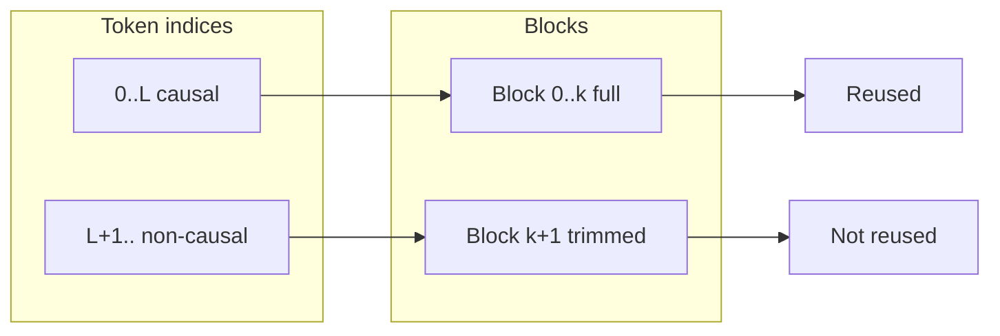

# dLLM Prefill and Prefix Caching: Design (Full Scope)

This document describes the full design for **prefill** (full-sequence or chunked, with proper attention mask) and **prefix caching** with causal trim for block-based diffusion LLMs (dLLMs) in vLLM. It is intended as a standalone design spec and as the basis for a **future RFC** when the project is ready to implement full prefix-caching support for dLLM. The main dLLM plugin RFC ([rfc-dllm-plugin-standalone.md](rfc-dllm-plugin-standalone.md)) only addresses minimal required clarifications and MVP limitations; this doc holds the complete picture.

---

## 1. Prefill and chunked prefill

**Prefill** is a distinct phase from decode. During prefill:

- The worker input may be **larger than DRAFT_SIZE**: the full prompt or a chunk of the prompt, with the **proper attention mask** applied (causal, block-based, windowed, or other model-specific mask).
- **Chunked prefill** is supported: long prompts can be processed in chunks (same idea as AR in vLLM), so that the scheduler can assign a bounded number of tokens per step and batch multiple requests.

After prefill, **decode** proceeds with block-based steps (DRAFT_SIZE in/out, Committed + next block) as described in the main RFC. The first decode step consumes the first input block (e.g. prompt suffix + `<MASK>` padding to DRAFT_SIZE) as specified by the First-step contract.

---

## 2. Prefix caching and causal prefix

Only tokens with **0 lookahead** (fully causal: they do not attend to any future token) have deterministic KV; only those positions are safe to reuse across requests with the same prefix.

**Ideal:** dLLMs can be designed to expose a "prefix checkpoint" (e.g. end of system prompt) so that reusable prefix is well-defined up to that checkpoint. Placing it at the end of the system prompt maximizes prefix reuse.

**Fallback:** If there is no such checkpoint, the correct handling is to **trim to the last causal token**: the reusable prefix is the set of tokens in blocks that do **not** contain any token after the last causal token (exclusive trim). See Trim semantics below.

---

## 3. Monotonicity condition

The trim rule below is correct **only when the attention mask is monotonic**: if token K cannot attend to K+t, then token K−1 cannot attend to K+t either. Under monotonicity, the "last causal token" (rightmost position with 0 lookahead) defines a clean boundary; all positions to its left are causal, and no position to its left attends to any position after it.

For **non-monotonic** masks, this simple trim is not sufficient (e.g. an earlier token might attend to a position after the "last causal" token). The plugin must use a different analysis or disable prefix caching for such architectures.

---

## 4. Trim semantics (exclusive, monotonic masks only)

**Rule:** Trim all blocks that contain any token after the last causal token. Equivalently: cap the prefix cache hit length to `num_prefix_cacheable_tokens = last_causal_token_index + 1`.

- Let `L = last_causal_token_index` (0-based). Reusable prefix length in tokens = `L + 1`.
- Set `num_prefix_cacheable_tokens = L + 1`. Then `max_cache_hit_length` used in prefix lookup is capped to that value (and to `num_tokens - 1` when applicable for existing behavior).
- The core `find_longest_cache_hit(..., max_length)` returns blocks such that the total number of tokens ≤ `L + 1`. So it never includes a block that contains position `L + 1` or beyond. Any block that contains a token after the last causal token is excluded (**exclusive** trim).

---

## 5. Viability: plugin + minimal core changes

Prefix cache lookup is done in **core** only: `KVCacheManager.get_computed_blocks(request)` uses `max_cache_hit_length = request.num_tokens - 1` and calls `coordinator.find_longest_cache_hit(request.block_hashes, max_cache_hit_length)`. The scheduler calls `get_computed_blocks(request)` when `request.num_computed_tokens == 0` (new request); the plugin does not call it. `find_longest_cache_hit` returns the longest prefix of blocks whose total token count ≤ `max_length`.

**Conclusion:** Trimming cannot be done purely in the plugin; a **minimal core change** is required so that a **cap** on reusable prefix length is applied during lookup; the plugin can then supply that cap.

### 5.1 Minimal core change (two small edits)

1. **Request** (`vllm/v1/request.py`)
   - Add optional attribute: `num_prefix_cacheable_tokens: int | None = None`
   - Semantics: if set, only this many leading tokens are considered for prefix reuse (must be ≤ `num_tokens`). Not set for normal AR; plugin sets it for dLLM (and similar) when prefill uses non-causal masks.

2. **KVCacheManager.get_computed_blocks** (`vllm/v1/core/kv_cache_manager.py` ~line 189)
   - Keep: `max_cache_hit_length = request.num_tokens - 1`
   - Add: if `request.num_prefix_cacheable_tokens is not None`, then `max_cache_hit_length = min(max_cache_hit_length, request.num_prefix_cacheable_tokens)`
   - No changes to coordinator, block pool, or hashing.

Effect: "Trim all blocks that contain tokens after the last causal token" is implemented by setting `num_prefix_cacheable_tokens = last_causal_token_index + 1`. Then `find_longest_cache_hit(..., max_cache_hit_length)` returns only blocks that lie entirely in `[0, last_causal_token_index]` (exclusive trim).

### 5.2 Plugin responsibility (no further core changes)

- The **plugin scheduler** must set `request.num_prefix_cacheable_tokens` **before** the request is used for prefix cache lookup.
- The core scheduler calls `get_computed_blocks(request)` inside `schedule()` for a request that was peeked from `self.waiting`. The waiting queue is iterable.
- The plugin scheduler can set the cap at the start of `schedule()` by iterating over `self.waiting` and setting `num_prefix_cacheable_tokens` on each dLLM request (e.g. from model config, prompt structure like "end of system prompt", or mask metadata), then call `super().schedule()`.
- Value to set: `last_causal_token_index + 1` (number of fully causal tokens). If the model has a "prefix checkpoint" (e.g. end of system prompt), that index + 1; otherwise derive last causal from the mask or declare prefix caching disabled.

No new hooks or scheduler API are required if the plugin sets the attribute on waiting requests before the base `schedule()` runs.

---

## 6. Limitations

- **Non-monotonic masks:** The trim-to-last-causal rule applies only when the attention mask is monotonic. For non-monotonic masks, the plugin must not rely on this simple trim (use a different analysis or disable prefix caching).
- **Missing causal boundary:** Architectures without a clear causal boundary (or prefix checkpoint) require the plugin to derive "last causal token" from the mask or disable prefix caching; per-architecture behavior and support for prefix caching should be documented by the plugin.
- **Fully bidirectional prefill:** If the model uses a fully bidirectional prefill mask, prefix caching is impossible and must be disabled (e.g. via model config or plugin).

---

## 7. Future RFC

This design can be proposed as a **future RFC** when the project is ready to implement full prefix-caching support for dLLM: the minimal core change (optional `Request.num_prefix_cacheable_tokens` and the cap in `get_computed_blocks`) and the plugin contract (set the cap, document how it is determined and whether prefix caching is supported).
