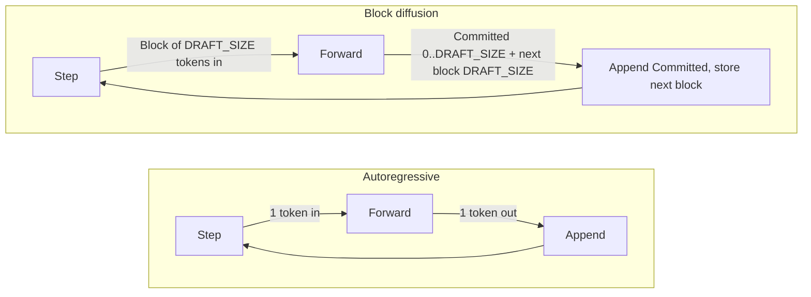
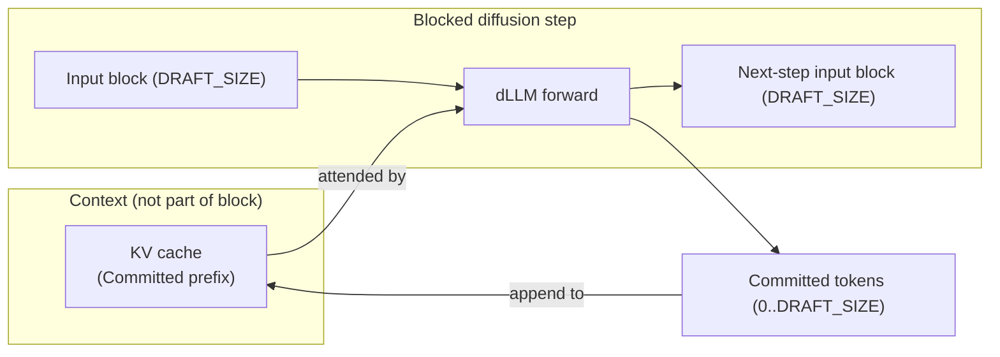
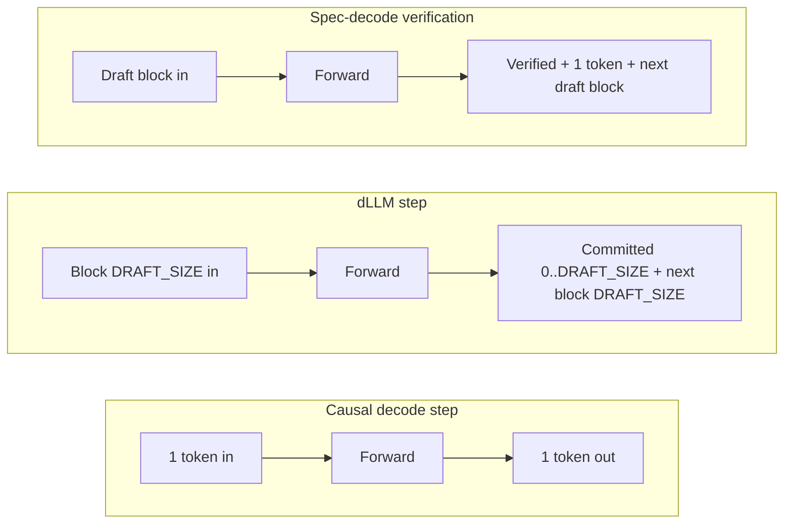
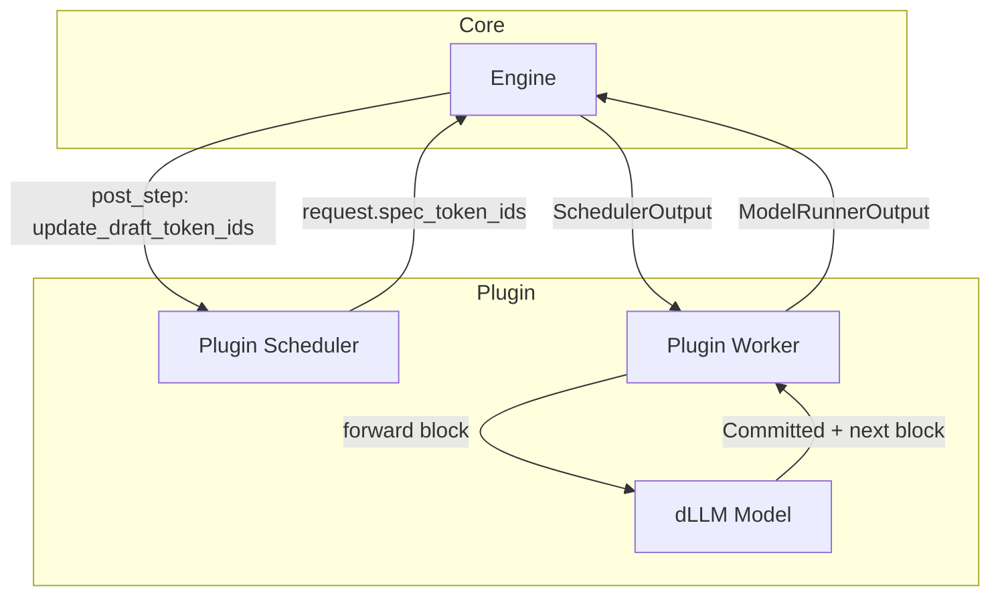
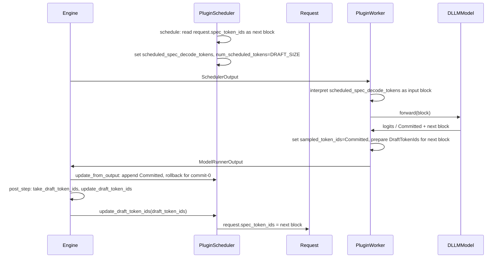

# [RFC]: dLLM support via plugin (spec-decode path reuse)

**Author:** (fill when opening issue)  
**Labels:** RFC, plugin, inference

---

## Summary

This RFC adds block-based diffusion language model (dLLM) support in vLLM via the plugin system by **reusing the existing spec-decode data path and scheduler interface**. One engine change—calling the draft-token hook after every step when the model was executed, not only when speculative decoding is enabled—lets a plugin supply a custom scheduler, worker, and model that implement full dLLM semantics (variable **Committed** tokens, including commit-0) with **maximal encapsulation** and no new core types. The cost is overloading existing spec-decode fields when the plugin stack is used; this document states that reliance and the intended contract explicitly.

---

## Motivation

Block-based dLLMs are gaining traction: they offer strong quality/speed tradeoffs, and recent benchmarks show large throughput or latency gains versus autoregressive LLMs (e.g. [WeDLM](https://arxiv.org/abs/2512.22737), [LLaDA2.1](https://arxiv.org/abs/2602.08676), [dInfer](https://arxiv.org/abs/2510.08666)). Major vLLM competitors ([SGlang](https://github.com/sgl-project/sglang/issues/14199), [Ollama](https://github.com/ollama/ollama/blob/main/llama/llama.cpp/src/models/llada.cpp), [LMDeploy](https://github.com/InternLM/lmdeploy/blob/main/lmdeploy/pytorch/models/sdar.py)) already support or ship dLLM-style inference. Adding dLLM support in vLLM keeps the ecosystem aligned and preserves **extensibility**: new architectures ([WeDLM](https://huggingface.co/tencent/WeDLM-8B-Instruct), [SDAR](https://huggingface.co/JetLM/SDAR-8B-Chat), [Fast-dLLMv2](https://huggingface.co/Efficient-Large-Model/Fast_dLLM_v2_1.5B), etc.) can be added via plugins without changing vLLM core. This design prioritizes **minimal upstream change** and **maximal plugin encapsulation** so the bar for merging stays low while enabling full dLLM semantics behind the plugin boundary.

---

## How dLLMs work

We use **LLaDA2.0** (block size 32, semi-causal, block-masked diffusion) as the running example.

### Block-based decoding

Autoregressive (AR) decoding: one token per step, strict left-to-right, causal mask. Diffusion language models (dLLMs): generate a **block** of tokens (e.g. 32) at a time via iterative denoising—some positions are masked, the model predicts masked positions in one forward; then tokens are either left for the next iteration as **Masked Draft** or **Decoded Draft**, or **Committed** to the sequence and KV cache. The unit of work is a **block** of fixed size (`DRAFT_SIZE`).

### Three token types

The model’s output for a block is classified into three roles. Decoded Draft and Committed are distinct: Decoded Draft tokens remain input to the next forward and may be revised; Committed tokens are final and KV-cached. When to move tokens from Decoded Draft to Committed is architecture- and mode-specific (e.g. LLaDA2.1 may edit Decoded Draft over iterations; WeDLM may commit continuously from the left). The vLLM contract only needs the **Committed** token IDs and the **next-step input block**.

| Term | Meaning | Role in next step |
|------|---------|-------------------|
| **Masked Draft tokens** | Low-confidence, masked positions. | Part of the **input** of the next step (e.g. `<MASK>` or refined predictions). |
| **Decoded Draft tokens** | High-confidence but not yet finalized. | Part of the **input** of the next step; may be **edited** in later iterations. |
| **Committed tokens** | Finalized for KV cache and output. | **No longer** dynamic input; written to KV cache and appended to the sequence. |

Semi-causal (block-masked) dLLMs use attention so that the **block**—the draft, exactly DRAFT_SIZE tokens—**causally attends to** the **context**: all previously Committed tokens to its left, stored in the KV cache. The block is only the draft (Masked Draft and Decoded Draft); the context is separate and not part of the block. Only **Committed** positions are written to the KV cache; the block output (Masked/Decoded Draft) forms the next-step input block. That matches vLLM’s decode-step model and allows streaming.

### One forward (block, context, KV cache)

The input is a single block of `DRAFT_SIZE` tokens. The forward attends to the **context** (Committed prefix already in the KV cache). Outputs: **Committed** tokens (0..DRAFT_SIZE) are appended to the KV cache and to the sequence; the **next-step input block** (DRAFT_SIZE tokens) is the draft for the next forward.

### Notation and step interface

| Term | Meaning |
|------|---------|
| **DRAFT_SIZE** | Block size (e.g. 32 for LLaDA2.0). |
| **Input block** | The `DRAFT_SIZE` token IDs for one forward (may include `<MASK>` for Masked Draft). |
| **Committed tokens** | 0 to `DRAFT_SIZE` tokens finalized this step: appended and KV-cached. |
| **Next-step input block** | Exactly `DRAFT_SIZE` token IDs for the **next** forward (from Masked/Decoded Draft). |

### Exact interface of one dLLM step

Inputs = one block of length `DRAFT_SIZE` per request. Outputs = **Committed** token IDs (length 0..DRAFT_SIZE, may be empty) + **next-step input block** (length DRAFT_SIZE). So: one forward in, one block in; variable-length Committed out, fixed-size next block out.

### Why it fits vLLM

Semi-causal structure and “only Committed in KV cache” align with one forward then append; streaming works incrementally per Committed segment or per block.

---

## Why reuse the spec-decode path

### Similarity

Causal decode: one token in, one token out. dLLM step: one block in, Committed (0..DRAFT_SIZE) + next block out. Spec-decode verification: one draft block in, verified prefix + one new token + next draft block. dLLM and spec-decode both use a **single forward over a block**, produce a **variable-length** finalized output, and pass a **next block** to the next step. The data shape is compatible, so the spec-decode path can be reused with field overloading. The only behavioral difference: spec-decode always adds one new token after the verified prefix; dLLM can commit 0..DRAFT_SIZE, so the plugin scheduler must handle commit-0 (roll back `num_computed_tokens`).

### The one engine change

Call the draft-token hook (`take_draft_token_ids()` then `update_draft_token_ids()` or `update_draft_token_ids_in_output()` when non-None) **whenever the model was executed**, not only when `use_spec_decode` is true. Locations: `vllm/v1/engine/core.py` in `post_step()` (sync) and in `step_with_batch_queue()` (batch-queue/async path). Relax the condition that gates this body on `use_spec_decode` so the body runs whenever the model was executed and draft token ids are available. Backward compatible: the default worker returns `None` from `take_draft_token_ids()` when not doing spec-decode; the default scheduler’s `update_draft_token_ids` only affects requests with spec-decode state.

### Field overloading

When the plugin’s scheduler and worker are used, these existing fields carry dLLM meaning (mutually exclusive with spec-decode):

| Existing field / method | Spec-decode meaning | dLLM meaning (plugin) |
|-------------------------|---------------------|------------------------|
| `Request.spec_token_ids` | Draft token IDs for next verification | Next-step input block (length DRAFT_SIZE) |
| `SchedulerOutput.scheduled_spec_decode_tokens` | Draft tokens sent to worker | Input block (length DRAFT_SIZE) for this step |
| `ModelRunnerOutput.sampled_token_ids` | Verified + sampled (1 + num_accepted) | **Committed** token IDs (0..DRAFT_SIZE; may be empty) |
| `take_draft_token_ids()` / `update_draft_token_ids()` | Next draft tokens | Next-step input block (stored in `request.spec_token_ids`) |

### Commit-0

The plugin scheduler, in `update_from_output`, treats empty `sampled_token_ids` as “commit 0” and rolls back `num_computed_tokens` by the number of tokens scheduled that step (e.g. DRAFT_SIZE), so KV and progress accounting stay correct.

### Contract for core

When a custom scheduler and worker are in use: (1) **Engine:** call the draft-token hook whenever the model was executed (as above). (2) **Fields that may carry dLLM semantics:** `SchedulerOutput.scheduled_spec_decode_tokens`, `Request.spec_token_ids`, `ModelRunnerOutput.sampled_token_ids`, `DraftTokenIds` / worker `take_draft_token_ids()`, scheduler `update_draft_token_ids()` and `update_draft_token_ids_in_output()`. The project should document this set and the single engine change as a **stable extension point** (or “dLLM extension contract”) so plugin authors and deployments have a clear compatibility target.

---

## Minimal core change

- **Behavioral change only:** Relax the guard in `post_step()` and in `step_with_batch_queue()` so the draft-token update runs whenever the model was executed (see above). No new types; no dLLM-specific branches in the default scheduler or worker.
- **In code:** Add a brief comment at the relaxed condition that when a custom scheduler and worker are in use, this path may carry dLLM semantics and refer to this RFC (or the Contract for core) so the contract is discoverable.

---

## Plugin encapsulation

The plugin provides a custom **scheduler**, **worker**, and **model**. The engine changes only by calling the draft-token hook after every step; all dLLM logic lives in the plugin.

### What the plugin provides

Custom scheduler and worker classes (shipped in the plugin package); the user selects them via `--scheduler-cls` and `--worker-cls`, or a platform plugin sets `worker_cls`. Models are registered via `ModelRegistry` / `vllm.general_plugins`. General plugins do not auto-inject worker or scheduler—only the model is registered; scheduler and worker are used when the user or config passes the corresponding CLI arguments.

### Data flow

- **Scheduler:** `schedule()` — read `request.spec_token_ids`, set `scheduled_spec_decode_tokens`, `num_scheduled_tokens` = DRAFT_SIZE. `update_from_output()` — apply Committed from `sampled_token_ids`, roll back `num_computed_tokens` for commit-0, append to output. `update_draft_token_ids()` — write next block to `request.spec_token_ids`.
- **Worker:** Interpret `scheduled_spec_decode_tokens` as input block; run dLLM forward; set `sampled_token_ids` = Committed; return next block via `take_draft_token_ids()`.
- **Engine:** After every step when the model was executed, call `take_draft_token_ids()` and `update_draft_token_ids()` (or batch-queue equivalent).

### Validation

The plugin **must** ensure the dLLM model is never used with the default scheduler or default worker (commit-0 would be unhandled and state could desync). At startup (e.g. model load or plugin registration), validate that the active `scheduler_cls` and `worker_cls` are the plugin’s classes; if not, **raise a clear, actionable error** (e.g. “dLLM model X requires the dLLM plugin scheduler and worker; got scheduler_cls=..., worker_cls=.... Use --scheduler-cls and --worker-cls.”). Treat model + scheduler + worker as one “dLLM stack” and recommend a **single entry point** (launcher, preset, or future `--use-dllm`-style flag) so operators set all three together.

---

## Contracts and edge cases

### First step

Before the first decode schedule, `request.spec_token_ids` must be the first input block (length DRAFT_SIZE). The plugin (scheduler or worker) must set it; the plugin documents which component does it and the padding/mask convention (e.g. prompt suffix + `<MASK>` to DRAFT_SIZE).

### Prefill

Prefill is distinct from decode. During prefill, worker input may be **larger than DRAFT_SIZE** (full prompt or chunk) with the proper attention mask; **chunked prefill** is supported. After prefill, decode proceeds with block-based steps as above.

### Grammar and structured output

The default scheduler applies grammar validation to draft tokens when structured output is in use. For dLLM, the “next block” is model-produced, not AR draft tokens. The **plugin scheduler MUST override** `update_draft_token_ids` and `update_draft_token_ids_in_output` and must **not** apply default AR grammar to the dLLM next block (or apply only dLLM-appropriate validation). The same applies when the engine calls these methods in the async path.

---

## Limitations, risks, and open questions

This design is a **balance of considerations**, not a perfect no-brainer.

- **Strict scheduler/worker pairing.** A dLLM model must always run with the plugin’s scheduler and worker. Validation (above) avoids silent misconfiguration; operators should treat the dLLM stack as one unit.
- **Stability of the spec-decode path.** The plugin relies on the existing spec-decode interface and post-step hook. Future changes to that path could break the dLLM plugin. Documenting the contract as a stable extension point (see Why reuse the spec-decode path) gives plugin authors a clear compatibility target.
- **Observability.** The same field names carry different meaning for dLLM vs spec-decode. Logs and metrics that assume speculative decoding can be misleading. The MVP or a follow-up should define an explicit way to identify dLLM runs (e.g. config flag or model type) so metrics and tooling can key off it.
- **Prefix-caching in the MVP.** dLLM prefill often uses non-causal or non-triangular attention masks, so reusable prefix is only well-defined for fully causal positions. The MVP does not specify causal trim or a prefix-cache cap; prefix-caching with dLLM may be conservative or incorrect unless the plugin or model disables it. Operators should be aware when enabling prefix caching with dLLM.
- **Full prefix-caching support.** Causal boundary, trim to last causal token under monotonic masks, and related core/plugin contract are **out of scope** for this RFC. A **future RFC** may propose the minimal core change and plugin contract when the project is ready.

Feedback, criticism, and suggestions are welcome; this RFC proposes a balance of tradeoffs, not a final specification.

---

## Tradeoffs

### Pros

Minimal core change (one condition in the engine); no new types; no changes to core scheduler or model interface; full encapsulation in the plugin; variable Committed count including commit-0 via plugin scheduler rollback.

### Cons

Overloaded semantics of spec-decode fields; possible confusion when debugging; reliance on stability of the spec-decode scheduler interface and post-step hook.

---

## First architecture / MVP

Target: at least one runnable dLLM architecture in a plugin (e.g. **LLaDA2.0** or LLaDA2.x), with the plugin providing the custom scheduler and worker and registering the model. MVP = core engine change in place, one plugin delivering one architecture with correct block-step semantics and minimal correctness tests; further architectures and optimizations without further core changes.

---

## Alternatives

- **Explicit dLLM path in core:** Add explicit dLLM types and dedicated core scheduler/worker branches; no field overloading, but more core code. This document does not specify that design.
- **This design (spec-decode reuse):** Reuse spec-decode path; one engine change; maximal plugin encapsulation; overloaded field semantics, as described above.

---

## Feedback period

Two weeks from the date this RFC is posted. We welcome constructive criticism and suggestions; this RFC proposes a balance of tradeoffs, not a final specification.

---

## CC list

(When opening the issue, tag relevant committers/area owners for scheduler, worker, plugins, and engine. See vLLM governance / committers.)

---

## Before submitting a new issue

- [ ] Searched for relevant issues and RFCs.
- [ ] Aligned with vLLM Plugin System and Governance Process.
