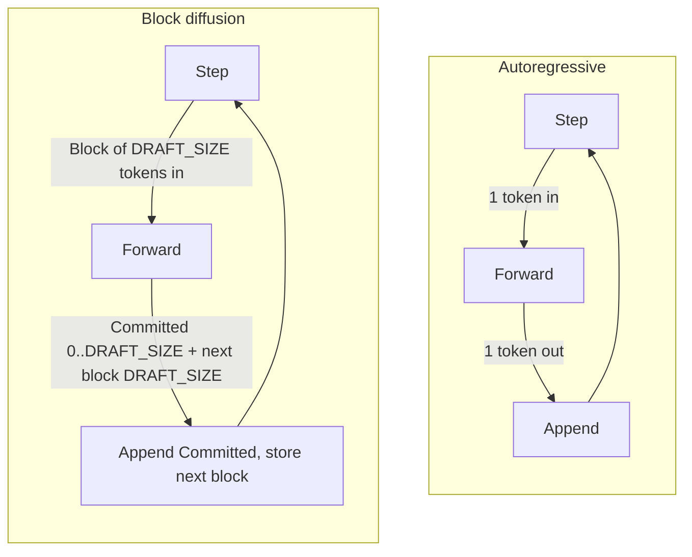
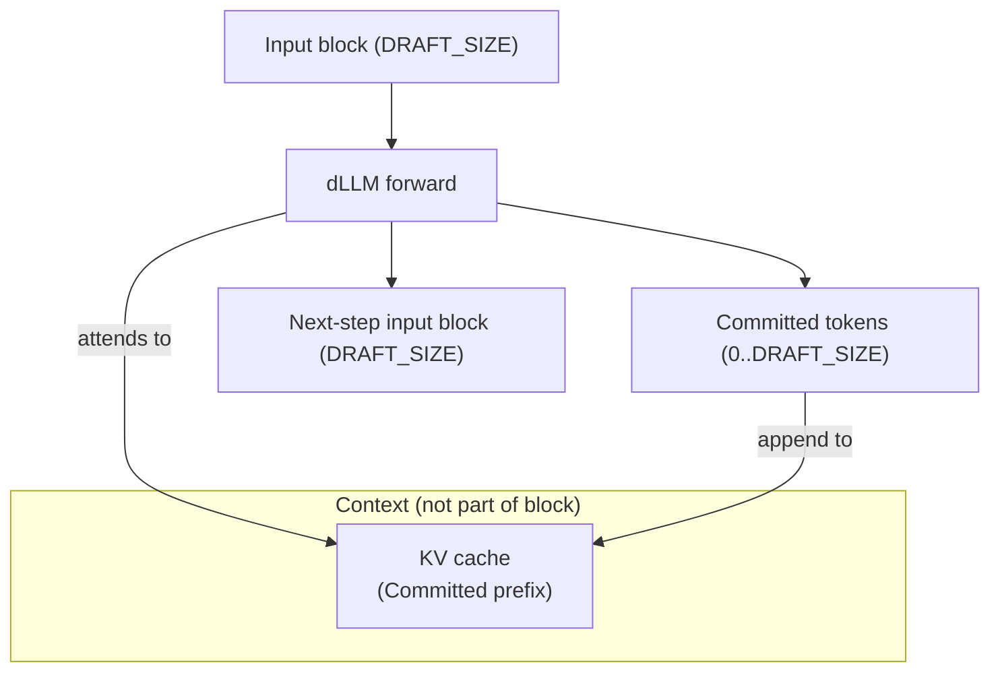
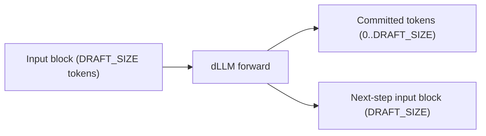
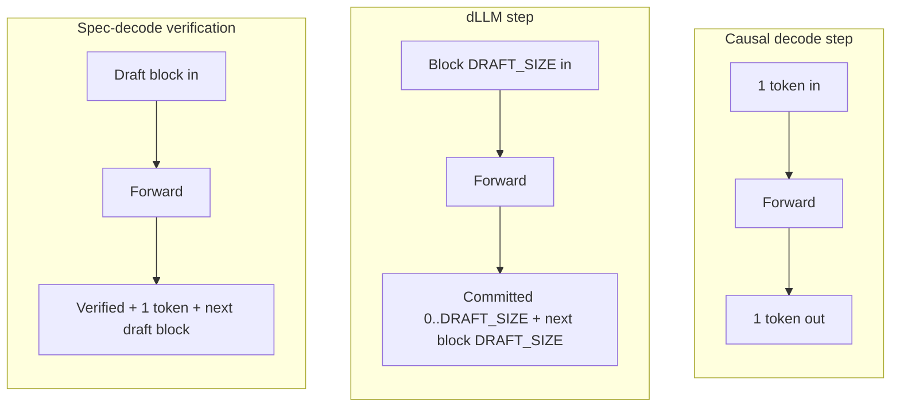
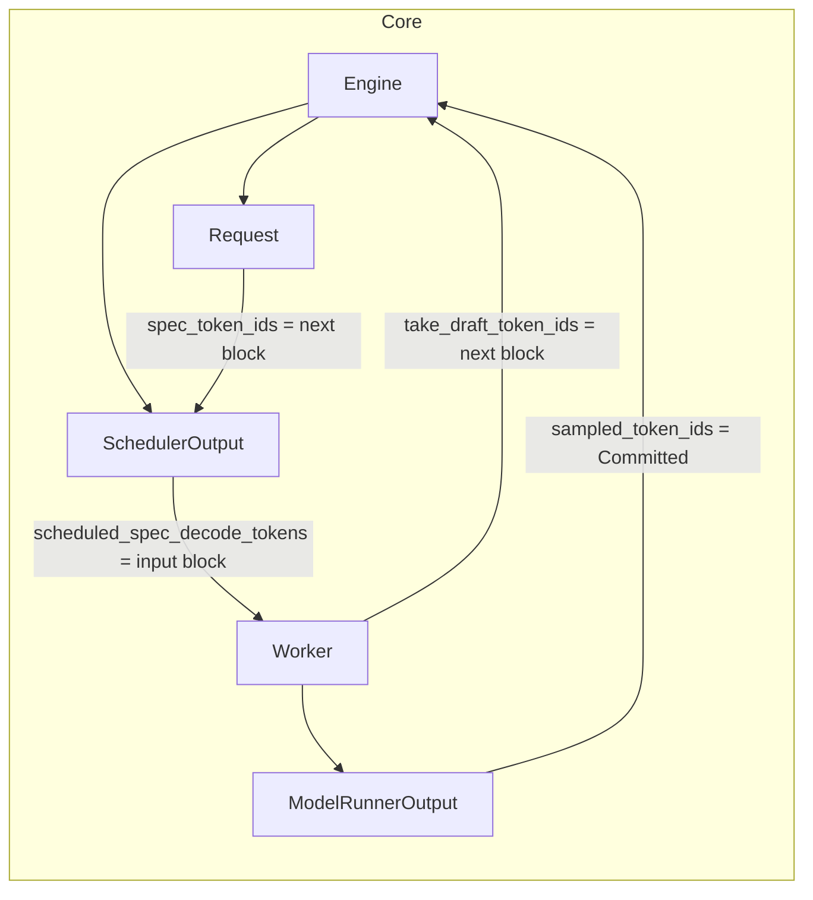
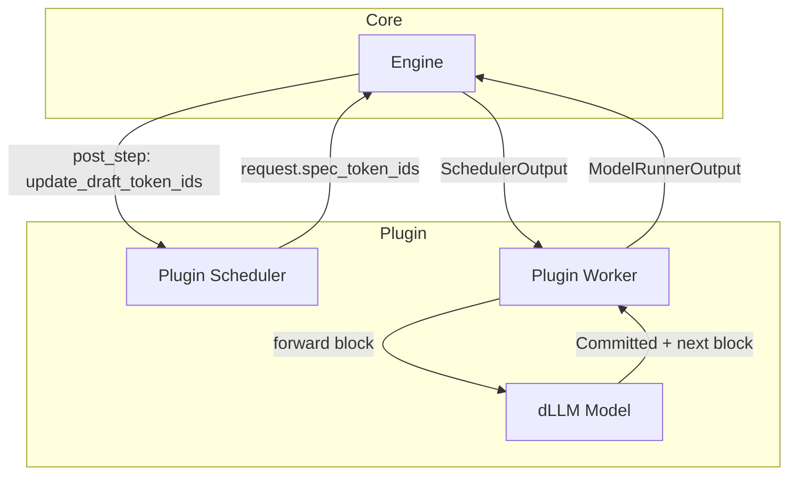
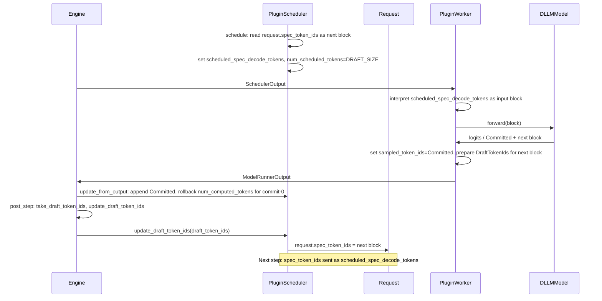

# [RFC]: dLLM support via plugin (spec-decode path reuse)

**Author:** (fill when opening issue)  
**Labels:** RFC, plugin, inference

---

## Background: Diffusion LLMs and why they fit vLLM

This section establishes foundational terms and notation used in the rest of the RFC. We use **LLaDA2.0** (block size 32, semi-causal, block-masked diffusion) as the running example.

### How diffusion LLMs work (high level)

- **Autoregressive (AR) decoding:** One token per step, strict left-to-right; each position attends only to previous positions (causal mask).
- **Diffusion language models (dLLMs):** Generate a **block** of tokens (e.g. 32) at a time via iterative "denoising": some positions are masked, the model predicts all masked positions in one forward; then, depending on confidence, tokens are either left for the next iteration as **Masked Draft** or **Decoded Draft** tokens, or **Committed** to the sequence and KV cache (see below). No strict one-token-per-step; the unit of work is a **block**.
- **Block-based / blocked diffusion:** The model is trained and run with a fixed **block size** (e.g. `DRAFT_SIZE = 32`). One "step" = one forward over one block. This is the family relevant to vLLM (LLaDA2.0, WeDLM, etc.).

### Three types of output tokens in the diffusion process

This RFC uses a single set of terms for the diffusion process. The model's output for a block is classified into three roles. **It is important to distinguish these**, especially **Decoded Draft** from **Committed**—they have completely different roles, and each dLLM architecture treats them differently.

| Term | Meaning | Role in next step |
|------|---------|-------------------|
| **Masked Draft tokens** | Tokens at positions that were masked for having low confidence. | Part of the **input** of the next diffusion step (e.g. as `<MASK>` or refined predictions). |
| **Decoded Draft tokens** | Tokens at positions that were decoded with high confidence but not yet finalized. | Part of the **input** of the next diffusion step; they may still be **edited** in future iterations in some architectures. |
| **Committed tokens** | Tokens that are finalized for KV caching and output. | **No longer** explicit dynamic input of the next steps. Written to KV cache and appended to the sequence. (Causal mask: future tokens attend to them; they do not attend forward.) |

- **Decoded Draft vs Committed:** Decoded Draft tokens are still "in play"—they are fed into the next forward and may be revised (e.g. LLaDA2.1 may edit them in later iterations). **Committed** tokens are final: they are KV-cached and never re-fed as input. The **policy of when to move tokens from Decoded Draft to Committed** is architecture- and often mode-specific.
- **Examples:** In **LLaDA2.1**, Decoded Draft tokens may be edited in future iterations before they are ever committed. In **WeDLM**, tokens may be **continuously committed** so that every diffusion step commits a few (e.g. commit-from-the-left each step). The plugin and model implement the chosen policy; the vLLM contract only needs the **count and IDs of Committed** tokens and the **next-step input block** (which the model builds from Masked Draft and Decoded Draft tokens as needed).

### Semi-causal / blocked diffusion and KV caching

Unlike fully bidirectional (BERT-style) models, **semi-causal** or **block-masked** dLLMs use attention so that the **block**—the draft, exactly DRAFT_SIZE tokens—**causally attends to** the **context**: all previously Committed tokens to its left, stored in the KV cache. The block is only the draft (Masked Draft and Decoded Draft); the context is separate and not part of the block. Only **Committed** positions are written to the KV cache; their KV entries are fixed and never change. The block output (Masked Draft and Decoded Draft tokens) is either discarded or forms the next-step input block. This aligns with vLLM's existing **decode-step** model: one forward, then append some tokens and advance the cache. **Streaming** still works: output is produced incrementally (per Committed segment or per block).

#### One forward (block, context, KV cache)

The input is a single block of `DRAFT_SIZE` tokens. The forward attends to the **context** (Committed prefix already in the KV cache). Outputs: **Committed** tokens (0..DRAFT_SIZE) are appended to the KV cache and to the sequence; the **next-step input block** (DRAFT_SIZE tokens) is the draft for the next forward.

#### Notation used in this document

| Term | Meaning |
|------|---------|
| **DRAFT_SIZE** | Block size (e.g. 32 for LLaDA2.0). |
| **One dLLM step** | One forward over exactly `DRAFT_SIZE` input positions. |
| **Input block** | The `DRAFT_SIZE` token IDs fed into that forward (may include `<MASK>` for Masked Draft positions that are re-predicted). |
| **Committed tokens** | 0 to `DRAFT_SIZE` tokens that the model (or plugin) finalizes for this step: appended to the sequence and written to KV cache; they are no longer explicit input to the next step. |
| **Next-step input block** | Exactly `DRAFT_SIZE` token IDs for the **next** forward. The model builds this from **Masked Draft and Decoded Draft** tokens (architecture-specific). |

### Exact interface of one dLLM step (inputs and outputs)

#### Inputs (scheduler → worker)

For each request in the step, a **block of token IDs** of length `DRAFT_SIZE` (the input block for this step). On the first decode step this may be derived from prompt + padding with `<MASK>`; on later steps it is the next-step input block from the previous step. On the first decode step, the input block (e.g. prompt suffix plus `<MASK>` padding to `DRAFT_SIZE`) must be supplied by the plugin—typically the **plugin scheduler** initializes `request.spec_token_ids` before the first schedule (e.g. from prompt tokens and padding), or the **plugin worker** builds the first block when no `scheduled_spec_decode_tokens` are present. The exact convention is **plugin-defined** and should be documented by the plugin.

#### Outputs (worker → scheduler)

- **Committed token IDs:** per request, a list of length in `[0, DRAFT_SIZE]` (can be empty = "commit 0"). These are the only tokens written to KV cache and appended to output for this step.
- **Next-step input block:** per request, a list of length exactly `DRAFT_SIZE` for the next forward. The model fills this from its **Masked Draft and Decoded Draft** outputs (policy is architecture-specific).

So: **one forward in, one block in; variable-length Committed out, fixed-size next block out.** LLaDA2.0 fits this interface (block size 32, semi-causal; 0..32 Committed per step, next block 32).

### First-step contract

Before the first decode schedule, `request.spec_token_ids` **MUST** be set to the first input block (length `DRAFT_SIZE`). The plugin **MUST** ensure this—either the plugin scheduler sets it before the first `schedule()` (e.g. during request admit or first schedule), or the plugin worker builds the first block when no `scheduled_spec_decode_tokens` are present and it is the first step. **Responsibility:** Exactly one of these components (scheduler or worker) is responsible; the plugin **MUST** document which component does it and the padding/mask convention (e.g. prompt suffix + `<MASK>` to `DRAFT_SIZE`). The exact layout (which positions are prompt vs mask) remains plugin-defined, but the contract is explicit: first block set before first schedule, one designated component, documented.

### Prefill

**Prefill** is a distinct phase from decode. During prefill, the worker input may be **larger than DRAFT_SIZE** (the full prompt or a chunk of it), with the **proper attention mask** applied (model-specific). **Chunked prefill** is supported: long prompts can be processed in chunks (same idea as in AR), so the scheduler can assign a bounded number of tokens per step. After prefill, **decode** proceeds with block-based steps (DRAFT_SIZE in/out, Committed + next block) as described in this document.

### dLLM step vs causal LLM decode step vs spec-decode verification

- **Causal LLM (current vLLM decode):** One forward on **one new token** per request; output = one token per request; KV cache grows by one position per request; next input is that single token (or EOS).
- **dLLM step:** One forward on **one block** of `DRAFT_SIZE` tokens per request; output = **0 to DRAFT_SIZE** **Committed** tokens + **exactly DRAFT_SIZE** next-block tokens; KV cache grows by Committed length only; next input is the full next block (built by the model from Masked Draft and Decoded Draft tokens).
- **Spec-decode (vLLM today):** One **verification** forward on (prompt + **draft token block**). Output = **verified prefix** (0 to num_draft accepted) + **exactly one** new sampled token; `sampled_token_ids` has length `1 + num_accepted`. The scheduler then gets a **new draft block** for the next step via `update_draft_token_ids`.

#### Similarity between dLLM and spec-decode

Both use a **single forward over a block of tokens**, produce a **variable-length** output that is finalized for the sequence (verified + 1 vs 0..DRAFT_SIZE Committed), and pass a **next block** to the next step. So the **data shape** is compatible: scheduler sends a block, worker runs one forward, returns Committed tokens and a next block—which is why the spec-decode path can be reused for dLLM with field overloading. **Difference:** Spec-decode always adds exactly one new token after the verified prefix; dLLM can commit 0 to DRAFT_SIZE. Commit-0 in dLLM requires the scheduler to "roll back" scheduled length (see below).

---

## Summary

This RFC describes a design for adding block-based diffusion language model (dLLM) support in vLLM via the plugin system by **reusing the existing spec-decode data path and scheduler interface**. A single engine behavioral change—calling the draft-token hook after every step when the model was executed, not only when speculative decoding is enabled—allows a plugin to provide a custom scheduler, custom worker, and custom model that implement full dLLM semantics (variable **Committed** tokens, including commit-0) with **maximal encapsulation**. The cost is overloading the meaning of existing spec-decode fields when the plugin's components are used; this document states the assumptions, reliance, and mild abuse of that path explicitly.

---

## Motivation

Block-based dLLMs are gaining traction: they offer strong quality/speed tradeoffs, and recent benchmarks compare them directly to autoregressive LLMs deployed with vLLM, sometimes showing **order-of-magnitude** throughput or latency wins (e.g. WeDLM, LLaDA2.1, dInfer, FlashDLM). At the same time, **three major vLLM competitors** (SGlang, Ollama, LMDeploy) already support or ship dLLM-style inference; users who want to serve these models today can turn to those stacks. Adding dLLM support in vLLM would keep the ecosystem aligned, let users get reported gains inside the same engine they use for AR, and preserve **extensibility**: by delivering dLLM models via plugins, new architectures (WeDLM, SDAR, Fast-dLLMv2, Mercury 2, etc.) can be added without changing vLLM core—only by publishing and installing a plugin.

This RFC’s design prioritizes **minimal upstream change** and **maximal plugin encapsulation**: one small engine change (calling the draft-token hook after every step) and no new core types, with dLLM logic fully encapsulated in the plugin (scheduler + worker + model). That keeps the bar low for merging while still enabling full dLLM semantics (variable Committed tokens, including commit-0) behind the plugin boundary.

---

## Assumptions

- **Scheduler interface:** The existing `SchedulerInterface` (including `update_draft_token_ids` and `update_draft_token_ids_in_output`) is stable enough for a plugin to implement a custom scheduler that stores the "next dLLM block" via that method.
- **Engine post-step hook:** The engine can be changed to call `take_draft_token_ids()` and `scheduler.update_draft_token_ids()` after every step when the model was executed, not only when `use_spec_decode` is true. This is backward compatible: the default worker returns `None` from `take_draft_token_ids()` when not doing spec-decode, and the default scheduler's `update_draft_token_ids` only affects requests that have spec-decode state.
- **Worker and scheduler selection:** vLLM supports custom workers and schedulers via **explicit configuration**: `--worker-cls` and `--scheduler-cls` (see `ParallelConfig.worker_cls`, `SchedulerConfig.scheduler_cls`). Alternatively, a **platform plugin** can set `worker_cls` in its `check_and_update_config`. **General plugins** (`vllm.general_plugins`) register only **models** (via `ModelRegistry`); they do not register workers or schedulers. So the dLLM plugin **package** ships the custom scheduler and worker **classes** (e.g. in the same package as the model); to run dLLM, the user (or a launcher / deployment config) must pass `--scheduler-cls` and `--worker-cls` pointing to those classes. The PluginWorker is therefore **possible and supported**—it is selected by user or config, not auto-injected by the general plugin entry point.
- **One scheduler/worker pair per process:** When using the dLLM plugin, users use the plugin's scheduler and worker together (e.g. `--scheduler-cls` and `--worker-cls`); no mixing with the default spec-decode path for the same model type in the same run.

---

## Reliance on the spec-decode path

This design **relies on** the following existing behavior and types (unchanged except for the one engine change below):

- **`SchedulerOutput.scheduled_spec_decode_tokens`** — existing field (req_id → list of token IDs).
- **`Request.spec_token_ids`** — existing field (list of token IDs on the request).
- **`ModelRunnerOutput.sampled_token_ids`** — existing field (per-request list of generated token IDs).
- **`DraftTokenIds`** and the worker method **`take_draft_token_ids()`**.
- Scheduler methods **`update_draft_token_ids()`** and **`update_draft_token_ids_in_output()`**.
- The engine calling `take_draft_token_ids()` and `update_draft_token_ids()` after a step when `use_spec_decode` is true (current behavior). The **only** proposed core change is to call this path **whenever the model was executed**, not only when `use_spec_decode` is true.

### Contract summary for core maintainers

When a custom scheduler and worker are in use, the following constitute the dLLM extension contract; changes here should consider impact on plugins that rely on it. (1) **Single engine change:** Call the draft-token hook (take_draft_token_ids, then update_draft_token_ids or update_draft_token_ids_in_output when non-None) whenever the model was executed, not only when use_spec_decode is true. (2) **Fields that may carry dLLM semantics:** `SchedulerOutput.scheduled_spec_decode_tokens`, `Request.spec_token_ids`, `ModelRunnerOutput.sampled_token_ids`, `DraftTokenIds` / worker `take_draft_token_ids()`, scheduler `update_draft_token_ids()` and `update_draft_token_ids_in_output()`.

When the plugin's scheduler and worker are used, these fields are given a **dLLM meaning** (see table below). The following diagram shows how the same data path carries both spec-decode and dLLM semantics:

### Grammar and structured output

When a **custom** scheduler is used, the engine invokes that scheduler’s implementation of `update_draft_token_ids` and `update_draft_token_ids_in_output`. The **default** scheduler applies grammar validation to draft tokens when structured output is in use (see `vllm/v1/core/sched/scheduler.py`). For dLLM, the "next block" is model-produced and is not AR draft tokens; applying that grammar would be incorrect. Therefore the **plugin scheduler MUST override** these methods and store the next block in `request.spec_token_ids` (and in `scheduler_output.scheduled_spec_decode_tokens` where applicable) **without** applying the default AR grammar validation to the dLLM next block—or apply only dLLM-appropriate validation if the plugin supports structured output for dLLM. **Async path:** The engine calls the same scheduler methods when deferred output exists and draft token ids are available. The same contract applies: the plugin scheduler owns how (and whether) grammar is applied to the next block.

---

## Mild abuse / overloading (field reuse)

When the plugin's scheduler and worker are used, the following existing fields and methods are given a **dLLM meaning** in addition to (and mutually exclusive with) their spec-decode meaning:

| Existing field / method | Spec-decode meaning | dLLM meaning (plugin) |
|-------------------------|---------------------|------------------------|
| `Request.spec_token_ids` | Draft token IDs for verification in the next step | Next-step input block (length DRAFT_SIZE; built from Masked Draft / Decoded Draft tokens) for the next dLLM forward |
| `SchedulerOutput.scheduled_spec_decode_tokens` | Draft token IDs sent to worker for verification | Input block (length DRAFT_SIZE) for this step's dLLM forward |
| `ModelRunnerOutput.sampled_token_ids` | Verified + sampled token IDs (1 + num_accepted) | **Committed** token IDs (0..DRAFT_SIZE per request; may be empty) |
| `take_draft_token_ids()` / `update_draft_token_ids()` | Next draft tokens for spec-decode | Next-step input block for dLLM (stored in `request.spec_token_ids`) |

### Commit-0

The plugin scheduler, in `update_from_output`, treats empty `sampled_token_ids` for a request as "commit 0 tokens" (no tokens finalized for KV cache that step). It then rolls back `num_computed_tokens` for that request by the full number of tokens scheduled in the step (e.g. DRAFT_SIZE), so that progress and KV accounting remain correct. The core scheduler does not do this rollback when `sampled_token_ids` is empty for non–spec-decode requests today; the plugin's custom scheduler implements this logic.

---

## Minimal change to core (vLLM)

- **Single behavioral change:** In the engine's [`post_step()`](https://github.com/vllm-project/vllm/blob/main/vllm/v1/engine/core.py#L410) (and the analogous path in `step_with_batch_queue()`, [lines 514–526](https://github.com/vllm-project/vllm/blob/main/vllm/v1/engine/core.py#L514)), call `take_draft_token_ids()` and `scheduler.update_draft_token_ids()` (or `update_draft_token_ids_in_output` where applicable) **whenever the model was executed**, not only when `use_spec_decode` is true.
- **No new types:** No `DllmStepOutput`, no `scheduled_dllm_input_tokens`, no `next_dllm_input_token_ids` in core.
- **No core scheduler logic:** No dLLM-specific branches in the default scheduler; the plugin provides a custom scheduler class (e.g. via `--scheduler-cls`).
- **No core worker dLLM logic:** The plugin provides a custom worker that interprets `scheduled_spec_decode_tokens` as the dLLM input block, runs the dLLM model, sets `sampled_token_ids` to the **Committed** tokens (variable length, possibly empty), and returns the next block via `take_draft_token_ids()`.

### Exact locations in vLLM

In the v1 engine core ([`vllm/v1/engine/core.py`](https://github.com/vllm-project/vllm/blob/main/vllm/v1/engine/core.py)):

- **Sync step:** In [`post_step()`](https://github.com/vllm-project/vllm/blob/main/vllm/v1/engine/core.py#L410), the condition that today includes `and self.use_spec_decode` ([line 414](https://github.com/vllm-project/vllm/blob/main/vllm/v1/engine/core.py#L414)) so the body runs only when speculative decoding is enabled is relaxed so that the body (call `take_draft_token_ids()`, then `update_draft_token_ids()` when non-None) runs whenever the model was executed and scheduling is not async—e.g. by removing the `and self.use_spec_decode` guard.
- **Batch-queue (async) path:** In `step_with_batch_queue()`, the block that calls `take_draft_token_ids()` and `update_draft_token_ids_in_output()` when there is deferred scheduler output and [`use_spec_decode` is true](https://github.com/vllm-project/vllm/blob/main/vllm/v1/engine/core.py#L518) (lines 514–526) is changed so that the draft-token update runs whenever deferred output exists and draft token ids are available, without being gated on `use_spec_decode`.

When implementing the engine change, add a **brief comment** at the relaxed condition (and, if applicable, where the scheduler's `update_draft_token_ids` is invoked) that when a custom scheduler and worker are in use, this path may carry dLLM semantics and refer to this RFC (or the Contract summary for core maintainers above) so that the contract is discoverable in code.

---

## Plugin encapsulation

The following diagram shows the boundary between core and plugin: the engine stays unchanged except for the single post-step hook; the plugin supplies scheduler, worker, and model.

- **Plugin provides:** A custom scheduler class and a custom worker class (shipped in the plugin package; the user selects them via `--scheduler-cls` and `--worker-cls`, or a platform plugin sets `worker_cls`), and custom model class(es) registered via `ModelRegistry` and `vllm.general_plugins`. General plugins do not auto-inject worker or scheduler—only the model is registered; worker and scheduler are used when the user (or config) passes the corresponding CLI arguments.
- **Plugin does not require:** New core types, changes to the default scheduler implementation, or changes to the model interface beyond what a normal vLLM model implements. The plugin worker is the only component that must know how to turn dLLM model output into `sampled_token_ids` (Committed tokens) and next-block `DraftTokenIds`.

### Plugin responsibilities and validation

The plugin **must** ensure the dLLM model is never used with the default scheduler or default worker. Using the default scheduler with a dLLM model (or mixing default worker with plugin scheduler) leaves commit-0 unhandled and can desync `num_computed_tokens` and KV cache. To avoid silent misconfiguration, the plugin **must** validate at startup (e.g. during model load or plugin registration) that the active scheduler and worker are the plugin's own classes: compare the configured `scheduler_cls` and `worker_cls` (from the resolved config) to the plugin's known qualified class names. If they do not match, **raise a clear error**—e.g. *"dLLM model X requires the dLLM plugin scheduler and worker; got scheduler_cls=..., worker_cls=.... Use --scheduler-cls and --worker-cls to point to the plugin classes."*—so that misconfiguration fails fast with an actionable message. This validation is a **required** part of the plugin contract for correct and safe operation when serving dLLM models. Deployment and automation (e.g. Helm, Terraform) should treat the triple (model + `scheduler_cls` + `worker_cls`) as a single "dLLM stack" (e.g. one launcher script or preset that sets all three) so users cannot accidentally omit the scheduler or worker. Deployment tooling or the plugin should provide a **single entry point** (e.g. a launcher script, a preset, or a future `--use-dllm`-style flag if vLLM adds it) that sets model, `--scheduler-cls`, and `--worker-cls` together, so operators do not have to remember three separate arguments.

---

## Data flow (high level)

- **Plugin scheduler** — `schedule()`: Reads `request.spec_token_ids` (next block), fills `scheduled_spec_decode_tokens`, sets `num_scheduled_tokens` to DRAFT_SIZE per request. `update_from_output()`: Applies **Committed** tokens from `sampled_token_ids`, rolls back `num_computed_tokens` by (scheduled − num_committed) so commit-0 is correct, appends to request output. `update_draft_token_ids()`: Writes next block to `request.spec_token_ids`.
- **Plugin worker** — Reads `scheduled_spec_decode_tokens` as input block, runs dLLM forward, sets `sampled_token_ids` = Committed tokens (variable length, may be []), provides next block via `take_draft_token_ids()`.
- **Engine** — After the minimal change: after every step when the model was executed, calls `take_draft_token_ids()` and `update_draft_token_ids()` (or the batch-queue equivalent).

---

## Tradeoffs

- **Pros:** Minimal core change (relaxing one condition in the engine); no new types; no changes to core scheduler or model interface; full encapsulation of dLLM logic in the plugin (scheduler + worker + model); variable Committed count (including 0) is supported by the plugin scheduler's rollback logic.
- **Cons:** Overloaded semantics of spec-decode fields; possible confusion when debugging (same field names, different meaning for dLLM); reliance on the stability of the existing spec-decode scheduler interface and post-step hook.

---

## Limitations, risks, and open questions

This design is a **balance of many considerations**, not a perfect no-brainer. The following limitations, risks, and open points should be understood by implementers and operators.

### Strict scheduler/worker pairing

A dLLM model must always run with the plugin's scheduler and worker. The default scheduler does not perform the commit-0 rollback; using it with a dLLM model (or mixing default worker with plugin scheduler) can produce incorrect state or hard-to-debug behavior. Plugin-side validation (see Plugin responsibilities and validation) helps; operators should treat the dLLM stack (model + scheduler + worker) as one unit.

### Stability of the spec-decode path

The plugin relies on the existing spec-decode scheduler interface, draft-token fields, and the post-step hook. The codebase may document that the custom scheduler interface is not public or that stability is not guaranteed. Future changes to spec-decode (new fields, different semantics) could break or change behavior for the dLLM plugin. Documenting the contract (fields + single engine change) in this RFC—and optionally in code comments where the hook and fields are used—helps core maintainers consider the plugin when evolving that path. When a custom scheduler and worker are in use, the fields and hook described in "Reliance on the spec-decode path" and "Mild abuse / overloading" may carry **dLLM semantics**; changes to that path in core should consider impact on plugins that rely on this contract. **Recommendation to the project:** If the project accepts this design, it should document the set of fields and the single engine change (see Reliance on the spec-decode path and Mild abuse / overloading) as a **stable extension point** for custom scheduler/worker plugins—or a dedicated "dLLM extension contract"—so that plugin authors and production deployments have a clear compatibility target across releases; without that, the dLLM plugin remains fragile to spec-decode and scheduler evolution.

### Field overloading and observability

The same fields (`spec_token_ids`, `scheduled_spec_decode_tokens`, `sampled_token_ids`) carry different meaning for dLLM. Logs and metrics that assume speculative decoding (e.g. draft/accept counts, acceptance rate) can be misleading for dLLM. The **MVP or a follow-up** should define an explicit way to identify dLLM runs (e.g. an engine/config flag when a dLLM plugin stack is active, or model type, or request attribute) so that logs, metrics, and tooling can key off it and avoid misinterpreting spec-decode metrics for dLLM; this is important for production support and operators.

### First-step and async/structured output

The **first decode step** is specified by the First-step contract (see Background). For **async scheduling** and **structured output**, the plugin scheduler must override the draft-token update methods and not apply AR grammar to the dLLM next block; see Grammar and structured output.

### Prefix-caching in the MVP

Prefix-caching with dLLM in the **MVP** has limitations: dLLM prefill often uses **non-causal or non-triangular attention masks**, so some positions may attend to future tokens (lookahead). Reusable prefix is then only well-defined for positions with 0 lookahead (fully causal). The MVP does not specify or require causal trim or a prefix-cache cap; prefix-caching behavior with dLLM may be conservative or incorrect for models with non-causal prefill unless the plugin or model disables it. Operators and plugin authors should be aware of this when enabling prefix caching with dLLM.

### Full prefix-caching support (future)

Full prefix-caching support for dLLM (causal boundary, trim to last causal token under monotonic masks, optional core cap on reusable prefix length, plugin contract) is **out of scope** for this RFC. A separate design document ([prefill-and-prefix-caching.md](prefill-and-prefix-caching.md)) describes the full approach; a **future RFC** may propose the minimal core change and plugin contract when the project is ready to implement it.

Feedback, criticism, and suggestions for improvement are welcome from the community. This RFC proposes a balance of tradeoffs; we do not claim it is the only or final way to support dLLM in vLLM.

---

## First architecture / MVP

Target: at least one runnable dLLM architecture in a plugin (e.g. **LLaDA2.0** or LLaDA2.x, the running example from the Background section), with the plugin providing the custom scheduler and worker and registering the model. MVP means the core engine change above is in place, and one plugin delivers one such architecture with correct block-step semantics and minimal correctness tests; further architectures and optimizations follow without further core changes.

---

## Alternatives

- **Explicit dLLM path in core:** Another option would be to add explicit dLLM types (e.g. `DllmStepOutput`, `scheduled_dllm_input_tokens`, `next_dllm_input_token_ids`) and dedicated core scheduler/worker branches; no field overloading, but more core code. This document does not specify that design.
- **This design (spec-decode reuse):** Reuse spec-decode path; one engine change; maximal plugin encapsulation; overloaded field semantics, as described above.

---

## Feedback period

Two weeks from the date this RFC is posted. We welcome constructive criticism and suggestions for improvement; this RFC proposes a balance of tradeoffs, not a final specification.

---

## CC list

(When opening the issue, tag relevant committers/area owners for scheduler, worker, plugins, and engine. See vLLM governance / committers.)

---

## Before submitting a new issue

- [ ] Searched for relevant issues and RFCs.
- [ ] Aligned with vLLM Plugin System and Governance Process.
