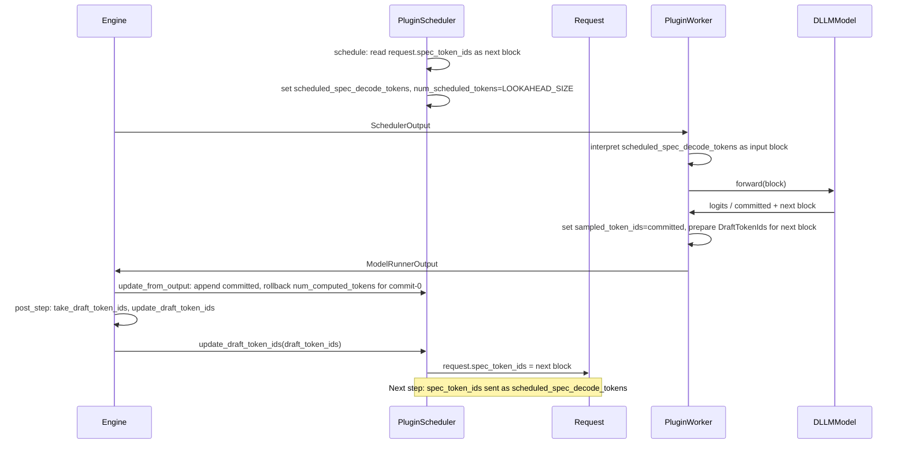

# [RFC]: dLLM support via plugin — minimal-core variant (spec-decode path reuse)

**Author:** (fill when opening issue)  
**Labels:** RFC, plugin, inference

**Relationship to other proposals:** An alternative design adds explicit dLLM types and core scheduler/worker branches in vLLM; in this document that variant is referred to as the "full core-path" design and may be documented separately. This document describes only the minimal-core, spec-decode-reuse variant.

---

## Summary

This RFC describes an **alternative** design for adding block-based diffusion language model (dLLM) support in vLLM via the plugin system. It avoids introducing new core types and core scheduler/worker dLLM logic by **reusing the existing spec-decode data path and scheduler interface**. A single engine behavioral change—calling the draft-token hook after every step when the model was executed, not only when speculative decoding is enabled—allows a plugin to provide a custom scheduler, custom worker, and custom model that implement full dLLM semantics (variable committed tokens, including commit-0) with **maximal encapsulation**. The cost is overloading the meaning of existing spec-decode fields when the plugin’s components are used; this document states the assumptions, reliance, and mild abuse of that path explicitly.

---

## Motivation

Same as the main dLLM plugin RFC: block-based dLLMs offer strong quality/speed tradeoffs; competitors already support them; vLLM users would benefit from running dLLM models in the same engine. This variant prioritizes **minimal upstream change** and **maximal plugin encapsulation** over a dedicated, explicit dLLM path in core.

---

## Assumptions

- **Scheduler interface:** The existing `SchedulerInterface` (including `update_draft_token_ids` and `update_draft_token_ids_in_output`) is stable enough for a plugin to implement a custom scheduler that stores the “next dLLM block” via that method.
- **Engine post-step hook:** The engine can be changed to call `take_draft_token_ids()` and `scheduler.update_draft_token_ids()` after every step when the model was executed, not only when `use_spec_decode` is true. This is backward compatible: the default worker returns `None` from `take_draft_token_ids()` when not doing spec-decode, and the default scheduler’s `update_draft_token_ids` only affects requests that have spec-decode state.
- **Worker selection:** Users can supply a custom worker via `--worker-cls` (or a platform plugin that sets `worker_cls`) when running a dLLM model; core need not auto-detect “dLLM model” and switch worker.
- **One scheduler/worker pair per process:** When using the dLLM plugin, users use the plugin’s scheduler and worker together (e.g. `--scheduler-cls` and `--worker-cls`); no mixing with the default spec-decode path for the same model type in the same run.

---

## Reliance on the spec-decode path

This design **relies on** the following existing behavior and types (unchanged except for the one engine change below):

- **`SchedulerOutput.scheduled_spec_decode_tokens`** — existing field (req_id → list of token IDs).
- **`Request.spec_token_ids`** — existing field (list of token IDs on the request).
- **`ModelRunnerOutput.sampled_token_ids`** — existing field (per-request list of generated token IDs).
- **`DraftTokenIds`** and the worker method **`take_draft_token_ids()`**.
- Scheduler methods **`update_draft_token_ids()`** and **`update_draft_token_ids_in_output()`**.
- The engine calling `take_draft_token_ids()` and `update_draft_token_ids()` after a step when `use_spec_decode` is true (current behavior). The **only** proposed core change is to call this path **whenever the model was executed**, not only when `use_spec_decode` is true.

---

## Mild abuse / overloading (field reuse)

When the plugin’s scheduler and worker are used, the following existing fields and methods are given a **dLLM meaning** in addition to (and mutually exclusive with) their spec-decode meaning:

| Existing field / method | Spec-decode meaning | dLLM meaning (plugin) |
|-------------------------|---------------------|------------------------|
| `Request.spec_token_ids` | Draft token IDs for verification in the next step | Next-step input block (length LOOKAHEAD_SIZE) for the next dLLM forward |
| `SchedulerOutput.scheduled_spec_decode_tokens` | Draft token IDs sent to worker for verification | Input block (length LOOKAHEAD_SIZE) for this step’s dLLM forward |
| `ModelRunnerOutput.sampled_token_ids` | Verified + sampled token IDs (1 + num_accepted) | Committed token IDs (0..LOOKAHEAD_SIZE per request; may be empty) |
| `take_draft_token_ids()` / `update_draft_token_ids()` | Next draft tokens for spec-decode | Next-step input block for dLLM (stored in `request.spec_token_ids`) |

**Commit-0:** The plugin scheduler, in `update_from_output`, treats empty `sampled_token_ids` for a request as “commit 0 tokens.” It then rolls back `num_computed_tokens` for that request by the full number of tokens scheduled in the step (e.g. LOOKAHEAD_SIZE), so that progress and KV accounting remain correct. The core scheduler does not do this rollback when `sampled_token_ids` is empty for non–spec-decode requests today; the plugin’s custom scheduler implements this logic.

---

## Minimal change to core (vLLM)

- **Single behavioral change:** In the engine’s [`post_step()`](https://github.com/vllm-project/vllm/blob/main/vllm/v1/engine/core.py#L410) (and the analogous path in `step_with_batch_queue()`, [lines 514–526](https://github.com/vllm-project/vllm/blob/main/vllm/v1/engine/core.py#L514)), call `take_draft_token_ids()` and `scheduler.update_draft_token_ids()` (or `update_draft_token_ids_in_output` where applicable) **whenever the model was executed**, not only when `use_spec_decode` is true.
- **No new types:** No `DllmStepOutput`, no `scheduled_dllm_input_tokens`, no `next_dllm_input_token_ids` in core.
- **No core scheduler logic:** No dLLM-specific branches in the default scheduler; the plugin provides a custom scheduler class (e.g. via `--scheduler-cls`).
- **No core worker dLLM logic:** The plugin provides a custom worker that interprets `scheduled_spec_decode_tokens` as the dLLM input block, runs the dLLM model, sets `sampled_token_ids` to the committed tokens (variable length, possibly empty), and returns the next block via `take_draft_token_ids()`.

**Exact locations in vLLM:** In the v1 engine core ([`vllm/v1/engine/core.py`](https://github.com/vllm-project/vllm/blob/main/vllm/v1/engine/core.py)):

- **Sync step:** In [`post_step()`](https://github.com/vllm-project/vllm/blob/main/vllm/v1/engine/core.py#L410), the condition that today includes `and self.use_spec_decode` ([line 414](https://github.com/vllm-project/vllm/blob/main/vllm/v1/engine/core.py#L414)) so the body runs only when speculative decoding is enabled is relaxed so that the body (call `take_draft_token_ids()`, then `update_draft_token_ids()` when non-None) runs whenever the model was executed and scheduling is not async—e.g. by removing the `and self.use_spec_decode` guard.
- **Batch-queue (async) path:** In `step_with_batch_queue()`, the block that calls `take_draft_token_ids()` and `update_draft_token_ids_in_output()` when there is deferred scheduler output and [`use_spec_decode` is true](https://github.com/vllm-project/vllm/blob/main/vllm/v1/engine/core.py#L518) (lines 514–526) is changed so that the draft-token update runs whenever deferred output exists and draft token ids are available, without being gated on `use_spec_decode`.

---

## Plugin encapsulation

- **Plugin provides:** A custom scheduler class (used via `--scheduler-cls`), a custom worker class (via `--worker-cls` or a platform plugin that sets `worker_cls`), and custom model class(es) registered via `ModelRegistry` and `vllm.general_plugins`.
- **Plugin does not require:** New core types, changes to the default scheduler implementation, or changes to the model interface beyond what a normal vLLM model implements. The plugin worker is the only component that must know how to turn dLLM model output into `sampled_token_ids` (committed) and next-block `DraftTokenIds`.

---

## Data flow (high level)

- **Plugin scheduler** — `schedule()`: Reads `request.spec_token_ids` (next block), fills `scheduled_spec_decode_tokens`, sets `num_scheduled_tokens` to LOOKAHEAD_SIZE per request. `update_from_output()`: Applies committed tokens from `sampled_token_ids`, rolls back `num_computed_tokens` by (scheduled − committed) so commit-0 is correct, appends to request output. `update_draft_token_ids()`: Writes next block to `request.spec_token_ids`.
- **Plugin worker** — Reads `scheduled_spec_decode_tokens` as input block, runs dLLM forward, sets `sampled_token_ids` = committed (variable length, may be []), provides next block via `take_draft_token_ids()`.
- **Engine** — After the minimal change: after every step when the model was executed, calls `take_draft_token_ids()` and `update_draft_token_ids()` (or the batch-queue equivalent).

---

## Tradeoffs vs. the full core-path RFC

- **Pros:** Minimal core change (relaxing one condition in the engine); no new types; no changes to core scheduler or model interface; full encapsulation of dLLM logic in the plugin (scheduler + worker + model); variable commit including 0 is supported by the plugin scheduler’s rollback logic.
- **Cons:** Overloaded semantics of spec-decode fields; possible confusion when debugging (same field names, different meaning for dLLM); reliance on the stability of the existing spec-decode scheduler interface and post-step hook.

---

## Relation to the full core-path design

That alternative (the "full core-path" design) introduces explicit dLLM types (`DllmStepOutput`, `scheduled_dllm_input_tokens`, `next_dllm_input_token_ids`) and core scheduler/worker branches. That design is the preferred path if the project is willing to add a dedicated dLLM path in core. This document is the “minimal-core, spec-decode reuse” alternative for maximum encapsulation and minimal upstream change.

---

## First architecture / MVP

Same target as the main dLLM plugin RFC: at least one runnable dLLM architecture (e.g. LLaDA2.x) in a plugin, with the plugin providing the custom scheduler and worker and registering the model. MVP means the core engine change above is in place, and one plugin delivers one such architecture with correct block-step semantics and minimal correctness tests; further architectures and optimizations follow without further core changes.

---

## Alternatives

- **Full core path (main dLLM plugin RFC):** Explicit dLLM types and core scheduler/worker branches; no field overloading; more core code, clearer semantics.
- **This minimal path:** Reuse spec-decode path; one engine change; maximal plugin encapsulation; overloaded field semantics.

---

## Feedback period

Two weeks from the date this RFC is posted.

---

## CC list

(When opening the issue, tag relevant committers/area owners for scheduler, worker, plugins, and engine. See vLLM governance / committers.)

---

## Before submitting a new issue

- [ ] Searched for relevant issues and RFCs.
- [ ] Aligned with vLLM Plugin System and Governance Process.
