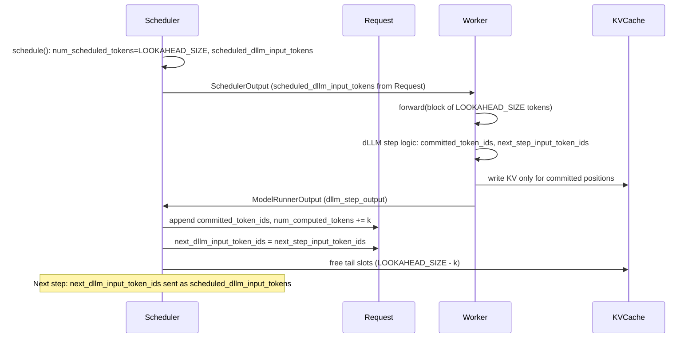

# [RFC]: dLLM (Blocked Masked Diffusion LLM) Support via Plugin

**Author:** (fill when opening issue)  
**Labels:** RFC, plugin, inference

---

## Summary

This RFC proposes first-class support in vLLM for **block-based diffusion language models (dLLMs)**—models that generate text in fixed-size blocks using mask-then-fill decoding instead of strict left-to-right autoregressive decoding—delivered **via the existing vLLM plugin system**. The engine would gain a dLLM execution path (one diffusion step = one worker iteration; committed tokens + next-block input per step), while dLLM **model architectures** would be added by installing a plugin (e.g. `vllm-dllm-plugin`) that registers one or more architectures with `ModelRegistry`, following the [bart-plugin](https://github.com/vllm-project/bart-plugin) pattern. Users could run models from the LLaDA2.x family and others without modifying vLLM core; new architectures would require only a new or updated plugin.

---

## Motivation

Block-based dLLMs are gaining traction: they offer strong quality/speed tradeoffs, and recent benchmarks compare them directly to autoregressive LLMs deployed with vLLM, sometimes showing **order-of-magnitude** throughput or latency wins (e.g. WeDLM, LLaDA2.1, dInfer, FlashDLM). At the same time, **three major vLLM competitors** (SGlang, Ollama, LMDeploy) already support or ship dLLM-style inference; users who want to serve these models today can turn to those stacks. Adding dLLM support in vLLM would keep the ecosystem aligned, let users get reported gains inside the same engine they use for AR, and preserve **extensibility**: by delivering dLLM models via plugins, new architectures (WeDLM, SDAR, Fast-dLLMv2, Mercury 2, etc.) can be added without changing vLLM core—only by publishing and installing a plugin.

---

## Proposed design

### Core (vLLM)

- **One step, one forward:** Each scheduler step corresponds to one forward over a block of fixed size `LOOKAHEAD_SIZE` (e.g. 32 tokens). The worker returns:
  - **Committed tokens:** 0 to `LOOKAHEAD_SIZE` per request (to append to the sequence and write to the KV cache).
  - **Next-step input:** Exactly `LOOKAHEAD_SIZE` token IDs per request for the next forward.
- **Scheduler as single source of truth:** Next-step input is stored on the Request and sent to the worker via `SchedulerOutput.scheduled_dllm_input_tokens` (same pattern as spec-decode draft tokens). The worker is stateless across steps.
- **First decode step:** When sequence length &lt; `LOOKAHEAD_SIZE`, the block is formed by right-padding with `<MASK>` so that “to decode” positions are on the right (context left, masks right).
- **KV cache:** Only committed positions are retained; slots for the rest of the block are freed each step.
- **Prefix caching:** Valid only up to committed length. When a model uses a **fully bidirectional prefill mask**, prefix caching is impossible and must be disabled (engine detects or model declares via config).

### Plugin

- **Registration:** Plugin uses `vllm.general_plugins` (e.g. `dllm=vllm_dllm_plugin:register_dllm_model`) and, in that callable, calls `ModelRegistry.register_model(arch_name, model_class_qualname)` for each dLLM architecture it provides. Re-entrant and idempotent (e.g. check `get_supported_archs()` before registering).
- **Model class:** Implements vLLM’s model interfaces; declares dLLM (config or base class) so the engine uses the dLLM path. The **worker** in core builds `DllmStepOutput` from the model’s forward output and validates lengths; the plugin does not return `DllmStepOutput` directly.
- **Package:** Single plugin package (e.g. `vllm-dllm-plugin` / `vllm_dllm_plugin`) can register multiple architectures (bart-plugin registers BART and Florence2 from one plugin).

### Data flow (high level)

**Contract summary:** The worker returns a `DllmStepOutput` with `req_ids`, `committed_token_ids` (list of lists, length 0..LOOKAHEAD_SIZE per request), and `next_step_input_token_ids` (list of lists, length exactly LOOKAHEAD_SIZE per request). The scheduler appends committed tokens to each Request, updates `num_computed_tokens`, stores `next_dllm_input_token_ids` on the Request, and on the next schedule sends them to the worker as `scheduled_dllm_input_tokens`. The worker validates lengths before returning; when `scheduled_dllm_input_tokens` is missing (e.g. first decode step), the worker builds the block from the last LOOKAHEAD_SIZE tokens of prompt+output or right-pads with `<MASK>`.

---

## First architecture and MVP (LLaDA2.x)

We propose integrating **at least one concrete dLLM architecture** from the **LLaDA2.x family** (Ant Group: LLaDA2.0, LLaDA2.1) as the reference implementation and MVP target.

### Why LLaDA2.x for the first architecture

- **Public presence:** LLaDA2.0 and LLaDA2.1 are cited in benchmarks (~800–900 TPS on coding tasks), support configurable speed vs quality modes, and are representative of block-based dLLMs.
- **Family:** LLaDA2.x provides a single family for MVP (one plugin can register LLaDA2.0 first, then add LLaDA2.1), aligning with “multiple architectures per plugin.”
- **Contract validation:** Implementing one real architecture proves the core contract (LOOKAHEAD_SIZE, committed tokens, next-step input, attention mask) and plugin registration end-to-end.

### MVP for the first architecture

- **MVP = one runnable dLLM architecture in a plugin**, with the core dLLM path in vLLM. Concretely:
  - **Core (vLLM):** dLLM step contract (scheduler/worker, `DllmStepOutput`, `next_dllm_input_token_ids`, `scheduled_dllm_input_tokens`), first-step convention, KV tail free, prefix cache rules. No requirement to ship a model in-tree.
  - **Plugin (e.g. vllm-dllm-plugin):** One architecture registered (e.g. **LLaDA2.0** or **LLaDA2.1**), loadable from HuggingFace or a known checkpoint; correct block-step semantics (output length = prompt length + sum of committed tokens per step); passes a minimal correctness test.
- **Out of MVP for the first release:** Heavy performance tuning, quantization, or shipping multiple LLaDA2.x variants in the first plugin release; those are future optimizations/expansions.

---

## Future work

- **More architectures:** After LLaDA2.x, the same plugin (or new plugins) can add **WeDLM**, **SDAR**, **Fast-dLLMv2**, **Mercury 2**, etc., with no core changes—only new model classes and registration.
- **More LLaDA2.x variants:** LLaDA2.1 (or additional checkpoints) in the same plugin; optional “speed vs quality” modes if exposed via sampling/config.
- **Optimizations:** Attention backend tuning for dLLM block masks; quantization for dLLM layers; prefix-cache tuning for specific architectures; optional dLLM-specific metrics once the path is stable.
- **Out of scope for this RFC:** Training; changes to the plugin system itself beyond using existing `general_plugins` and `ModelRegistry`.

---

## Alternatives considered

- **Core-only (no plugin):** Ship dLLM models in-tree. Rejected: would require core changes for every new architecture and would not leverage the existing plugin extensibility.
- **Plugin-only (no core changes):** Implement the entire dLLM step loop in a plugin. Rejected: the current plugin system does not support registering new scheduler/worker behavior; a platform or new plugin type would be needed and would complicate multi-worker and preemption.
- **New plugin type for dLLM:** Rejected to keep a single extension mechanism (`vllm.general_plugins`) and avoid fragmenting the plugin API; BART and others already use general_plugins for model registration.

---

## Prior art

- **[bart-plugin](https://github.com/vllm-project/bart-plugin):** Registers BART and Florence2 via `vllm.general_plugins` and `ModelRegistry.register_model`; one package, multiple architectures; re-entrant registration.
- **SGlang, Ollama, LMDeploy:** Already support or ship dLLM-style inference (e.g. LLaDA 2.0, block-diffusion text).
- **LLaDA2.x benchmarks and papers:** Reported ~800–900 TPS on coding benchmarks; configurable speed/quality modes.
- **Core dLLM step contract:** The scheduler/worker contract (committed tokens, next-step input, first-step convention, prefix cache) described in this RFC is consistent with vLLM’s existing “one step, one forward” and “scheduler as source of truth” design; this RFC adds delivery via plugin and a concrete first architecture (LLaDA2.x).

---

## Drawbacks / open points

- **Core changes required once:** The dLLM execution path (scheduler/worker/outputs) must be added to vLLM; this is a one-time cost that then allows any plugin-registered dLLM to work.
- **Plugin authors must respect contract:** Model classes must expose block size and step semantics so the worker can build `DllmStepOutput`; invalid output (e.g. wrong lengths) should be validated and fail clearly.
- **Version compatibility:** Plugin declares a minimum vLLM version; compatibility is the plugin author’s responsibility; optional runtime check at registration can warn on version mismatch.
- **Unresolved:** Exact model-class interface for “worker builds DllmStepOutput” (e.g. method on model vs adapter in core) can be finalized during implementation; the contract (lengths, semantics) is fixed.

---

## Feedback period

Two weeks from the date this RFC is posted.

---

## CC list

(When opening the issue, tag relevant committers/area owners for scheduler, worker, plugins, and model loader. See [vLLM governance / committers](https://docs.vllm.ai/en/latest/governance/committers/).)

---

## Before submitting a new issue

- [x] Searched for relevant issues and RFCs.
- [x] Aligned with [vLLM Plugin System](https://docs.vllm.ai/en/latest/design/plugin_system/) and [Governance Process](https://docs.vllm.ai/en/latest/governance/process/).
