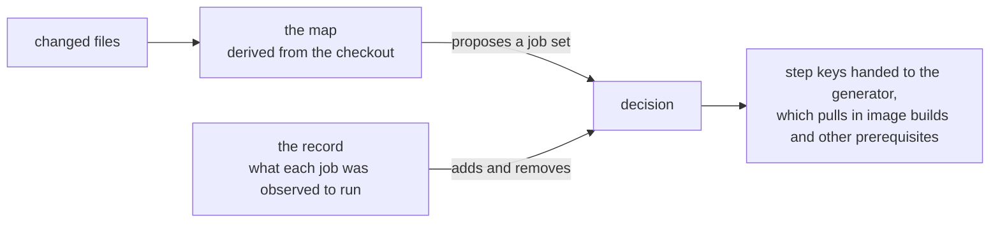

# Automatic CI test selection

A tool that reads a pull request's changed files and works out which CI jobs need to run. It derives that answer from the repository on every run, so there is nothing to keep in sync and nothing to go stale.

Today it only prints. Nothing in CI calls it, so it can be reviewed before it decides anything.

`README.md` covers running it. `ci_selector/decide.py` is the decision rule.

## Terms

A **step** is one job definition in the yaml. A step with `parallelism` fans out into several **jobs**, one per slice; CI time is measured in jobs. A **device family** is the hardware a step targets: cuda, rocm, cpu, xpu and so on.

## 1. Problem

The pull request pipeline is about 330 step definitions. A program in `vllm-project/ci-infra` (the **generator**) reads the step yaml and decides which to emit, from two hand-written inputs:

- **`source_file_dependencies`**, a path list on each step. Roughly 500 steps carry one, adding up to well over a thousand path entries.
- **`run_all_patterns`**, eleven paths that force a full run: `csrc/`, `cmake/`, `CMakeLists.txt`, `setup.py`, the Dockerfile, several requirements files. A second list in the same file, `run_all_exclude_patterns`, vetoes five of those matches (`csrc/cpu/`, `csrc/rocm/`, `cmake/hipify.py`, `cmake/cpu_extension.cmake`, the suffixed Dockerfiles).

Both describe the code from memory, and the code moves, so both drift. The drift costs in two directions.

**Stale entries silently skip tests.** Nothing detects this, so the list stays wrong until someone traces a breakage back to it. Eight of the `csrc/` prefixes declared across `.buildkite` point at paths that no longer exist after the stable-ABI move, and a CPU step runs the Rust tool-parser tests without declaring `rust/`.

**Broad entries run tests that cannot be affected.** Thirty-seven steps declare a bare `vllm/`, so they run on nearly every change.

Both follow from the same thing: the mapping from code to tests is maintained by hand, in a different repository from the code it describes, at a size nobody can review against the import structure.

## 2. Failure direction

The two ways to be wrong do not cost the same. Running a job that did not need to run wastes resource. Skipping a job that would have caught a bug ships the bug.

Every decision is therefore one-directional. Where anything is unknown, unparsable or ambiguous, the tool selects more:

| situation | result |
| --- | --- |
| a file will not parse | run everything |
| a file holds a dynamic import the tool cannot model | run everything |
| a derived table comes back empty | run everything |
| `git show` cannot produce a file's base version | that file yields no changed function names, so nothing it reaches can be dropped |

The last row is the narrowest of the four and worth being concrete about. Working out which functions a diff touched means reading both sides of each file, and the base side comes from `git show <base>:<path>`. When that exits non-zero, times out, or returns bytes that are not UTF-8, the file contributes an empty name set. The record then has nothing to match against, so every step that file reaches is kept.

## 3. Design



Two independent sources of evidence. The map proposes, the record adjusts in both directions.

### 3.1 The map

Built from the checkout at the commit the pull request branched from. It never looks at the diff, so it is the same work for any pull request against that base, and takes seconds on CPU.

An import graph alone is not enough. vLLM reaches code by name, through registries, shell commands and container images, and an import-only view is blind to all of it. So the map derives several things and routes each changed file through whichever fits:

| derived from the repo | answers |
| --- | --- |
| the import graph | ordinary Python reach |
| each step's shell commands, following scripts three levels deep | which test files a job runs, as opposed to what its label suggests |
| the model and quantization registries | files loaded by name at runtime, which no import edge connects |
| the container image build graph | anything baked into an image rather than imported |
| the CMake build map | which device families compile a given `csrc` or `cmake` file |
| native op registration sites, joined to `torch.ops.<ns>.<op>` call sites | which Python wrappers dispatch to a given kernel |
| the Cargo workspace | which shipped artifact a Rust crate feeds |

All of it is parsed, with tests. A file that fits no mechanism runs everything.

### 3.2 The record

One row per step, holding the function names that step was observed to enter, keyed by file and identified by full qualified name so that fifty different `forward` methods do not collapse into one.

It is collected by instrumenting full CI runs. The recorder subscribes to CPython's `sys.monitoring` function-start event and returns `DISABLE` from the callback, so each function costs one event ever. Across the 222 jobs that both an instrumented sweep and a plain scheduled run passed, total wall clock was 83.2 hours against 83.3.

Every row carries a trust stamp: which builds and jobs fed it, whether they passed, whether tests executed, whether every parallel slice reported. A row whose stamp shows any weakness can add jobs but never remove one.

### 3.3 Why both

The map is complete but imprecise. It can answer for the whole repository, including files never observed, but it reasons about reach rather than risk. The record is precise but partial, and only knows what it has watched.

PR 51726 is the case that separates them: it doubled a default `max_num_batched_tokens` and failed two B200 eval jobs. The change was a value rather than a shape, so structural rules have nothing to grip. The record caught it, having observed those jobs executing the changed code.

The record is not there to save jobs. It covers what structural rules cannot express.

## 4. Example

Three changed files, one of each kind.

**`vllm/model_executor/models/qwen3.py`**, a model file. Reached by name through the model registry rather than by import, so the map routes it to the steps whose commands mention that architecture, plus everything that imports it. The record then checks each: a step whose row shows it entered the changed functions is kept, and a step whose row shows it entered none of them can be dropped.

**`tests/entrypoints/openai/chat_completion/test_chat.py`**, a test file. The map asks which steps run this path, parsed from their shell commands rather than inferred from their labels. That answer is exact, so the record adds nothing.

**`csrc/libtorch_stable/attention/merge_attn_states.cu`**, a kernel. No Python frame exists for it, so the record cannot speak about it directly. The map scopes it to the device families CMake says compile it, then translates the change into the ops that file registers and joins those to the `torch.ops.*` call sites in `vllm/`. That produces Python wrapper names, which the record can answer.

The three answers are unioned, so a step needed for any one file runs. Had any file said "run everything", the whole pipeline runs and no drop applies anywhere in that diff.

## 5. Decision

Per changed file, never per diff.

| for changed file F and step S | decision |
| --- | --- |
| a row shows S ran changed code in F | run S. One observation is enough, and nothing about the row's health can make it untrue |
| a row shows S ran none of it | drop S, if the lookup below allows it |
| S has no row, or F is something the recorder cannot see | the map decides; the record has nothing to say |

### 5.1 Dropping

Selecting takes one observation and no gates. Dropping means trusting a silence, and a silence is only evidence if the recorder was watching: watching that file, during a run that finished, on code that still exists. The lookup returns one of thirteen verdicts, and two of them permit a drop.

| verdict | result |
| --- | --- |
| no table loaded, or it failed to parse | keep |
| the row failed verification at load | keep |
| the step has no row | keep |
| the row is present and empty | keep |
| the row is too thin to read a silence from: a slice missing, tests all skipped, lines lost | keep |
| some job that built the row was not marked passed | keep |
| the row was recorded by a different Python | keep |
| some changed file in scope is one the recorder could not see | keep |
| a changed file names no function at all, such as a config or a data file | keep |
| nothing in the diff names anything a row could hold, so "no match" would be emptiness rather than absence | keep |
| the diff names things, but every changed name runs at import rather than being callable, so no row could ever hold one | **drop** |
| the row shows the step ran one of the changed functions | keep |
| the row shows it ran none of them | **drop** |

These are the `Evidence` enum in `coverage/table.py`, one branch each. Code the recorder has never seen falls into the "could not see" row and blocks dropping outright.

## 6. Non-Python

None of it routes through imports, so each surface has its own derived mechanism.

| surface | routing | droppable on evidence |
| --- | --- | --- |
| `csrc/`, `.cu`, `.cpp`, headers | CMake device families, plus the op-to-wrapper bridge | yes, through the wrapper names |
| `cmake/` | the same build map, inheriting the context it is included from | no |
| `rust/` | which shipped artifact the crate feeds, not which image copies it | no |
| Dockerfiles, `requirements/` | the image build graph | no |
| `.buildkite/` config | twelve ordered rules: defines steps, matches a step's targets, is a Dockerfile input, and so on | no |
| docs, `.github/`, markdown | nothing to run; a docs-only diff emits nothing | n/a |

Measured on 25 C++/cmake/requirements pull requests: 4,284 jobs against CI's own 4,511. `cmake/cpu_extension.cmake` alone goes from 244 jobs to 20, against CI's 21. On 13 Rust pull requests the routing took selection from 9.2x of CI down to 1.1x, with a Rust-only change picking 16 jobs against CI's 14.

Two of these rules answer narrower than "run everything", which is the only place the tool volunteers less under uncertainty. Scoping a build file to its compiling families is a reading of what CMake declares rather than a guess. And a file no mechanism reaches, that no image copies and no step names, runs only the always-on builds, because nothing claiming it is itself evidence.

`CMakeLists.txt` and `pyproject.toml` still run everything, since they compile into every wheel. Outside the op bridge there is no execution evidence for a non-Python file, so those surfaces narrow by reasoning about the build and never by observation.

## 7. Integration

The generator reads `VLLM_CI_ONLY_STEP_KEYS`, an environment variable holding a list of step keys, and walks each named step's `depends_on` chain for everything else. The tool names test steps only; image builds and other prerequisites follow.

Emission is the one place where a bug makes CI run less rather than more. Three failure modes resolve to omitting the variable, and an omitted variable means the generator applies its own rules: when the answer is "run everything", when a selected step cannot be named, and when the key set is empty, since an empty list would mean "run nothing". The same holds a level up, where a crash or timeout leaves the variable unset.

Two gaps are open.

**Emitted names are not verified against the generator.** The safeguard above only fires when the tool can produce no name at all. A name it produces but spells wrong passes, and two things cause that. The tool predicts each key by transcribing the generator's own derivation function, so if that function changes upstream and the transcription does not, the name stops matching. And AMD mirror steps are created only when no key list is passed, so naming one can never match. The generator then rejects the name and the whole upload fails.

**`VLLM_CI_ONLY_STEP_KEYS` reaches one pipeline only.** Everything above rests on setting that variable on a build, and it is set per build on one named pipeline. Some pull requests also trigger `amd-ci` or `intel-ci` through a label, and those are separate builds that never receive it, so they run unchanged and gain nothing. Handing them the same list would not work either: amd-ci renders a legacy template that reads no variable at all, and intel-ci runs a forked generator in which none of the emitted keys name a step. Neither pipeline has been scored, since crosscheck filters to the pull request pipeline, and neither has coverage rows.

## 8. Limits

- **Core changes still run most of the pipeline.** Roughly 900 files under `vllm/` sit in one import cycle, so reach cannot tell them apart. Routing those by the tests beside them was the single biggest improvement, and it still plateaus, because the end-to-end jobs do execute that code. Running nearly everything for a hot core function is the correct answer.
- **Non-Python changes can add jobs but mostly cannot drop them**, outside the op bridge.
- **Hardware families whose images do not carry the recorder have no rows**, so nothing there is ever dropped. CPU, Arm, TPU, XPU and several others start their own containers, so the recorder never loads into the interpreter that runs the tests. (Fixable upstream: three flags on each hardware script's `docker run`.)
- **One file of hardcoded facts about the tree survives**, around 550 lines. It is the real maintenance surface, and what most of the guards below watch.
- **Safety rests on eight cases.** Replaying history is one-sided: a loss is visible because the job ran and failed, but a win is not, since today's rules would have had to skip the job for us to beat them, so it never ran.

Closing that last one needs data history cannot supply. The way to get it is shadow mode: run the tool on real pull request builds alongside today's CI, gate nothing, and record what it would have skipped against what actually ran and failed.

## 9. Guards

vLLM keeps changing underneath the tool, so the checks are part of it rather than a phase of building it.

**Drift tests.** 67 tests read the real vLLM and ci-infra trees and fail when something moves. Each failure message is written for a vLLM contributor who has not seen this tool: what moved, what it costs selection, and the exact edit.

**Detection floors.** Every check asks whether anything unknown is present, and that question reports green when the detector has stopped detecting, because zero findings and zero capability look identical from outside. So checks assert their own output volume. The comparison against a snapshot of the generator fails if it verified fewer than a thousand cases, so a parser that stops finding things fails loudly rather than reporting a clean repository.

**Preflight, on every selection.** Nine derived tables are checked for emptiness, an unknown yaml field on a step force-selects that step, an unreadable command force-selects, and a device outside the known hardware taxonomy switches off the rules that depend on it.

**Crosscheck.** Given real pull request numbers, it rebuilds the tool's state at each base, runs both inputs and a replica of today's generator, and compares all three against the jobs Buildkite ran and which of those failed.

## Usage

Python 3.12 or newer, depending only on `pyyaml` and `regex`.

```bash
ci-select --repo . --diff origin/main...HEAD             # both inputs, the real answer
ci-select codemap --repo . --diff origin/main...HEAD     # the map alone, for comparison
ci-select --repo . --diff origin/main...HEAD --emit-keys # the same run, as the key list CI would consume
ci-validate crosscheck --repo . --prs 50219              # replay a real PR against real Buildkite outcomes
```

The range must be two-ended. A one-ended range compares against the working tree, which skips the base checkout, so added-file routing never fires.
