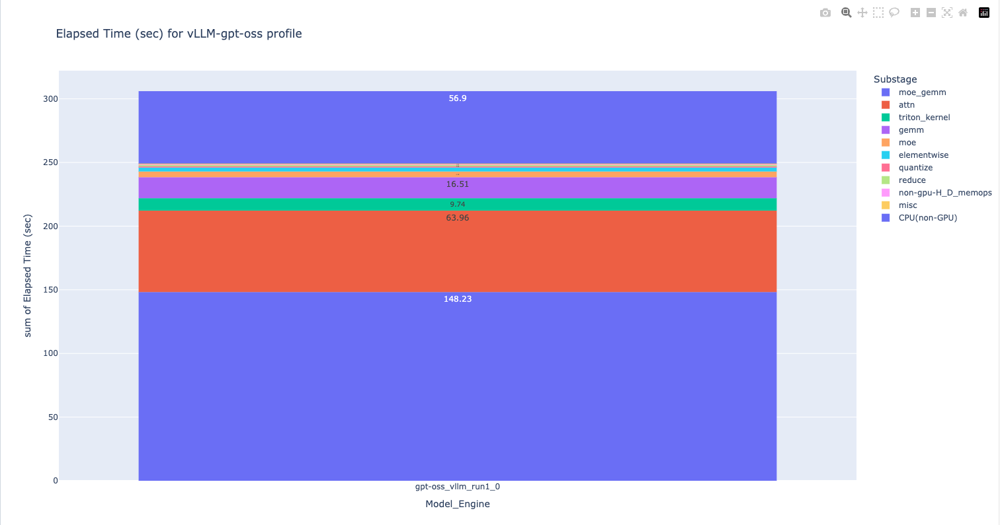
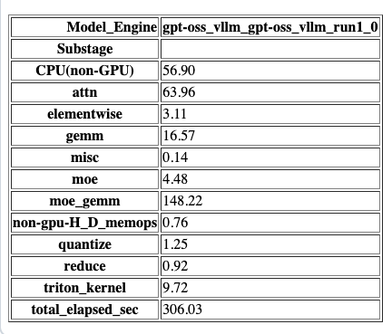
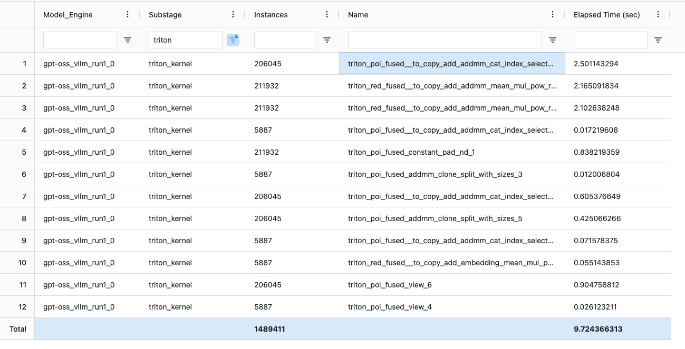

# gputrc2graph.py

This script processes NVIDIA Nsight Systems (`nsys`) GPU trace files
(`.nsys-rep`) with -t cuda tracing enabled, and generates kernel-level
summaries and visualizations of GPU and non-GPU time. It is useful for
profiling and analyzing nsys profile output.

## Usage

### Command-line Arguments

- `--in_file`  
  **(required)**  
  List of input files and their metadata. Each entry should be in the format:  
  `<nsys-rep>,<engine>,<model>,<elapsed_nonprofiled_sec>`  
    - `nsys-rep`: Path to the `.nsys-rep` file.
    - `engine`: Engine name (e.g., `vllm`).
    - `model`: Model name (e.g., `llama`, `gpt-oss`, `ds`).
    - `elapsed_nonprofiled_sec`: Wall-clock runtime (in seconds) without
    profiling. Specify `0` to use the elapsed time from the nsys-rep file
    (this may inflate non-GPU time if actual runtime without profiling is
    less). Multiple entries can be provided, separated by spaces.

- `--out_dir`  
  Output directory for the generated CSV and HTML files.  
  If not specified, results are saved in the current directory.

- `--title`  
  Title for the HTML chart/visualization.

- `--nsys_cmd`  
  Path to the `nsys` command.  
  Default: `nsys` (assumes it is in your PATH).  
  Use this if `nsys` is not in your system PATH.

## Notes

- Make sure you have pandas installed.
- Make sure [nsys](https://developer.nvidia.com/nsight-systems/get-started) is installed, and specify the path to the `nsys` command with `--nsys_cmd` if it is not in your PATH.
- For more details on available engines and models, see the help string in
  the script or run:

```bash
python3 gputrc2graph.py --help
```

## Example 1: analyze a single profile

To analyze the GPU cycles for say, gpt-oss model with vLLM engine:

1. Run the following command to collect nsys profile, for vllm serve config.

   ```bash
   nsys profile -t cuda -o run1 -f true --trace-fork-before-exec=true \
   --cuda-graph-trace=node --delay <DELAY> --duration <DURATION> \
   vllm serve openai/gpt-oss-120b ...
   ```

   where:

   - DELAY: how many seconds to delay nsys from collecting profiles, needed so
     that profiles aren't captured till vllm server has come up and load
     generation starts.
   - DURATION: how many seconds for nsys profile to run before generating the
     profile. This should be > the duration of the run.

2. Run again, this time without collecting the profile, and get the total run
   time in seconds. This value will be used by the script to calculate the
   CPU(non-GPU) seconds for the analysis.

3. Say the run elapsed time is 306 seconds, from step #2. Run script to
   analyze:

   ```bash
   python3 gputrc2graph.py \
   --in_file run1.nsys-rep,vllm,gpt-oss,306 \
   --title "vLLM-gpt-oss profile"
   ```

The command will produce 2 files for analysis:

- result.html: this categorizes kernel names into different categories in a
  stacked bar chart.
- result.csv: shows how the kernel names are mapped to the different
  categories.

### HTML visualization with result.html

The html file shows the number of elapsed seconds due to different GPU
Substages or categories, which consist of moe_gemm (Mixture of Experts GEMM)
kernels the biggest category, at 148 seconds, followed by "attn" or attention
kernels. This lets the user prioritize the kernels to focus on for performance
optimizations.



There's also an appended data table underneath the bar chart for copying out to other post-processing tools.



### Kernel to category mapping with result.csv

Suppose the user would like to focus on improving triton kernels. It's not the
biggest consumer of cycles at 9.74 sec but perhaps it hasn't been optimized.
The next step is to use the result.csv to dive into what the kernels are which
compose the triton kernel GPU cycles. The following image shows that
triton_poi_fused__to_copy_add_addmm_cat_.. kernel to be the biggest
contributor to GPU cycles.



## Example 2: analyze multiple profiles

Suppose the user has multiple nsys trace files, captured for different models,
say llama and gpt-oss in this case, and wish to compare their GPU/non-GPU
time, something like the following command can be used.

```bash
python3 gputrc2graph.py \
--in_file run1.nsys-rep,vllm,llama,100 run2.nsys-rep,vllm,gpt-oss,102 \
--out_dir results \
--title "Comparison of vLLM Models"
```

The analysis process is similar to example 1 but now there will be multiple
stack bar charts that can be compared.  The categories for the different
kernels will remain the same, so that it's easy to compare the GPU cycles for
the same categories.

Once a category is shown to have more cycles for one configuration than
another, the next step would be to use the csv file to see what kernels are
mapped into that category, and which kernels are taking the largest amount of
time which would cause a difference for the overall category.

## Example 3: add new classification for a new model

To create a new engine DEF with model ABC, just add another json file in the same directory as
gputrc2graph.py with the same format as the other json files. The script will automatically pick up all the json files in the same directory as engine/model specifications.

Then, for this new model, suppose there are 4 kernels to be classified into "gemm" and "attn", where the gemm kernels
have names with "*H*" or "*I*" in them, and attn kernels have names with "*J*"
or "*K*" in them, just add another .json file in the same directory as
gputrc2graph.py with the same format as the other json files, like the following:

```json
{
  "DEF": {
      "ABC": { 
          "H|I": "gemm",
          "J|K": "attn",
          "CUDA mem": "non-gpu-H_D_memops",
          ".*": "misc"
      }
  }
}
```

Each entry in the dictionary consists of:

- key: a regex used to classify the kernels
- value: the category to classify the kernels into.

The last 2 entries are common for all engine/models, consisting of CUDA memory
operations and a 'misc' for anything that's leftover and can't be classified.

When invoking gputrc2graph.py, specify a trace file with this new model/engine
like the following:

```bash
--infile new.nsys-rep,DEF,ABC,<runtime>
```

If the engine_DEF.json file already exists, just add the model as a new node in
the existing engine file, after the other models.
