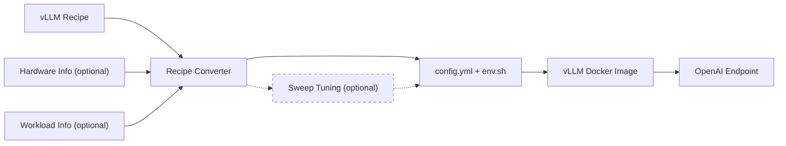

# vLLM Recipes Tools

Convert a vLLM Recipes deployment rendering into files for `vllm serve`.

## Optimized Deployment Flow



The recipe is the baseline. Hardware and workload information can optionally
refine the initial configuration. Sweep tuning is an optional validation step.

## 1. vLLM Recipes Only

Use the converter directly when the recipe already contains the deployment
settings you need. This path requires only PyYAML; the vLLM Python package is
not required unless optional runtime tuning or sweep generation is requested.

```bash
pip install pyyaml
```

Choose whichever recipe-selection method fits the workflow:

**Interactive discovery** — search models, then choose hardware and strategy:

```bash
python3 tools/recipes/recipe_json_to_vllm_config.py
```

**Non-interactive discovery** — provide model and hardware and use the
Recipes-recommended strategy:

```bash
python3 tools/recipes/recipe_json_to_vllm_config.py \
  --model meta-llama/Llama-3.1-8B-Instruct \
  --hardware xeon6
```

**Direct JSON input** — use a Recipes JSON URL or a local JSON file:

```bash
python3 tools/recipes/recipe_json_to_vllm_config.py \
  https://recipes.vllm.ai/meta-llama/Llama-3.1-8B-Instruct/hw/xeon6.json

python3 tools/recipes/recipe_json_to_vllm_config.py recipe.json
```

All paths generate `config.yml` and `env.sh`. See
[REFERENCE.md](REFERENCE.md) for recipe discovery, strategy selection, direct
JSON input, custom output files, and deployment scope.

## 2. Hardware Information (Optional)

Add `--detect-hardware` when the target host's effective CPU/NUMA/memory
resources should refine deployment-sensitive values such as
`tensor-parallel-size` and `gpu-memory-utilization`.

```bash
python3 tools/recipes/recipe_json_to_vllm_config.py \
  --model meta-llama/Llama-3.1-8B-Instruct \
  --hardware xeon6 \
  --detect-hardware
```

Hardware detection is optional and uses vLLM CPU resource utilities only when
requested. See [RUNTIME_TUNING.md](RUNTIME_TUNING.md#hardware-information).

## 3. Workload Information (Optional)

Workload hints can refine scheduler settings for one initial deployment
suggestion. Inputs include token lengths, concurrency, and optional latency or
capacity objectives.

```bash
python3 tools/recipes/recipe_json_to_vllm_config.py \
  --model meta-llama/Llama-3.1-8B-Instruct \
  --hardware xeon6 \
  --input-tokens 128 \
  --output-tokens 128 \
  --concurrency 32 \
  --ttft-sla-ms 3000 \
  --tpot-sla-ms 100
```

Hardware detection and workload information are independent optional inputs;
they can also be supplied together. See
[RUNTIME_TUNING.md](RUNTIME_TUNING.md#workload-information) for the supported
inputs and how runtime parameters are calculated.

## 4. Sweep Tuning (Optional)

Use `--generate-sweep` when the initial scheduler suggestion should be validated
with `vllm bench sweep serve`. The sweep benchmarks nearby scheduler values and
`recommend.py` produces one measured `recommended-config.yml` plus the
selection evidence in `recommendation.json`.

```bash
python3 tools/recipes/recipe_json_to_vllm_config.py \
  --model meta-llama/Llama-3.1-8B-Instruct \
  --hardware xeon6 \
  --detect-hardware \
  --input-tokens 128 \
  --output-tokens 128 \
  --concurrency 32 \
  --generate-sweep
```

See [SWEEP_TUNING.md](SWEEP_TUNING.md) for the benchmark, recommendation, and
vLLM CPU Docker-shell workflow.

## Start vLLM

```bash
source env.sh
vllm serve --config config.yml
```
