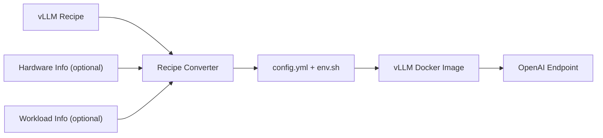

# vLLM Recipes Tools

Utilities for consuming deployment configurations from [vLLM Recipes](https://recipes.vllm.ai/) and converting them into files that can be used directly with vLLM.


## Optimized Deployment Flow

The recipe provides the validated deployment baseline. Hardware and workload
information are optional inputs that can refine deployment-sensitive values
before the generated configuration is passed to vLLM.




## `recipe_json_to_vllm_config.py`

Converts a hardware-specific vLLM Recipes JSON rendering into:

- `config.yml` — native configuration for `vllm serve --config`
- `env.sh` — environment variables required by the recipe

The converter uses the Recipes JSON API as the source of truth. It does not reimplement model-variant, hardware, or strategy compatibility rules.

## Install Dependency

```bash
pip install pyyaml
```

## Recipe Selection Model

Discovery follows the JSON links published by vLLM Recipes:

```text
/models.json
    -> /{hf_id}.json
        -> recommended_command.by_hardware[{hardware}]
            -> /{hf_id}/hw/{hardware}.json
                -> recommended strategy
                -> alternatives[{strategy}]
```

The per-hardware JSON is the recommended deployment rendering for that model and hardware. Alternative strategy renderings are referenced through the JSON's `alternatives` map.

The converter follows those exact links instead of constructing strategy paths locally. This also handles the Recipes API's legacy default-hardware strategy path automatically.

## Interactive Recipe Discovery

If you do not know the recipe JSON URL, run the script without an input:

```bash
python3 tools/recipes/recipe_json_to_vllm_config.py
```

The script will:

1. Search the Recipes model index, including promoted variant model IDs.
2. Ask which model to use.
3. Show the hardware configurations available for that model.
4. Show the recommended strategy and generated alternative strategies.
5. Resolve the exact Recipes JSON endpoint.
6. Generate `config.yml` and `env.sh`.

Example interaction:

```text
No recipe JSON supplied; starting Recipes API discovery.
Model search (for example: llama 3.1): llama 3.1 fp8

Matching models:
  [1] nvidia/Llama-3.1-8B-Instruct-FP8 — Llama-3.1-8B-Instruct [Meta]
Select model: 1

Available hardware:
  [1] arc_pro_b70
  [2] b200
  [3] h100
Select hardware: 1

Available strategies:
  [1] single_node_tp (recommended)
  [2] multi_node_tp
Select strategy: 1

Resolved recipe:
  Model:    nvidia/Llama-3.1-8B-Instruct-FP8
  Hardware: arc_pro_b70
  Strategy: single_node_tp
  JSON:     https://recipes.vllm.ai/nvidia/Llama-3.1-8B-Instruct-FP8/hw/arc_pro_b70.json
```

## Non-Interactive Recipe Discovery

For automation or CI, specify the model and hardware directly:

```bash
python3 tools/recipes/recipe_json_to_vllm_config.py \
  --model meta-llama/Llama-3.1-8B-Instruct \
  --hardware xeon6
```

When `--strategy` is omitted with both `--model` and `--hardware`, the converter uses the Recipes-recommended strategy from the per-hardware JSON.

To request a generated alternative strategy explicitly:

```bash
python3 tools/recipes/recipe_json_to_vllm_config.py \
  --model nvidia/Llama-3.1-8B-Instruct-FP8 \
  --hardware arc_pro_b70 \
  --strategy multi_node_tp
```

The converter does not synthesize a URL such as `.../strategies/multi_node_tp.json`. It reads the selected hardware JSON and follows the exact `alternatives["multi_node_tp"]` link published by the Recipes API.

## Direct Recipe JSON Input

If you already know the recipe JSON URL:

```bash
python3 tools/recipes/recipe_json_to_vllm_config.py \
  https://recipes.vllm.ai/meta-llama/Llama-3.1-8B-Instruct/hw/xeon6.json
```

A local JSON file is also supported:

```bash
python3 tools/recipes/recipe_json_to_vllm_config.py recipe.json
```

When a positional JSON source is supplied, do not combine it with `--model`, `--hardware`, or `--strategy`.

## Start vLLM

After generating the files:

```bash
source env.sh
vllm serve --config config.yml
```

Example generated `config.yml`:

```yaml
model: meta-llama/Llama-3.1-8B-Instruct
tensor-parallel-size: 1
```

If the selected recipe does not require environment variables, `env.sh` will contain no additional exports.

## Custom Output Files

```bash
python3 tools/recipes/recipe_json_to_vllm_config.py \
  --model meta-llama/Llama-3.1-8B-Instruct \
  --hardware xeon6 \
  --config-out llama31-xeon6.yml \
  --env-out llama31-xeon6-env.sh
```

## Strategy and Deployment Scope

Strategy discovery and config conversion are separate concerns.

The converter can resolve any generated strategy JSON exposed by the Recipes API. It currently emits one `config.yml`, so the selected rendering must contain a single `vllm serve` `argv`.

Single-process renderings such as `single_node_tp` can be converted directly. Multi-node, disaggregated prefill/decode, or other multi-process renderings expose fields such as `head_argv`, `worker_argv`, `prefill`, or `decode`; the converter intentionally exits instead of generating an incomplete single-process config.

## Optional Runtime Tuning

The Recipes JSON remains the baseline. vLLM Recipes already provide validated
model, hardware, strategy, environment variables, and serving arguments.
Runtime tuning is optional and is intended for parameters whose best value can
depend on the actual deployment resources or expected request workload.

### Deployment-Time Parameters

The parameters below may already exist in a recipe. They are candidates for
deployment-time refinement when the recipe value is missing, generic, or based
on a validation environment that differs from the user's target deployment.

| Runtime parameter | Why it may need deployment-time refinement | Main decision input | Current draft policy |
| --- | --- | --- | --- |
| `tensor-parallel-size` | The effective CPU/NUMA topology available to a container or pod can differ from the system used to validate the recipe. | Hardware topology | Use the largest power-of-two TP value that does not exceed the effective NUMA-node count. |
| `gpu-memory-utilization` | Available memory can differ by machine size, container limits, and other memory use. The vLLM option name is also used by the CPU backend. | Hardware memory + recipe baseline | Compute a conservative safe fraction, reserve 10%, cap at `0.90`, and never increase a smaller recipe value. If the recipe omits it, start from `0.80`. |
| `max-num-seqs` | The useful scheduler concurrency depends on the number of requests expected to be active at the same time. | Workload concurrency | Set `max-num-seqs` to `--concurrency`. |
| `max-num-batched-tokens` | The batching budget depends strongly on request input length and concurrency. | Workload token shape + concurrency | Compute `input_tokens * min(concurrency, 8)`, round up to a power of two, and clamp to `2048..32768`. |
| `data-parallel-size` | The required replica count depends on the requested throughput and the capacity of one replica. | Capacity target | Keep the recipe value today. `--target-qps` is captured for a future capacity-based policy. |

These policies are intentionally isolated in `runtime_tuning.py` so the
decision rules can evolve as more benchmark data becomes available.

### How Runtime Tuning Determines the Values

The converter can combine the recipe baseline with optional deployment
information. Different information sources are used for different parameters:

| Information source | How it is obtained | Examples | Parameters it can help determine |
| --- | --- | --- | --- |
| vLLM Recipe | Recipes JSON API or direct recipe JSON | model ID, recipe hardware, strategy, existing `argv`, environment variables | Provides the baseline for all parameters and selects the applicable hardware tuning policy. |
| Hardware (optional) | `--detect-hardware` | effective NUMA nodes, allowed CPUs, physical cores, per-NUMA total/available memory | `tensor-parallel-size`, `gpu-memory-utilization` |
| Workload (optional) | User CLI inputs | `--input-tokens`, `--output-tokens`, `--concurrency` | `max-num-seqs`, `max-num-batched-tokens`; output length is also available for future KV-cache-aware policies. |
| SLO / capacity (optional) | User CLI inputs | `--ttft-sla-ms`, `--tpot-sla-ms`, `--target-qps` | Future SLA-aware batching and `data-parallel-size` capacity decisions. |

All additional inputs are optional. If none are supplied, the converter keeps
the normal Recipes conversion behavior.

The effective precedence is:

```text
vLLM defaults
    -> vLLM Recipes baseline
        -> hardware refinement (optional)
            -> workload / SLO refinement (optional)
                -> config.yml + env.sh
```

For example, hardware detection can refine TP and memory sizing without any
workload input:

```bash
python3 tools/recipes/recipe_json_to_vllm_config.py \
  --model meta-llama/Llama-3.1-8B-Instruct \
  --hardware xeon6 \
  --detect-hardware
```

Workload information can be added when it is known:

```bash
python3 tools/recipes/recipe_json_to_vllm_config.py \
  --model meta-llama/Llama-3.1-8B-Instruct \
  --hardware xeon6 \
  --detect-hardware \
  --input-tokens 2048 \
  --output-tokens 128 \
  --concurrency 32 \
  --ttft-sla-ms 3000 \
  --tpot-sla-ms 100
```

`--output-tokens`, `--ttft-sla-ms`, and `--tpot-sla-ms` are accepted as policy
inputs, but the current draft does not force them into an arbitrary formula.
Output length affects KV-cache residency and request lifetime, while TTFT and
TPOT constrain how aggressive scheduler batching can be. These inputs can be
used once benchmark-derived or otherwise validated decision rules are available.

### Runtime-Tuning Hardware Scope

Runtime tuning is selected from the resolved recipe JSON's `hardware` field,
rather than by inspecting which physical devices happen to be present on the
host. This matters because a GPU server also exposes its host CPU topology.

The current runtime-tuning policy registry contains `xeon6`. A tuning request
for unregistered recipe hardware, such as `b200`, fails before host hardware
detection:

```text
ERROR: Runtime tuning is not supported for recipe hardware 'b200'.
Currently supported: xeon6.
```

Plain recipe conversion remains available for all recipe hardware. The gate only
applies when optional runtime-tuning inputs are requested.

The implementation remains modular:

- `hardware_detection.py` collects effective CPU/NUMA/memory information.
- `runtime_tuning.py` owns hardware-policy selection and independent parameter
  tuning functions.
- `recipe_json_to_vllm_config.py` resolves the recipe, collects optional inputs,
  applies the selected policy, and generates `config.yml` and `env.sh`.
