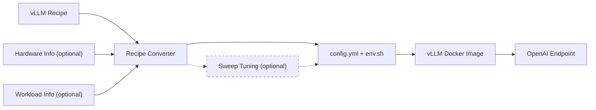

# vLLM Recipes Tools

Convert a vLLM Recipes deployment rendering into files for `vllm serve`.

## Optimized Deployment Flow



The recipe is the baseline. Hardware and workload information can optionally
refine the initial configuration. Sweep tuning is an optional validation step.

## Quick Start

Recipe-only conversion requires only PyYAML:

```bash
pip install pyyaml
```

The vLLM Python package is not required when only converting a Recipes JSON
rendering with no runtime tuning, hardware detection, or sweep.

```bash
python3 tools/recipes/recipe_json_to_vllm_config.py \
  --model meta-llama/Llama-3.1-8B-Instruct \
  --hardware xeon6
```

This writes `config.yml` and `env.sh`.

```bash
source env.sh
vllm serve --config config.yml
```

## Optional Tuning

For recipe discovery, strategy handling, runtime parameters, and initial-value
calculation details, see [REFERENCE.md](REFERENCE.md).

For sweep tuning, post-sweep recommendation, and the Docker-shell workflow, see
[SWEEP_TUNING.md](SWEEP_TUNING.md).
