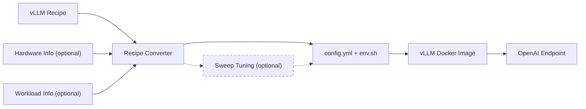

# vLLM Recipes Tools

Convert a vLLM Recipes deployment rendering into files for `vllm serve`.

## Optimized Deployment Flow



The recipe is the baseline. Hardware and workload information can optionally
refine the initial configuration. Sweep tuning is optional.

## Getting Started

Use `serve_with_recipe.sh` to generate the recipe configuration and start vLLM:

```bash
tools/recipes/serve_with_recipe.sh \
  --model meta-llama/Llama-3.1-8B-Instruct \
  --hardware xeon6
```

For `xeon6`, hardware detection is enabled automatically. The sections below
show the individual configuration and tuning steps.

## Detailed Deployment Workflow

### 1. vLLM Recipes Only

Use the converter directly when the recipe already contains the deployment
settings you need. This path requires only PyYAML; the vLLM Python package is
not required unless optional runtime tuning or sweep generation is requested.

```bash
pip install pyyaml
```

For non-interactive discovery, provide the model and hardware and use the
Recipes-recommended strategy:

```bash
python3 tools/recipes/recipe_json_to_vllm_config.py \
  --model meta-llama/Llama-3.1-8B-Instruct \
  --hardware xeon6
```

#### 1.1 Interactive Discovery

Search models, then choose hardware and strategy interactively:

```bash
python3 tools/recipes/recipe_json_to_vllm_config.py
```

#### 1.2 Direct JSON Input

Use a Recipes JSON URL or a local JSON file:

```bash
python3 tools/recipes/recipe_json_to_vllm_config.py \
  https://recipes.vllm.ai/meta-llama/Llama-3.1-8B-Instruct/hw/xeon6.json

python3 tools/recipes/recipe_json_to_vllm_config.py recipe.json
```

#### 1.3 Test a Preview Recipe API

A Recipes pull request can expose the same JSON API through its Vercel preview.
Use `--api-base` to validate it before the recipe is available in production:

```bash
PREVIEW=https://vllm-recipes-git-fork-intel-ai-tce-dockerin-f4c148-inferact-inc.vercel.app

python3 tools/recipes/recipe_json_to_vllm_config.py \
  --api-base "$PREVIEW" \
  --model meta-llama/Llama-3.2-1B-Instruct \
  --hardware xeon6
```

See [REFERENCE.md](REFERENCE.md) for recipe discovery, strategy selection,
custom output files, and deployment scope.

### 2. Hardware Information (Optional)

Add `--detect-hardware` when using the converter directly and the target host's
effective CPU/NUMA/memory resources should refine deployment-sensitive values:

```bash
python3 tools/recipes/recipe_json_to_vllm_config.py \
  --model meta-llama/Llama-3.1-8B-Instruct \
  --hardware xeon6 \
  --detect-hardware
```

`serve_with_recipe.sh` enables this automatically for `xeon6`. See
[RUNTIME_TUNING.md](RUNTIME_TUNING.md#hardware-information) for details.

### 3. Workload Information (Optional)

Add workload hints when token lengths, concurrency, or latency objectives should
seed optional benchmark tuning:

```bash
python3 tools/recipes/recipe_json_to_vllm_config.py \
  --model meta-llama/Llama-3.1-8B-Instruct \
  --hardware xeon6 \
  --input-tokens 128 \
  --output-tokens 128 \
  --concurrency 32 \
  --ttft-sla-ms 3000 \
  --tpot-sla-ms 100
```

See [RUNTIME_TUNING.md](RUNTIME_TUNING.md#workload-information) for supported
inputs and runtime calculations.

### 4. Sweep Tuning (Optional)

Use `--generate-full-sweep` for benchmark-backed tuning of TP/DP, concurrency,
and scheduler settings:

```bash
python3 tools/recipes/recipe_json_to_vllm_config.py \
  --model meta-llama/Llama-3.1-8B-Instruct \
  --hardware xeon6 \
  --detect-hardware \
  --input-tokens 128 \
  --output-tokens 128 \
  --concurrency 32 \
  --generate-full-sweep
```

See [SWEEP_TUNING.md](SWEEP_TUNING.md) for targeted sweep modes, NUMA binding,
failure handling, recommendations, reporting, and visualization.

### 5. Start vLLM

When using the converter directly:

```bash
source env.sh
vllm serve --config config.yml
```
