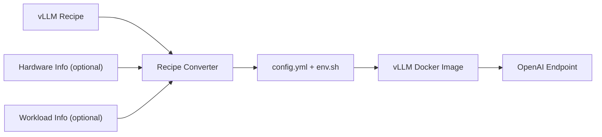

# vLLM Recipes Tools

Utilities for consuming deployment configurations from [vLLM Recipes](https://recipes.vllm.ai/) and converting them into files that can be used directly with vLLM.

## Optimized Deployment Flow

The recipe provides the validated deployment baseline. Hardware and workload
information are optional inputs that can refine deployment-sensitive values
before the generated configuration is passed to vLLM.



## `recipe_json_to_vllm_config.py`

Converts a hardware-specific vLLM Recipes JSON rendering into:

- `config.yml` — native configuration for `vllm serve --config`
- `env.sh` — environment variables required by the recipe

The converter uses the Recipes JSON API as the source of truth. It does not reimplement model-variant, hardware, or strategy compatibility rules.

## Install Dependency

```bash
pip install pyyaml
```

## Recipe Selection Model

Discovery follows the JSON links published by vLLM Recipes:

```text
/models.json
    -> /{hf_id}.json
        -> recommended_command.by_hardware[{hardware}]
            -> /{hf_id}/hw/{hardware}.json
                -> recommended strategy
                -> alternatives[{strategy}]
```

The per-hardware JSON is the recommended deployment rendering for that model and hardware. Alternative strategy renderings are referenced through the JSON's `alternatives` map.

The converter follows those exact links instead of constructing strategy paths locally. This also handles the Recipes API's legacy default-hardware strategy path automatically.

## Interactive Recipe Discovery

If you do not know the recipe JSON URL, run the script without an input:

```bash
python3 tools/recipes/recipe_json_to_vllm_config.py
```

The script will:

1. Search the Recipes model index, including promoted variant model IDs.
2. Ask which model to use.
3. Show the hardware configurations available for that model.
4. Show the recommended strategy and generated alternative strategies.
5. Resolve the exact Recipes JSON endpoint.
6. Generate `config.yml` and `env.sh`.

Example interaction:

```text
No recipe JSON supplied; starting Recipes API discovery.
Model search (for example: llama 3.1): llama 3.1 fp8

Matching models:
  [1] nvidia/Llama-3.1-8B-Instruct-FP8 — Llama-3.1-8B-Instruct [Meta]
Select model: 1

Available hardware:
  [1] arc_pro_b70
  [2] b200
  [3] h100
Select hardware: 1

Available strategies:
  [1] single_node_tp (recommended)
  [2] multi_node_tp
Select strategy: 1

Resolved recipe:
  Model:    nvidia/Llama-3.1-8B-Instruct-FP8
  Hardware: arc_pro_b70
  Strategy: single_node_tp
  JSON:     https://recipes.vllm.ai/nvidia/Llama-3.1-8B-Instruct-FP8/hw/arc_pro_b70.json
```

## Non-Interactive Recipe Discovery

For automation or CI, specify the model and hardware directly:

```bash
python3 tools/recipes/recipe_json_to_vllm_config.py \
  --model meta-llama/Llama-3.1-8B-Instruct \
  --hardware xeon6
```

When `--strategy` is omitted with both `--model` and `--hardware`, the converter uses the Recipes-recommended strategy from the per-hardware JSON.

To request a generated alternative strategy explicitly:

```bash
python3 tools/recipes/recipe_json_to_vllm_config.py \
  --model nvidia/Llama-3.1-8B-Instruct-FP8 \
  --hardware arc_pro_b70 \
  --strategy multi_node_tp
```

The converter does not synthesize a URL such as `.../strategies/multi_node_tp.json`. It reads the selected hardware JSON and follows the exact `alternatives["multi_node_tp"]` link published by the Recipes API.

## Direct Recipe JSON Input

If you already know the recipe JSON URL:

```bash
python3 tools/recipes/recipe_json_to_vllm_config.py \
  https://recipes.vllm.ai/meta-llama/Llama-3.1-8B-Instruct/hw/xeon6.json
```

A local JSON file is also supported:

```bash
python3 tools/recipes/recipe_json_to_vllm_config.py recipe.json
```

When a positional JSON source is supplied, do not combine it with `--model`, `--hardware`, or `--strategy`.

## Start vLLM

After generating the files:

```bash
source env.sh
vllm serve --config config.yml
```

Example generated `config.yml`:

```yaml
model: meta-llama/Llama-3.1-8B-Instruct
tensor-parallel-size: 1
```

If the selected recipe does not require environment variables, `env.sh` will contain no additional exports.

## Custom Output Files

```bash
python3 tools/recipes/recipe_json_to_vllm_config.py \
  --model meta-llama/Llama-3.1-8B-Instruct \
  --hardware xeon6 \
  --config-out llama31-xeon6.yml \
  --env-out llama31-xeon6-env.sh
```

## Strategy and Deployment Scope

Strategy discovery and config conversion are separate concerns.

The converter can resolve any generated strategy JSON exposed by the Recipes API. It currently emits one `config.yml`, so the selected rendering must contain a single `vllm serve` `argv`.

Single-process renderings such as `single_node_tp` can be converted directly. Multi-node, disaggregated prefill/decode, or other multi-process renderings expose fields such as `head_argv`, `worker_argv`, `prefill`, or `decode`; the converter intentionally exits instead of generating an incomplete single-process config.

## Related Guides

- [RUNTIME_TUNING.md](RUNTIME_TUNING.md) — optional hardware and workload inputs, runtime parameter policies, and calculations.
- [SWEEP_TUNING.md](SWEEP_TUNING.md) — optional benchmark sweep and measured recommendation workflow.
