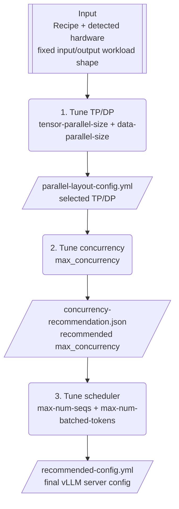

# Sweep Tuning

Sweep tuning is optional. The converter always creates an initial `config.yml`
that can be deployed directly. For benchmark-backed tuning, the recommended
workflow is **Tune All**, which measures the serving stack in dependency order:

```text
TP/DP -> concurrency -> scheduler
```

The examples below assume tuning is run inside the target vLLM CPU container so
hardware detection sees the same CPU, NUMA, memory, and cgroup limits as the
deployment.

## 1. Start the vLLM CPU Docker Shell

From the vLLM source tree:

```bash
mkdir -p recipe-output

docker run --rm -it \
  --entrypoint bash \
  --security-opt seccomp=unconfined \
  --cap-add SYS_NICE \
  --shm-size=4g \
  -p 8000:8000 \
  -v "$PWD/tools/recipes:/recipes:ro" \
  -v "$PWD/recipe-output:/output" \
  -v "$HOME/.cache/huggingface:/root/.cache/huggingface" \
  -w /output \
  vllm/vllm-openai-cpu:latest-x86_64
```

`/recipes` is mounted read-only from the source tree and `/output` is writable.
Run the converter, generated sweep scripts, and hardware detection inside this
container.

For additional container details, see
[RUNTIME_TUNING.md](RUNTIME_TUNING.md#vllm-cpu-docker-shell).

## 2. Recommended: Tune All

Use `--generate-full-sweep` by default when you want benchmark-backed runtime
tuning. It measures TP/DP first, then the highest useful concurrency, then
scheduler parameters using the selected layout and concurrency.



### Workflow options

The table is ordered by the tuning sequence. **Tune All** is the recommended
default; the other modes are useful when only one part of the serving stack
needs to be re-measured.

| Goal | Option | Tuning sequence |
| --- | --- | --- |
| **Tune all (recommended)** | `--generate-full-sweep` | **1. TP/DP -> 2. concurrency -> 3. scheduler** |
| Tune TP/DP only | `--generate-parallel-layout-sweep` | 1. TP/DP |
| Tune concurrency only | `--generate-concurrency-sweep` | 2. concurrency |
| Tune scheduler only | `--generate-scheduler-sweep` (`--generate-sweep` alias) | 3. scheduler |

All workflows keep one fixed input/output workload shape and require
`--input-tokens`, `--output-tokens`, and `--concurrency`.

For **Tune All**, the supplied `--concurrency` is the representative load used
for the initial TP/DP comparison and to size the benchmark request set. The
concurrency stage then measures the final SLA-feasible `max_concurrency`.

### Generate the Tune All package

Inside the container:

```bash
python3 /recipes/recipe_json_to_vllm_config.py \
  --model meta-llama/Llama-3.1-8B-Instruct \
  --hardware xeon6 \
  --detect-hardware \
  --input-tokens 128 \
  --output-tokens 128 \
  --concurrency 32 \
  --ttft-sla-ms 3000 \
  --tpot-sla-ms 100 \
  --config-out /output/config.yml \
  --env-out /output/env.sh \
  --generate-full-sweep \
  --sweep-out-dir /output/sweep
```

The initial configuration remains directly deployable:

```bash
source /output/env.sh
vllm serve --config /output/config.yml
```

Stop a manually started server before running the sweep because the generated
sweep scripts start and stop their own vLLM servers.

Run all tuning stages:

```bash
/output/sweep/run_full_sweep.sh
```

The end-to-end flow produces intermediate recommendations for TP/DP and
concurrency and finishes with:

```text
/output/sweep/recommended-config.yml
/output/sweep/recommendation.json
```

Inspect the final recommendation:

```bash
cat /output/sweep/recommendation.json
```

## 3. Tune All Stage Details

### Stage 1: Tune TP/DP

The parallel-layout stage measures NUMA-aware combinations of:

- `tensor-parallel-size`
- `data-parallel-size`

Primary candidates use all effective NUMA nodes:

```text
tensor-parallel-size * data-parallel-size = effective NUMA nodes
```

TP is restricted to the supported values `1`, `2`, `4`, and `8`. The sweep also
includes the largest supported TP size that does not exceed the effective
NUMA-node count, even if that layout leaves some NUMA nodes idle.

| Effective NUMA nodes | Generated layouts |
| ---: | --- |
| 2 | `TP=2, DP=1`; `TP=1, DP=2` |
| 4 | `TP=4, DP=1`; `TP=2, DP=2`; `TP=1, DP=4` |
| 6 | `TP=4, DP=1` (4 of 6 nodes); `TP=2, DP=3`; `TP=1, DP=6` |
| 8 | `TP=8, DP=1`; `TP=4, DP=2`; `TP=2, DP=4`; `TP=1, DP=8` |

Each candidate starts with a per-replica scheduler baseline:

```text
max-num-seqs = ceil(global concurrency / data-parallel-size)
```

The stage writes:

```text
sweep/parallel-layout-config.yml
sweep/parallel-layout-recommendation.json
```

The selected TP/DP layout becomes the fixed server layout for Stage 2.

### Temporary TP/DP NUMA-binding workaround

Xeon TP/DP and Tune All sweeps currently enable a temporary explicit CPU-binding
workaround by default:

```text
--tp-dp-numa-bind-workaround
```

Hardware detection builds one `VLLM_CPU_OMP_THREADS_BIND` CPU list per effective
NUMA node. On x86 it selects one logical CPU per physical core, matching vLLM's
auto-binding SMT policy, and excludes one physical core from each NUMA node for
non-OMP work. The resulting value is written to `env.sh`, for example:

```bash
export VLLM_CPU_OMP_THREADS_BIND='48-62|64-78|80-94|96-110'
```

The exact CPU IDs depend on the effective container/cgroup cpuset and NUMA
topology. Discontinuous CPU IDs are preserved as comma-separated ranges.

`VLLM_CPU_NUM_OF_RESERVED_CPU` is not used by this workaround because vLLM only
applies its reserved-CPU logic in automatic binding mode. With an explicit
`VLLM_CPU_OMP_THREADS_BIND`, reserved cores must already be omitted from the
generated lists.

After the vLLM CPU DP NUMA-binding issue is fixed, disable the workaround
without removing the implementation:

```bash
--no-tp-dp-numa-bind-workaround
```

An explicit non-`auto` `VLLM_CPU_OMP_THREADS_BIND` supplied by the recipe is
preserved.

### Stage 2: Tune Concurrency

The concurrency stage keeps the selected TP/DP layout fixed and uses vLLM
Workload Explorer:

```text
vllm bench sweep serve_workload --workload-var max_concurrency
```

This stage explores client load rather than changing vLLM server configuration.
With TTFT/TPOT objectives, `recommend_concurrency.py` selects the highest
SLA-feasible `max_concurrency` that satisfies the P99 latency and combined
compliance policy.

The stage writes:

```text
sweep/concurrency-recommendation.json
```

`max_concurrency` is benchmark/deployment metadata. It is **not** written as a
`vllm serve` configuration parameter.

### Stage 3: Tune Scheduler

Before the scheduler sweep, `prepare_scheduler.py` recalculates the scheduler
baseline from:

```text
selected TP/DP
        +
selected max_concurrency
        +
fixed input/output token shape
```

The scheduler stage keeps an explicit `max-num-seqs` at the per-replica
concurrency lower bound while tuning `max-num-batched-tokens`. It also compares
the explicit sequence limit with the vLLM default.

The per-replica sequence baseline is recalculated as:

```text
max-num-seqs = ceil(selected max_concurrency / selected data-parallel-size)
```

The directed scheduler sweep does not test `max-num-seqs` below this value;
doing so limits immediately active requests and can turn scheduler queueing into
severe TTFT degradation. It keeps the existing batch-budget curve around the
baseline and also measures three vLLM-default reference candidates:

| Reference candidate | `max-num-seqs` | `max-num-batched-tokens` |
| --- | --- | --- |
| `vllm_default_max_num_seqs` | vLLM default | generated value |
| `vllm_default_max_num_batched_tokens` | generated value | vLLM default |
| `vllm_defaults` | vLLM default | vLLM default |

The default references do not hard-code values such as 128 or 2048. The sweep
omits the selected scheduler argument and lets the installed vLLM resolve its
normal platform-, world-size-, model-, and usage-context-aware default.

If a default-reference candidate wins, the corresponding scheduler key is
omitted from `recommended-config.yml`.

## 4. Benchmark Size, Warmup, and Failure Handling

Measured request count scales with concurrency using:

```text
num_prompts = min(1000, max(100, concurrency * 10))
```

This targets about ten concurrency turnovers when neither bound applies. The
100-prompt floor avoids very small samples for P99/compliance measurements, and
the 1000-prompt cap bounds sweep runtime.

Before a measured parameter combination, generated scripts use one unmeasured
warmup containing one full concurrency window. Warmup output is retained as
`warmup.json` for auditing but is excluded from recommendation statistics.

Generated scripts also handle sweep-run failures without discarding completed
work:

- If the installed vLLM CLI supports `--continue-on-error`, the generated script
  enables it.
- If the installed vLLM does not expose that option, the script omits it and
  automatically retries an interrupted sweep with `--resume`.
- The default is two automatic resume retries. Override it with
  `VLLM_RECIPE_SWEEP_RETRIES`.

For example:

```bash
export VLLM_RECIPE_SWEEP_RETRIES=3
/output/sweep/run_full_sweep.sh
```

## 5. Targeted Tuning Workflows

Use these modes when a full re-tune is unnecessary.

### Tune TP/DP Only

Use this when only the parallel layout needs to be measured. This mode stops
after selecting `tensor-parallel-size` and `data-parallel-size`:

```bash
python3 /recipes/recipe_json_to_vllm_config.py \
  --model meta-llama/Llama-3.1-8B-Instruct \
  --hardware xeon6 \
  --detect-hardware \
  --input-tokens 128 \
  --output-tokens 128 \
  --concurrency 32 \
  --ttft-sla-ms 3000 \
  --tpot-sla-ms 100 \
  --config-out /output/config.yml \
  --env-out /output/env.sh \
  --generate-parallel-layout-sweep \
  --sweep-out-dir /output/sweep
```

Run:

```bash
/output/sweep/run_parallel_layout_sweep.sh
/output/sweep/recommend_parallel_layout.py
```

The result is `/output/sweep/parallel-layout-config.yml`. Use Tune All when
concurrency and scheduler tuning should follow the selected layout.

### Tune Concurrency Only

Use this when TP/DP and scheduler configuration are already fixed and only
concurrent serving capacity needs to be measured:

```bash
python3 /recipes/recipe_json_to_vllm_config.py \
  --model meta-llama/Llama-3.1-8B-Instruct \
  --hardware xeon6 \
  --detect-hardware \
  --input-tokens 128 \
  --output-tokens 128 \
  --concurrency 32 \
  --ttft-sla-ms 3000 \
  --tpot-sla-ms 100 \
  --config-out /output/config.yml \
  --env-out /output/env.sh \
  --generate-concurrency-sweep \
  --sweep-out-dir /output/sweep
```

Run:

```bash
/output/sweep/run_concurrency_sweep.sh
/output/sweep/recommend_concurrency.py
```

### Tune Scheduler Only

Use this when TP/DP and target concurrency are already known:

```bash
python3 /recipes/recipe_json_to_vllm_config.py \
  --model meta-llama/Llama-3.1-8B-Instruct \
  --hardware xeon6 \
  --detect-hardware \
  --input-tokens 128 \
  --output-tokens 128 \
  --concurrency 32 \
  --ttft-sla-ms 3000 \
  --tpot-sla-ms 100 \
  --config-out /output/config.yml \
  --env-out /output/env.sh \
  --generate-scheduler-sweep \
  --sweep-out-dir /output/sweep
```

`--generate-sweep` remains a backward-compatible alias for
`--generate-scheduler-sweep`.

Run:

```bash
/output/sweep/run_sweep.sh
/output/sweep/recommend.py
```

## 6. Recommendation Policy

With TTFT/TPOT objectives, benchmark commands use vLLM `--goodput`.

For TP/DP and scheduler selection, the recommender:

1. Excludes invalid configurations and failed benchmark measurements.
2. Calculates duration-weighted combined compliance across successful runs.
3. Requires median P99 TTFT/TPOT objectives and the minimum combined compliance
   ratio, which defaults to `0.99`.
4. Establishes the highest mean output-token throughput among eligible
   configurations, then applies the selection policy below.

For a scheduler-only comparison with one fixed TP/DP layout, candidates within
1% of the highest eligible output-token throughput are treated as practically
equivalent. Within that set, the recommender prefers the candidate with fewer
explicit scheduler overrides, followed by compliance, goodput, and throughput.
This avoids hard-coding a scheduler value for a difference that is likely within
normal run-to-run variation. Change or disable the equivalence range with:

```bash
/output/sweep/recommend.py --throughput-equivalence-percent VALUE
```

Use `0` to restore exact highest-throughput selection. TP/DP comparisons still
use exact highest-throughput selection because changing a parallel layout is a
material deployment decision.

For concurrency selection, the policy instead selects the **highest
SLA-feasible `max_concurrency`**, with throughput/compliance metrics used to
break ties.

Change the compliance threshold with:

```bash
/output/sweep/recommend.py --minimum-compliance VALUE
```

If no configuration is SLA-feasible, the recommendation JSON records a
best-effort candidate. A deployable final configuration is produced only when
the required recommendation stages succeed.

## 7. Deploy the Tuned Configuration

After Tune All completes:

```bash
source /output/env.sh
vllm serve --config /output/sweep/recommended-config.yml
```
