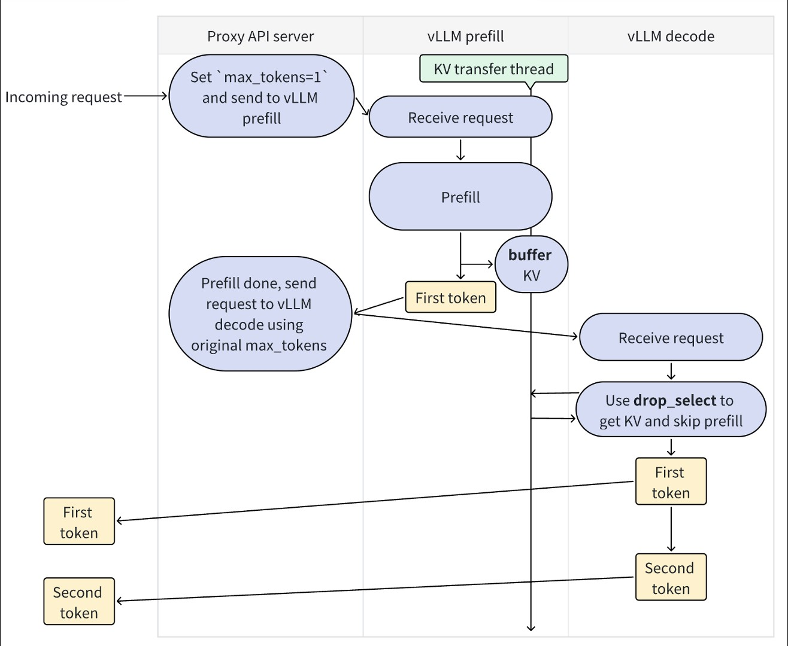

# Distributed KV cache transfer

This folder implements distributed KV cache transfer across vLLM instances.
Currently the main usecase is for disaggregated prefilling.

## Abstractions

The KV cache transfer contains three layer of abstractions:

- KV pipe: a FIFO pipe for torch.tensor transmission. Key APIs: `send_tensor` and `recv_tensor`.
- KV lookup buffer: a lookup buffer for KV caches. Key: the tokens, value: the KV caches (and/or hidden states). Key APIs: `insert` and `drop_select` (similar to SQL semantics).
- KV connector: a connector that connects the KV pipe and KV lookup buffer to vLLM. Key APIs: `send_kv_caches_and_hidden_states` and `recv_kv_caches_and_hidden_states`.

Why we need KV lookup buffer: FIFO pipe itself is not enough as prefill vLLM worker may process requests in a different order compared to decode vLLM worker. Say the QPS is really high, prefill worker may handle requests in order A -> B -> C, but the decode worker may process request C first. This is not the case that can be naturally handled by FIFO pipe, so we provide KV lookup buffer to help translate a FIFO pipe to a lookup buffer.

NOTE: KV pipe layer is bypassible: you can skip this layer if your distributed
communication service already supports key-value-based lookup (like redis or
RDMA database).

NOTE: If you want to not only transfer KV caches, but adjust the model execution flow of vLLM as well (for example, allow vLLM to receive KV caches on some tokens and do prefill on the remaining tokens), you can bypass both KV pipe layer and KV lookup buffer layer, and directly implement on KV connector layer. Bear in mind that as vLLM's model input is constantly changing, this implementation will likely be broken when vLLM has new updates.

## Disaggregated prefilling

The example usage is in [this file](../../../examples/online_serving/disaggregated_prefill.sh).

Here is the diagram of how we run disaggretgated prefilling.

