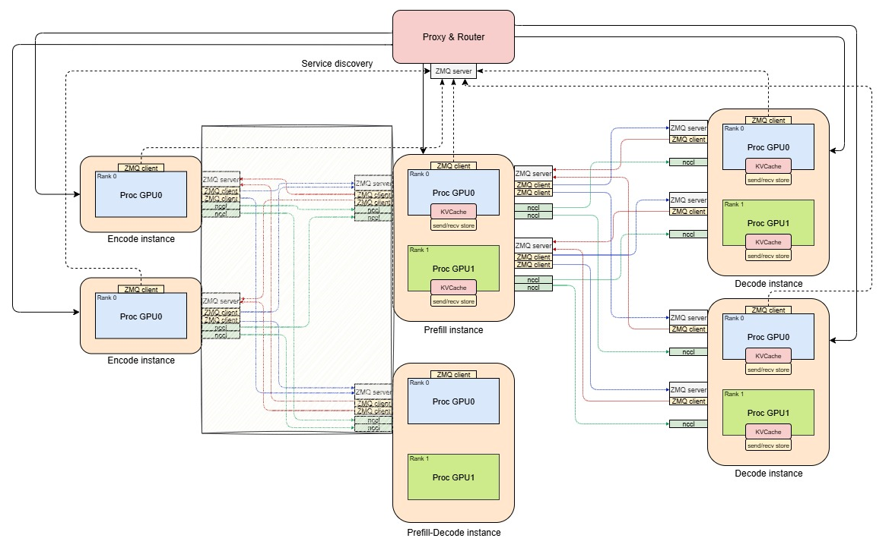
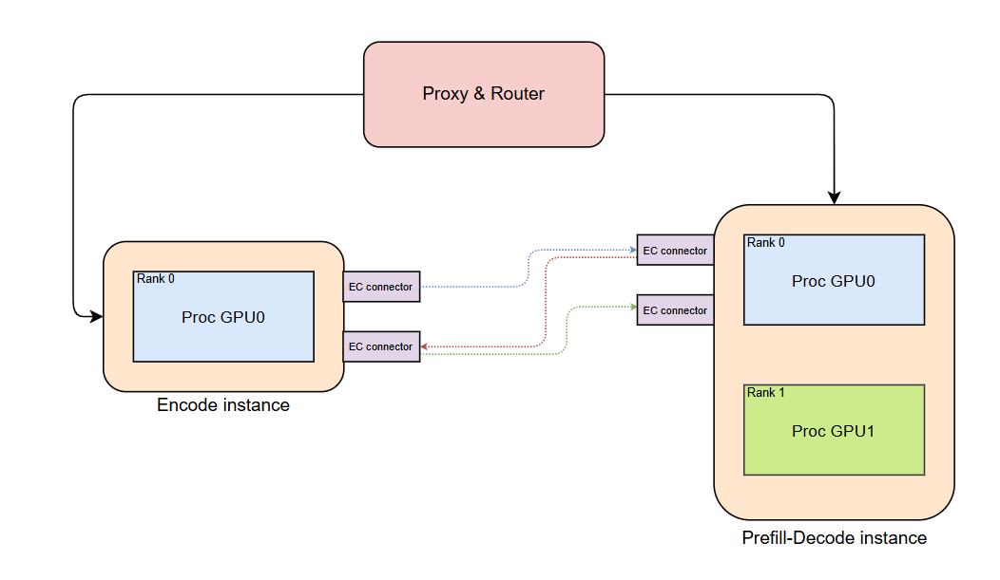

# Encode instance and E-P Encoder Cache Treansfer

MLLM EPD disaggregated serving enables more efficient resource utilization and specialized processing for encoding, prefill, and decode stages in the future.



This update introduces separated encode instance and encoder cache connector for EPD disaggregation.

## Overall Process
 
The separated encode overall process in 1E1PD scenario:

1. The client sends an HTTP request to the Proxy/Router's /v1/completions interface.
2. The Proxy/Router selects a 1E1PD (1 Encode instance + 1 Prefill+Decode instance) through random selection, generates a request_id.
3. Proxy sends request to E instance. 
4. When request is scheduled on the E instance, the request's metadata is sent to PD instance through Encoder Cache connector.
5. Then multimodal embeddings are generated for request's multimodal inputs, the multimodal embeddings are scheduled for the transfer in encoder cache connector on E instance and empty response is returned to proxy immediately after generation of the multimodal embeddings. 
6. After receiving response from E instance, the Proxy/Router forwards the request to the PD instance. As encoder budget is set to 0 on PD instance, it can't schedule chunks with multimodal input and waits the injection of encoder cache.
7. When there is enough space in the encoder cache manager on the PD instance, instance preallocates the space for request and sends a preallocation notification to the E instance. If the encoder cache is not required (i.e., tokens are reused via the KV cache), it sends a "failed" preallocation notification, indicating that encoder cache transfer is not required.
8. After preallocation notification is received on E instance's EC connector the encoder cache is sent from E instance to the PD instance. 
9. PD instance receives cache and finalize allocation of the multimodal input data and now is able to schedule the request. As encoder cache is already calculated PD instance skips MLLM's encode step and uses the value from cache.
10. After completing Prefill and Decode, the PD instance returns the result to the Proxy/Router, which then forwards it to the client.



# Implementation

## vLLM minor changes

### EPD Disaggregation Configuration
**Files:** `vllm/config.py`, `vllm/core/arg_utils.py`

Added a new configuration class for EPD disaggregation. Currently supports configuration of instance type and the number of connector workers.

### Additional ModelRunnerOutput Data Fields
**Files:** `vllm/v1/outputs.py`

The model runner output now includes two additional data fields: `transfered_mm_data` and `injected_mm_data`.

The `transfered_mm_data` field passes a list of transfered encoder cache input IDs from the model runner to the scheduler on the encode instance. After receiving transfered data IDs, the scheduler will clear free space in the encoder cache manager.

The `injected_mm_data` field passes a list of injected encoder cache input IDs from the model runner to the scheduler on the prefill instance. After receiving injected data IDs, the scheduler will clear free space in the encoder cache manager.

### Model Runner Wrapper Integration in GPUWorker
**Files:** `vllm/v1/worker/gpu_worker.py`

When EPD disaggregation is enabled, the system uses wrapper classes of GPUModelRunner class.

### GPU Model Runner santiy check in encoder execution
**Files:** `vllm/v1/worker/gpu_model_runner.py`

If EPD disaggregated serving is enabled, an additional attribute is added to indicate whether encoder execution is allowed. This attribute is used to perform a sanity check on each execution of the encoder.

## Major Changes

### EncoderCacheManager new Allocation Logic
**Files:** `vllm/v1/core/encoder_cache_manager.py`

The EncoderCacheManager now contains methods for a two-step allocation process for remote encoder cache injection. This change introduces 4 new methods designed around the concept of preallocation, to reserve cache space for a request without immediately adding it to the cached dictionary.

The allocation process operates in two steps. In preallocation, the system reserves the required space by deducting it from the available encoder cache size. In allocation finalization, the request completes its allocation in the update_from_output scheduler function after successful encoder cache injection in the model runner. 

To implement such approach we need following functions:

`can_preallocate(cache_size)` - checks if sufficient space exists for preallocation using only the request's encoder cache size data.

`preallocate(req_id, input_id, cache_size)` - takes cache_size slots in the encoder cache manager and adds the information that (req_id, input_id) is preallocated.

`depreallocate(req_id, input_id)` - rolls back the preallocate action by freeing the allocated slots associated with (req_id, input_id). Used when we skip the multimodal input via prefix cache usage.

`finalize_allocation(req_id, input_id)` - finalizes the allocation process by adding the (req_id, input_id) to the cached mapping, called after successful encoder cache injection to complete the allocation that was started with preallocate().

The two-step allocation ensures that sufficient space will exist in the encoder cache manager for incoming requests after preallocation notification is sent. It also prevents direct allocation in the encoder cache manager until the actual cache injection occurs.

Since the complete request is not transfered from encode instance to prefill instance. This methods determines are using only the request's metadata.

The manager also includes a `deallocate(self, req_id: str, input_id, encoder_cache_size)`method for encode instance to release cache space in encoder scheduler, we need this method because the encoder instance finishes request before encoder cache transfer.

### EncoderCachePreallocator
**Files:** `vllm/separated_encode/sched/encoder_cache_preallocator.py`

The EncoderCachePreallocator system introduces a classes for managing encoder cache preallocation across distributed instances. This implementation provides two distinct strategies for handling encoder cache metadata and coordinating allocation decisions between encoder and scheduler instances.

Implementation provides an abstract base class EncoderCachePreallocatorTemplate that defines the core interface for encoder cache preallocation management. This template defines abstract methods for request lifecycle management and create encoder cache connector object in init for receiving encoder cache metadata.

Preallocator will asynchronously receive encoder cache metadata through `receive_encoder_cache_metadata()` callback, detailed preallocator behaivour is determined by concrete implementation, but in general it always **tries** to schedule preallocation of (req_id, input_id), if the (req_id, input_id) is schedulable, then it adds (req_id, input_id) to preallocation queue, that will be used in `get_prealloc_candidate`. 

On each request addition and finish the preallocator's corresponding function is called to handle initialization and cleaning.

As the scheduler processes tokens, it continuously updates the multimodal input completion status through preallocator's `update_mm_inputs_done()` method. This method determines which multimodal inputs have been fully processed based on their position in the token sequence and the number of computed tokens, that allows us to control which encoder caches are not required now.

Two concrete implementations provide different allocation strategies:

AsyncEncoderCachePreallocator provides asynchronous approach that immediately triggers preallocation callbacks upon receiving encoder cache metadata. This implementation maintains minimal state and always accepts encoder cache, this allows to avoid additional request state tracking and synchronous approach. 

SyncEncoderCachePreallocator implements a synchronous approach with  state tracking. It tracks active requests, pending preallocation requests, waiting preallocation metadata, and ignored preallocation entries, to decide whether instance needs to accept encoder cache, or we can reject it and use data from KV cache.

Both implementations track multimodal input progress through `mm_inputs_done` and `mm_inputs_total` counters, updating completion status as tokens are computed, to clear the encoder cache after injection or to avoid accepting encoder cache for the mm input tokens that are covered by prefix cache. The `get_prealloc_candidate` method provides a interface for retrieving the next preallocation candidate based on available cache space, with options for immediate next candidate filling. If instance can't get candidate(either no candidates/no slots) it returns false.

The preallocation queue operates on a first-come, first-served basis, with candidates being processed based on available encoder cache space. The system tracks which preallocations are pending to avoid duplicate processing and to ensure proper cleanup when preallocations become unnecessary.

The preallocation system coordinates with encoder cache connectors to send preallocation notifications, enabling distributed coordination between instances that generate cache data and instances that manage allocation decisions.


### Encoder Scheduler

#### Encoder Scheduler (encode)
**Files:** `vllm/separated_encode/sched/encoder_scheduler.py`

Separate EncoderScheduler class implementation is provided for encode instance scheduling, while prefill and prefill+decode instances continue to use the main Scheduler class.

The EncoderScheduler is a specialized scheduler for encode instances that focuses on multimodal input processing. It maintains an _allocated dictionary to track allocated encoder cache entries and their sizes, this dictionary is used to allow us to finish the encode request before all related transfers are completed.

The encode scheduler schedules all multimodal inputs for a request at once in the schedule() method. It checks if there's sufficient encoder cache space and budget before allocating all inputs together. A request on the encode instance is considered finished when all its multimodal embeddings have been computed, so all requests are finished in 1 iteration after scheduling, transfer is handled separately in encoder cache connectors, space allocated for encoder cache is deallocated only after succesfull transfers, not after request finish.

In the update_from_output() method, the scheduler goes throguh transferred multimodal data IDs and deallocates the corresponding encoder cache entries.

#### Main Scheduler (prefill and prefill+decode instances)
**Files:** `vllm/v1/core/sched/scheduler.py`

For prefill and prefill+decode instances, the main scheduler is changed for multimodal inputs encode separation, instance `max_num_encoder_input_tokens` value is set to 0 to avoid multimodal inputs encoder execution.

If current instance is the prefill(P) or prefill+decode(PD) instance, then we instantiate preallocator object in scheduler, this preallocator will manage communication and preallocation, also we set `max_num_encoder_input_tokens` to 0 to avoid the usage of the multimodal data encoder on P or PD instance.

Mostly main scheduler has 2 changes, integration of encoder cache preallocator and `_perform_preallocations()` into request lifecycle and injected data handling. 

The integration of `ec_preallocator` is described in the corresponding part of the documentation. For the `_perform_preallocations()` function, this function is used to connect `ec_preallocator`, which manages which requests will be preallocated, and the encoder cache manager, which actually performs preallocations. This function just keeps preallocations until there are enough slots in the encoder cache manager and enough preallocation requests. By default, `_perform_preallocations()` is called 2 times: in `update_after_schedule()` after freeing some encoder inputs, and in `update_from_output` after handling injected data.

The injected data handling is performed with `injected_mm_data` obtained from `ModelRunnerOutput`, scheduler is going through injected data and decides whether the allocation is finalized or we don't need the obtained data anymore and we can `depreallocate` it.

Such an implementation with is designed to avoid redundant processing or injection, ensure that scheduler will have enough slots after encoder cache arriving and ensure the deletion of encoder caches that cannot be used due to prefix caching or early request abortion.

### Instance-Specific Model Runner Wrappers
**Files:** `vllm/separated_encode/worker/gpu_epd_lm_wrapper.py`, `vllm/separated_encode/worker/gpu_epd_vm_wrapper.py`

The implementation introduces specialized GPU model runner wrappers for disaggregated architecture, focusing on distinct roles for multimodal encoding and text generation. These wrappers are built on top of the GPUModelRunner for better compatibility with future changes in GPUModelRunner. As long as the v1 interface for GPU Model Runner remains unchanged, the wrappers do not require updates, wrapper simply call the original methods, instantiate the encoder cache connector, track information, and modify the model runner output with EPD-related information.

#### DisaggVModelGPURunnerWrapper (Encode Instance)

This wrapper runs on encode instances and processes multimodal inputs. It executes encoder models and sends the results to other instances through encoder cache connector.

The encode instance doesn't need KV cache since it only runs vision part of MLLM. The wrapper overrides `initialize_kv_cache_tensors` and `initialize_kv_cache` to return empty results, freeing up GPU memory for larger encoder cache storage.

During execution, the wrapper executes encoding for scheduled multimodal inputs, converts outputs to numpy arrays and inserts enocder cache to encoder cache connector, also it stores. Since no text generation happens here, it returns a mostly empty ModelRunnerOutput with additional transfer status information in ModelRunnerOutput, this information is used in encoder scheduler to free the space in encoder cache manager.

#### DisaggLModelGPURunnerWrapper (Prefill/(Prefill+Decode) Instance)

This wrapper runs on prefill or (prefill+decode) instances where the Language Model is exectued. It receives encoder cache from encode instances and injects them into the normal inference pipeline.

The wrapper uses a callback function `receive_encoder_cache` to handle incoming encoder data. This callback converts numpy arrays back to GPU tensors with the correct device and dtype, then stores them in the standard encoder_cache dictionary.

During `execute_model`, the wrapper simply calls `execute_model`, and also tracks which encoder caches were injected. It reports successful injections back to the scheduler through the model output, allowing the scheduler to finalize allocations of preallocated inputs.

### Encoder Cache Connector
**Files:** `vllm/separated_encode/ec_transfer/connector/template.py`, `vllm/separated_encode/ec_transfer/connector/redis.py`

The Encoder Cache Connector provides an abstraction layer for transferring encoder caches between encode and prefill instances in disaggregated vLLM deployments. The abstract base class ECConnectorTemplate defines the communication logic.

The connector operates using a thread-based architecture with separate send and receive event loops. Communication is handled asynchronously through configurable worker pools. It maintains separate queues for send and receive operations, with each operation executed by dedicated worker threads.

The encoder connector operates in four distinct states based on instance type and its component:

**Encode Scheduler State** - Pure sender functionality that handles encoder cache metadata transfer. When multimodal input is scheduled, metadata sending tasks are added to the send queue for processing by the send event loop.

**Prefill Scheduler State** - Receives encoder cache metadata from encode instances and manages preallocation through scheduler callbacks. The preallocation logic is described in scheduler updates. After successful preallocation, sends completion notifications back to encode instances from which it received the metadata.

**Encode Model Runner State** - Manages cache storage, transfer, and lifecycle. It maintains:

- encoder_cache: Dictionary storing computed encoder caches
- cache_to_send: Set of pending cache transfers awaiting preallocation confirmation
- cache_to_avoid: Set of caches that failed preallocation
- transfered_ids: List tracking successfully transferred cache IDs

When encoder output is generated, add_encoder_cache() either stores the cache locally or immediately schedules transfer if a succesfull preallocation notification was already received. Upon receiving succesfull preallocation notifications via `_maybe_send_encoder_cache()`, it either sends the cache immediately or adds the request to the pending set. It can receive failed preallocation notification, it means that we don't need to send encoder cache to this instance and can delete the encoder cache for this (req_id, input_id) from the Encoder instance.

**Prefill Model Runner State** - Receive-only state that accepts encoder cache data and calls injection callbacks to add the cache into the model runner's encoder cache dictionary.

The communication flow follows this sequence:

- Encode Scheduler sends metadata to Prefill Scheduler for cache preallocation
- Prefill Scheduler attempts preallocation and sends success/failure notifications to Encode Model Runner
- Upon successful preallocation, Encode Model Runner transfers the actual encoder cache data to Prefill Model Runner

The preallocation step is implemented to avoid OOM problems on the prefill instance.

The `add_encoder_cache` method also looks up pending send queries. If a cache transfer has already been requested (exists in `cache_to_send` set), it immediately schedules the send operation rather than storing the cache locally. This optimization minimizes latency by sending caches as soon as both prerequisites are met. Failed preallocations are tracked in `cache_to_avoid` to prevent unnecessary transfers

Transfer completion tracking is built into the class. Through the connector's `get_transferred_ids` method, the model runner can determine which request data has already been received.

#### Extension Example

The included `RedisECConnector` demonstrates a concrete implementation using Redis as the communication backend. To use other communication backends, implement the abstract methods `_send_prealloc_notification`, `_send_encoder_cache_metas`, `_send_encoder_cache`, `_recv_prealloc_notification`, `_recv_encoder_cache_metas`, and `_recv_encoder_cache` according to your chosen transport mechanism.

# Usage instruction

Install and start the Redis server:
```
redis-server &
```

To start the EPD instances and the proxy server, use the provided script. Modify the arguments in the script as necessary before running it:

```
bash examples/online_serving/separated_encode/launch_epd_serve.sh
```

Once the server is running, you can use OpenAI-like API requests to interact with the proxy server and receive responses.