# MLLM Encode separation and E-P Encoder Cache Transfer


Encode-Prefill-Decode disaggregation provides greater flexibility in distributed MLLM inference, enables better resource utilization under fixed TTFT and TPOT Service Level Objectives, and allows for the application of stage-level optimizations. To implement the EPD full disaggregation, visual encoder is need to be moved to a separate instance. 

This update introduces the implementation of MLLM visual encoder separation, an abstraction for inter-instance (E-P) communication for encoder cache transfer, and a concrete example implementation of disaggregated E+PD serving.


## Motivation

1. Encoder separation is a critical part of EPD disaggregation, as it allows the visual encoder to be decoupled from the Prefill and Decode stages. To implement and use EPD disaggregation in future a visual encoder separation is required.

2. Better serving for MLLM. Consider mixed inputs continuous serving scenario, every 10th request includes a large multimodal input, while all others are text-only. In the current vLLM, all requests in a batch in model execution will wait for the multimodal input embedding generation to complete. When new request with the image arrive, all requests will again wait for the multimodal (MM) encoder to run, causing significant performance degradation. By separating the encoding stage, this bottleneck can be avoided. This scenario is used only to highlight the bottleneck, same bottleneck appears in other serving scenarios and can be fixed by separated encoder.

```mermaid
flowchart LR
    subgraph "Current vLLM Architecture"
        direction LR
        

        subgraph I2 ["Iteration 2"]
            direction LR
            R2["Requests 11-19: Text<br/>🖼️ Request 20: MM + Text"]
            R3["Running Batch 1-10"]
            S2[Scheduler]
            B2["Batch 1-20"]
            MR2[ModelRunner]
            MM2["execute_mm_encoder<br/>ALL requests blocked AGAIN"]
            LM2["Language Model<br/>1 generation step"]
            
            R2 --> S2
            R3 <--> S2
            S2 --> B2 --> MR2 --> MM2 --> LM2
        end

        subgraph I1 ["Iteration 1"]
            direction LR
            R1["Requests 1-9: Text<br/> Request 10: MM + Text"] 
            S1[Scheduler]
            B1["Batch 1-10"]
            MR1[ ModelRunner]
            MM1["execute_mm_encoder<br/> ALL requests blocked"]
            LM1["Language Model<br/>1 generation step"]
            
            R1 --> S1 --> B1 --> MR1 --> MM1 --> LM1
        end

    end
```



## Overall Process (Sequential requests)
 
The separated encode overall process in 1E1PD with proxy scenario:

1. The client sends an HTTP request to the Proxy/Router's /v1/completions interface.
2. The Proxy/Router selects a 1E1PD (1 Encode instance + 1 Prefill+Decode instance) generates a request_id.
3. Proxy sends request to E instance. 
4. When request is scheduled on the E instance, the request's metadata is sent to PD instance through Encoder Cache connector.
5. Then multimodal embeddings are generated for request's multimodal inputs, the multimodal embeddings are scheduled for the transfer in encoder cache connector on E instance and empty response is returned to proxy immediately after generation of the multimodal embeddings is completed. 
6. After receiving response from E instance, the Proxy/Router forwards the request to the PD instance. As encoder budget is set to 0 on PD instance, it can't schedule chunks with multimodal input and waits the injection of encoder cache.
7. When there is enough space in the encoder cache manager on the PD instance, instance preallocates the space for request and sends a preallocation notification to the E instance. If the encoder cache is not required (i.e., tokens are reused via the KV cache), it sends a "failed" preallocation notification, indicating that encoder cache transfer is not required.
8. After preallocation notification is received on E instance's EC connector the encoder cache is sent from E instance to the PD instance. 
9. PD instance receives cache and finalize allocation of the multimodal input data and now is able to schedule the request. As encoder cache is already calculated PD instance skips MLLM's encode step and uses the value from cache.
10. After completing Prefill and Decode, the PD instance returns the result to the Proxy/Router, which then forwards it to the client.


NOTE: Current implementation allows to execute E and PD instance for the same request in parallel, but it doesn't provide significant performance improvement, therefore scheme doesn't illustrat this.


# Implementation

Code changes in the implementation are madeto solve three practical problems. Implementation must provide clear control of the request lifecycle in EPD scenario so memory can be reserved for cache between instances, encoder outputs can be transfered, and request must keep using the key caching features without issues. Also the code must be compatible enough to keep working as vLLM changes, so deep vLLM core changes are avoided and most logic is put behind small adapters/wrappers. And implementaiton must provide proper EPD disaggregation functionality.

Forward-compatibility is preserved by wrapping existing components instead of changing them. The GPU model runner is used as-is, with thin wrappers that add EPD tracking and connector calls. The scheduler gets small hooks to talk to a preallocator and to reconcile injected data. The transport is hidden behind a connector interface so implementations can be switched without touching schedulers or runners. The request lifecycle control and "inter-instance" encoder cache space management are handled by EncoderCachePreallocator, EncoderCacheConnector, and a two-stage allocation flow in the EncoderCacheManager.

## vLLM minor changes

### Scheduler routing
**Files:** `vllm/v1/core/core.py`

During execution with EPD disaggregation, EngineCore now uses the Encoder Scheduler for the Encode instance.

### EPD Disaggregation Configuration
**Files:** `vllm/config/__init__.py`, `vllm/core/arg_utils.py`

Added a new configuration class for EPD disaggregation. Currently supports configuration of instance type, instance's EPD rank and the number of connector workers.

### Additional ModelRunnerOutput Data Fields
**Files:** `vllm/v1/outputs.py`

The model runner output now includes two additional data fields: `transfered_mm_data` and `injected_mm_data`.

The `transfered_mm_data` field passes a list of transfered encoder cache input IDs from the model runner to the scheduler on the encode instance. After receiving transfered data IDs, the scheduler will clear free space in the encoder cache manager.

The `injected_mm_data` field passes a list of injected encoder cache input IDs with `mm_hash` from the model runner to the scheduler on the prefill instance. After receiving injected data IDs, the scheduler will finalize allocations 

### Model Runner Wrapper Integration in GPUWorker
**Files:** `vllm/v1/worker/gpu_worker.py`

When EPD disaggregation is enabled, the system uses wrapper classes of GPUModelRunner class.

### GPU Model Runner santiy check in encoder execution
**Files:** `vllm/v1/worker/gpu_model_runner.py`

If EPD disaggregated serving is enabled, an additional attribute is added to indicate whether encoder execution is allowed. This attribute is used to perform a sanity check on each execution of the encoder. Also encoder cache lock is added to ensure encoder cache injection safety. 

## Major Changes

### EncoderCacheManager new Allocation Logic
**Files:** `vllm/v1/core/encoder_cache_manager.py`

In disaggregated settings, encoder outputs need to be transferred between instances. This creates timing challenges: we must reserve cache space before receiving the data, but we can't mark it as cached until the transfer completes. For that the EncoderCacheManager now supports a two-stage allocation process for handling encoder outputs receiving. The two-stage process addresses this by separating reservation from finalization.

The `preallocate()` method reserves cache space for incoming encoder outputs. It tracks which requests need which multimodal inputs and prevents premature eviction of entries that will be reused. This method returns whether the encoder output needs to be computed and transferred `(true)` or is already available in cache `(false)`.

The `finalize_allocation()` method completes the allocation after encoder outputs are received. It converts the preallocation into an actual cached entry or releases the reservation if another request provided the data or mm input tokens prefilling is skipped due to prefix caching.

To prevent race conditions between eviction and incoming transfers, we don't evict caches that have active preallocations(not finalized allocations*).

### EncoderCachePreallocator
**Files:** `vllm/separated_encode/sched/encoder_cache_preallocator.py`
The EncoderCachePreallocator schedules preallocation requests. It synchronizes incoming requests with encoder metadata received asynchronously from encoding instances. The preallocator serves three essential purposes:

It synchronizes request arrival with encoder metadata reception. Since encoder metadata can arrive before or after the corresponding request, the preallocator buffers metadata for requests that haven't arrived yet and processes waiting metadata when requests do arrive.

It manages the preallocation queue to determine for which encode output when cache space should be reserved. The system maintains a queue of pending preallocations and validates each candidate against available cache capacity before proceeding with reservation. 

It tracks multimodal input processing progress to avoid unnecessary data transfers. When inputs are obtained from existing caches (KV cache or encoder cache), the preallocator sends notifications to cancel pending transfers and ignores subsequent metadata for those inputs.

The system provides an abstract base class `EncoderCachePreallocatorTemplate` that defines the interface for preallocation strategies. This template initializes the encoder cache connector for receiving metadata and defines abstract methods that concrete implementations must provide. And one concrete synchronous implementation example.

#### Request flow

When encoder metadata arrives via the `_receive_encoder_cache_metadata` callback, the preallocator checks if the request is active. For active requests, it immediately schedules preallocation. For inactive requests, it stores the metadata in `waiting_preallocs` for later processing.

Request addition triggers processing of any waiting metadata. The `add_request` method initializes tracking structures and schedules preallocations for any metadata that arrived early.

As the tokens are processed, `update_mm_inputs_done` tracks which multimodal inputs are complete. When a pending input is covered by existing cache, the system sends a cancellation notification and marks it as ignored.

The `get_prealloc_candidate` method provides the interface for retrieving candidates from the queue. It validates each candidate against available space and skips ignored entries. The method returns whether to continue processing and the candidate data if valid. In the scheduler this method is called from `_perform_preallocations` method.


### Encoder Scheduler

#### Encoder Scheduler (encode)
**Files:** `vllm/separated_encode/sched/encoder_scheduler.py`

Separate EncoderScheduler class implementation is provided for encode instance scheduling.

The EncoderScheduler is a specialized scheduler for encode instances that focuses on only multimodal input scheduling. It maintains an `_allocated` dictionary to track allocated encoder cache entries, their sizes and hashes. This dictionary is used to allow us to free up logical space without storing the request itself, which enables us to end the request before the data is transferred.

Currently the encode scheduler schedules all multimodal inputs for a request at once in the `schedule()` method. It checks if there's sufficient encoder cache space and budget before allocating all inputs together. Note that input is already cached we will still add it into the `scheduled_encoder_inputs`, but we will not allocate space for it and on model runner we will skip the encoder execution for such elements, we need to do that because in `model_runner` the signal needs to be sent to `ECConnector` from each `mm_input`.  

A request on the encode instance is considered finished when all its multimodal embeddings have been computed, so all requests are finished in 1 iteration after scheduling, transfer is handled separately in encoder cache connectors, space allocated for encoder cache is deallocated only after transfers, not after request finish.

In the `update_from_output()` method, the scheduler goes through transferred multimodal data IDs and frees the mm inputs in encoder cache manager.

#### Main Scheduler (prefill and prefill+decode instances)
**Files:** `vllm/v1/core/sched/scheduler.py`

For prefill and prefill+decode instances, the main scheduler is changed for multimodal inputs encode separation. 

If encoder separation is turned on, we instantiate `encoder_cache_preallocator` object in scheduler, this preallocator handles communication through `ec_connector` in it and `preallocation` scheduling and synchronization, also we set `max_num_encoder_input_tokens` to 0 to avoid the usage of the multimodal data encoder on P or PD instance.

Mostly main scheduler has 3 changes, integration of `encoder_cache_preallocator`, `_perform_preallocations()` and `injected_mm_data` allocation. 

The  `encoder_cache_preallocator` is described in the corresponding part of the documentation. The `_perform_preallocations()` function is used to connect `encoder_cache_preallocator`, which manages which requests will be preallocated, and the encoder cache manager, in which we actually performs preallocations. This function just gets the preallocation candidate from the `encode_cache_preallocator` until there are enough slots in the `encoder_cache_manager`. Perform preallocation is called 2 times: in `update_after_schedule()` after some cache can  potentially become freeable, and in `update_from_output` after handling injected data.

The injected data handling is performed via `injected_mm_data` attribute from `ModelRunnerOutput`, scheduler just going through injected data and decides whether the allocation needs to be finalized or we don't need the obtained data anymore and we can just say that this injected data is freeable.

Such implementation allows us to achieve motivation described in changes for encoder cache manager, encoder cache preallocator and also more efficiently use caching techniques in EPD disaggregation.

### Instance-Specific Model Runner Wrappers
**Files:** `vllm/separated_encode/worker/gpu_epd_lm_wrapper.py`, `vllm/separated_encode/worker/gpu_epd_vm_wrapper.py`

The implementation introduces specialized GPU model runner wrappers for disaggregated architecture, focusing on distinct roles for multimodal encoding and text generation. These wrappers are built on top of the GPUModelRunner for better compatibility with future changes in GPUModelRunner. As long as the v1 interface for GPU Model Runner remains unchanged, the wrappers do not require updates, wrapper simply call the original methods, instantiate the encoder cache connector, track information, and modify the model runner output with EPD-related information.

#### DisaggEncodeGPURunnerWrapper (Encode Instance)

This wrapper runs on encode instances and processes multimodal inputs. It executes encoder models and sends the results to other instances through encoder cache connector.

The encode instance doesn't need KV cache since it only runs vision part of MLLM. The wrapper overrides `initialize_kv_cache_tensors` and `initialize_kv_cache` to return empty results, freeing up GPU memory for larger encoder cache storage.

During execution, the wrapper executes encoding for scheduled multimodal inputs and inserts encoder output in encoder cache connector, due to nature of encode scheduler the `scheduled_output.scheduled_encoder_inputs` can contain already cached inputs or multiple same multimodal inputs, as cache is already present or going to be present we can just skip the encoding process for such `mm_inputs`.So we temporarily remove cached inputs and inputs such that their `mm_hash` already present somewhere in `scheduled_encoder_inputs`, after execution we return all removed entries back to `scheduler_output`. Motivation for sending all multimodal inputs to `model_runner` is provided in `EncoderScheduler` section.  

Since no text generation happens here, it returns almost empty ModelRunnerOutput with additional transfered encoder outputs information in ModelRunnerOutput, this information is used in encoder scheduler to free the space in encoder cache manager.

#### DisaggPrefillDecodeGPURunnerWrapper (Prefill/(Prefill+Decode) Instance)

This wrapper runs on prefill or (prefill+decode) instances where the Language Model is exectued. It receives encoder cache from encode instances and injects them into the encoder cache stored in normal GPUModelRunner.

The wrapper uses a callback function `receive_encoder_cache` to handle incoming encoder data. It asynchronously injects encoder_output into the encoder cache and updates injected_ids list.

During `execute_model`, the wrapper simply calls `execute_model` from original GPUModelRunner, and also adds tracking of injected encoder caches. It reports successful injections back to the scheduler through the model output, allowing the scheduler to finalize allocations of preallocated inputs.

### Encoder Cache Connector
**Files:** `vllm/separated_encode/ec_transfer/connector/template.py`, `vllm/separated_encode/ec_transfer/connector/redis.py`

The Encoder Cache Connector provides an abstraction layer for transferring encoder caches between encode and prefill instances in disaggregated vLLM deployments. The abstract base class ECConnectorTemplate defines the communication logic.

The connector addresses several critical challenges in encoder output transfer in encoder separation. First, it ensures reliable data transfer by verifying that receiver instances have sufficient memory allocated and adequate logical space for encoder outputs before initiating transfers(Therefore we need first E->P/PD transfer). This prevents out-of-memory errors and failed transfers that could disrupt the inference pipeline. Second, it provides a flexible abstraction layer that allows simple implementation of different connector approaches (e.g., Redis, nccl, ...) without modifying the EPD disaggregation / vLLM core components. Third, it helps to manage the lifecycle of the request in EPD disaggregation.

The connector operates using a thread-based architecture with separate send and receive event loops. Communication is handled asynchronously through configurable worker pools. It maintains separate queues for send and receive operations, with each operation executed by dedicated worker threads.

The encoder connector operates in four distinct states based on instance type and its component:

**State for Encode Scheduler** - Pure sender functionality that handles encoder cache metadata transfer. When multimodal input is scheduled, metadata sending tasks are added to the send queue for processing by the send event loop.

**State for Prefill Scheduler** - Receives encoder cache metadata from encode instances and manages preallocation through scheduler callbacks. The preallocation logic is described in scheduler updates. After successful preallocation, sends completion notifications back to encode instances from which it received the metadata.

**State for Encode Model Runner** - Manages cache storage, transfer, and lifecycle. It maintains:

- `encoder_cache`: Dictionary storing computed encoder outputs. *NOTE: The values are not copies of encoder cache, therefore we don't use additional GPU memory to store this encoder cache dictionary.*
- `cache_to_send`: Set of pending encoder outputs transfers awaiting preallocation confirmation
- `cache_to_avoid`: Set of encoder_output IDs that don't need to be sent
- `transfered_ids`: List tracking successfully transferred cache IDs

When encoder output is generated, `add_encoder_cache()` either adds the cache to local (`input_id`, `req_id`) map or immediately schedules transfer(or skips transfer) if a preallocation notification was already received before. 

Upon receiving successful preallocation notifications via `_maybe_send_encoder_cache()`, it either sends the cache immediately or adds the request to the pending set. It can receive failed preallocation notification, it means that we don't need to send encoder cache to this instance and can delete the encoder cache for this (req_id, input_id) from the Encoder instance.

So encoder outputs are scheduled for transfer to PD instance as soon as both conditions are met.

**State for Prefill Model Runner** - Receive-only state that accepts encoder cache data and calls injection callbacks to add the cache into the model runner's encoder cache dictionary.

The communication flow follows this sequence:

- Encode Scheduler sends metadata to Prefill Scheduler for cache preallocation
- Prefill Scheduler attempts preallocation and sends success/failure notifications to Encode Model Runner
- Upon successful preallocation, Encode Model Runner transfers the actual encoder cache data to Prefill Model Runner

Transfer completion tracking is built into the class. Through the connector's `get_transferred_ids` method, the model runner can retrieve which request data has already been received.


#### Extension Example

The included `RedisECConnector` demonstrates a concrete implementation using Redis as the communication backend. To use other communication backends, implement the abstract methods `_send_prealloc_notification`, `_send_encoder_cache_metas`, `_send_encoder_cache`, `_recv_prealloc_notification`, `_recv_encoder_cache_metas`, and `_recv_encoder_cache` according to your chosen transport mechanism. This connection extension supports multiple E instances and multiple PD or P instances. 

# Usage Instructions

*To use E+PD disaggregation install `redis`, `msgpack_numpy` python packages and `redis-server` to your system. Because currently only RedisECConnector is implemented*.

Update provides a toy proxy implementation and scripts to startup the EPD Disaggregated vLLM. There are multiple scripts to run EPD disaggregation, one of them is used to run EPD Disaggregated vLLM on 1 GPU, and all another scripts are used to run it on multiple GPUs. Any number of GPUs is supported by components(you can run xEyPD disagg.), but you need to rewrite script, use other scripts as reference.

To start the EPD instances and proxy server, select one of the provided scripts and modify the arguments as needed before execution. You can run the deployment using any of these commands:

```bash
# 1 GPU, 2 Instances on the same GPU
bash examples/online_serving/separated_encode/launch_epd_serve.sh
```

```bash
# 2 GPUs, 1 E instance, 1 PD instance
bash examples/online_serving/separated_encode/launch_1e1pd.sh
```

```bash
# 3 GPUs, 1 E instance, 2 PD instances
bash examples/online_serving/separated_encode/launch_1e2pd.sh
```

```bash
# 3 GPUs, 2 E instance, 1 PD instances
bash examples/online_serving/separated_encode/launch_2e1pd.sh
```

After the server starts running, you can interact with it using OpenAI-compatible API requests to send queries and receive responses. Sample Python code for sending requests is available in the examples/online_serving/separated_encode/ directory. You can send testing request like this:

```bash
python examples/online_serving/separated_encode/proxy_request.py --port $PORT --model_path $MODEL --image_path docs/assets/design/arch_overview/entrypoints.excalidraw.png &
```

# Benchmark

Performance evaluation was conducted using Qwen2.5-VL-3B-Instruct on an NVIDIA A100-SXM4-80GB GPU. :

- default vllm(1 GPU) 
- default vllm(2 GPU, Tensor Par.) 
- default vllm(2 GPU, Data Par.)
- 1E1PD disaggregated(1 GPU), 
- 1E1PD disaggregated(2 GPU). 
    
Testing was conducted on the lmarena-ai/VisionArena-Chat dataset with varying prompt loads from 100 to 1000 requests to assess scalability characteristics.

```
python benchmarks/benchmark_serving.py \
  --backend openai-chat \
  --endpoint /v1/chat/completions \
  --model $MODEL \
  --dataset-name hf \
  --dataset-path $DATASET \
  --hf-split train \
  --num-prompts $NUM_PROMPTS \
  --seed 40 \
  --save-result \
  --save-detailed \
  --result-dir $LOG_PATH/vision_arena_results \
  --result-filename vision_arena_outputs$(date +"%Y%m%d_%H%M%S").json \
  --port 10001 > $LOG_PATH/benchmark_VisionArena_$(date +"%Y%m%d_%H%M%S").log 2>&1
```

We benchmarked EPD approaches and Default (1GPU) three times across 4 workloads. Data parallel and tensor parallel approaches were testedat different times on the same server. The table below shows the mean statistics across all benchmark runs, with detailed individual results provided at the end of this document.

| Approach                      | \# prompts | Benchmark duration (s) | Req throughput (req/s) | Mean TTFT (ms) | P99 TTFT (ms) | Mean TPOT (ms) | P99 TPOT (ms) | Mean ITL (ms) | P99 ITL (ms) |
| ----------------------------- | ---------- | ---------------------- | -------------------------- | -------------- | ------------- | -------------- | ------------- | ------------- | ------------ |
| E+PD [2GPU,1E,1PD] (Mean)     | 1000       | 63.36                  | 15.82                      | 32002.81       | 60608.7       | 62.31          | 111.02        | 152.28        | 1639.21      |
| Default [2GPU, Data Par.]\*   | 1000       | 74.94                  | 13.34                      | 37626.68       | 70951.04      | 146.56         | 342.69        | 195.13        | 1816.9       |
| Default [2GPU, Tensor Par.]\* | 1000       | 91.69                  | 10.91                      | 42369.61       | 87645.92      | 159.2          | 294.61        | 157.89        | 1100.4       |
| E+PD [1GPU] (Mean)            | 1000       | 93.54                  | 10.69                      | 50211.56       | 90882.21      | 98.28          | 186.53        | 128.71        | 924.02       |
| Default [1GPU] (Mean)         | 1000       | 106.71                 | 9.39                       | 50789.65       | 102740.3      | 115.47         | 202.19        | 139.82        | 1123.19      |
| E+PD [2GPU,1E,1PD] (Mean)     | 500        | 34.4                   | 14.56                      | 17151.17       | 32094.03      | 60.62          | 104.12        | 97.91         | 789.28       |
| Default [2GPU, Data Par.]\*   | 500        | 40.23                  | 12.43                      | 19294.31       | 36177.82      | 128.46         | 378.29        | 173.43        | 1485.35      |
| Default [2GPU, Tensor Par.]\* | 500        | 48.99                  | 10.21                      | 22218.02       | 45730.88      | 157.56         | 234.1         | 158.67        | 833.73       |
| E+PD [1GPU] (Mean)            | 500        | 49.25                  | 10.16                      | 26199.06       | 46978.92      | 93.11          | 196.85        | 114.67        | 651.61       |
| Default [1GPU] (Mean)         | 500        | 54.67                  | 9.15                       | 23792.12       | 51304.22      | 108.05         | 239.63        | 129.38        | 1054.42      |
| E+PD [2GPU,1E,1PD] (Mean)     | 200        | 15.46                  | 12.98                      | 6666.79        | 12372.37      | 45.57          | 76.24         | 68.81         | 367.75       |
| Default [2GPU, Data Par.]\*   | 200        | 18.04                  | 11.09                      | 7791.15        | 4029.51       | 89.08          | 312.61        | 82.42         | 906.56       |
| Default [2GPU, Tensor Par.]\* | 200        | 21.76                  | 9.19                       | 9143.71        | 18484.54      | 101.74         | 221.54        | 95.91         | 455.9        |
| E+PD [1GPU] (Mean)            | 200        | 21.83                  | 9.17                       | 9780.98        | 19271.01      | 79.11          | 147.9         | 85.97         | 354.24       |
| Default [1GPU] (Mean)         | 200        | 22.97                  | 8.71                       | 9420.3         | 20477.48      | 88.53          | 216.12        | 86.12         | 667.83       |
| E+PD [2GPU,1E,1PD] (Mean)     | 100        | 7.49                   | 13.4                       | 3867.56        | 6057.55       | 21.8           | 44.44         | 28.63         | 264.65       |
| Default [2GPU, Data Par.]\*   | 100        | 8.26                   | 12.1                       | 3898.85        | 6745.78       | 45.53          | 163.51        | 36.75         | 577.1        |
| Default [2GPU, Tensor Par.]\* | 100        | 10.87                  | 9.2                        | 4920.22        | 9505.53       | 60.54          | 212.46        | 50.51         | 653.17       |
| E+PD [1GPU] (Mean)            | 100        | 10.84                  | 9.27                       | 5925.45        | 9402.15       | 36.09          | 122.15        | 35.19         | 262.08       |
| Default [1GPU] (Mean)         | 100        | 11.05                  | 9.11                       | 5153.35        | 9354.25       | 57.95          | 195.97        | 49.15         | 478.4        |

* The TP and DP benchmarking were conducted at different time, the observed differences may be attributed to other factors

The benchmark results demonstrate that E+PD can provide request throughput and latency performance compared to default configurations across both 1 and 2 GPU setups, as evaluated on NVIDIA A100-SXM4-80GB hardware using the Qwen2.5-VL-3B-Instruct model. These performance improvements highlight the effectiveness of the Encoder Separation technique for optimizing multimodal model serving workloads.


Detailed results:

| Approach           | Trial      | num_prompts | Benchmark duration (s) | Total input tokens | Total generated tokens | Request throughput (req/s) | Output token throughput (tok/s) | Total Token throughput (tok/s) | Mean TTFT (ms) | Median TTFT (ms) | P99 TTFT (ms) | Mean TPOT (ms) | Median TPOT (ms) | P99 TPOT (ms) | Mean ITL (ms) | Median ITL (ms) | P99 ITL (ms) |
| ------------------ | ---------- | ----------- | ---------------------- | ------------------ | ---------------------- | -------------------------- | ------------------------------- | ------------------------------ | -------------- | ---------------- | ------------- | -------------- | ---------------- | ------------- | ------------- | --------------- | ------------ |
| Default [1GPU]     | 1          | 100         | 12.31013               | 8122               | 10917                  | 8.123391                   | 886.8306                        | 1546.612                       | 6213.311       | 5776.914         | 10610         | 60.43373       | 50.78793         | 216.0569      | 51.2556       | 14.30057        | 613.0175     |
| Default [1GPU]     | 2          | 100         | 10.85676               | 8122               | 10957                  | 9.210854                   | 1009.233                        | 1757.339                       | 4779.188       | 4088.457         | 9124.295      | 59.50579       | 52.69066         | 191.1305      | 50.71513      | 14.28988        | 607.7266     |
| Default [1GPU]     | 3          | 100         | 9.991029               | 8122               | 10989                  | 10.00898                   | 1099.887                        | 1912.816                       | 4467.538       | 3962.17          | 8328.441      | 53.90317       | 47.2205          | 180.7076      | 45.4647       | 14.11477        | 214.4418     |
| Default [1GPU]     | mean_stats |             | 11.05264               | 8122               | 10954.33               | 9.114408                   | 998.6502                        | 1738.922                       | 5153.346       | 4609.18          | 9354.245      | 57.94756       | 50.23303         | 195.965       | 49.14514      | 14.23507        | 478.3953     |
| Default [1GPU]     | 1          | 200         | 22.98617               | 32055              | 22152                  | 8.700882                   | 963.7097                        | 2358.244                       | 9865.168       | 8039.06          | 20380.57      | 83.9027        | 87.92922         | 200.0653      | 83.52419      | 22.85806        | 752.5209     |
| Default [1GPU]     | 2          | 200         | 22.89445               | 32055              | 22060                  | 8.735741                   | 963.5523                        | 2363.673                       | 9200.236       | 7245.377         | 20568.84      | 90.94091       | 98.33245         | 224.7042      | 87.7061       | 20.40263        | 630.2986     |
| Default [1GPU]     | 3          | 200         | 23.03203               | 32055              | 22073                  | 8.683559                   | 958.361                         | 2350.118                       | 9195.481       | 7298.334         | 20483.04      | 90.75096       | 96.2287          | 223.5768      | 87.12716      | 22.04948        | 620.6832     |
| Default [1GPU]     | mean_stats |             | 22.97089               | 32055              | 22095                  | 8.706728                   | 961.8743                        | 2357.345                       | 9420.295       | 7527.59          | 20477.48      | 88.53152       | 94.16346         | 216.1154      | 86.11915      | 21.77006        | 667.8342     |
| Default [1GPU]     | 1          | 500         | 55.16338               | 60877              | 54268                  | 9.063984                   | 983.7685                        | 2087.345                       | 24032.54       | 20746.58         | 51869.53      | 108.6506       | 98.5411          | 250.0097      | 132.4853      | 106.2516        | 1066.694     |
| Default [1GPU]     | 2          | 500         | 54.1481                | 60877              | 54413                  | 9.233935                   | 1004.892                        | 2129.161                       | 23329.79       | 20071.22         | 50569.95      | 106.4999       | 105.1927         | 237.7959      | 127.4949      | 89.68485        | 1064.654     |
| Default [1GPU]     | 3          | 500         | 54.69779               | 60877              | 53811                  | 9.141137                   | 983.7874                        | 2096.757                       | 24014.02       | 21001.2          | 51473.18      | 109.0092       | 110.4562         | 231.0923      | 128.1639      | 101.1179        | 1031.919     |
| Default [1GPU]     | mean_stats |             | 54.66976               | 60877              | 54164                  | 9.146352                   | 990.816                         | 2104.421                       | 23792.12       | 20606.33         | 51304.22      | 108.0533       | 104.73           | 239.6326      | 129.3814      | 99.0181         | 1054.422     |
| Default [1GPU]     | 1          | 1000        | 105.1188               | 92971              | 106904                 | 9.513042                   | 1016.982                        | 1901.419                       | 50431.95       | 51536            | 101359.1      | 115.7794       | 117.7622         | 222.7387      | 142.6449      | 106.7326        | 1131.579     |
| Default [1GPU]     | 2          | 1000        | 102.5482               | 92971              | 106982                 | 9.751516                   | 1043.237                        | 1949.845                       | 48095.11       | 46742.29         | 98620.85      | 109.9126       | 107.0314         | 190.3935      | 129.0594      | 96.81393        | 1035.998     |
| Default [1GPU]     | 3          | 1000        | 112.4488               | 92971              | 107016                 | 8.892937                   | 951.6866                        | 1778.472                       | 53841.88       | 54992.64         | 108241        | 120.7289       | 126.1713         | 193.4413      | 147.7406      | 110.6369        | 1201.979     |
| Default [1GPU]     | mean_stats |             | 106.7053               | 92971              | 106967.3               | 9.385832                   | 1003.969                        | 1876.579                       | 50789.65       | 51090.31         | 102740.3      | 115.4736       | 116.9883         | 202.1912      | 139.815       | 104.7278        | 1123.185     |

| Approach           | Trial      | num_prompts | Benchmark duration (s) | Total input tokens | Total generated tokens | Request throughput (req/s) | Output token throughput (tok/s) | Total Token throughput (tok/s) | Mean TTFT (ms) | Median TTFT (ms) | P99 TTFT (ms) | Mean TPOT (ms) | Median TPOT (ms) | P99 TPOT (ms) | Mean ITL (ms) | Median ITL (ms) | P99 ITL (ms) |
| ------------------ | ---------- | ----------- | ---------------------- | ------------------ | ---------------------- | -------------------------- | ------------------------------- | ------------------------------ | -------------- | ---------------- | ------------- | -------------- | ---------------- | ------------- | ------------- | --------------- | ------------ |
| E+PD [1GPU]        | 1          | 100         | 12.03229               | 8122               | 10952                  | 8.310967                   | 910.2171                        | 1585.234                       | 6994.752       | 6383.804         | 10612.88      | 34.84306       | 35.47549         | 97.73405      | 34.04824      | 13.6935         | 276.8582     |
| E+PD [1GPU]        | 2          | 100         | 10.18145               | 8122               | 10913                  | 9.821786                   | 1071.852                        | 1869.577                       | 5035.682       | 5188.816         | 8728.965      | 39.86719       | 36.29167         | 156.4304      | 38.67256      | 13.81485        | 194.8142     |
| E+PD [1GPU]        | 3          | 100         | 10.32014               | 8122               | 10892                  | 9.689795                   | 1055.412                        | 1842.418                       | 5745.909       | 5403.587         | 8864.612      | 33.5687        | 34.10522         | 112.2893      | 32.83498      | 13.1678         | 314.57       |
| E+PD [1GPU]        | mean_stats |             | 10.84463               | 8122               | 10919                  | 9.274183                   | 1012.494                        | 1765.743                       | 5925.448       | 5658.735         | 9402.153      | 36.09298       | 35.29079         | 122.1513      | 35.18526      | 13.55872        | 262.0808     |
| E+PD [1GPU]        | 1          | 200         | 22.53692               | 32055              | 22210                  | 8.874328                   | 985.4941                        | 2407.827                       | 10164.43       | 8225.639         | 19737.15      | 78.71672       | 83.81666         | 149.1261      | 87.53348      | 42.34258        | 349.4325     |
| E+PD [1GPU]        | 2          | 200         | 21.15139               | 32055              | 22113                  | 9.455644                   | 1045.463                        | 2560.967                       | 9476.332       | 8594.147         | 18818.54      | 80.28189       | 83.99973         | 165.4138      | 79.32952      | 41.26098        | 366.8436     |
| E+PD [1GPU]        | 3          | 200         | 21.79525               | 32055              | 22335                  | 9.17631                    | 1024.764                        | 2495.498                       | 9702.187       | 8326.214         | 19257.32      | 78.32132       | 92.71767         | 129.1543      | 91.03399      | 43.73197        | 346.4315     |
| E+PD [1GPU]        | mean_stats |             | 21.82785               | 32055              | 22219.33               | 9.168761                   | 1018.574                        | 2488.097                       | 9780.984       | 8382             | 19271.01      | 79.10664       | 86.84469         | 147.8981      | 85.96566      | 42.44518        | 354.2359     |
| E+PD [1GPU]        | 1          | 500         | 51.44422               | 60877              | 54201                  | 9.719265                   | 1053.588                        | 2236.947                       | 25547.28       | 23111.25         | 49217.38      | 98.04562       | 95.03304         | 177.3768      | 138.6956      | 96.89536        | 1005.7       |
| E+PD [1GPU]        | 2          | 500         | 48.27857               | 60877              | 53854                  | 10.35656                   | 1115.485                        | 2376.437                       | 27904.17       | 30772.62         | 46019.26      | 88.95721       | 78.50464         | 206.927       | 98.23104      | 77.5184         | 438.898      |
| E+PD [1GPU]        | 3          | 500         | 48.0366                | 60877              | 54391                  | 10.40873                   | 1132.282                        | 2399.587                       | 25145.74       | 25104.45         | 45700.12      | 92.33802       | 91.74887         | 206.2593      | 107.086       | 80.41453        | 510.236      |
| E+PD [1GPU]        | mean_stats |             | 49.25313               | 60877              | 54148.67               | 10.16152                   | 1100.452                        | 2337.657                       | 26199.06       | 26329.44         | 46978.92      | 93.11362       | 88.42885         | 196.8544      | 114.6709      | 84.94276        | 651.6112     |
| E+PD [1GPU]        | 1          | 1000        | 92.8552                | 92971              | 106896                 | 10.76946                   | 1151.212                        | 2152.459                       | 49511.54       | 52686.3          | 90166.05      | 99.1985        | 99.80546         | 166.7989      | 124.7338      | 90.17502        | 742.4403     |
| E+PD [1GPU]        | 2          | 1000        | 93.60591               | 92971              | 107227                 | 10.68309                   | 1145.515                        | 2138.732                       | 49018.63       | 45659.07         | 90859.77      | 97.11694       | 93.49865         | 189.8387      | 132.8123      | 87.51951        | 1008.385     |
| E+PD [1GPU]        | 3          | 1000        | 94.16372               | 92971              | 106684                 | 10.6198                    | 1132.963                        | 2120.297                       | 52104.5        | 56606.76         | 91620.82      | 98.5272        | 90.3015          | 202.946       | 128.5848      | 83.8681         | 1021.238     |
| E+PD [1GPU]        | mean_stats |             | 93.54161               | 92971              | 106935.7               | 10.69078                   | 1143.23                         | 2137.163                       | 50211.56       | 51650.71         | 90882.21      | 98.28088       | 94.5352          | 186.5278      | 128.7103      | 87.18754        | 924.021      |

| Approach           | Trial      | num_prompts | Benchmark duration (s) | Total input tokens | Total generated tokens | Request throughput (req/s) | Output token throughput (tok/s) | Total Token throughput (tok/s) | Mean TTFT (ms) | Median TTFT (ms) | P99 TTFT (ms) | Mean TPOT (ms) | Median TPOT (ms) | P99 TPOT (ms) | Mean ITL (ms) | Median ITL (ms) | P99 ITL (ms) |
| ------------------ | ---------- | ----------- | ---------------------- | ------------------ | ---------------------- | -------------------------- | ------------------------------- | ------------------------------ | -------------- | ---------------- | ------------- | -------------- | ---------------- | ------------- | ------------- | --------------- | ------------ |
| E+PD [2GPU,1E,1PD] | 1          | 100         | 8.129621               | 8122               | 10841                  | 12.3007                    | 1333.518                        | 2332.581                       | 4531.025       | 4842.273         | 6653.774      | 20.48578       | 19.92048         | 48.2179       | 24.76422      | 11.64389        | 229.7043     |
| E+PD [2GPU,1E,1PD] | 2          | 100         | 7.196747               | 8122               | 10820                  | 13.89517                   | 1503.457                        | 2632.022                       | 3723.191       | 3591.878         | 5752.759      | 22.33815       | 21.74556         | 39.84977      | 28.97187      | 11.99492        | 348.9685     |
| E+PD [2GPU,1E,1PD] | 3          | 100         | 7.147378               | 8122               | 10879                  | 13.99114                   | 1522.097                        | 2658.457                       | 3348.468       | 3238.785         | 5766.111      | 22.58321       | 23.11859         | 45.2545       | 32.16768      | 11.61273        | 215.2784     |
| E+PD [2GPU,1E,1PD] | mean_stats |             | 7.491249               | 8122               | 10846.67               | 13.39567                   | 1453.024                        | 2541.02                        | 3867.562       | 3890.979         | 6057.548      | 21.80238       | 21.59488         | 44.44073      | 28.63459      | 11.75051        | 264.6504     |
| E+PD [2GPU,1E,1PD] | 1          | 200         | 16.66409               | 32055              | 21998                  | 12.00186                   | 1320.084                        | 3243.681                       | 7707.448       | 7896.659         | 13593.91      | 43.1641        | 44.17912         | 70.99135      | 67.42118      | 34.18124        | 329.3577     |
| E+PD [2GPU,1E,1PD] | 2          | 200         | 14.63482               | 32055              | 22037                  | 13.66604                   | 1505.792                        | 3696.116                       | 6035.327       | 6079.81          | 11616.76      | 45.66734       | 47.01402         | 79.61327      | 70.14829      | 33.69296        | 358.0308     |
| E+PD [2GPU,1E,1PD] | 3          | 200         | 15.0796                | 32055              | 22402                  | 13.26295                   | 1485.583                        | 3611.302                       | 6257.599       | 5918.491         | 11906.45      | 47.87966       | 50.82737         | 78.11015      | 68.863        | 36.27602        | 415.8599     |
| E+PD [2GPU,1E,1PD] | mean_stats |             | 15.45951               | 32055              | 22145.67               | 12.97695                   | 1437.153                        | 3517.033                       | 6666.791       | 6631.654         | 12372.37      | 45.57036       | 47.34017         | 76.23825      | 68.81082      | 34.71674        | 367.7494     |
| E+PD [2GPU,1E,1PD] | 1          | 500         | 33.87189               | 60877              | 54103                  | 14.7615                    | 1597.283                        | 3394.555                       | 17079.91       | 16107.95         | 31689.53      | 55.98321       | 62.27903         | 93.5782       | 101.1234      | 59.71449        | 723.1812     |
| E+PD [2GPU,1E,1PD] | 2          | 500         | 36.32494               | 60877              | 54199                  | 13.76465                   | 1492.06                         | 3167.961                       | 17724.86       | 20153.1          | 33779.83      | 65.33763       | 61.43517         | 126.8949      | 95.23513      | 63.6576         | 727.3881     |
| E+PD [2GPU,1E,1PD] | 3          | 500         | 32.99449               | 60877              | 54261                  | 15.15405                   | 1644.547                        | 3489.613                       | 16648.73       | 17887.73         | 30812.72      | 60.54447       | 62.02508         | 91.89419      | 97.36272      | 58.35994        | 917.2843     |
| E+PD [2GPU,1E,1PD] | mean_stats |             | 34.39711               | 60877              | 54187.67               | 14.56007                   | 1577.964                        | 3350.71                        | 17151.17       | 18049.59         | 32094.03      | 60.62177       | 61.91309         | 104.1224      | 97.90707      | 60.57734        | 789.2845     |
| E+PD [2GPU,1E,1PD] | 1          | 1000        | 60.60446               | 92971              | 106831                 | 16.50044                   | 1762.758                        | 3296.82                        | 32204.67       | 33271.47         | 58176.87      | 57.46417       | 56.7792          | 106.0846      | 141.4603      | 74.10948        | 1447.025     |
| E+PD [2GPU,1E,1PD] | 2          | 999         | 61.5361                | 92962              | 107012                 | 16.23437                   | 1739.012                        | 3249.702                       | 28927.87       | 27331.07         | 59006.99      | 60.83669       | 58.55945         | 104.2718      | 155.272       | 91.53153        | 1701.048     |
| E+PD [2GPU,1E,1PD] | 3          | 1000        | 67.93865               | 92971              | 106216                 | 14.71916                   | 1563.411                        | 2931.866                       | 34875.88       | 35455.82         | 64642.23      | 68.64089       | 69.29424         | 122.7087      | 160.1047      | 71.93224        | 1769.555     |
| E+PD [2GPU,1E,1PD] | mean_stats |             | 63.35973               | 92968              | 106686.3               | 15.81799                   | 1688.394                        | 3159.463                       | 32002.81       | 32019.45         | 60608.7       | 62.31392       | 61.5443          | 111.0217      | 152.279       | 79.19108        | 1639.209     |