```mermaid
flowchart LR
    subgraph "Current vLLM Architecture"
        direction LR
        

        subgraph I2 ["Iteration 2"]
            direction LR
            R2["Requests 11-19: Text<br/>🖼️ Request 20: MM + Text"]
            R3["Running Batch 1-10"]
            S2[Scheduler]
            B2["Batch 1-20"]
            MR2[ModelRunner]
            MM2["execute_mm_encoder<br/>ALL requests blocked AGAIN"]
            LM2["Language Model<br/>1 generation step"]
            
            R2 --> S2
            R3 <--> S2
            S2 --> B2 --> MR2 --> MM2 --> LM2
        end

        subgraph I1 ["Iteration 1"]
            direction LR
            R1["Requests 1-9: Text<br/> Request 10: MM + Text"] 
            S1[Scheduler]
            B1["Batch 1-10"]
            MR1[ ModelRunner]
            MM1["execute_mm_encoder<br/> ALL requests blocked"]
            LM1["Language Model<br/>1 generation step"]
            
            R1 --> S1 --> B1 --> MR1 --> MM1 --> LM1
        end

    end
```

# MLLM Encode separation and E-P Encoder Cache Transfer


Encode-Prefill-Decode disaggregation provides greater flexibility in distributed MLLM inference, enables better resource utilization under fixed TTFT and TPOT Service Level Objectives, and allows for the application of stage-level optimizations. To implement the EPD full disaggregation, we need to move the visual encoder to a separate instance. 

This update introduces the implementation of MLLM visual encoder separation, an abstraction for inter-instance (E-P) communication for encoder cache transfer, and a concrete example implementation of disaggregated E+PD serving.


## Motivation

1. Encoder separation is a critical part of EPD disaggregation, as it allows the visual encoder to be decoupled from the Prefill and Decode stages. To implement and use EPD disaggregation in future we need a visual encoder separation.

2. Better serving for MLLM. Consider mixed inputs continuous serving scenario, every 10th request includes a large multimodal input, while all others are text-only. In the current vLLM, all requests in a batch in model execution will wait for the multimodal input embedding generation to complete. When new request with the image arrive, all requests will again wait for the multimodal (MM) encoder to run, causing significant performance degradation. By separating the encoding stage, we can avoid these bottleneck. This scenario is used only to highlight the bottleneck, same bottleneck appears in other serving scenarios and can be fixed by separated encoder.



## Overall Process
 
The separated encode overall process in 1E1PD with proxy scenario:

1. The client sends an HTTP request to the Proxy/Router's /v1/completions interface.
2. The Proxy/Router selects a 1E1PD (1 Encode instance + 1 Prefill+Decode instance) generates a request_id.
3. Proxy sends request to E instance. 
4. When request is scheduled on the E instance, the request's metadata is sent to PD instance through Encoder Cache connector.
5. Then multimodal embeddings are generated for request's multimodal inputs, the multimodal embeddings are scheduled for the transfer in encoder cache connector on E instance and empty response is returned to proxy immediately after generation of the multimodal embeddings is completed. 
6. After receiving response from E instance, the Proxy/Router forwards the request to the PD instance. As encoder budget is set to 0 on PD instance, it can't schedule chunks with multimodal input and waits the injection of encoder cache.
7. When there is enough space in the encoder cache manager on the PD instance, instance preallocates the space for request and sends a preallocation notification to the E instance. If the encoder cache is not required (i.e., tokens are reused via the KV cache), it sends a "failed" preallocation notification, indicating that encoder cache transfer is not required.
8. After preallocation notification is received on E instance's EC connector the encoder cache is sent from E instance to the PD instance. 
9. PD instance receives cache and finalize allocation of the multimodal input data and now is able to schedule the request. As encoder cache is already calculated PD instance skips MLLM's encode step and uses the value from cache.
10. After completing Prefill and Decode, the PD instance returns the result to the Proxy/Router, which then forwards it to the client.


# Implementation

The implementation avoids large changes. Modifications to the model runner are minimal, and the main functionality is provided through model runner wrapper classes, which are only instantiated during the execution of the separated encoder. Same with scheduler, changes in the scheduler are all handled by the condition if self.separated_encode, ensuring that the default VLLM serving remains unaffected. These changes only take effect during execution with the separated multimodal encoder

## vLLM minor changes

### EPD Disaggregation Configuration
**Files:** `vllm/config.py`, `vllm/core/arg_utils.py`

Added a new configuration class for EPD disaggregation. Currently supports configuration of instance type, instance's EPD rank and the number of connector workers.

### Additional ModelRunnerOutput Data Fields
**Files:** `vllm/v1/outputs.py`

The model runner output now includes two additional data fields: `transfered_mm_data` and `injected_mm_data`.

The `transfered_mm_data` field passes a list of transfered encoder cache input IDs from the model runner to the scheduler on the encode instance. After receiving transfered data IDs, the scheduler will clear free space in the encoder cache manager.

The `injected_mm_data` field passes a list of injected encoder cache input IDs from the model runner to the scheduler on the prefill instance. After receiving injected data IDs, the scheduler will clear free space in the encoder cache manager.

### Model Runner Wrapper Integration in GPUWorker
**Files:** `vllm/v1/worker/gpu_worker.py`

When EPD disaggregation is enabled, the system uses wrapper classes of GPUModelRunner class.

### GPU Model Runner santiy check in encoder execution
**Files:** `vllm/v1/worker/gpu_model_runner.py`

If EPD disaggregated serving is enabled, an additional attribute is added to indicate whether encoder execution is allowed. This attribute is used to perform a sanity check on each execution of the encoder.

## Major Changes

### EncoderCacheManager new Allocation Logic
**Files:** `vllm/v1/core/encoder_cache_manager.py`

The EncoderCacheManager now contains methods for a two-step allocation process for remote encoder cache injection. This change introduces 4 new methods designed around the concept of preallocation, to reserve cache space for a request without immediately adding it to the cached dictionary.

The allocation process operates in two steps. In preallocation, the system reserves the required space by deducting it from the available encoder cache size. In allocation finalization, the request completes its allocation in the update_from_output scheduler function after successful encoder cache injection in the model runner. 

To implement such approach we need following functions:

`can_preallocate(cache_size)` - checks if sufficient space exists for preallocation using only the request's encoder cache size data.

`preallocate(req_id, input_id, cache_size)` - takes cache_size slots in the encoder cache manager and adds the information that (req_id, input_id) is preallocated.

`depreallocate(req_id, input_id)` - rolls back the preallocate action by freeing the allocated slots associated with (req_id, input_id). Used when we skip the multimodal input via prefix cache usage.

`finalize_allocation(req_id, input_id)` - finalizes the allocation process by adding the (req_id, input_id) to the cached mapping, called after successful encoder cache injection to complete the allocation that was started with preallocate().

The two-step allocation ensures that sufficient space will exist in the encoder cache manager for incoming requests after preallocation notification is sent. It also prevents direct allocation in the encoder cache manager until the actual cache injection occurs.

Since the complete request is not transfered from encode instance to prefill instance. This methods determines are using only the request's metadata.

The manager also includes a `deallocate(self, req_id: str, input_id, encoder_cache_size)`method for encode instance to release cache space in encoder scheduler, we need this method because the encoder instance finishes request before encoder cache transfer.

### EncoderCachePreallocator
**Files:** `vllm/separated_encode/sched/encoder_cache_preallocator.py`

The EncoderCachePreallocator system introduces a classes for managing encoder cache preallocation across distributed instances. This implementation provides two distinct strategies for handling encoder cache metadata and coordinating allocation decisions between encoder and scheduler instances.

Implementation provides an abstract base class EncoderCachePreallocatorTemplate that defines the core interface for encoder cache preallocation management. This template defines abstract methods for request lifecycle management and create encoder cache connector object in init for receiving encoder cache metadata.

Preallocator will asynchronously receive encoder cache metadata through `receive_encoder_cache_metadata()` callback, detailed preallocator behaivour is determined by concrete implementation, but in general it always **tries** to schedule preallocation of (req_id, input_id), if the (req_id, input_id) is schedulable, then it adds (req_id, input_id) to preallocation queue, that will be used in `get_prealloc_candidate`. 

On each request addition and finish the preallocator's corresponding function is called to handle initialization and cleaning.

As the scheduler processes tokens, it continuously updates the multimodal input completion status through preallocator's `update_mm_inputs_done()` method. This method determines which multimodal inputs have been fully processed based on their position in the token sequence and the number of computed tokens, that allows us to control which encoder caches are not required now.

Two concrete implementations provide different allocation strategies:

~~AsyncEncoderCachePreallocator provides asynchronous approach that immediately triggers preallocation callbacks upon receiving encoder cache metadata. This implementation maintains minimal state and always accepts encoder cache, this allows to avoid additional request state tracking and synchronous approach.~~ Removed temporarily.

SyncEncoderCachePreallocator implements a synchronous approach with  state tracking. It tracks active requests, pending preallocation requests, waiting preallocation metadata, and ignored preallocation entries, to decide whether instance needs to accept encoder cache, or we can reject it and use data from KV cache.

Both implementations track multimodal input progress through `mm_inputs_done` and `mm_inputs_total` counters, updating completion status as tokens are computed, to clear the encoder cache after injection or to avoid accepting encoder cache for the mm input tokens that are covered by prefix cache. The `get_prealloc_candidate` method provides a interface for retrieving the next preallocation candidate based on available cache space, with options for immediate next candidate filling. If instance can't get candidate(either no candidates/no slots) it returns false.

The preallocation queue operates on a first-come, first-served basis, with candidates being processed based on available encoder cache space. The system tracks which preallocations are pending to avoid duplicate processing and to ensure proper cleanup when preallocations become unnecessary.

The preallocation system coordinates with encoder cache connectors to send preallocation notifications, enabling distributed coordination between instances that generate cache data and instances that manage allocation decisions.


### Encoder Scheduler

#### Encoder Scheduler (encode)
**Files:** `vllm/separated_encode/sched/encoder_scheduler.py`

Separate EncoderScheduler class implementation is provided for encode instance scheduling, while prefill and prefill+decode instances continue to use the main Scheduler class.

The EncoderScheduler is a specialized scheduler for encode instances that focuses on multimodal input processing. It maintains an _allocated dictionary to track allocated encoder cache entries and their sizes, this dictionary is used to allow us to finish the encode request before all related transfers are completed.

The encode scheduler schedules all multimodal inputs for a request at once in the schedule() method. It checks if there's sufficient encoder cache space and budget before allocating all inputs together. A request on the encode instance is considered finished when all its multimodal embeddings have been computed, so all requests are finished in 1 iteration after scheduling, transfer is handled separately in encoder cache connectors, space allocated for encoder cache is deallocated only after succesfull transfers, not after request finish.

In the update_from_output() method, the scheduler goes throguh transferred multimodal data IDs and deallocates the corresponding encoder cache entries.

#### Main Scheduler (prefill and prefill+decode instances)
**Files:** `vllm/v1/core/sched/scheduler.py`

For prefill and prefill+decode instances, the main scheduler is changed for multimodal inputs encode separation, instance `max_num_encoder_input_tokens` value is set to 0 to avoid multimodal inputs encoder execution.

If current instance is the prefill(P) or prefill+decode(PD) instance, then we instantiate preallocator object in scheduler, this preallocator will manage communication and preallocation, also we set `max_num_encoder_input_tokens` to 0 to avoid the usage of the multimodal data encoder on P or PD instance.

Mostly main scheduler has 2 changes, integration of encoder cache preallocator and `_perform_preallocations()` into request lifecycle and injected data handling. 

The integration of `ec_preallocator` is described in the corresponding part of the documentation. For the `_perform_preallocations()` function, this function is used to connect `ec_preallocator`, which manages which requests will be preallocated, and the encoder cache manager, which actually performs preallocations. This function just keeps preallocations until there are enough slots in the encoder cache manager and enough preallocation requests. By default, `_perform_preallocations()` is called 2 times: in `update_after_schedule()` after freeing some encoder inputs, and in `update_from_output` after handling injected data.

The injected data handling is performed with `injected_mm_data` obtained from `ModelRunnerOutput`, scheduler is going through injected data and decides whether the allocation is finalized or we don't need the obtained data anymore and we can `depreallocate` it.

Such an implementation with is designed to avoid redundant processing or injection, ensure that scheduler will have enough slots after encoder cache arriving and ensure the deletion of encoder caches that cannot be used due to prefix caching or early request abortion.

### Instance-Specific Model Runner Wrappers
**Files:** `vllm/separated_encode/worker/gpu_epd_lm_wrapper.py`, `vllm/separated_encode/worker/gpu_epd_vm_wrapper.py`

The implementation introduces specialized GPU model runner wrappers for disaggregated architecture, focusing on distinct roles for multimodal encoding and text generation. These wrappers are built on top of the GPUModelRunner for better compatibility with future changes in GPUModelRunner. As long as the v1 interface for GPU Model Runner remains unchanged, the wrappers do not require updates, wrapper simply call the original methods, instantiate the encoder cache connector, track information, and modify the model runner output with EPD-related information.

#### DisaggEncodeGPURunnerWrapper (Encode Instance)

This wrapper runs on encode instances and processes multimodal inputs. It executes encoder models and sends the results to other instances through encoder cache connector.

The encode instance doesn't need KV cache since it only runs vision part of MLLM. The wrapper overrides `initialize_kv_cache_tensors` and `initialize_kv_cache` to return empty results, freeing up GPU memory for larger encoder cache storage.

During execution, the wrapper executes encoding for scheduled multimodal inputs, converts outputs to numpy arrays and inserts enocder cache to encoder cache connector, also it stores. Since no text generation happens here, it returns a mostly empty ModelRunnerOutput with additional transfer status information in ModelRunnerOutput, this information is used in encoder scheduler to free the space in encoder cache manager.

#### DisaggPrefillDecodeGPURunnerWrapper (Prefill/(Prefill+Decode) Instance)

This wrapper runs on prefill or (prefill+decode) instances where the Language Model is exectued. It receives encoder cache from encode instances and injects them into the normal inference pipeline.

The wrapper uses a callback function `receive_encoder_cache` to handle incoming encoder data. This callback converts numpy arrays back to GPU tensors with the correct device and dtype, then stores them in the standard encoder_cache dictionary.

During `execute_model`, the wrapper simply calls `execute_model`, and also tracks which encoder caches were injected. It reports successful injections back to the scheduler through the model output, allowing the scheduler to finalize allocations of preallocated inputs.

### Encoder Cache Connector
**Files:** `vllm/separated_encode/ec_transfer/connector/template.py`, `vllm/separated_encode/ec_transfer/connector/redis.py`

The Encoder Cache Connector provides an abstraction layer for transferring encoder caches between encode and prefill instances in disaggregated vLLM deployments. The abstract base class ECConnectorTemplate defines the communication logic.

The connector operates using a thread-based architecture with separate send and receive event loops. Communication is handled asynchronously through configurable worker pools. It maintains separate queues for send and receive operations, with each operation executed by dedicated worker threads.

The encoder connector operates in four distinct states based on instance type and its component:

**State for Encode Scheduler** - Pure sender functionality that handles encoder cache metadata transfer. When multimodal input is scheduled, metadata sending tasks are added to the send queue for processing by the send event loop.

**State for Prefill Scheduler** - Receives encoder cache metadata from encode instances and manages preallocation through scheduler callbacks. The preallocation logic is described in scheduler updates. After successful preallocation, sends completion notifications back to encode instances from which it received the metadata.

**State for Encode Model Runner** - Manages cache storage, transfer, and lifecycle. It maintains:

- encoder_cache: Dictionary storing computed encoder caches
- cache_to_send: Set of pending cache transfers awaiting preallocation confirmation
- cache_to_avoid: Set of caches that failed preallocation
- transfered_ids: List tracking successfully transferred cache IDs

When encoder output is generated, add_encoder_cache() either stores the cache locally or immediately schedules transfer if a succesfull preallocation notification was already received. Upon receiving succesfull preallocation notifications via `_maybe_send_encoder_cache()`, it either sends the cache immediately or adds the request to the pending set. It can receive failed preallocation notification, it means that we don't need to send encoder cache to this instance and can delete the encoder cache for this (req_id, input_id) from the Encoder instance.

**State for Prefill Model Runner** - Receive-only state that accepts encoder cache data and calls injection callbacks to add the cache into the model runner's encoder cache dictionary.

The communication flow follows this sequence:

- Encode Scheduler sends metadata to Prefill Scheduler for cache preallocation
- Prefill Scheduler attempts preallocation and sends success/failure notifications to Encode Model Runner
- Upon successful preallocation, Encode Model Runner transfers the actual encoder cache data to Prefill Model Runner


The preallocation step is implemented to avoid OOM problems on the prefill instance.

The `add_encoder_cache` method also looks up pending send queries. If a cache transfer has already been requested (exists in `cache_to_send` set), it immediately schedules the send operation rather than storing the cache locally. This optimization minimizes latency by sending caches as soon as both prerequisites are met. Failed preallocations are tracked in `cache_to_avoid` to prevent unnecessary transfers

Transfer completion tracking is built into the class. Through the connector's `get_transferred_ids` method, the model runner can determine which request data has already been received.


#### Extension Example

The included `RedisECConnector` demonstrates a concrete implementation using Redis as the communication backend. To use other communication backends, implement the abstract methods `_send_prealloc_notification`, `_send_encoder_cache_metas`, `_send_encoder_cache`, `_recv_prealloc_notification`, `_recv_encoder_cache_metas`, and `_recv_encoder_cache` according to your chosen transport mechanism. This connection extension supports multiple E instances and multiple PD or P instances. 

# Usage Instructions

The system offers three different deployment options through separate scripts. The first two scripts, `launch_epd_api_server.sh` and `launch_epd_serve.sh`, are designed to run the 1E1PD disaggregation on a single device and are used in the benchmark below to illustrate the performance of the encoder separation. The third script, `launch_epd_serve_separated.sh`, enables 1E1PD disaggregation by deploying EPD across two devices.

To start the EPD instances and proxy server, select one of the provided scripts and modify the arguments as needed before execution. You can run the deployment using any of these commands:

```bash
bash examples/online_serving/separated_encode/launch_epd_serve.sh
```

```bash
bash examples/online_serving/separated_encode/launch_epd_serve_separated.sh
```

```bash
bash examples/online_serving/separated_encode/launch_epd_api_server.sh
```

After the server starts running, you can interact with it using OpenAI-compatible API requests to send queries and receive responses. Sample Python code for sending requests is available in the examples/online_serving/separated_encode/ directory, providing practical examples for integration.

The distinction between `launch_epd_api_server.sh` and `launch_epd_serve.sh`. Communication between the proxy and vLLM API introduces significant delays, likely due to the proxy implementation. For benchmarking purposes, `launch_epd_api_server.sh` was preferred as it uses a custom API server that instantiates AsyncLLMs directly, bypassing the proxy overhead. Both the proxy and API server implementations can be found in their respective directories: `examples/online_serving/separated_encode/api_server` and `examples/online_serving/separated_encode/proxy`. 

The API server implementation allows sending both requests simultaneously without waiting for the response from instance E and enables shared tokenization process. 

# Benchmark

Performance evaluation was conducted using Qwen2.5-VL-3B-Instruct on an NVIDIA A100-SXM4-80GB GPU, comparing default vllm serve against an 1E1PD with API server approach(1 GPU is used). Testing utilized the lmarena-ai/VisionArena-Chat dataset with varying prompt loads from 100 to 1000 requests to assess scalability characteristics.

```
python benchmarks/benchmark_serving.py \
  --backend openai-chat \
  --endpoint /v1/chat/completions \
  --model $MODEL \
  --dataset-name hf \
  --dataset-path $DATASET \
  --hf-split train \
  --num-prompts $NUM_PROMPTS \
  --seed 40 \
  --save-result \
  --save-detailed \
  --result-dir $LOG_PATH/vision_arena_results \
  --result-filename vision_arena_outputs$(date +"%Y%m%d_%H%M%S").json \
  --port 10001 > $LOG_PATH/benchmark_VisionArena_$(date +"%Y%m%d_%H%M%S").log 2>&1
```

Approaches were becnhmarked exactly three times for 4 workloads. The detailed individual run results are provided at the end of this document. The following table presents the averaged values across the three runs:

| Approach         | Attempt | num_prompts | Benchmark duration (s) | Total input tokens | Total generated tokens | Request throughput (req/s) | Output token throughput (tok/s) | Total Token throughput (tok/s): | Mean TTFT (ms) | Median TTFT (ms) | P99 TTFT (ms) | Mean TPOT (ms) | Median TPOT (ms) | P99 TPOT (ms) | Mean ITL (ms) | Median ITL (ms) | P99 ITL (ms) |
| ---------------- | ------- | ----------- | ---------------------- | ------------------ | ---------------------- | -------------------------- | ------------------------------- | ------------------------------- | -------------- | ---------------- | ------------- | -------------- | ---------------- | ------------- | ------------- | --------------- | ------------ |
| EPD + API server | Average | 1000        | 98.7853293             | 92971              | 106523.7               | 10.12349                   | 1078.382                        | 2019.573                        | 57026.25       | 46380.71         | 96040.69      | 71.73063       | 69.1398          | 193.1126      | 104.9561      | 81.03571        | 480.6579     |
| Default          | Average | 1000        | 104.583797             | 92971              | 106839.7               | 9.578082                   | 1023.299                        | 1913.783                        | 52346.16       | 53842.2          | 100961.9      | 110.0694       | 112.1598         | 213.1379      | 142.4182      | 110.8261        | 1300.83      |
| EPD + API server | Average | 500         | 51.4213523             | 60877              | 54107.67               | 9.732088                   | 1053.164                        | 2238.085                        | 28896.73       | 24019.14         | 48724.26      | 69.22972       | 64.33054         | 160.8622      | 95.86726      | 42.68267        | 568.3903     |
| Default          | Average | 500         | 54.7017588             | 60877              | 54266                  | 9.156761                   | 993.8385                        | 2108.711                        | 25312.62       | 22780.83         | 51484.87      | 105.1223       | 101.7818         | 249.2097      | 125.8377      | 102.3105        | 1091.073     |
| EPD + API server | Average | 200         | 22.3673393             | 32055              | 22005                  | 8.971873                   | 987.1085                        | 2425.075                        | 11214.79       | 11636.47         | 19402.69      | 62.37385       | 61.03607         | 144.6376      | 68.46181      | 35.94717        | 420.6547     |
| Default         | Average | 200         | 23.9030047             | 32055              | 22076.33               | 8.385546                   | 925.625                         | 2269.618                        | 10518.36       | 9017.107         | 21257.95      | 88.69048       | 92.24262         | 223.4623      | 85.02821      | 22.40411        | 426.5481     |
| EPD + API server | Average | 100         | 11.5802248             | 8122               | 10900                  | 8.703224                   | 948.5129                        | 1655.389                        | 6844.649       | 7812.578         | 10080.7       | 28.99446       | 27.43043         | 71.56686      | 28.94147      | 12.29917        | 332.59       |
| Default         | Average | 100         | 10.9282427             | 8122               | 10955.33               | 9.169778                   | 1004.516                        | 1749.285                        | 5377.105       | 5061.771         | 9238.652      | 53.99106       | 45.59746         | 180.4706      | 45.79778      | 14.34606        | 228.4581     |


As mentioned in the motivation section, the results demonstrate significant improvements in TPOT, for example median TPOT is improved by at least 30% across all workloads. Due to improvement in TPOT we can also observe improvements in ITL, especially in cases where the number of inputs is significantly larger than 1 batch size. However, the increased TTFT is also observed in some cases. 

The elevated TTFT is primarily produced from two factors. First, image preprocessing occurs twice in the current implementation, creating redundant computational overhead. While this duplication introduces latency, the impact is partially mitigated through concurrent request processing to both encoder and prefill-decode instances. Second, the encoder cache transfer mechanism introduces delay in current two-step preallocation approach, where a preallocation notification is sent followed by a one iteration of model execution for the PD instance model runner, that will receive the encoder cache and return the injected IDs.

In the future the image preprocessing on PD or P instance can be removed in separated encode scenario. Also the ECConnector could be extended to utilize an intermediate caching server that stores encoder outputs and enables immediate cache delivery, eliminating the synchronization wait period **without changing the ECConnector  architecture**. Also, adapting the AsyncScheduler feature could provide asynchronous coordination between the encoder and prefill-decode stages, reducing the communication overhead.

Other reasons can produce this TTFT increasing, but most likely it can be handled by proper configuration/changes without architecture changes.

We also can note the general throughput improvements, with EPD achieving ~5% higher request throughput at 1000 prompts workload (10.12 vs 9.58 req/s) and output token throughput (1078 vs 1023 tok/s). By resolving TTFT-related issues and modifying the vllm architecture towards disaggregated serving, we can continue obtaining better results in distributed setting, as the current implementation already slightly demonstrates the benefits while leaving clear optimization opportunities.


| Approach         | Attempt | num_prompts | Benchmark duration (s) | Total input tokens | Total generated tokens | Request throughput (req/s) | Output token throughput (tok/s) | Total Token throughput (tok/s): | Mean TTFT (ms) | Median TTFT (ms) | P99 TTFT (ms) | Mean TPOT (ms) | Median TPOT (ms) | P99 TPOT (ms) | Mean ITL (ms) | Median ITL (ms) | P99 ITL (ms) |
| ---------------- | ------- | ----------- | ---------------------- | ------------------ | ---------------------- | -------------------------- | ------------------------------- | ------------------------------- | -------------- | ---------------- | ------------- | -------------- | ---------------- | ------------- | ------------- | --------------- | ------------ |
| Default          | 1       | 1000        | 108.818755             | 92971              | 107110                 | 9.189592                   | 984.2972                        | 1838.663                        | 55436.79       | 56813.1          | 104856.4      | 114.0293       | 118.4968         | 217.089       | 144.1065      | 110.2357        | 1329.507     |
| Default          | 2       | 1000        | 106.206745             | 92971              | 106568                 | 9.415598                   | 1003.401                        | 1878.779                        | 53979.34       | 55614.99         | 102238.9      | 110.6632       | 113.0775         | 217.9329      | 143.6158      | 110.9558        | 1336.021     |
| Default          | 3       | 1000        | 98.7258908             | 92971              | 106841                 | 10.12906                   | 1082.198                        | 2023.907                        | 47622.35       | 49098.51         | 95790.45      | 105.5157       | 104.9052         | 204.3918      | 139.5322      | 111.2868        | 1236.962     |
| EPD + API server | 1       | 1000        | 98.077255              | 92971              | 106386                 | 10.19604                   | 1084.716                        | 2032.653                        | 56331.73       | 46221.64         | 95290.58      | 71.94272       | 71.47078         | 187.32        | 103.1987      | 79.49658        | 525.6242     |
| EPD + API server | 2       | 1000        | 99.7605763             | 92971              | 106673                 | 10.024                     | 1069.29                         | 2001.231                        | 58299.94       | 46936.69         | 97064.33      | 70.39732       | 63.32871         | 198.3573      | 105.527       | 81.53784        | 491.0549     |
| EPD + API server | 3       | 1000        | 98.5181566             | 92971              | 106512                 | 10.15041                   | 1081.141                        | 2024.835                        | 56447.08       | 45983.8          | 95767.17      | 72.85183       | 72.61992         | 193.6606      | 106.1427      | 82.07272        | 425.2945     |


| Approach         | Attempt | num_prompts | Benchmark duration (s) | Total input tokens | Total generated tokens | Request throughput (req/s) | Output token throughput (tok/s) | Total Token throughput (tok/s): | Mean TTFT (ms) | Median TTFT (ms) | P99 TTFT (ms) | Mean TPOT (ms) | Median TPOT (ms) | P99 TPOT (ms) | Mean ITL (ms) | Median ITL (ms) | P99 ITL (ms) |
| ---------------- | ------- | ----------- | ---------------------- | ------------------ | ---------------------- | -------------------------- | ------------------------------- | ------------------------------- | -------------- | ---------------- | ------------- | -------------- | ---------------- | ------------- | ------------- | --------------- | ------------ |
| Default          | 1       | 500         | 56.428549              | 60877              | 54219                  | 8.860763                   | 960.8434                        | 2039.677                        | 26813          | 23700.94         | 53241.82      | 107.3523       | 109.4915         | 248.2761      | 126.0184      | 107.1299        | 1034.488     |
| Default          | 2       | 500         | 56.1866219             | 60877              | 54247                  | 8.898915                   | 965.4789                        | 2048.957                        | 26207.5        | 23918.05         | 52401.87      | 107.3814       | 100.2808         | 283.0429      | 125.8715      | 99.78915        | 1002.124     |
| Default          | 3       | 500         | 51.4901054             | 60877              | 54332                  | 9.710604                   | 1055.193                        | 2237.498                        | 22917.35       | 20723.49         | 48810.91      | 100.6332       | 95.57323         | 216.3102      | 125.6233      | 100.0123        | 1236.606     |
| EPD + API server | 1       | 500         | 53.437778              | 60877              | 54106                  | 9.356676                   | 1012.505                        | 2151.717                        | 30865.67       | 27543.71         | 50218.1       | 70.87199       | 69.57855         | 143.0846      | 93.57872      | 40.68765        | 726.1194     |
| EPD + API server | 2       | 500         | 49.744643              | 60877              | 54121                  | 10.05133                   | 1087.976                        | 2311.767                        | 27431.33       | 21379.6          | 47324.22      | 66.08844       | 58.55796         | 168.8007      | 97.82116      | 43.78139        | 541.6914     |
| EPD + API server | 3       | 500         | 51.0816358             | 60877              | 54096                  | 9.788253                   | 1059.011                        | 2250.77                         | 28393.18       | 23134.1          | 48630.45      | 70.72874       | 64.8551          | 170.7015      | 96.2019       | 43.57897        | 437.36       |


| Approach         | Attempt | num_prompts | Benchmark duration (s) | Total input tokens | Total generated tokens | Request throughput (req/s) | Output token throughput (tok/s) | Total Token throughput (tok/s): | Mean TTFT (ms) | Median TTFT (ms) | P99 TTFT (ms) | Mean TPOT (ms) | Median TPOT (ms) | P99 TPOT (ms) | Mean ITL (ms) | Median ITL (ms) | P99 ITL (ms) |
| ---------------- | ------- | ----------- | ---------------------- | ------------------ | ---------------------- | -------------------------- | ------------------------------- | ------------------------------- | -------------- | ---------------- | ------------- | -------------- | ---------------- | ------------- | ------------- | --------------- | ------------ |
| Default          | 1       | 200         | 24.5006072             | 32055              | 22006                  | 8.163063                   | 898.1818                        | 2206.517                        | 10624.24       | 9287.442         | 21406.62      | 91.05334       | 93.69391         | 236.6062      | 86.08179      | 22.5844         | 433.7648     |
| Default          | 2       | 200         | 24.851384              | 32055              | 22128                  | 8.047842                   | 890.4132                        | 2180.281                        | 11116.64       | 9906.34          | 22410.03      | 90.06257       | 91.60713         | 240.6391      | 85.6736       | 22.15825        | 573.0396     |
| Default          | 3       | 200         | 22.3570229             | 32055              | 22095                  | 8.945735                   | 988.2801                        | 2422.058                        | 9814.216       | 7857.54          | 19957.2       | 84.95553       | 91.42681         | 193.1417      | 83.32924      | 22.46968        | 272.8398     |
| EPD + API server | 1       | 200         | 24.2093271             | 32055              | 22025                  | 8.261279                   | 909.7733                        | 2233.85                         | 12211.91       | 12770.36         | 20889.94      | 64.49944       | 62.40786         | 210.7073      | 72.553        | 38.54969        | 512.1777     |
| EPD + API server | 2       | 200         | 21.1679568             | 32055              | 22029                  | 9.448243                   | 1040.677                        | 2554.994                        | 10382.41       | 10918.64         | 18272.09      | 62.0585        | 63.351           | 105.9183      | 67.79005      | 34.11853        | 381.7419     |
| EPD + API server | 3       | 200         | 21.7247341             | 32055              | 21961                  | 9.206097                   | 1010.875                        | 2486.383                        | 11050.07       | 11220.41         | 19046.05      | 60.56361       | 57.34935         | 117.2872      | 65.04238      | 35.17329        | 368.0445     |


| Approach         | Attempt | num_prompts | Benchmark duration (s) | Total input tokens | Total generated tokens | Request throughput (req/s) | Output token throughput (tok/s) | Total Token throughput (tok/s): | Mean TTFT (ms) | Median TTFT (ms) | P99 TTFT (ms) | Mean TPOT (ms) | Median TPOT (ms) | P99 TPOT (ms) | Mean ITL (ms) | Median ITL (ms) | P99 ITL (ms) |
| ---------------- | ------- | ----------- | ---------------------- | ------------------ | ---------------------- | -------------------------- | ------------------------------- | ------------------------------- | -------------- | ---------------- | ------------- | -------------- | ---------------- | ------------- | ------------- | --------------- | ------------ |
| Default          | 1       | 100         | 11.4039932             | 8122               | 10939                  | 8.768858                   | 959.2254                        | 1671.432                        | 5743.257       | 5427.356         | 9693.019      | 55.2021        | 46.46419         | 183.4328      | 46.96411      | 14.45822        | 245.1261     |
| Default          | 2       | 100         | 11.1324276             | 8122               | 11001                  | 8.982767                   | 988.1942                        | 1717.774                        | 5624.956       | 5437.031         | 9450.948      | 53.63854       | 44.50252         | 187.5499      | 45.04299      | 14.37061        | 219.1667     |
| Default          | 3       | 100         | 10.2483071             | 8122               | 10926                  | 9.757709                   | 1066.127                        | 1858.648                        | 4763.103       | 4320.926         | 8571.988      | 53.13253       | 45.82566         | 170.4291      | 45.38624      | 14.20935        | 221.0815     |
| EPD + API server | 1       | 100         | 11.2066429             | 8122               | 10878                  | 8.923279                   | 970.6743                        | 1695.423                        | 6720.913       | 7658.095         | 9748.991      | 29.00245       | 29.63379         | 56.34314      | 29.1553       | 12.48378        | 329.5521     |
| EPD + API server | 2       | 100         | 13.0033727             | 8122               | 10930                  | 7.690313                   | 840.5512                        | 1465.158                        | 7645.624       | 9042.544         | 11540.08      | 25.92384       | 22.77873         | 90.72761      | 26.4075       | 11.4776         | 327.2501     |
| EPD + API server | 3       | 100         | 10.5306588             | 8122               | 10892                  | 9.496082                   | 1034.313                        | 1805.585                        | 6167.409       | 6737.096         | 8953.019      | 32.0571        | 29.87877         | 67.62984      | 31.26161      | 12.93614        | 340.9677     |
