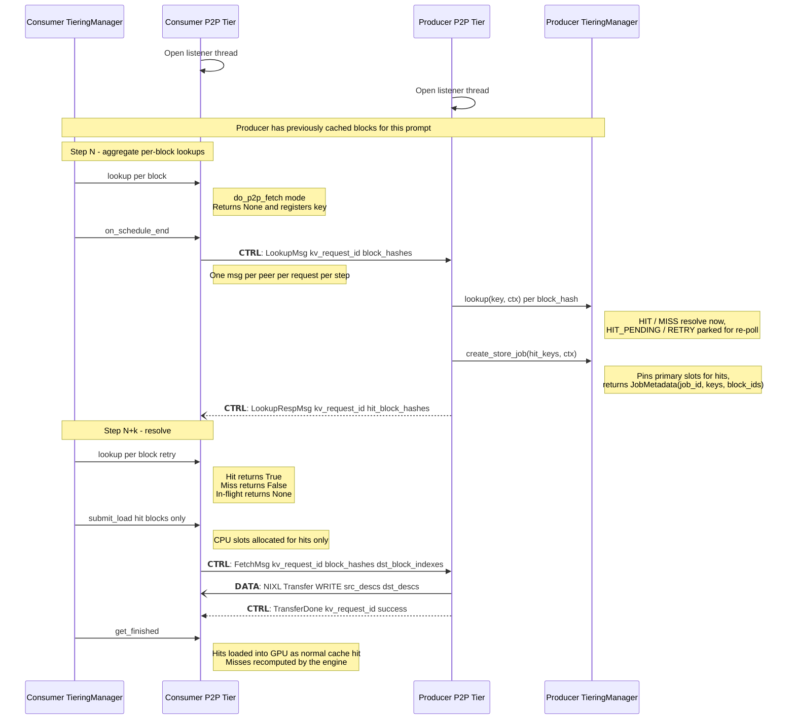

# Generic p2p plan

## Sequence Diagram



## Lookup phase

The lookup phase lets a consumer probe which of its block hashes a
producer peer currently holds, before issuing a fetch. It runs
asynchronously: per-block `lookup()` calls aggregate across a scheduler
step, one `LookupMsg` is sent per `(peer, kv_request_id)` at
`on_schedule_end()`, and the response resolves the answer for a
subsequent `lookup()` call in a later step.

### Wire protocol

- `LookupMsg(kv_request_id, block_hashes)` — consumer asks which of
  these hashes the peer holds.
- `LookupRespMsg(kv_request_id, block_hashes, hits)` — two parallel
  arrays of equal length. Each `(block_hash, hit)` pair is
  self-describing, so the producer is free to split or coalesce
  responses across multiple LookupRespMsgs for the same
  `kv_request_id`.

### Client role

State is kept per `(kv_request_id, block_hash)` in `ClientRole._lookups`:

```text
            register_lookup()         flush_pending_lookups()    LookupRespMsg
   (none) ─────────────────► PENDING ──────────────────────► IN_FLIGHT ─────────► RESOLVED(bool)
                                │            send                                        │
                                │                                       register_lookup() │ (returns
                                │                                                         │  bool, deletes)
                                ▼                                                         ▼
                           idempotent: register_lookup() while PENDING/IN_FLIGHT returns None
```

- The first `manager.lookup(key, ctx)` for a symmetric-P2P consumer
  (`p2p` sub-dict in `kv_transfer_params`) registers a PENDING entry
  and returns `LookupResult.RETRY`.
- `manager.on_schedule_end()` drives `session.flush_pending_lookups()`
  on every session. The flush groups all unsent entries by
  `kv_request_id` and emits one `LookupMsg` per group; sends are gated
  on the connection's ConnectAckMsg.
- An incoming `LookupRespMsg` walks the `(block_hash, hit)` pairs and
  sets each entry's `result`.
- A subsequent `manager.lookup()` for the same key pops the entry and
  returns `LookupResult.HIT` / `LookupResult.MISS` accordingly — HIT
  becomes a normal secondary-tier hit (the manager starts promotion);
  MISS falls back to local prefill.
- A timeout (`_LOAD_TIMEOUT_S` since flush) sets `result = False` so
  the next `register_lookup` resolves via the happy path above instead
  of looping forever.

#### Entry lifecycle

There are three ways an entry leaves `_lookups`:

- **Happy path — resolved by next `register_lookup()`.** Once the
  response has set `state.result`, the next `register_lookup()` for
  that `(kv_request_id, block_hash)` deletes the entry and returns the
  bool. State lives only as long as the answer hasn't been delivered
  to the manager.
- **Request finished mid-flight — `on_request_finished()`.** The
  manager calls `session.finish_request()`, which calls
  `ClientRole.cancel_lookups(kv_request_id)` to drop every entry for
  that request whose `result` was never picked up.
- **Session torn down — `close()`.** Clears `_lookups` along with
  `_inbound`. Unresolved entries just disappear; the manager sees no
  session for the peer on the next call and the request falls back to
  local prefill.

### Server role

The producer answers any incoming `LookupMsg` from a connected peer —
there is no per-request producer flag. The reply is computed against
the local TieringManager via three callbacks
(`TieringCallbacks` Protocol, in `tiering/p2p/tiering_callbacks.py`):

| Callback | Purpose |
| --- | --- |
| `lookup(key, ctx) -> LookupResult` | Hit/miss decision per hash. |
| `create_store_job(keys, ctx) -> JobMetadata` | Pin the primary-tier slots for the HIT keys; returns parallel `keys` / `block_ids` and a fresh `job_id`. The pin survives until the engine processes the matching `JobResult`. |
| `finish_request(ctx) -> None` | Release per-request bookkeeping the TieringManager accumulated under the synthetic peer-driven `ctx`. |

The default is `_AllMissCallbacks` (every `lookup` returns `MISS`,
`create_store_job` is unreachable, `finish_request` is a no-op),
which preserves the pre-integration all-miss behaviour until the real
adapter on `TieringOffloadingManager` is wired.

#### Per-LookupMsg tracking

`ServerRole._inbound_lookups: dict[lookup_id, _LookupBlocks]` tracks
the state for each inbound `LookupMsg` independently. Each entry
carries its own synthetic `ReqContext`:

```text
ctx = ReqContext(req_id=f"p2p:{peer_id}:{kv_request_id}:lu{lookup_id}")
```

A fresh ctx per LookupMsg gives the TieringManager a clean,
bounded-lifetime request to attach state to — created on the first
`lookup` call, closed by `finish_request` once the lookup's last hash
has been answered on the wire.

#### `on_lookup(kv_request_id, block_hashes)`

Build a `_LookupBlocks` for the LookupMsg with a `deadline` of
`now + _LOOKUP_PENDING_TIMEOUT_S`, then for each hash call
`cb.lookup(h, ctx)` and route:

| `LookupResult` | Action |
| --- | --- |
| `HIT` | Add to the newly-HIT list; record `resolved[h] = True`. |
| `MISS` | Record `resolved[h] = False`. |
| `HIT_PENDING` / `RETRY` | Add to `lookup.pending`. |

Then:

1. If any HITs: call `cb.create_store_job(hits, ctx)` once, then feed
   the returned JobMetadata into the existing
   `ServerRole.add_stored_blocks(...)` path so the eventual FetchMsg
   matches from `_outbound[kv_request_id].available`. HITs are pinned
   **immediately** even though the wire response is deferred — waiting
   would let the block evict before the client's FetchMsg lands.
2. If `lookup.pending` is empty (everything resolved on first sight),
   emit the aggregated `LookupRespMsg` now and fire
   `cb.finish_request(ctx)` (see `_finalize_lookup`).
3. Otherwise stash the entry in `_inbound_lookups` — the aggregate
   response is deferred until either every pending hash settles or
   `deadline` fires.

Exactly one `LookupRespMsg` goes out per inbound `LookupMsg`, carrying
every hash in its original wire order. The single-thread guarantee
(`lookup → HIT → create_store_job` in one synchronous sequence) means
no eviction can race between HIT detection and the pin.

#### `_resolve_pending_lookups` (driven from `collect_results`)

Called every poll tick. For every parked lookup:

- Re-call `cb.lookup` per still-pending hash.
    - `HIT` → move to the newly-HIT list, record `resolved[h] = True`,
      drop from `pending`.
    - `MISS` → record `resolved[h] = False`, drop from `pending`.
    - Still `HIT_PENDING` / `RETRY` → leave for next tick.
- If `now >= lookup.deadline` and `pending` is still non-empty, force
  the stragglers to MISS (record `resolved[h] = False` for each and
  clear `pending`). Guarantees the response goes out within the
  deadline even against a stuck producer.
- For the newly-HIT list: one `cb.create_store_job(...)` call per
  lookup, plumbed through `add_stored_blocks` as in `on_lookup`.
- Any lookup whose `pending` is now empty is finalized by
  `_finalize_lookup`: emit the aggregated `LookupRespMsg` in wire
  order using `resolved`, then fire `cb.finish_request(ctx)` and drop
  the entry.

#### Cleanup

- `finish(kv_request_id)` (PD path) — drops every parked lookup
  matching `kv_request_id` and fires `finish_request(ctx)` for each.
  In symmetric P2P this rarely fires: the producer has no local
  request lifecycle for the consumer's id, so the `on_request_finished`
  path that calls into `session.finish_request` is not exercised on
  this side.
- `close()` — best-effort `finish_request` (under `contextlib.suppress`)
  for every remaining lookup, then clears `_inbound_lookups`. Wedged
  callbacks can't block teardown.

#### Pin lifetime

The pin created by `cb.create_store_job` covers the full lookup → fetch
→ transfer → completion journey, which spans multiple engine steps:

```text
cb.create_store_job   ─►  JobMetadata registered, ref_cnt += 1 on each block
add_stored_blocks     ─►  _outbound[req].available populated; _store_jobs[job_id] tracked
on_fetch              ─►  add_fetch_demand matches available, NIXL write_blocks issued
collect_results       ─►  StoreResult emitted on transfer completion
manager._finished_jobs ─► JobResult bubbled to engine's get_finished_jobs()
TieringManager        ─►  _process_finished_jobs pops _transfer_jobs[job_id] and
                          calls complete_read(keys, ctx) — ref_cnt -= 1
```

The release path is the same one PD already uses — there is no
separate `complete_store_job` callback. Failure modes (peer drops the
fetch, transfer fails, `_STORE_TIMEOUT_S` fires, session closes,
`finish` arrives) all flow through the existing terminal-finalize
code, which emits `StoreResult(success=False)` for the pinned job and
the engine still releases ref_cnt.
