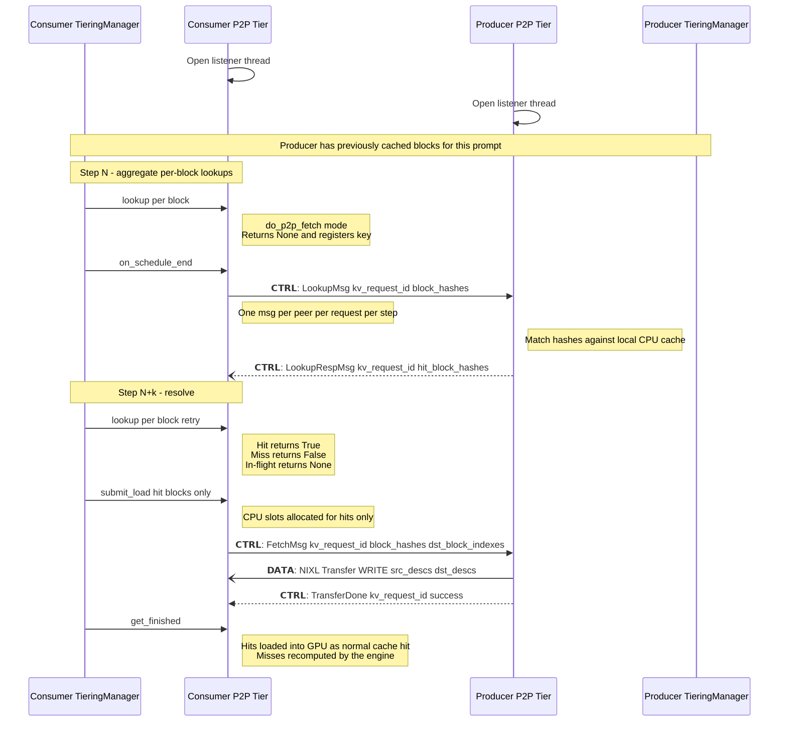

# Generic p2p plan

## Sequence Diagram



## Lookup phase

The lookup phase lets a consumer probe which of its block hashes a
producer peer currently holds, before issuing a fetch. It runs
asynchronously: per-block `lookup()` calls aggregate across a scheduler
step, one `LookupMsg` is sent per `(peer, kv_request_id)` at
`on_schedule_end()`, and the response resolves the answer for a
subsequent `lookup()` call in a later step.

### Wire protocol

- `LookupMsg(kv_request_id, block_hashes)` — consumer asks which of
  these hashes the peer holds.
- `LookupRespMsg(kv_request_id, block_hashes, hits)` — two parallel
  arrays of equal length. Each `(block_hash, hit)` pair is
  self-describing, so the producer is free to split or coalesce
  responses across multiple LookupRespMsgs for the same
  `kv_request_id`.

### Consumer state machine

State is kept per `(kv_request_id, block_hash)` in `ClientRole._lookups`:

```text
            register_lookup()         flush_pending_lookups()    LookupRespMsg
   (none) ─────────────────► PENDING ──────────────────────► IN_FLIGHT ─────────► RESOLVED(bool)
                                │            send                                        │
                                │                                       register_lookup() │ (returns
                                │                                                         │  bool, deletes)
                                ▼                                                         ▼
                           idempotent: register_lookup() while PENDING/IN_FLIGHT returns None
```

- The first `manager.lookup(key, ctx)` for a `do_p2p_fetch=true`
  consumer registers a PENDING entry and returns `None`.
- `manager.on_schedule_end()` drives `session.flush_pending_lookups()`
  on every session. The flush groups all unsent entries by
  `kv_request_id` and emits one `LookupMsg` per group; sends are gated
  on the connection's ConnectAckMsg.
- An incoming `LookupRespMsg` walks the `(block_hash, hit)` pairs and
  sets each entry's `result`.
- A subsequent `manager.lookup()` for the same key pops the entry and
  returns the bool — `True` becomes a normal secondary-tier hit (the
  manager starts promotion); `False` falls back to local prefill.
- A timeout (`_LOAD_TIMEOUT_S` since flush) sets `result = False` so
  the next `register_lookup` resolves via the happy path above instead
  of looping forever.

### Producer side

The producer receives `LookupMsg(kv_request_id, block_hashes)`, decides
hit-or-miss for each hash, and replies with one or more
`LookupRespMsg(kv_request_id, block_hashes, hits)` whose pairs cover
the requested hashes. There is no per-request producer flag — the
producer answers any incoming LookupMsg from a connected peer.

### Entry lifecycle

There are three ways an entry leaves `_lookups`:

- **Happy path — resolved by next `register_lookup()`.** Once the
  response has set `state.result`, the next `register_lookup()` for
  that `(kv_request_id, block_hash)` deletes the entry and returns the
  bool. State lives only as long as the answer hasn't been delivered
  to the manager.
- **Request finished mid-flight — `on_request_finished()`.** The
  manager calls `session.finish_request()`, which calls
  `ClientRole.cancel_lookups(kv_request_id)` to drop every entry for
  that request whose `result` was never picked up.
- **Session torn down — `close()`.** Clears `_lookups` along with
  `_inbound`. Unresolved entries just disappear; the manager sees no
  session for the peer on the next call and the request falls back to
  local prefill.
