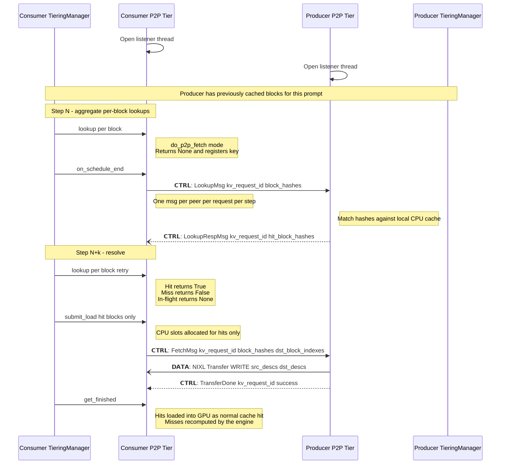

# Generic p2p plan

## Sequence Diagram

```mermaid

sequenceDiagram
    participant Cons_TM as Consumer TieringManager
    participant Cons_P2P as Consumer P2P Tier
    participant Prod_P2P as Producer P2P Tier
    participant Prod_TM as Producer TieringManager

    Cons_P2P->>Cons_P2P: Open listener thread
    Prod_P2P->>Prod_P2P: Open listener thread

    Note over Cons_TM,Prod_TM: Producer has previously cached blocks for this prompt

    Note over Cons_TM,Cons_P2P: Step N - aggregate per-block lookups

    Cons_TM->>Cons_P2P: lookup per block
    Note right of Cons_P2P: do_p2p_fetch mode<br/>Returns None and registers key

    Cons_TM->>Cons_P2P: on_schedule_end
    Cons_P2P->>Prod_P2P: 𝗖𝗧𝗥𝗟: LookupMsg kv_request_id block_hashes
    Note right of Cons_P2P: One msg per peer per request per step

    Note right of Prod_P2P: Match hashes against local CPU cache

    Prod_P2P--)Cons_P2P: 𝗖𝗧𝗥𝗟: LookupRespMsg kv_request_id hit_block_hashes

    Note over Cons_TM,Cons_P2P: Step N+k - resolve

    Cons_TM->>Cons_P2P: lookup per block retry
    Note right of Cons_P2P: Hit returns True<br/>Miss returns False<br/>In-flight returns None

    Cons_TM->>Cons_P2P: submit_load hit blocks only
    Note right of Cons_P2P: CPU slots allocated for hits only

    Cons_P2P->>Prod_P2P: 𝗖𝗧𝗥𝗟: FetchMsg kv_request_id block_hashes dst_block_indexes

    Prod_P2P-)Cons_P2P: 𝗗𝗔𝗧𝗔: NIXL Transfer WRITE src_descs dst_descs
    Prod_P2P-->>Cons_P2P: 𝗖𝗧𝗥𝗟: TransferDone kv_request_id success

    Cons_TM->>Cons_P2P: get_finished
    Note right of Cons_P2P: Hits loaded into GPU as normal cache hit<br/>Misses recomputed by the engine
```
