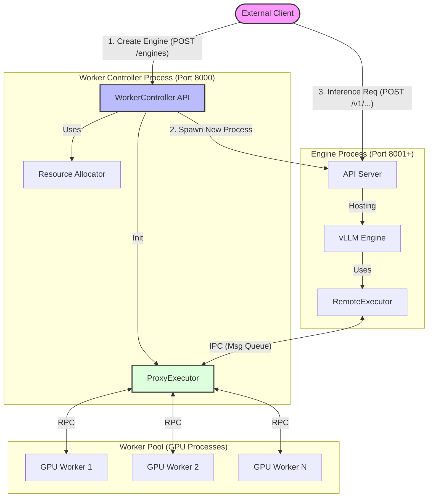

# Worker Controller Architecture Overview

The `vllm.worker_controller` module implements a decoupled architecture for managing vLLM worker processes. This system allows for dynamic allocation of GPU resources to different model engines, significantly reducing the "cold start" time associated with launching new models.

## Core Concept

In standard vLLM, creating an engine spawns new worker processes. This involves heavy initialization (Python interpreter startup, CUDA context creation, library loading). 

The **Worker Controller** architecture pre-initializes a pool of "dummy" workers that hold GPU resources but are not bound to a specific model. When a request to serve a model arrives, these pre-warmed workers are dynamically assigned to the new engine, configured, and loaded with the model weights.

## Architecture Diagram

## Key Components

### 1. Worker Controller (`worker_controller.py`)
The central orchestrator that manages the lifecycle of engines and workers.
- **Responsibilities:**
    - Initializes the `ProxyExecutor` and `ResourceAllocator`.
    - Handles `create_engine` requests: Spawns a new API server process and assigns workers to it.
    - Handles `delete_engine` requests: Terminates the API server and releases workers back to the pool.

### 2. Resource Allocator (`worker_controller.py`)
A helper class within the Controller.
- **Responsibilities:**
    - Tracks the status of every GPU rank (Free vs. Assigned).
    - Manages port allocation for new API servers (starting from 8001).
    - Maps `engine_uuid` to specific worker ranks.

### 3. GPU Worker (`gpu_worker.py`)
A specialized `Worker` class extending `LocalOrDistributedWorkerBase`.
- **Features:**
    - **Idle State:** Starts with a dummy configuration.
    - **Dynamic Loading:** Can load (`load_model`) and unload (`unload_model`) models on demand without restarting the process.
    - **Hold Mechanism:** Can be "held" by a specific engine ID to prevent race conditions during assignment.
    - **Memory Management:** Includes methods for sleeping (offloading weights) and waking up.

### 4. Proxy Executor (`executor/proxy_executor.py`)
Used by the Controller to manage the pool of workers.
- **Responsibilities:**
    - Maintains communication channels (RPC) with the worker processes.
    - Broadcasts commands to workers.

### 5. REST API (`main.py`)
A FastAPI application providing an interface to the system.
- **Endpoints:**
    - `POST /engines`: Create a new engine.
    - `DELETE /engines/{uuid}`: Stop an engine.
    - `GET /engines`: List active engines.
    - `GET /workers`: View GPU worker allocation status.

## Workflow

### System Startup
1. `main.py` starts the FastAPI server.
2. `WorkerController` is initialized.
3. `ProxyExecutor` spawns a fixed number of `gpu_worker.py` processes (based on available GPUs).
4. Workers initialize their CUDA contexts and enter an idle loop, waiting for commands.

### Creating an Engine
1. Client sends `POST /engines` with model details (e.g., "facebook/opt-125m").
2. `ResourceAllocator` finds available workers (e.g., ranks 0 and 1).
3. `WorkerController` assigns these workers to the new engine UUID.
4. The Controller spawns a new **API Server Process**.
5. This new process connects to the assigned workers, instructs them to load the specified model, and begins serving traffic on a new port.

### Deleting an Engine
1. Client sends `DELETE /engines/{uuid}`.
2. The API Server process is terminated.
3. `WorkerController` instructs the workers to unload the model/weights.
4. Workers return to the "free" state in `ResourceAllocator`.

## Directory Structure

- **`main.py`**: Entry point for the Controller REST API.
- **`worker_controller.py`**: Core logic for managing the worker pool.
- **`gpu_worker.py`**: The worker process code capable of dynamic model loading.
- **`executor/`**: Contains executor implementations (`proxy_executor`, `remote_executor`) for communicating with workers.
- **`entrypoint/`**: Contains code for the spawned API server processes.
