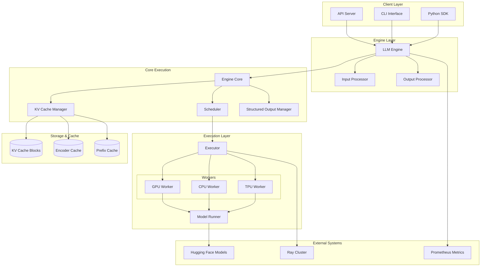
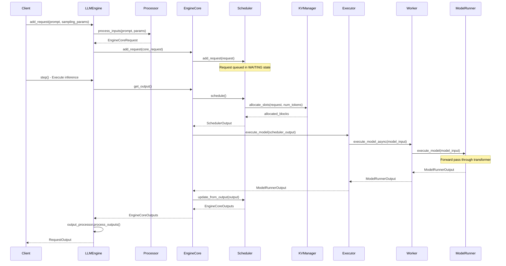
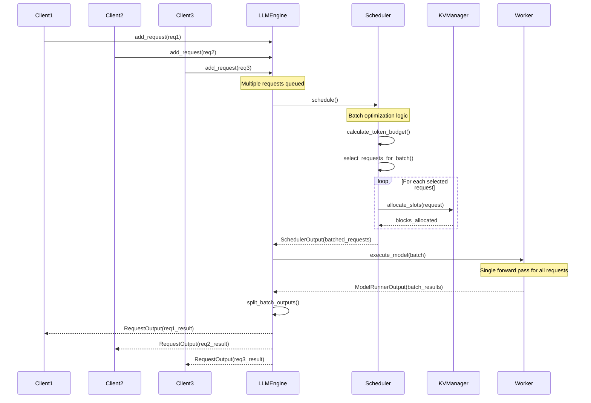
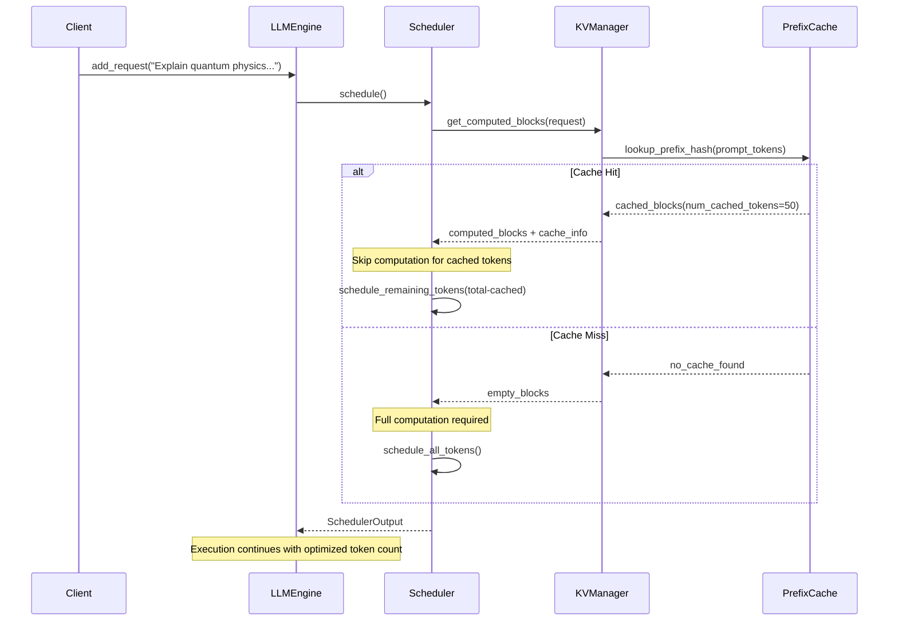
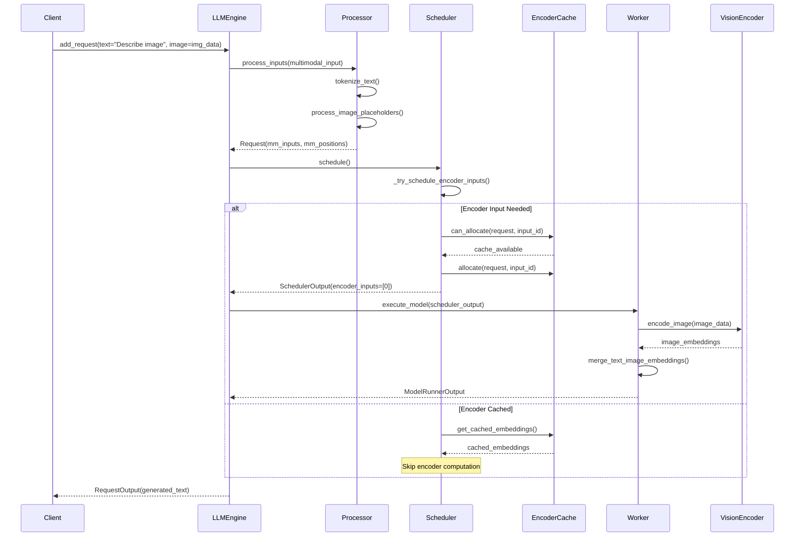

# vLLM v1 Developer Onboarding Guide

## 1. 🧭 Overview

vLLM v1 is a high-performance large language model serving framework designed for **easy, fast, and cheap LLM serving**. It represents a major architectural upgrade from v0 with significant performance improvements and cleaner code organization.

### Key Features
- **High-throughput serving** with state-of-the-art performance
- **PagedAttention** for efficient memory management of attention key-value pairs
- **Continuous batching** of incoming requests for optimal resource utilization
- **Speculative decoding** and **chunked prefill** for faster inference
- **Multi-modal support** (text, vision, audio) with unified processing
- **Distributed inference** with tensor and pipeline parallelism
- **Prefix caching** for improved efficiency on repeated prompts
- **Multiple hardware support** (NVIDIA GPUs, AMD, Intel, TPU, AWS Neuron)

### Technologies Used
- **Language**: Python 3.8+ with C++/CUDA kernels
- **Framework**: PyTorch with custom CUDA kernels
- **Distributed**: Ray for multi-node coordination, multiprocessing for local parallelism
- **Memory Management**: Custom block-based KV cache with PagedAttention
- **API**: OpenAI-compatible REST API server
- **Build System**: CMake for C++/CUDA components, setuptools for Python

---

## 2. 🧱 High-Level Architecture Diagram

### Component Explanations

- **LLM Engine**: Main orchestrator that coordinates all components and provides the public API
- **Engine Core**: Core execution engine that manages request lifecycle and coordinates scheduling
- **Scheduler**: Intelligent request scheduler that manages resource allocation and batching decisions
- **KV Cache Manager**: Sophisticated memory manager using PagedAttention for efficient key-value storage
- **Workers**: Hardware-specific execution units that run the actual model inference
- **Executor**: Coordinates distributed execution across multiple workers/nodes

---

## 3. 🔎 Component Breakdown

### Component: LLM Engine (`/data/users/yeq/gitrepos/vllm/vllm/v1/engine/llm_engine.py`)

**Purpose**:
Main entry point and orchestrator for the entire vLLM system. Provides backward compatibility with v0 API while leveraging v1 architecture improvements.

**Key Elements**:
- `LLMEngine.__init__()`: Initializes all core components and establishes communication channels
- `add_request()`: Processes and queues new inference requests with validation
- `step()`: Executes one inference iteration, coordinating scheduling and execution
- `abort_request()`: Handles request cancellation and resource cleanup
- `get_tokenizer_group()`: Provides access to tokenization services

**Depends On**:
- Internal: `EngineCoreClient`, `Processor`, `OutputProcessor`, `Executor`
- External: PyTorch, Hugging Face Transformers, Ray (optional)

---

### Component: Engine Core (`/data/users/yeq/gitrepos/vllm/vllm/v1/engine/core.py`)

**Purpose**:
Core execution engine that manages the request lifecycle, coordinates between scheduler and workers, and handles distributed execution.

**Key Elements**:
- `EngineCore.add_request()`: Validates and queues requests for scheduling
- `EngineCore.get_output()`: Retrieves completed inference results
- `EngineCore.abort_requests()`: Handles request cancellation
- `EngineCoreClient`: Client interface for multiprocess communication

**Depends On**:
- Internal: `Scheduler`, `Executor`, `ModelRunner`
- External: Multiprocessing, asyncio

---

### Component: Scheduler (`/data/users/yeq/gitrepos/vllm/vllm/v1/core/sched/scheduler.py`)

**Purpose**:
Intelligent request scheduler that makes optimal batching decisions, manages resource allocation, and handles advanced features like speculative decoding and prefix caching.

**Key Elements**:
- `Scheduler.schedule()`: Core scheduling algorithm that batches requests optimally
- `_try_schedule_encoder_inputs()`: Handles multi-modal input scheduling
- `update_from_output()`: Processes model outputs and updates request states
- `_make_cached_request_data()`: Optimizes data structures for cached requests

**Depends On**:
- Internal: `KVCacheManager`, `StructuredOutputManager`, `RequestQueue`
- External: None (pure Python logic)

---

### Component: KV Cache Manager (`/data/users/yeq/gitrepos/vllm/vllm/v1/core/kv_cache_manager.py`)

**Purpose**:
Sophisticated memory management system implementing PagedAttention for efficient key-value cache storage and retrieval.

**Key Elements**:
- `KVCacheManager.allocate_slots()`: Allocates memory blocks for new requests
- `get_computed_blocks()`: Retrieves cached computation results
- `free()`: Releases memory blocks when requests complete
- `cache_blocks()`: Implements prefix caching for repeated prompts

**Depends On**:
- Internal: `BlockPool`, `KVCacheUtils`
- External: PyTorch tensors

---

### Component: Workers (`/data/users/yeq/gitrepos/vllm/vllm/v1/worker/`)

**Purpose**:
Hardware-specific execution units that perform the actual model inference on different accelerators.

**Key Elements**:
- `GPUWorker`: NVIDIA GPU-optimized execution with CUDA kernels
- `CPUWorker`: CPU-based inference for cost-effective serving
- `TPUWorker`: Google TPU integration for specialized workloads
- `ModelRunner`: Coordinates model execution and batch processing

**Depends On**:
- Internal: `InputBatch`, `BlockTable`, model loading utilities
- External: PyTorch, hardware-specific libraries (CUDA, TPU)

---

### Component: Executors (`/data/users/yeq/gitrepos/vllm/vllm/v1/executor/`)

**Purpose**:
Coordinates distributed execution across multiple workers and handles different parallelism strategies.

**Key Elements**:
- `MultiprocessExecutor`: Local multi-GPU execution
- `RayDistributedExecutor`: Multi-node distributed execution via Ray
- `AbstractExecutor`: Base interface for all execution strategies

**Depends On**:
- Internal: `Worker` implementations
- External: Ray (for distributed), multiprocessing

---

### Component: Request Processing (`/data/users/yeq/gitrepos/vllm/vllm/v1/request.py`, `/data/users/yeq/gitrepos/vllm/vllm/v1/outputs.py`)

**Purpose**:
Handles request lifecycle management, input validation, and output formatting.

**Key Elements**:
- `Request`: Core request data structure with state management
- `RequestStatus`: Enum tracking request lifecycle states
- `ModelRunnerOutput`: Structured output from model execution
- `SamplerOutput`: Token sampling results with logprobs

**Depends On**:
- Internal: Sampling/pooling parameters, multi-modal inputs
- External: PyTorch tensors

---

## 4. 🔁 Data Flow & Call Flow Examples

### Example Flow: Single Request Processing

**Description**:
A client submits a text generation request that goes through the complete vLLM pipeline from input processing to response generation.

**Sequence Diagram**:

---

### Example Flow: Batched Request Processing

**Description**:
Multiple requests are intelligently batched together for efficient GPU utilization, demonstrating vLLM's continuous batching capabilities.

**Sequence Diagram**:

---

### Example Flow: Prefix Caching Hit

**Description**:
A request benefits from prefix caching when its prompt shares a common prefix with a previously processed request.

**Sequence Diagram**:

---

### Example Flow: Multi-Modal Request Processing

**Description**:
Processing a request that includes both text and image inputs, demonstrating vLLM's multi-modal capabilities.

**Sequence Diagram**:

---

## 5. 🗃️ Data Models (Entities)

### Entity: Request

- **Class**: `Request` in `/data/users/yeq/gitrepos/vllm/vllm/v1/request.py`
- **Fields**:
  - `request_id: str` – unique identifier for the request
  - `prompt_token_ids: list[int]` – tokenized input prompt
  - `sampling_params: SamplingParams` – generation parameters (temperature, top_p, etc.)
  - `pooling_params: PoolingParams` – for embedding/pooling requests
  - `status: RequestStatus` – current lifecycle state (WAITING, RUNNING, FINISHED_*)
  - `num_computed_tokens: int` – number of tokens already processed
  - `max_tokens: int` – maximum tokens to generate
  - `arrival_time: float` – timestamp when request was received
  - `priority: int` – scheduling priority (higher = more important)

- **Relations**:
  - Contains `MultiModalKwargs` for vision/audio inputs
  - References `LoRARequest` for adapter-specific inference
  - Links to `StructuredOutputRequest` for guided generation

- **Notes**:
  - Immutable token lists use `ConstantList` wrapper for safety
  - Supports speculative decoding with `spec_token_ids`
  - Tracks prefix cache hits via `num_cached_tokens`

---

### Entity: RequestStatus

- **Enum**: `RequestStatus` in `/data/users/yeq/gitrepos/vllm/vllm/v1/request.py`
- **Values**:
  - `WAITING` – queued for scheduling
  - `WAITING_FOR_FSM` – waiting for structured output compilation
  - `WAITING_FOR_REMOTE_KVS` – waiting for distributed KV transfer
  - `RUNNING` – actively being processed
  - `PREEMPTED` – temporarily paused for higher priority requests
  - `FINISHED_STOPPED` – completed normally (stop token/string)
  - `FINISHED_LENGTH_CAPPED` – completed due to max length
  - `FINISHED_ABORTED` – cancelled by client
  - `FINISHED_IGNORED` – rejected due to constraints

- **Relations**:
  - Maps to `FinishReason` enum for API compatibility
  - Used by scheduler for state transitions

- **Notes**:
  - States > PREEMPTED are considered finished
  - Supports graceful degradation and error handling

---

### Entity: ModelRunnerOutput

- **Class**: `ModelRunnerOutput` in `/data/users/yeq/gitrepos/vllm/vllm/v1/outputs.py`
- **Fields**:
  - `req_ids: list[str]` – request identifiers in batch order
  - `req_id_to_index: dict[str, int]` – mapping for efficient lookup
  - `sampled_token_ids: list[list[int]]` – generated tokens per request
  - `spec_token_ids: list[list[int]]` – speculative tokens (if enabled)
  - `logprobs: LogprobsLists` – token probabilities for each request
  - `prompt_logprobs_dict: dict[str, LogprobsTensors]` – prompt token probabilities
  - `pooler_output: list[torch.Tensor]` – embeddings for pooling requests

- **Relations**:
  - Consumed by `Scheduler.update_from_output()`
  - Converted to `RequestOutput` by `OutputProcessor`

- **Notes**:
  - Uses lists instead of tensors for efficient serialization
  - Supports variable-length outputs per request in batch

---

### Entity: SchedulerOutput

- **Class**: `SchedulerOutput` in `/data/users/yeq/gitrepos/vllm/vllm/v1/core/sched/output.py`
- **Fields**:
  - `scheduled_new_reqs: list[NewRequestData]` – first-time scheduled requests
  - `scheduled_cached_reqs: CachedRequestData` – continuing requests
  - `num_scheduled_tokens: dict[str, int]` – tokens per request this step
  - `total_num_scheduled_tokens: int` – total batch size
  - `scheduled_encoder_inputs: dict[str, list[int]]` – multi-modal inputs to process
  - `num_common_prefix_blocks: list[int]` – shared prefix optimization data

- **Relations**:
  - Produced by `Scheduler.schedule()`
  - Consumed by `Executor.execute_model()`

- **Notes**:
  - Optimizes memory layout for different request types
  - Includes metadata for advanced features (speculative decoding, prefix caching)

---

### Entity: KVCacheConfig

- **Class**: `KVCacheConfig` in `/data/users/yeq/gitrepos/vllm/vllm/v1/kv_cache_interface.py`
- **Fields**:
  - `block_size: int` – tokens per memory block (typically 16)
  - `num_gpu_blocks: int` – total GPU memory blocks available
  - `num_cpu_blocks: int` – CPU memory blocks for offloading
  - `cache_dtype: torch.dtype` – data type for cache storage
  - `kv_cache_groups: list[KVCacheGroup]` – cache organization

- **Relations**:
  - Used by `KVCacheManager` for memory allocation
  - Configured based on model and hardware constraints

- **Notes**:
  - Block-based design enables efficient memory management
  - Supports heterogeneous memory hierarchies (GPU/CPU)

---

### Entity: SamplingParams

- **Class**: `SamplingParams` in `vllm/sampling_params.py`
- **Fields**:
  - `n: int` – number of output sequences to generate
  - `max_tokens: int` – maximum tokens to generate
  - `temperature: float` – sampling randomness (0.0 = deterministic)
  - `top_p: float` – nucleus sampling threshold
  - `top_k: int` – top-k sampling limit
  - `stop: list[str]` – stop strings to terminate generation
  - `logprobs: int` – number of log probabilities to return

- **Relations**:
  - Embedded in `Request` objects
  - Used by sampling kernels during generation

- **Notes**:
  - Supports advanced sampling strategies (beam search, parallel sampling)
  - Extensible for custom sampling algorithms# vLLM Developer Onboarding Guide
